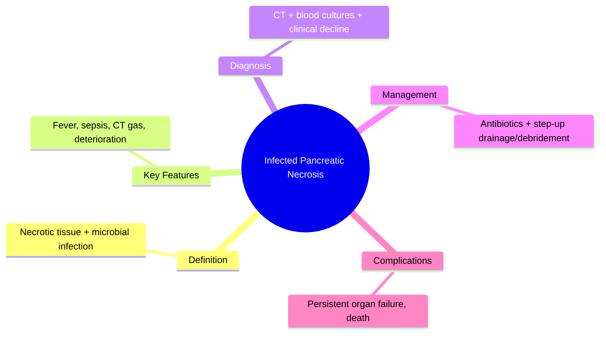
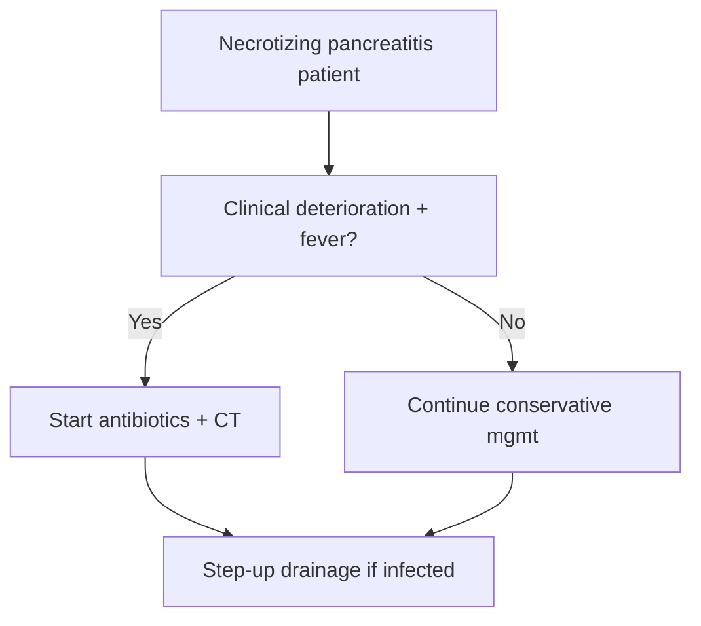

## Learning Objectives
- Define infected pancreatic necrosis as a complication of necrotizing pancreatitis.
- Recognize clinical deterioration (fever, sepsis, rising CRP, gas on CT) as infection suspicion.
- Initiate appropriate antibiotic therapy and critical care support.
- Understand the step-up approach for drainage/debridement (percutaneous → endoscopic → surgical).
- Apply the principle: antibiotics alone are insufficient if drainage is needed.# Infected pancreatic necrosis and sepsis

Related: [[../Gastroenterology MOC|Gastroenterology MOC]] · [[../Pancreatic Disorders|Pancreatic Disorders]] · [[Necrotizing pancreatitis]]

> [!important]
> Infected pancreatic necrosis is one of the **deadliest complications of pancreatitis**. High-yield points: **suspect infection when a necrotizing pancreatitis patient becomes septic or fails to improve, start appropriate antibiotics, and use a step-up drainage/debridement strategy with critical care support**.

## Definition
Infected pancreatic necrosis is necrotic pancreatic or peripancreatic tissue complicated by microbial infection, often causing sepsis and multiorgan deterioration.

## Anatomy and Physiology
- Devitalized pancreatic/peripancreatic tissue becomes a nidus for bacterial infection.
- Infection may occur later in the course after initial sterile necrosis.

## Etiology / Risk Factors
- Necrotizing pancreatitis
- Prolonged severe pancreatitis
- Persistent organ failure
- Translocation of enteric organisms into necrotic collections

## Pathophysiology
- Necrotic tissue loses host defense integrity.
- Infection triggers sepsis, worsened organ dysfunction, and increased mortality.

## Clinical Features
- Persistent or recurrent fever
- Worsening abdominal pain/distension
- Rising inflammatory markers
- Sepsis, confusion, hypotension
- Failure to improve after initial pancreatitis management

## Red Flags
- Septic shock
- Respiratory failure
- AKI/oliguria
- Gas in necrotic collection on CT
- Progressive multiorgan failure

## Investigations
- CBC, CRP, U&E, creatinine, lactate
- Blood cultures when septic
- Contrast CT to assess necrosis/collections
- Image-guided culture may be used in selected cases

## Interpretation Framework
### When to suspect infection
- Clinical deterioration after necrotizing pancreatitis
- Persistent sepsis without another clear source
- Gas in collection on imaging

### Management logic
1. Recognize sepsis and organ failure.
2. Start appropriate broad-spectrum antibiotics targeting pancreatic infection patterns.
3. Involve ICU, GI, surgery/interventional radiology.
4. Use **step-up** drainage/debridement approach when needed.

## Diagnosis
Diagnosis is based on necrotizing pancreatitis with strong clinical/radiological evidence of infection, sometimes supported by microbiology.

## Differential Diagnosis
- Sterile necrosis with inflammatory SIRS
- Cholangitis
- Hospital-acquired infection from another site
- Perforated viscus or bowel ischemia

## Management
## Immediate priorities
- Sepsis resuscitation
- ICU/HDU care if unstable
- Broad-spectrum antibiotics when infection suspected/confirmed
- Organ support and enteral nutrition where feasible

## Source control
- Percutaneous or endoscopic drainage when appropriate
- Step-up escalation to necrosectomy/debridement if drainage alone insufficient
- Avoid reflex early open surgery in all cases

## Complications
- Septic shock
- Multiorgan failure
- Hemorrhage
- Persistent fistula/collections
- Death

## Common Exam / Viva Traps
- Waiting too long to recognize sepsis
- Treating infected necrosis like sterile necrosis
- Calling for immediate open surgery in every case
- Forgetting antibiotics and source control together

## One-Page Summary
- Infected pancreatic necrosis = infected devitalized pancreatic tissue.
- Suspect when a necrotizing pancreatitis patient **becomes septic or fails to improve**.
- CT may show gas.
- Treatment = **critical care + antibiotics + step-up source control**.

## Revision Prompts
- How do you suspect infected necrosis clinically?
- Why is gas on CT important?
- What is the step-up approach?

## MCQs (10)
1. Infected pancreatic necrosis is a complication of:
   - A. Necrotizing pancreatitis
   - B. IBS
   - C. GERD
   - D. Hemorrhoids
   - **Answer: A**
2. A clue to infection on CT is:
   - A. Gas in collection
   - B. Normal pancreas
   - C. Simple constipation
   - D. Splenomegaly only
   - **Answer: A**
3. A septic patient with necrotizing pancreatitis requires:
   - A. Antibiotics and source-control planning
   - B. Reassurance only
   - C. Laxatives only
   - D. PPI only
   - **Answer: A**
4. The preferred intervention concept is:
   - A. Step-up approach
   - B. No intervention ever
   - C. Immediate colectomy always
   - D. Mandatory ERCP
   - **Answer: A**
5. Which is a red flag?
   - A. Septic shock
   - B. Stable appetite
   - C. Mild bloating only
   - D. Dyspepsia after tea
   - **Answer: A**
6. A major differential is:
   - A. Sterile necrosis
   - B. Anal fissure
   - C. Achalasia
   - D. Barrett oesophagus
   - **Answer: A**
7. Best level of care in unstable disease:
   - A. ICU/HDU
   - B. Home care only
   - C. Dermatology clinic
   - D. ENT ward
   - **Answer: A**
8. Which is true?
   - A. Infection often causes failure to improve
   - B. Sepsis is irrelevant
   - C. Imaging has no role
   - D. No antibiotics are ever used
   - **Answer: A**
9. The greatest systemic danger is:
   - A. Multiorgan failure
   - B. Constipation only
   - C. Heartburn only
   - D. Headache only
   - **Answer: A**
10. Infected necrosis belongs to which chapter system here?
   - A. Gastroenterology
   - B. Hepatology
   - C. Dermatology
   - D. Neurology
   - **Answer: A**

## SBA Questions (10)
1. A patient with necrotizing pancreatitis becomes febrile, hypotensive, and confused on day 10. Most likely complication?
   - A. Infected pancreatic necrosis
   - B. IBS-D
   - C. Hemorrhoids
   - D. Functional bloating
   - **Answer: A**
2. CT shows gas bubbles within pancreatic necrotic tissue. Best interpretation?
   - A. Infected necrosis is likely
   - B. Recovery phase only
   - C. Gallbladder polyp
   - D. GERD
   - **Answer: A**
3. Which management combination is most appropriate?
   - A. Antibiotics plus source control planning
   - B. PPIs alone
   - C. Outpatient reassurance only
   - D. Colonoscopy
   - **Answer: A**
4. A patient remains septic despite antibiotics. Best next principle?
   - A. Escalate step-up drainage/debridement strategy
   - B. Ignore source control
   - C. Stop monitoring
   - D. Diagnose IBS
   - **Answer: A**
5. Which is a close differential early in the course?
   - A. Sterile necrosis with SIRS
   - B. Achalasia
   - C. Eosinophilic esophagitis
   - D. Anal fissure
   - **Answer: A**
6. Best care location for shock and organ failure?
   - A. ICU/HDU
   - B. Day-case unit
   - C. Home care only
   - D. Psychiatry ward
   - **Answer: A**
7. Which sign most strongly supports sepsis severity?
   - A. Rising lactate and hypotension
   - B. Normal appetite
   - C. Constipation alone
   - D. Mild reflux only
   - **Answer: A**
8. Which statement is correct?
   - A. Open surgery is not automatically the first step for all
   - B. Surgery is always immediate
   - C. Antibiotics are never used
   - D. Infection is harmless
   - **Answer: A**
9. A patient with infected necrosis deteriorates and becomes oliguric. This indicates:
   - A. Organ failure
   - B. Mild disease
   - C. Functional symptoms
   - D. Only dehydration from IBS
   - **Answer: A**
10. What underlies the infected tissue?
   - A. Devitalized pancreatic/peripancreatic necrosis
   - B. Normal mucosa
   - C. Esophageal ulcer only
   - D. Hemorrhoidal tissue
   - **Answer: A**

## Flashcards
- Q: Most dangerous evolution of necrotizing pancreatitis?  
  A: Infected pancreatic necrosis with sepsis.
- Q: CT clue for infected necrosis?  
  A: Gas in the collection.
- Q: Core treatment triad?  
  A: ICU support, antibiotics, source control.
- Q: Preferred intervention philosophy?  
  A: Step-up approach.
- Q: Main close differential?  
  A: Sterile necrosis with SIRS.

## Mind Map

## Flowchart

## Must Know / Should Know / Nice to Know
### Must Know
- Infection = sepsis in necrotizing pancreatitis
- Gas on CT = high specificity for infection
- Antibiotics + drainage = step-up approach
- Critical care support essential

### Should Know
- Percutaneous first, then endoscopic/surgical
- Delay intervention if possible (4+ weeks)
- Fungemia in prolonged courses

### Nice to Know
- Minimally invasive necrosectomy techniques
- Biomarkers for early infection prediction

## Self-Test Scorecard
- Can I define Infected Pancreatic Necrosis correctly? /10
- Can I list 4 key features/clinical clues? /10
- Can I explain the diagnostic approach? /10
- Can I outline the management principles? /10

**Interpretation:**
- **<35/40** = weak topic
- **35-36/40** = acceptable but insecure
- **37+/40** = exam-ready

## Answer Key Pearls
- In exams, the phrase **“septic patient with necrotizing pancreatitis”** should trigger **infected necrosis until proven otherwise**.
