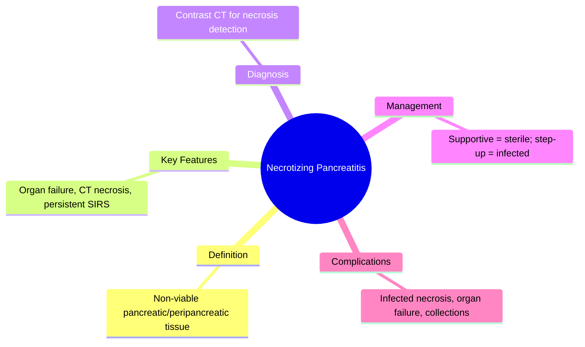
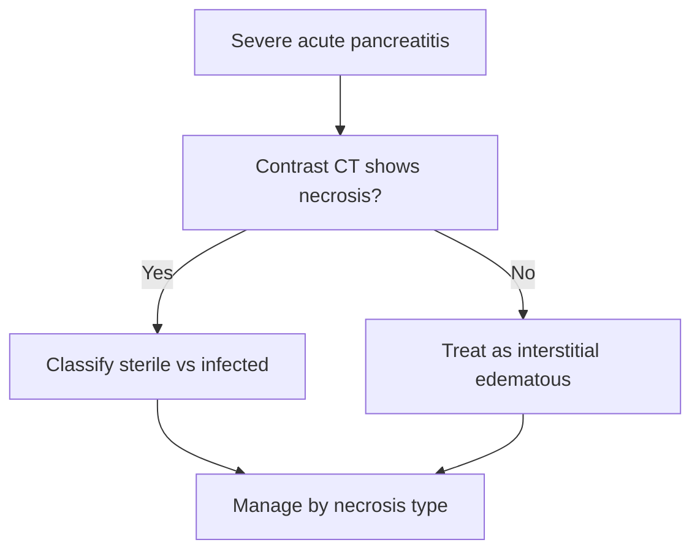

## Learning Objectives
- Distinguish necrotizing pancreatitis from interstitial edematous disease by imaging.
- Classify necrosis as sterile vs infected and pancreatic vs peripancreatic vs combined.
- Recognize persistent organ failure as the hallmark of severe necrotizing pancreatis.
- Apply the step-up approach for infected necrosis management over rushed surgery.
- Understand that sterile necrosis is managed supportively without routine antibiotics.# Necrotizing pancreatitis

Related: [[../Gastroenterology MOC|Gastroenterology MOC]] · [[../Pancreatic Disorders|Pancreatic Disorders]] · [[Acute pancreatitis]]

> [!important]
> Necrotizing pancreatitis is a **severe local complication** of acute pancreatitis. Exam answers should emphasize **severity, organ failure, CT-based recognition, sterile vs infected necrosis, and step-up management rather than rushed surgery**.

## Definition
Necrotizing pancreatitis is acute pancreatitis with non-viable pancreatic and/or peripancreatic tissue.

## Anatomy and Physiology
- Necrosis may involve pancreatic parenchyma, surrounding fat, or both.
- Local devitalized tissue creates a high risk of persistent inflammation, infection, organ failure, and later collections.

## Classification
- Sterile necrosis
- Infected necrosis
- Pancreatic necrosis alone
- Peripancreatic necrosis alone
- Combined necrosis

## Etiology / Risk Factors
- Severe acute pancreatitis of any cause
- Delayed presentation
- Persistent SIRS/organ failure
- Extensive inflammatory injury on imaging

## Pathophysiology
- Severe enzymatic and inflammatory injury causes tissue ischemia and necrosis.
- Necrotic tissue drives systemic inflammation and may later become infected.

## Clinical Features
- Severe persistent abdominal pain
- Fever and systemic illness
- Prolonged organ dysfunction
- Failure to improve as expected
- Abdominal distension/ileus

## Red Flags
- Persistent organ failure >48 h
- Sepsis physiology
- Worsening abdominal pain or systemic deterioration
- Gas within necrotic collection on imaging suggesting infection

## Investigations
- Standard severity labs: CBC, U&E, creatinine, calcium, CRP, ABG/VBG
- Contrast-enhanced CT when complication/necrosis suspected
- Organ failure assessment clinically and biochemically

## Interpretation Framework
### When to suspect necrosis
- Severe pancreatitis not settling
- Ongoing SIRS or organ failure
- Rising inflammatory burden
- Complicated course after initial acute pancreatitis

### Sterile vs infected necrosis
- Sterile: inflammatory but no proven infection
- Infected: gas on imaging, positive culture, or septic clinical course strongly suggestive

## Diagnosis
Diagnosis is made by imaging evidence of non-viable pancreatic/peripancreatic tissue in the appropriate clinical setting.

## Differential Diagnosis
- Severe interstitial pancreatitis without necrosis
- Infected pseudocyst/other collections
- Perforated viscus
- Mesenteric ischemia

## Management
## Core principles
- ICU/HDU level care if unstable
- Aggressive supportive care and organ support
- Enteral nutrition when feasible
- Multidisciplinary management

## Sterile necrosis
- Usually conservative initially
- Avoid unnecessary early intervention if stable

## Infected or complicated necrosis
- Antibiotics when infection suspected/confirmed
- Image-guided drainage or endoscopic/transluminal approaches as part of a **step-up** strategy
- Surgery/debridement is generally delayed when possible until collections mature and the patient is optimized

## Complications
- Persistent organ failure
- Infected necrosis
- Bleeding
- Fistulae
- Collections and pseudocyst evolution
- Death in severe cases

## Common Exam / Viva Traps
- Equating all necrosis with immediate surgery
- Missing distinction between sterile and infected necrosis
- Forgetting ongoing ICU-level support and enteral feeding

## One-Page Summary
- Necrotizing pancreatitis = severe pancreatitis with devitalized tissue.
- Suspect when the patient remains toxic or in organ failure.
- CT helps define necrosis.
- Sterile necrosis may be treated conservatively.
- Infected necrosis requires antibiotics and often step-up drainage/debridement planning.

## Revision Prompts
- What is necrotizing pancreatitis?
- How do you separate sterile from infected necrosis?
- Why is immediate surgery often avoided?

## MCQs (10)
1. Necrotizing pancreatitis is characterized by:
   - A. Functional bowel pain
   - B. Non-viable pancreatic/peripancreatic tissue
   - C. Esophageal spasm
   - D. Simple dyspepsia
   - **Answer: B**
2. A major concern in necrotizing pancreatitis is:
   - A. Portal hypertension only
   - B. Organ failure
   - C. Hemorrhoids
   - D. GERD
   - **Answer: B**
3. Best imaging test when necrosis is suspected is often:
   - A. Contrast-enhanced CT
   - B. Colonoscopy
   - C. Echo
   - D. EEG
   - **Answer: A**
4. Presence of gas in necrotic tissue suggests:
   - A. Infected necrosis
   - B. IBS
   - C. Coeliac disease
   - D. Gastritis
   - **Answer: A**
5. Sterile necrosis is usually managed initially by:
   - A. Conservative supportive care
   - B. Immediate colectomy
   - C. Routine ERCP
   - D. Daily laxatives
   - **Answer: A**
6. Best general interventional principle is:
   - A. Step-up approach when needed
   - B. Immediate open surgery for all
   - C. No monitoring needed
   - D. Ignore nutrition
   - **Answer: A**
7. Persistent organ failure beyond 48 hours suggests:
   - A. Severe pancreatitis
   - B. Mild constipation
   - C. Functional disease
   - D. GERD
   - **Answer: A**
8. Which may coexist or follow necrosis?
   - A. Collections/pseudocyst
   - B. Achalasia
   - C. Barrett oesophagus
   - D. Anal fissure
   - **Answer: A**
9. A major viva trap is:
   - A. Distinguishing sterile from infected necrosis
   - B. Forgetting the distinction
   - C. Using severity language
   - D. Mentioning ICU support
   - **Answer: B**
10. Nutritional principle in severe pancreatitis is:
   - A. Prefer enteral nutrition when feasible
   - B. Never feed
   - C. Fluids only for weeks
   - D. Routine TPN for all immediately
   - **Answer: A**

## SBA Questions (10)
1. A patient with severe pancreatitis remains febrile and in organ failure. CT shows non-enhancing pancreatic tissue. Diagnosis?
   - A. Necrotizing pancreatitis
   - B. IBS-D
   - C. Coeliac disease
   - D. Functional bloating
   - **Answer: A**
2. Which finding most strongly suggests infected necrosis?
   - A. Gas within necrotic collection on CT
   - B. Mild nausea only
   - C. Normal vitals
   - D. Isolated constipation
   - **Answer: A**
3. Best overall management setting for unstable necrotizing pancreatitis?
   - A. ICU/HDU level care
   - B. Outpatient clinic
   - C. Dermatology ward
   - D. Home observation only
   - **Answer: A**
4. A stable patient with sterile necrosis is best managed initially by:
   - A. Conservative treatment
   - B. Immediate surgery
   - C. Mandatory ERCP
   - D. PPI only
   - **Answer: A**
5. Which management concept is preferred when intervention becomes necessary?
   - A. Step-up drainage/debridement strategy
   - B. Random emergency laparotomy for all
   - C. Ignore infection
   - D. Stop monitoring
   - **Answer: A**
6. Which complication is common in necrotizing pancreatitis?
   - A. Persistent organ failure
   - B. Mitral stenosis
   - C. Esophageal web
   - D. UC remission
   - **Answer: A**
7. Why is immediate early surgery often avoided?
   - A. Later intervention is often safer and better targeted
   - B. Surgery is impossible anatomically
   - C. CT cannot diagnose it
   - D. Necrosis never gets infected
   - **Answer: A**
8. Which clinical pattern should raise suspicion of necrosis?
   - A. Failure to improve with ongoing SIRS
   - B. Mild self-limiting pain only
   - C. Stable appetite alone
   - D. Isolated bloating only
   - **Answer: A**
9. Which nutrition statement is correct?
   - A. Enteral support is preferred when feasible
   - B. Nutrition is irrelevant
   - C. Feed nothing for all patients indefinitely
   - D. Only IV sugar should be used always
   - **Answer: A**
10. Necrotizing pancreatitis belongs to which spectrum?
   - A. Severe acute pancreatitis complications
   - B. Functional bowel disorders
   - C. Lower GI bleeding
   - D. GERD only
   - **Answer: A**

## Flashcards
- Q: What defines necrotizing pancreatitis?  
  A: Non-viable pancreatic/peripancreatic tissue.
- Q: Best imaging when necrosis is suspected?  
  A: Contrast-enhanced CT.
- Q: Key distinction in management?  
  A: Sterile vs infected necrosis.
- Q: Intervention philosophy?  
  A: Step-up approach when needed.
- Q: Common systemic danger?  
  A: Persistent organ failure.

## Mind Map

## Flowchart

## Must Know / Should Know / Nice to Know
### Must Know
- Sterile necrosis = supportive care only
- Infected necrosis = antibiotics + step-up drainage
- Organ failure >48h = severe
- No early surgery

### Should Know
- CT timing: 3-5 days after onset
- Fine-needle aspiration rarely needed
- Pseudocyst/WON as late complications

### Nice to Know
- Transluminal endoscopic drainage
- Long-term diabetes/exocrine risk

## Self-Test Scorecard
- Can I define Necrotizing Pancreatitis correctly? /10
- Can I list 4 key features/clinical clues? /10
- Can I explain the diagnostic approach? /10
- Can I outline the management principles? /10

**Interpretation:**
- **<35/40** = weak topic
- **35-36/40** = acceptable but insecure
- **37+/40** = exam-ready

## Answer Key Pearls
- A high-scoring answer always says: **severe pancreatitis + CT-defined necrosis + sterile/infected distinction + ICU support + step-up management**.
