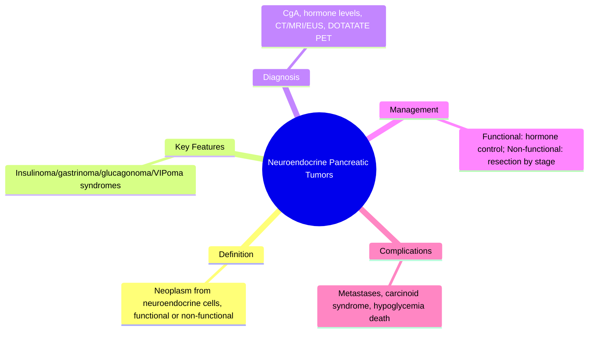
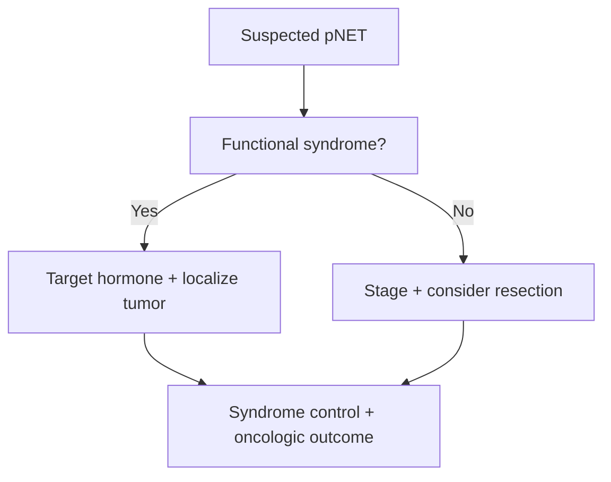

## Learning Objectives
- Define pancreatic neuroendocrine tumors (pNETs) and distinguish functional from non-functional types.
- Recognize the classic functional syndromes: insulinoma (hypoglycemia), gastrinoma (ulcers/diarrhea), glucagonoma (diabetes/rash), VIPoma (watery diarrhea/hypokalemia).
- Identify red flags for non-functional pNETs: mass effect, weight loss, jaundice, metastases.
- Outline the investigation strategy: biochemical markers, imaging (CT/MRI/EUS), and tissue diagnosis when needed.
- Outline management principles: functional tumors targeted by hormone control, non-functional by resection/ablation based on stage.# Neuroendocrine pancreatic tumors

Related: [[../Gastroenterology MOC|Gastroenterology MOC]] · [[../Pancreatic Disorders|Pancreatic Disorders]] · [[Pancreatic adenocarcinoma]]

> [!important]
> Pancreatic neuroendocrine tumors (pNETs) are less common than adenocarcinoma but are exam-important because they may be **functional or non-functional**, often behave differently, and may present with distinctive hormonal syndromes.

## Definition
Pancreatic neuroendocrine tumors are neoplasms arising from pancreatic neuroendocrine cells. They may be:
- **functional**: hormone-producing
- **non-functional**: mass-effect or incidental presentation

## Anatomy and Physiology
- These tumors arise within the pancreas but differ biologically from exocrine adenocarcinoma.
- Functional tumors produce excess hormones such as insulin, gastrin, glucagon, or VIP.

## Classification
### Functional pNETs
- Insulinoma
- Gastrinoma
- Glucagonoma
- VIPoma
- Somatostatinoma

### Non-functional pNETs
- Present later with pain, mass effect, jaundice, weight loss, or metastasis

## Pathophysiology
- Hormone hypersecretion causes syndrome-specific symptoms.
- Non-functional tumors present due to tumor burden rather than endocrine syndrome.

## Clinical Features
### Functional clues
- **Insulinoma**: recurrent hypoglycemia
- **Gastrinoma**: severe/refractory peptic ulcer disease, diarrhea
- **Glucagonoma**: diabetes, weight loss, rash
- **VIPoma**: profuse watery diarrhea, hypokalemia

### Non-functional clues
- Abdominal pain
- Weight loss
- Jaundice if obstructive
- Incidental imaging discovery

## Red Flags
- Recurrent unexplained hypoglycemia
- Severe refractory ulcer disease with diarrhea
- Large pancreatic mass or liver metastases
- Progressive weight loss

## Investigations
- Hormone-directed blood tests depending on syndrome
- Pancreatic CT/MRI
- EUS for lesion definition/tissue sampling when appropriate
- Staging imaging for metastatic disease

## Interpretation Framework
### Functional syndrome logic
- Hypoglycemia → think insulinoma
- Refractory ulcer + diarrhea → think gastrinoma
- Watery diarrhea + low K+ → think VIPoma

### pNET vs adenocarcinoma
- pNET may present with hormonal syndrome
- Adenocarcinoma more classically presents with painless jaundice/weight loss without endocrine syndrome

## Diagnosis
Diagnosis depends on clinical syndrome, hormone testing, imaging, and pathology when needed.

## Differential Diagnosis
- Pancreatic adenocarcinoma
- Autoimmune pancreatitis
- Peptic ulcer disease without gastrinoma
- Other endocrine causes of hypoglycemia/diarrhea

## Management
- Surgical resection if localized and feasible
- Control hormone excess when functional
- Oncology/MDT planning for metastatic disease
- Symptom-directed support and somatostatin-analog-based strategies in selected settings

## Complications
- Metastatic spread, often liver
- Hormone-related crises or severe metabolic complications
- Nutritional and quality-of-life impairment

## Common Exam / Viva Traps
- Forgetting the functional vs non-functional division
- Missing gastrinoma in refractory ulcer disease
- Confusing pNETs with usual pancreatic adenocarcinoma pattern

## One-Page Summary
- pNETs may be **functional** or **non-functional**.
- Functional tumors produce classic endocrine syndromes.
- Diagnose using syndrome-directed hormones + imaging.
- Localized disease may be resectable; metastatic disease needs MDT care.

## Revision Prompts
- Name 5 functional pNETs.
- What symptom pattern suggests gastrinoma?
- How does pNET differ from pancreatic adenocarcinoma?

## MCQs (10)
1. pNET stands for:
   - A. Pancreatic neuroendocrine tumor
   - B. Pancreatic necrotic enzyme tract
   - C. Peripancreatic node embolic tumor
   - D. Pancreatic nutrition enzyme test
   - **Answer: A**
2. A functional pNET is:
   - A. Insulinoma
   - B. Hemorrhoid
   - C. GERD
   - D. Anal fissure
   - **Answer: A**
3. Recurrent hypoglycemia suggests:
   - A. Insulinoma
   - B. VIPoma
   - C. UC
   - D. IBS
   - **Answer: A**
4. Refractory ulcer disease with diarrhea suggests:
   - A. Gastrinoma
   - B. Achalasia
   - C. FAP
   - D. Microscopic colitis
   - **Answer: A**
5. Profuse watery diarrhea with hypokalemia suggests:
   - A. VIPoma
   - B. Barrett oesophagus
   - C. Hemorrhoids
   - D. GERD
   - **Answer: A**
6. A major distinction from adenocarcinoma is:
   - A. Possible hormone syndrome
   - B. Always painless jaundice only
   - C. Never metastasizes
   - D. Never needs imaging
   - **Answer: A**
7. Best broad imaging approach includes:
   - A. Pancreatic CT/MRI
   - B. EEG only
   - C. DXA only
   - D. Spirometry only
   - **Answer: A**
8. Which may be non-functional?
   - A. A pNET presenting by mass effect
   - B. All insulinomas
   - C. All gastrinomas
   - D. All VIPomas
   - **Answer: A**
9. Common metastatic site is often:
   - A. Liver
   - B. Cornea
   - C. Thyroid cartilage
   - D. Retina
   - **Answer: A**
10. Localized pNET management may involve:
   - A. Surgery
   - B. Colectomy for all
   - C. No treatment ever
   - D. Antibiotics only
   - **Answer: A**

## SBA Questions (10)
1. A patient has repeated fasting hypoglycemia relieved by glucose. Pancreatic lesion is found. Most likely tumor?
   - A. Insulinoma
   - B. VIPoma
   - C. UC
   - D. Pancreatic pseudocyst
   - **Answer: A**
2. A patient has recurrent severe ulcers and chronic diarrhea. Which pancreatic tumor should be suspected?
   - A. Gastrinoma
   - B. Insulinoma
   - C. Glucagonoma
   - D. Chronic pancreatitis
   - **Answer: A**
3. Profuse watery diarrhea with hypokalemia points toward:
   - A. VIPoma
   - B. IBS-C
   - C. Achalasia
   - D. Anal fissure
   - **Answer: A**
4. Which is a key first diagnostic principle for suspected pNET?
   - A. Syndrome-directed hormone testing plus imaging
   - B. Ignore endocrine symptoms
   - C. Colonoscopy alone
   - D. ERCP for all
   - **Answer: A**
5. Which feature helps distinguish pNET from adenocarcinoma?
   - A. Endocrine hormone syndrome
   - B. Always obstructive jaundice only
   - C. Never any imaging findings
   - D. Purely esophageal symptoms
   - **Answer: A**
6. A non-functional pNET may present with:
   - A. Weight loss and mass effect
   - B. Only hypoglycemia
   - C. Only hematemesis
   - D. Only dysuria
   - **Answer: A**
7. Which management option is appropriate for localized disease?
   - A. Surgical resection
   - B. No follow-up ever
   - C. Routine colectomy
   - D. Daily PPIs only
   - **Answer: A**
8. Which metastatic site is common?
   - A. Liver
   - B. Ear canal
   - C. Cornea
   - D. Knee joint
   - **Answer: A**
9. Which statement is correct?
   - A. pNETs may be functional or non-functional
   - B. All are identical to adenocarcinoma
   - C. None produce hormones
   - D. All are benign
   - **Answer: A**
10. Which is a classic viva error?
   - A. Forgetting the functional/non-functional split
   - B. Mentioning insulinoma
   - C. Ordering imaging
   - D. Discussing surgery
   - **Answer: A**

## Flashcards
- Q: Two broad pNET groups?  
  A: Functional and non-functional.
- Q: pNET causing hypoglycemia?  
  A: Insulinoma.
- Q: pNET causing refractory ulcers and diarrhea?  
  A: Gastrinoma.
- Q: pNET causing watery diarrhea and hypokalemia?  
  A: VIPoma.
- Q: Common metastatic site?  
  A: Liver.

## Mind Map

## Flowchart

## Must Know / Should Know / Nice to Know
### Must Know
- Insulinoma = hypoglycemia
- Gastrinoma = ulcers + diarrhea
- VIPoma = watery diarrhea + hypokalemia
- Non-functional = mass effect/mets

### Should Know
- Somatostatin analogs for control
- Ki-67 grading (G1/G2/G3)
- PRRT for metastatic

### Nice to Know
- MEN1 syndrome association
- Everolimus/sunitinib for advanced

## Self-Test Scorecard
- Can I define Neuroendocrine Pancreatic Tumors correctly? /10
- Can I list 4 key features/clinical clues? /10
- Can I explain the diagnostic approach? /10
- Can I outline the management principles? /10

**Interpretation:**
- **<35/40** = weak topic
- **35-36/40** = acceptable but insecure
- **37+/40** = exam-ready

## Answer Key Pearls
- In exams, first state the **functional vs non-functional** division, then connect each syndrome to its tumor.