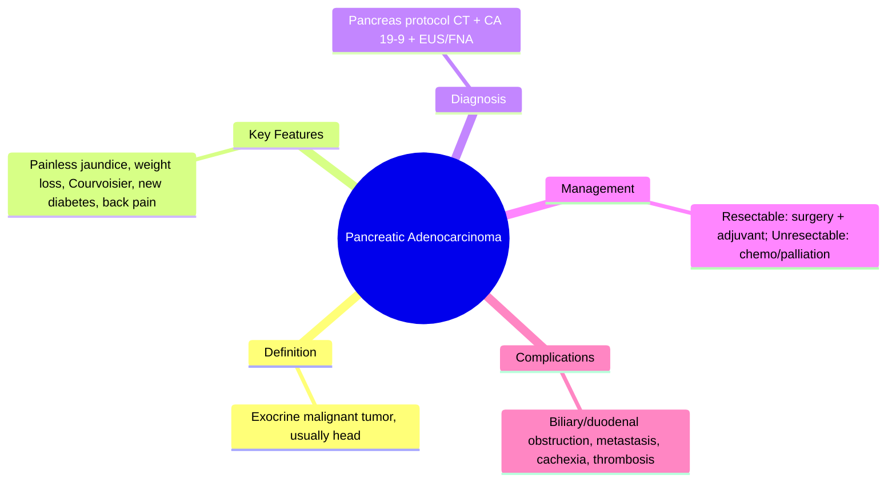

## Learning Objectives
- Recognize pancreatic adenocarcinoma as a late-presenting, high-mortality malignancy.
- Identify classic presentation: painless jaundice (head), weight loss, new diabetes, Courvoisier sign, back pain.
- Apply pancreatic protocol CT for staging and resectability assessment.
- Distinguish resectable vs borderline vs locally advanced vs metastatic management pathways.
- Understand the role of CA 19-9 as a supportive marker, not a standalone diagnostic test.# Pancreatic adenocarcinoma

Related: [[../Gastroenterology MOC|Gastroenterology MOC]] · [[../Pancreatic Disorders|Pancreatic Disorders]] · [[Autoimmune pancreatitis]]

> [!important]
> Pancreatic adenocarcinoma is a classic **late-presenting high-mortality malignancy**. Exam scoring depends on recognizing **painless jaundice, weight loss, Courvoisier sign, new diabetes, back pain, CT staging, and resectable vs unresectable management logic**.

## Definition
Pancreatic adenocarcinoma is a malignant epithelial tumor, usually arising from the exocrine pancreas, most often in the pancreatic head.

## Anatomy
- **Head lesions** commonly obstruct the distal CBD and cause jaundice.
- **Body/tail lesions** may present later with pain and weight loss.
- Local invasion may involve vessels and nearby structures, determining resectability.

## Physiology / Pathophysiology
- Tumor growth causes biliary obstruction, ductal obstruction, pain, cachexia, and early metastasis.
- Metastatic spread commonly involves liver, peritoneum, and regional nodes.

## Risk Factors
- Smoking
- Chronic pancreatitis
- Family history/genetic susceptibility in selected patients
- Increasing age
- Long-standing diabetes and obesity are associated risks

## Clinical Features
- Weight loss
- Anorexia
- Epigastric/back pain
- **Painless progressive jaundice** in head lesions
- Dark urine/pale stools/pruritus
- New-onset diabetes in some patients
- Thrombotic tendency may occur

## Red Flags
- Painless obstructive jaundice
- Palpable non-tender gallbladder (Courvoisier sign) in the right setting
- Significant weight loss
- Persistent deep back pain
- New diabetes with weight loss in older patient

## Investigations
- CBC, LFTs, bilirubin, cholestatic profile
- CA 19-9 as supportive marker, **not sole diagnostic test**
- **Pancreatic protocol CT** for diagnosis and staging
- EUS +/- FNA/FNB for tissue diagnosis when needed
- MRCP can help biliary/pancreatic duct assessment

## Interpretation Framework
### Presentation logic by site
- **Head**: jaundice/cholestasis
- **Body/tail**: pain, weight loss, later presentation

### Resectability logic
Key questions:
1. Is there distant metastasis?
2. Is there major vascular involvement?
3. Is the patient surgically fit?

## Diagnosis
Diagnosis is based on imaging and, when indicated, tissue confirmation in the context of a compatible clinical picture.

## Differential Diagnosis
- Autoimmune pancreatitis
- Cholangiocarcinoma/ampullary malignancy
- Chronic pancreatitis
- Pancreatic cystic neoplasm

## Management
## Curative intent
- Surgical resection if resectable and patient fit
- Head lesions may require pancreatoduodenectomy (Whipple procedure)

## Non-curative / advanced disease
- Palliative chemotherapy as appropriate
- Biliary stenting for obstructive jaundice
- Pain control, nutrition, thrombosis awareness, symptom support

## Complications
- Biliary obstruction and cholangitis risk
- Cachexia
- Pain
- Thromboembolism
- Metastatic disease

## Common Exam / Viva Traps
- Missing painless jaundice as a red flag
- Using CA 19-9 as a stand-alone diagnostic test
- Forgetting resectability/staging logic
- Failing to mention palliation when unresectable

## One-Page Summary
- Pancreatic adenocarcinoma presents late and carries poor prognosis.
- Red flags: **painless jaundice, weight loss, back pain, new diabetes**.
- Head tumors → obstructive jaundice.
- Best staging test: **pancreatic protocol CT**.
- Management depends on **resectability**; palliation is crucial in advanced disease.

## Revision Prompts
- Why do head lesions cause jaundice?
- What are the classic alarm features?
- How is resectability assessed?

## MCQs (10)
1. Commonest pancreatic cancer type is:
   - A. Adenocarcinoma
   - B. Lymphoma
   - C. Sarcoma
   - D. Melanoma
   - **Answer: A**
2. A classic presentation of pancreatic head cancer is:
   - A. Painless jaundice
   - B. Hematemesis only
   - C. Dysphagia only
   - D. Diarrhea only
   - **Answer: A**
3. A common constitutional feature is:
   - A. Weight loss
   - B. Polycythemia always
   - C. Stridor
   - D. Rash only
   - **Answer: A**
4. Best primary cross-sectional staging test is:
   - A. Pancreatic protocol CT
   - B. EEG
   - C. Spirometry
   - D. DXA
   - **Answer: A**
5. CA 19-9 is:
   - A. Supportive, not a sole diagnostic test
   - B. The only required test
   - C. A curative treatment
   - D. A thyroid marker
   - **Answer: A**
6. Body/tail tumors may present later with:
   - A. Pain and weight loss
   - B. Hemorrhoids
   - C. Achalasia
   - D. Anal fissure
   - **Answer: A**
7. Curative treatment requires:
   - A. Resectable disease
   - B. Any stage regardless of spread
   - C. PPI only
   - D. Colonoscopy
   - **Answer: A**
8. A key differential is:
   - A. Autoimmune pancreatitis
   - B. Rhinitis
   - C. Migraine
   - D. Otitis externa
   - **Answer: A**
9. Palliative biliary decompression may require:
   - A. Stenting
   - B. Laxatives only
   - C. Steroids only
   - D. Antacids only
   - **Answer: A**
10. A classical sign in obstructive malignancy context is:
   - A. Courvoisier sign
   - B. Trousseau for all cases exclusively
   - C. Babinski sign
   - D. Murphy sign only
   - **Answer: A**

## SBA Questions (10)
1. A 67-year-old man has progressive painless jaundice, weight loss, pruritus, and dark urine. Most likely diagnosis?
   - A. Pancreatic head adenocarcinoma
   - B. IBS-D
   - C. Functional dyspepsia
   - D. UC flare
   - **Answer: A**
2. What is the most appropriate initial staging imaging test?
   - A. Pancreatic protocol CT
   - B. EEG
   - C. Spirometry
   - D. Colonoscopy
   - **Answer: A**
3. Which lab marker can support but not confirm diagnosis alone?
   - A. CA 19-9
   - B. TSH
   - C. Troponin
   - D. CK
   - **Answer: A**
4. Which feature makes a lesion more likely to be in the pancreatic head?
   - A. Obstructive jaundice
   - B. Pure isolated steatorrhoea only
   - C. Hemorrhoids
   - D. Dysphagia
   - **Answer: A**
5. Which is a major management question before surgery?
   - A. Is the tumor resectable?
   - B. Does the patient have migraine?
   - C. Does the patient need PPIs?
   - D. Is there hemorrhoidal bleeding?
   - **Answer: A**
6. A major important differential in a mass-like pancreatic lesion is:
   - A. Autoimmune pancreatitis
   - B. Functional constipation
   - C. GERD
   - D. Hemorrhoids
   - **Answer: A**
7. Which symptom may herald body/tail disease?
   - A. Persistent deep back pain and weight loss
   - B. Hoarseness only
   - C. Epistaxis only
   - D. Dysuria only
   - **Answer: A**
8. Which palliative measure may relieve malignant jaundice?
   - A. Biliary stenting
   - B. Routine colectomy
   - C. Laxatives only
   - D. Helmet therapy
   - **Answer: A**
9. Which statement is correct?
   - A. Pancreatic cancer often presents late
   - B. It is usually benign
   - C. Jaundice excludes pancreatic disease
   - D. CT has no role
   - **Answer: A**
10. New diabetes with weight loss in an older patient may be a clue to:
   - A. Pancreatic adenocarcinoma
   - B. Simple IBS
   - C. Rhinitis
   - D. Tension headache
   - **Answer: A**

## Flashcards
- Q: Classic presentation of pancreatic head cancer?  
  A: Painless obstructive jaundice.
- Q: Common body/tail presentation?  
  A: Back pain and weight loss.
- Q: Best staging test?  
  A: Pancreatic protocol CT.
- Q: Important supportive marker?  
  A: CA 19-9.
- Q: Key management decision?  
  A: Resectable vs unresectable disease.


## Mind Map


## Flowchart
```mermaid
flowchart TD
  A[Painless jaundice + weight loss] --> B[CT shows resectable?]
  B -- Yes --> C[Surgery (Whipple) + adjuvant chemo]
  B -- No --> D[Borderline: neoadjuvant; Unresectable: chemo + biliary stent]
  C --> E[Palliation or curative intent]
  D --> E
```

## Must Know / Should Know / Nice to Know
### Must Know
- Painless jaundice + weight loss = classic
- Courvoisier sign = palpable nontender GB
- CT = staging, CA 19-9 = supportive
- 5-year survival low

### Should Know
- Borderline resectable criteria
- FOLFIRINOX vs Gem/Abraxane
- Biliary stenting for palliation

### Nice to Know
- Neoadjuvant therapy trials
- BRCA/PALB2 targeted therapy

## Self-Test Scorecard
- Can I define Pancreatic Adenocarcinoma correctly? /10
- Can I list 4 key features/clinical clues? /10
- Can I explain the diagnostic approach? /10
- Can I outline the management principles? /10

**Interpretation:**
- **<35/40** = weak topic
- **35-36/40** = acceptable but insecure
- **37+/40** = exam-ready


## Answer Key Pearls
- The standard exam structure is: **recognize red flags → image/stage → assess resectability → discuss curative vs palliative management**.
