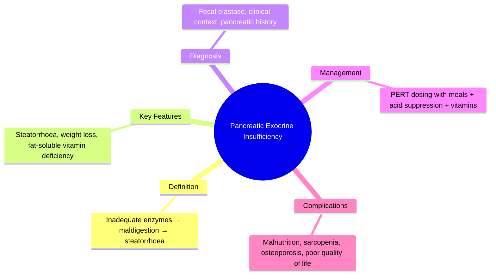
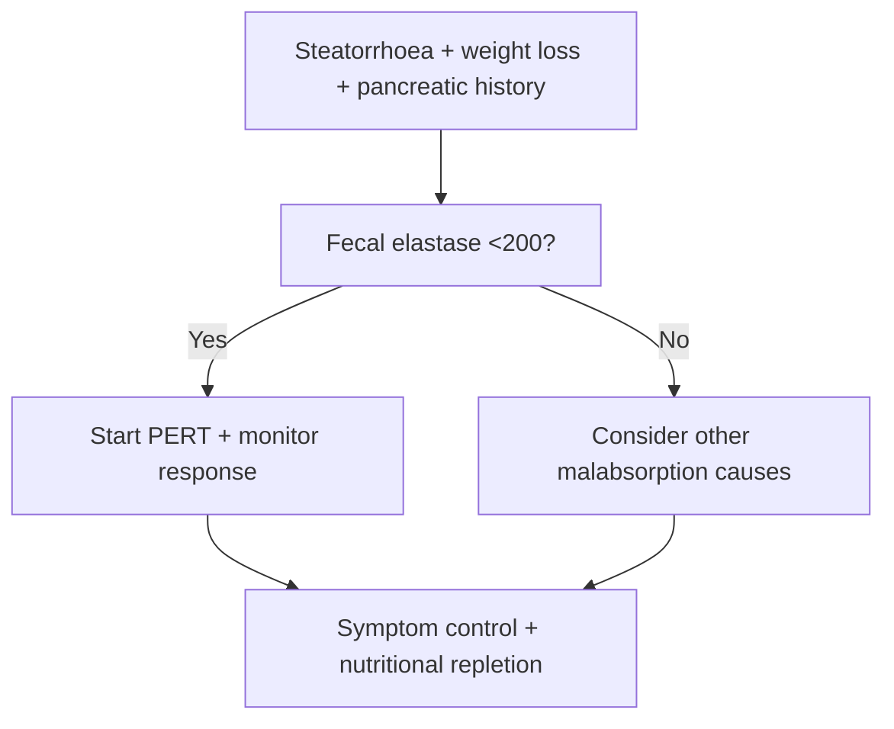

## Learning Objectives
- Define pancreatic exocrine insufficiency (PEI) as inadequate enzyme delivery causing maldigestion.
- Recognize steatorrhoea, weight loss, bloating, and fat-soluble vitamin deficiency as cardinal features.
- Identify chronic pancreatitis, pancreatic resection, and duct obstruction as common etiologies.
- Apply fecal elastase and clinical assessment for diagnosis.
- Prescribe pancreatic enzyme replacement therapy (PERT) with appropriate dosing, timing, and acid-suppression adjuncts.# Pancreatic exocrine insufficiency

Related: [[../Gastroenterology MOC|Gastroenterology MOC]] · [[../Pancreatic Disorders|Pancreatic Disorders]] · [[Chronic pancreatitis]]

> [!important]
> Pancreatic exocrine insufficiency (PEI) causes **maldigestion and malabsorption**, especially of fat. In exams, stress **steatorrhoea, weight loss, fat-soluble vitamin deficiency, underlying pancreatic disease, and pancreatic enzyme replacement therapy (PERT)**.

## Definition
PEI is inadequate delivery of pancreatic digestive enzymes/bicarbonate to the intestine, causing maldigestion and nutrient deficiency.

## Anatomy and Physiology
- Pancreatic acinar cells produce lipase, amylase, proteases.
- Ductal secretion provides bicarbonate for enzyme function.
- Loss of enzyme secretion most prominently causes **fat malabsorption**.

## Etiology / Causes
- Chronic pancreatitis
- Pancreatic resection
- Pancreatic duct obstruction in some cases
- Advanced cystic fibrosis or other pancreatic destruction states in broader medicine
- Severe pancreatic cancer may contribute

## Pathophysiology
- Inadequate enzyme output causes poor fat digestion.
- Result: steatorrhoea, weight loss, bloating, fat-soluble vitamin deficiency.
- Protein and carbohydrate digestion may also be impaired later.

## Clinical Features
- Steatorrhoea
- Weight loss
- Bloating/flatulence
- Nutritional deficiency
- Sarcopenia in chronic cases
- Background chronic pancreatitis symptoms may coexist

## Red Flags
- Severe weight loss
- Vitamin deficiency features
- Diabetes and chronic pancreatitis coexistence
- Suspicion of pancreatic malignancy when new-onset symptoms appear without known chronic disease

## Investigations
- History of pancreatic disease
- Fecal elastase where available
- Nutritional assessment, vitamins, albumin
- Imaging for underlying pancreatic pathology

## Interpretation Framework
### When to think PEI
- Oily stools + weight loss + pancreatic history
- Malabsorption not explained by small-bowel disease alone

### Differentiate from small-bowel malabsorption
- PEI often has pancreatic history/structural disease
- Coeliac disease and small-bowel disorders have different serologic/endoscopic clues

## Diagnosis
Diagnosis is based on suggestive symptoms, underlying pancreatic disease, and supportive functional tests such as low fecal elastase where available.

## Differential Diagnosis
- Coeliac disease
- Bile acid diarrhoea
- Small bowel bacterial overgrowth
- Chronic pancreatitis without overt exocrine failure yet
- Chronic diarrhea from non-malabsorptive causes

## Management
## Core treatment
- **Pancreatic enzyme replacement therapy (PERT)** with meals/snacks
- Nutritional counseling
- Replace fat-soluble vitamins when needed
- Treat underlying pancreatic disease

## Supportive measures
- Adequate calories/protein
- Monitor weight and nutritional response
- Acid suppression may help selected patients using PERT

## Complications
- Malnutrition
- Osteopenia/osteoporosis from deficiency states
- Poor quality of life
- Progressive frailty

## Common Exam / Viva Traps
- Missing PEI in a patient with chronic pancreatitis and weight loss
- Treating diarrhea without giving enzymes
- Not checking nutritional deficiency

## One-Page Summary
- PEI = failure of pancreatic digestive output.
- Hallmarks: **steatorrhoea, weight loss, deficiency states**.
- Commonest cause in adult gastro revision: **chronic pancreatitis**.
- Main treatment = **PERT + nutrition support**.

## Revision Prompts
- Define PEI.
- Why is steatorrhoea prominent?
- What is the treatment cornerstone?

## MCQs (10)
1. PEI causes failure of:
   - A. Digestion from lack of pancreatic enzymes
   - B. Esophageal peristalsis only
   - C. Liver conjugation only
   - D. Colonic transit only
   - **Answer: A**
2. Most typical stool feature is:
   - A. Steatorrhoea
   - B. Hematemesis
   - C. Hemoptysis
   - D. Melanuria
   - **Answer: A**
3. Common adult cause is:
   - A. Chronic pancreatitis
   - B. Migraine
   - C. Appendicitis
   - D. Rhinitis
   - **Answer: A**
4. Useful functional test when available is:
   - A. Fecal elastase
   - B. Troponin
   - C. PSA
   - D. EEG
   - **Answer: A**
5. Cornerstone treatment is:
   - A. Pancreatic enzyme replacement
   - B. Laxatives only
   - C. Colonoscopy only
   - D. Routine antibiotics
   - **Answer: A**
6. A common consequence is:
   - A. Fat-soluble vitamin deficiency
   - B. Stroke always
   - C. Hemorrhoids only
   - D. Hyperthyroidism
   - **Answer: A**
7. Which symptom combination suggests PEI?
   - A. Weight loss and oily stools
   - B. Dysphagia and hoarseness
   - C. Hematuria and flank pain
   - D. Cough and wheeze
   - **Answer: A**
8. PEI should be differentiated from:
   - A. Coeliac disease
   - B. Migraine
   - C. Otitis media
   - D. Glaucoma
   - **Answer: A**
9. PERT should be taken with:
   - A. Meals/snacks
   - B. Only at bedtime unrelated to food
   - C. Weekly only
   - D. Never with food
   - **Answer: A**
10. PEI belongs to which pancreatic group here?
   - A. Chronic pancreatic disease
   - B. Oesophageal disorders
   - C. Lower GI bleeding
   - D. Hepatology
   - **Answer: A**

## SBA Questions (10)
1. A patient with chronic pancreatitis reports bulky oily stools and weight loss. Most likely explanation?
   - A. Pancreatic exocrine insufficiency
   - B. Hemorrhoids
   - C. IBS-C
   - D. Achalasia
   - **Answer: A**
2. Best first-line specific treatment?
   - A. Pancreatic enzyme replacement therapy
   - B. Long-term fasting
   - C. Chemotherapy
   - D. Anticoagulation
   - **Answer: A**
3. Which test may support the diagnosis?
   - A. Fecal elastase
   - B. EEG
   - C. Spirometry
   - D. MRI knee
   - **Answer: A**
4. Which deficiency group is especially relevant?
   - A. Fat-soluble vitamins
   - B. Only vitamin C
   - C. Only B12 always
   - D. None ever
   - **Answer: A**
5. Which underlying condition most commonly points toward PEI in adult gastro exams?
   - A. Chronic pancreatitis
   - B. Seasonal allergy
   - C. Migraine
   - D. Psoriasis
   - **Answer: A**
6. Which differential may mimic malabsorption symptoms?
   - A. Coeliac disease
   - B. Tension headache
   - C. Otitis externa
   - D. Cataract
   - **Answer: A**
7. A patient loses weight despite normal eating. Stool is greasy. What mechanism best explains this?
   - A. Maldigestion from enzyme deficiency
   - B. Colonic bleeding
   - C. Cardiac failure only
   - D. Hyperthyroidism only
   - **Answer: A**
8. Which statement about PERT is correct?
   - A. It should be linked to food intake
   - B. It is never useful in PEI
   - C. It replaces insulin
   - D. It treats UC directly
   - **Answer: A**
9. Which complication can occur if untreated?
   - A. Malnutrition
   - B. Achalasia
   - C. Aortic stenosis
   - D. Glomerulonephritis
   - **Answer: A**
10. New-onset PEI symptoms without known chronic pancreatitis should also raise concern for:
   - A. Pancreatic malignancy
   - B. Rhinitis
   - C. Migraine
   - D. Hemorrhoids only
   - **Answer: A**

## Flashcards
- Q: Hallmark stool pattern in PEI?  
  A: Steatorrhoea.
- Q: Common adult cause?  
  A: Chronic pancreatitis.
- Q: Key specific treatment?  
  A: PERT.
- Q: Useful test where available?  
  A: Fecal elastase.
- Q: Deficiency group to monitor?  
  A: Fat-soluble vitamins.

## Mind Map

## Flowchart

## Must Know / Should Know / Nice to Know
### Must Know
- Steatorrhoea = oily/foul/difficult-to-flush stools
- Chronic pancreatitis = #1 cause
- PERT with meals/snacks + PPI
- Fat-soluble vitamins A/D/E/K monitoring

### Should Know
- Enteric-coated microspheres dosing
- Acid suppression improves PERT efficacy
- Cystic fibrosis/shwachman-diamond in young

### Nice to Know
- Fecal elastase limitations
- Sarcopenia prevention

## Self-Test Scorecard
- Can I define Pancreatic Exocrine Insufficiency correctly? /10
- Can I list 4 key features/clinical clues? /10
- Can I explain the diagnostic approach? /10
- Can I outline the management principles? /10

**Interpretation:**
- **<35/40** = weak topic
- **35-36/40** = acceptable but insecure
- **37+/40** = exam-ready

## Answer Key Pearls
- PEI answers score when you link **symptoms + pancreatic cause + enzyme replacement + nutrition correction**.
