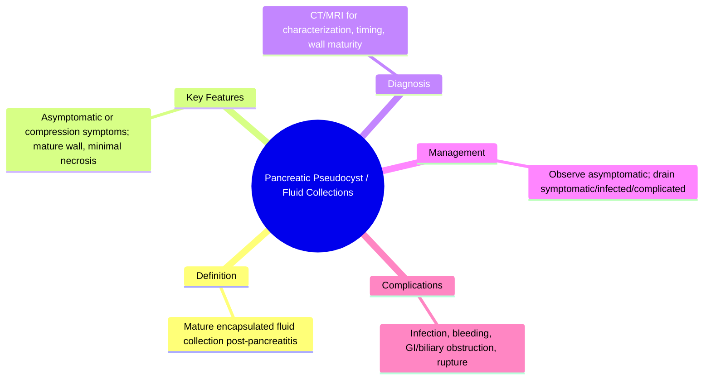

## Learning Objectives
- Distinguish the four revised collection types: acute peripancreatic fluid collection, pseudocyst, acute necrotic collection, walled-off necrosis.
- Apply the timing and content criteria: pseudocyst = mature wall, minimal solid debris; WON = mature wall with necrosis.
- Recognize compression symptoms (gastric outlet, biliary, vascular) and infection signs.
- Apply the principle: asymptomatic mature collections may be observed; intervention for symptoms, infection, or complications.
- Understand endoscopic, percutaneous, and surgical drainage options and selection criteria.# Pancreatic pseudocyst and fluid collections

Related: [[../Gastroenterology MOC|Gastroenterology MOC]] · [[../Pancreatic Disorders|Pancreatic Disorders]] · [[Acute pancreatitis]]

> [!important]
> After acute pancreatitis, candidates must distinguish **acute fluid collections, pseudocyst, acute necrotic collection, and walled-off necrosis**. Marks come from showing **timing, contents, symptoms, and whether drainage is actually needed**.

## Definition
A pancreatic pseudocyst is a mature, encapsulated, enzyme-rich fluid collection with little or no solid necrotic material, usually developing weeks after pancreatitis.

## Anatomy and Physiology
- Collections form in or around the pancreas.
- A pseudocyst lacks a true epithelial lining.
- Collections may compress stomach, duodenum, bile duct, or vessels.

## Classification
### Revised practical collection types
- Acute peripancreatic fluid collection
- Pancreatic pseudocyst
- Acute necrotic collection
- Walled-off necrosis

### Key distinction
- **Pseudocyst** = mainly fluid, mature wall, little/no solid debris
- **Walled-off necrosis** = mature wall **with necrotic material**

## Etiology / Risk Factors
- Acute pancreatitis
- Chronic pancreatitis
- Pancreatic duct disruption or leak

## Pathophysiology
- Inflammatory fluid and pancreatic secretions accumulate after pancreatic injury.
- Over time, a fibrous wall matures around the collection.
- Ductal disruption can maintain/enlarge the collection.

## Clinical Features
- Often asymptomatic and found on imaging
- Persistent abdominal pain
- Early satiety/vomiting from compression
- Palpable mass rarely
- Fever if infected
- Jaundice if biliary compression occurs

## Red Flags
- Sepsis/infection
- GI obstruction
- Bleeding into collection
- Rapid enlargement
- Significant pain or poor intake

## Investigations
- Contrast CT or MRI to define size, wall maturity, and debris
- EUS can characterize contents and guide drainage
- Labs for inflammation, cholestasis, anemia if complicated

## Interpretation Framework
### Timing logic
- Early after pancreatitis: think acute fluid collection or acute necrotic collection
- Later mature wall: think pseudocyst or walled-off necrosis

### Drain or observe?
Drain if:
- symptomatic
- infected
- causing obstruction/compression
- bleeding/other complications

Do **not** drain automatically just because it exists.

## Diagnosis
Diagnosis is imaging-based, integrating timing after pancreatitis and whether the collection is fluid-only or contains necrotic material.

## Differential Diagnosis
- Walled-off necrosis
- Pancreatic cystic neoplasm
- Abscess
- Other upper abdominal cystic lesions

## Management
## Observation
- Asymptomatic stable collections may be observed
- Serial imaging may be appropriate depending on context

## Intervention indications
- Persistent symptoms
- Infection
- Gastric outlet/biliary obstruction
- Bleeding or other major complication

## Drainage options
- EUS-guided internal drainage is common when anatomically suitable
- Percutaneous drainage in selected cases
- Surgical options when necessary

## Complications
- Infection
- Hemorrhage
- Rupture
- Obstruction
- Recurrence

## Common Exam / Viva Traps
- Calling every post-pancreatitis collection a pseudocyst
- Forgetting to differentiate pseudocyst from walled-off necrosis
- Draining asymptomatic collections unnecessarily

## One-Page Summary
- Post-pancreatitis collections require **timing + contents** classification.
- Pseudocyst = mature wall + fluid.
- Walled-off necrosis = mature wall + solid necrotic debris.
- Drain only if **symptomatic, infected, obstructive, or complicated**.

## Revision Prompts
- Define pseudocyst.
- Differentiate pseudocyst from walled-off necrosis.
- When should a pancreatic collection be drained?

## MCQs (10)
1. A pseudocyst usually develops after:
   - A. Acute or chronic pancreatic injury
   - B. Asthma attack
   - C. UC only
   - D. GERD only
   - **Answer: A**
2. A pancreatic pseudocyst typically contains:
   - A. Mainly fluid
   - B. Only feces
   - C. Pleural fluid
   - D. Air only
   - **Answer: A**
3. Which mature collection contains solid necrotic material?
   - A. Walled-off necrosis
   - B. Simple GERD pouch
   - C. IBS lesion
   - D. Hemorrhoid sac
   - **Answer: A**
4. The best imaging principle is to define:
   - A. Timing and contents
   - B. Hair color
   - C. Handedness
   - D. Mood score only
   - **Answer: A**
5. Asymptomatic stable pseudocyst usually requires:
   - A. Immediate drainage always
   - B. Observation
   - C. Colectomy
   - D. ERCP in all cases
   - **Answer: B**
6. A drainage indication is:
   - A. Infection
   - B. Normal appetite
   - C. No symptoms
   - D. Normal imaging only
   - **Answer: A**
7. Which method commonly guides internal drainage?
   - A. EUS
   - B. EEG
   - C. ECG only
   - D. Spirometry
   - **Answer: A**
8. Pseudocyst may cause:
   - A. Gastric outlet obstruction
   - B. Mitral stenosis
   - C. Cataract
   - D. Tinnitus only
   - **Answer: A**
9. A common exam mistake is:
   - A. Draining every collection automatically
   - B. Mentioning observation
   - C. Using imaging classification
   - D. Differentiating debris
   - **Answer: A**
10. A true epithelial lining is:
   - A. Not typical of pseudocyst
   - B. Always present
   - C. Diagnostic of IBS
   - D. Typical of hemorrhoids
   - **Answer: A**

## SBA Questions (10)
1. A patient 5 weeks after pancreatitis has persistent pain and CT shows a well-defined fluid-only collection. Most likely diagnosis?
   - A. Pancreatic pseudocyst
   - B. Walled-off necrosis by definition
   - C. Colon cancer
   - D. Barrett oesophagus
   - **Answer: A**
2. A mature collection contains solid necrotic debris. Best label?
   - A. Walled-off necrosis
   - B. Simple pseudocyst
   - C. IBS-C
   - D. Gallstone ileus
   - **Answer: A**
3. An asymptomatic stable post-pancreatitis pseudocyst is best managed initially by:
   - A. Observation
   - B. Immediate drainage
   - C. Emergency laparotomy
   - D. Routine chemotherapy
   - **Answer: A**
4. Which feature makes drainage more likely to be needed?
   - A. Gastric outlet obstruction
   - B. Normal appetite
   - C. Incidental small asymptomatic lesion
   - D. Normal vitals and no symptoms
   - **Answer: A**
5. Which modality both characterizes and may guide drainage?
   - A. EUS
   - B. EEG
   - C. DXA
   - D. Spirometry
   - **Answer: A**
6. Which is true about pseudocyst?
   - A. It is usually enzyme-rich and encapsulated
   - B. It is always malignant
   - C. It is always infected
   - D. It contains only blood by definition
   - **Answer: A**
7. Important differential for pseudocyst is:
   - A. Pancreatic cystic neoplasm
   - B. Asthma
   - C. Migraine
   - D. Hemorrhoids
   - **Answer: A**
8. Which complication may occur?
   - A. Hemorrhage
   - B. Aortic regurgitation
   - C. Nephrotic syndrome
   - D. Otitis media
   - **Answer: A**
9. Which statement is correct?
   - A. Timing after pancreatitis helps classify collections
   - B. Timing is irrelevant
   - C. All collections are pseudocysts immediately
   - D. CT has no role
   - **Answer: A**
10. The biggest conceptual distinction in exams is between pseudocyst and:
   - A. Walled-off necrosis
   - B. GERD
   - C. IBS
   - D. UC
   - **Answer: A**

## Flashcards
- Q: What is a pancreatic pseudocyst?  
  A: A mature encapsulated fluid collection after pancreatic injury with little/no solid necrotic debris.
- Q: Key differential with solid material?  
  A: Walled-off necrosis.
- Q: Drainage indications?  
  A: Symptoms, infection, obstruction, bleeding/complications.
- Q: Common imaging tools?  
  A: CT, MRI, EUS.
- Q: Should every pseudocyst be drained?  
  A: No.


## Mind Map


## Flowchart
```mermaid
flowchart TD
  A[Pancreatic fluid collection on imaging post-pancreatitis] --> B[Mature wall (>4 weeks)?]
  B -- Yes --> C[Pseudocyst (fluid) vs WON (necrosis)]
  B -- No --> D[Acute collection (observe)]
  C --> E[Observe vs drain by type/symptoms]
  D --> E
```

## Must Know / Should Know / Nice to Know
### Must Know
- Pseudocyst = fluid, mature wall, minimal necrosis
- WON = mature wall WITH necrosis
- Asymptomatic = observe
- Drain for symptoms/infection/compression

### Should Know
- Time since pancreatitis = wall maturity
- EUS-guided transmural drainage preferred
- Pseudocyst vs cystic neoplasm distinction

### Nice to Know
- Cystogastrostomy vs cystojejunostomy
- Duct disruption and stenting

## Self-Test Scorecard
- Can I define Pancreatic Pseudocyst / Fluid Collections correctly? /10
- Can I list 4 key features/clinical clues? /10
- Can I explain the diagnostic approach? /10
- Can I outline the management principles? /10

**Interpretation:**
- **<35/40** = weak topic
- **35-36/40** = acceptable but insecure
- **37+/40** = exam-ready


## Answer Key Pearls
- The scoring framework is: **classify the collection correctly, then explain who needs drainage and who does not**.
