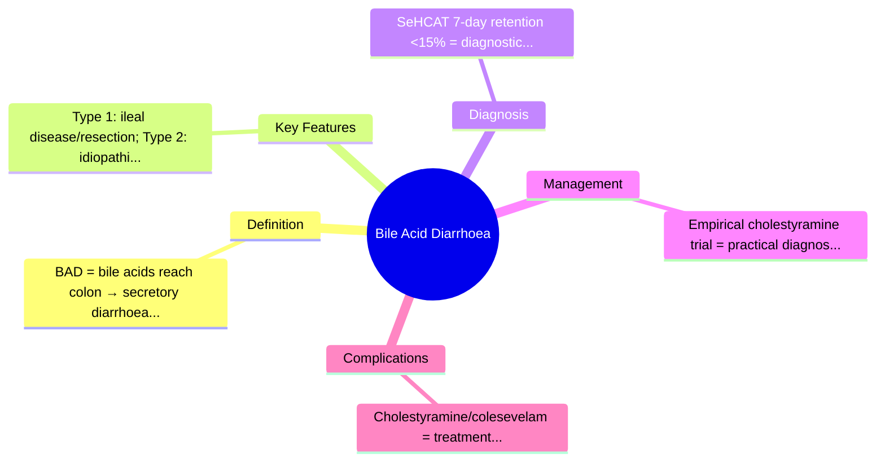
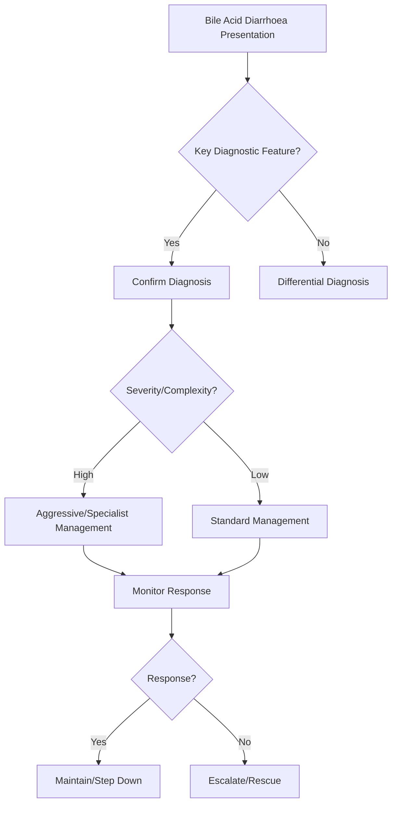

## Learning Objectives
- Define bile acid diarrhoea (BAD) and distinguish types 1, 2, and 3.
- Recognize the clinical clue: watery diarrhoea, often nocturnal, responds to bile acid sequestrants.
- Understand the pathophysiology: failed ileal reabsorption → colonic bile acid excess → secretory diarrhoea.
- Apply the SeHCAT test and empirical therapeutic trial for diagnosis.
- Outline management: bile acid sequestrants (cholestyramine/colesevelam) and treat underlying cause.# Bile acid diarrhoea

## Definition
Bile acid diarrhoea is chronic watery diarrhoea caused by excess bile acids reaching the colon, producing secretory and motility effects.

## Causes / settings
- Idiopathic bile acid malabsorption
- Terminal ileal disease or resection
- Post-cholecystectomy in some patients
- Postinfective/functional overlap in selected cases

## Clinical clues
- Chronic watery urgency
- Morning diarrhoea, postprandial worsening
- Bloating less dominant than in carbohydrate malabsorption
- Often misdiagnosed as IBS-D

## Pathophysiology
Failure of ileal bile acid reabsorption increases colonic bile acid exposure, stimulating secretion and motility.

## Investigations
- SeHCAT where available
- Empirical therapeutic trial with bile acid sequestrant in some settings
- Evaluate terminal ileal disease if suggested clinically

## Management
- Bile acid sequestrants such as cholestyramine/colesevelam
- Dietary fat adjustment in some patients
- Treat ileal disease if present

## Exam pearls
- Think of it in “IBS-D” that has urgency and responds to sequestrants.
- Important after ileal resection/Crohn ileitis.

## One-page summary
Bile acid diarrhoea is a **secretory watery diarrhoea** syndrome due to failure of ileal bile acid recycling. It is a common overlooked mimic of **IBS-D** and responds to **bile acid binders**.

## MCQs (10)
1. Typical stool pattern? **Watery diarrhoea**.
2. Commonly overlooked as? **IBS-D**.
3. Important anatomic clue? **Terminal ileal disease/resection**.
4. Main test in some centres? **SeHCAT**.
5. Main treatment drug class? **Bile acid sequestrants**.
6. Mechanism is mainly? **Secretory/motility stimulation**.
7. Bloating dominates over urgency? **No**.
8. Crohn ileitis can cause it? **Yes**.
9. Response to cholestyramine supports? **This diagnosis**.
10. Pathology lies in failure of? **Ileal bile acid reabsorption**.

## SBA Questions (10)
1. Chronic watery urgency after ileal resection: likely diagnosis? **Bile acid diarrhoea**.
2. Test classically used? **SeHCAT**.
3. Why confused with IBS-D? **Watery chronic diarrhoea without obvious inflammation**.
4. Best therapeutic class? **Bile acid sequestrant**.
5. Main mechanism? **Excess bile acids reaching colon**.
6. Post-cholecystectomy diarrhoea may reflect? **Bile acid diarrhoea**.
7. Key inflammatory disease association? **Crohn disease affecting terminal ileum**.
8. Best exam-safe phrase? **Consider bile acid diarrhoea in chronic watery diarrhoea, especially with ileal disease**.
9. Pathophysiologic organ primarily failing? **Terminal ileum**.
10. Symptom response to cholestyramine is clinically? **Supportive**.

## Flashcards
- Q: Main stool type in bile acid diarrhoea?  
  A: Watery urgency diarrhoea.
- Q: Key anatomical association?  
  A: Terminal ileal disease/resection.
- Q: Mimics which functional condition?  
  A: IBS-D.
- Q: Common treatment?  
  A: Cholestyramine/colesevelam.
- Q: Main mechanism?  
  A: Colonic exposure to excess bile acids.

## Mind Map

## Flowchart

## Must Know / Should Know / Nice to Know
### Must Know
- BAD = bile acids reach colon → secretory diarrhoea
- Type 1: ileal disease/resection; Type 2: idiopathic; Type 3: other (cholecystectomy, metformin)
- SeHCAT 7-day retention <15% = diagnostic
- Empirical cholestyramine trial = practical diagnosis
- Cholestyramine/colesevelam = treatment

### Should Know
- FGF19 deficiency in type 2
- Differential: microscopic colitis, SIBO, functional
- Colesevelam better tolerated than cholestyramine

### Nice to Know
- FXR agonists in development
- Breath test for bile acids

## Self-Test Scorecard
- Can I define Bile Acid Diarrhoea correctly? /10
- Can I list 4 key features? /10
- Can I explain the diagnostic approach? /10
- Can I outline the management? /10

**Interpretation:**
- **<35/40** = weak topic
- **35-36/40** = acceptable but insecure
- **37+/40** = exam-ready

## Revision Prompts
- What is Bile Acid Diarrhoea?
- What are the key diagnostic features?
- What is the management approach?

## Answer Key with Explanations

