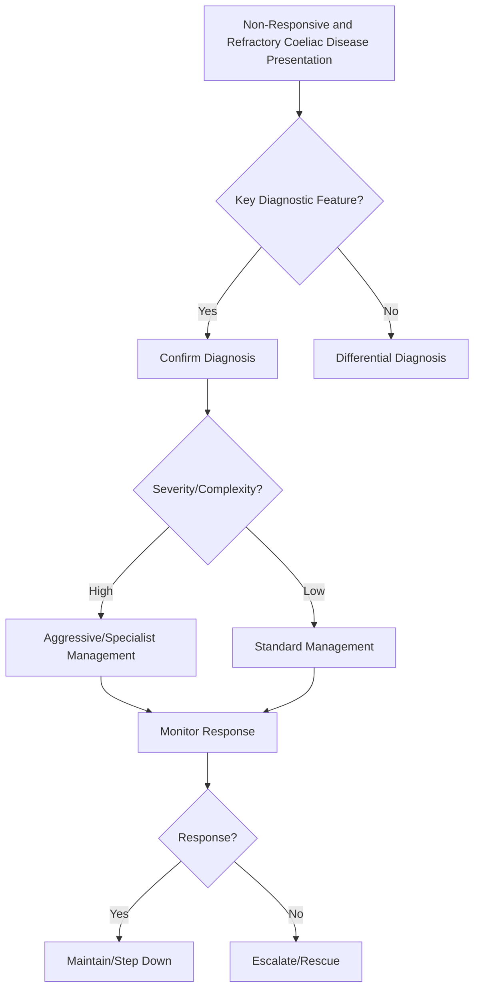

## Learning Objectives
- Define non-responsive coeliac disease (NRCD): persistent symptoms/signs despite 6-12 months strict GFD.
- Identify common causes of NRCD: gluten contamination (most common), alternative diagnoses (IBS, SIBO, lactose, microscopic colitis), refractory coeliac disease.
- Define refractory coeliac disease (RCD): persistent villous atrophy despite >12 months strict GFD after excluding other causes.
- Distinguish RCD type I (normal IEL phenotype) from type II (aberrant IEL, pre-lymphoma).
- Outline management: dietitian review, repeat serology/biopsy, immunosuppression/steroids for RCD, lymphoma surveillance.# Non-responsive and refractory coeliac disease

Related: [[../Gastroenterology MOC|Gastroenterology MOC]] · [[../Small Bowel Malabsorption and Coeliac Disease|Small Bowel Malabsorption and Coeliac Disease]]

## Definition
Non-responsive coeliac disease means persistent symptoms, laboratory abnormalities, or villous damage despite an apparently treated coeliac patient. Refractory coeliac disease is persistent/recurrent malabsorption with villous atrophy despite a strict gluten-free diet for usually >12 months after excluding other causes.

## High-yield distinction
- **Non-responsive coeliac disease**: often due to ongoing gluten exposure or alternative diagnosis.
- **Refractory coeliac disease**: true immune-mediated persistent enteropathy after exclusion of mimics.

## Common causes of persistent symptoms
- Inadvertent gluten exposure
- Lactose intolerance
- Small intestinal bacterial overgrowth
- Microscopic colitis
- Pancreatic insufficiency
- IBS overlap
- Refractory coeliac disease
- Enteropathy-associated T-cell lymphoma

## Refractory subtypes
- **Type 1**: better prognosis, normal phenotype IELs.
- **Type 2**: aberrant clonal IEL population, higher lymphoma risk, poorer prognosis.

## Investigations
- Careful dietary review with expert dietitian
- Repeat coeliac serology and nutritional profile
- Duodenal biopsy review
- Exclude SIBO, microscopic colitis, pancreatic insufficiency
- Consider immunophenotyping / T-cell receptor studies
- Imaging/capsule/CT enterography if lymphoma suspected

## Management
1. Confirm true coeliac diagnosis.
2. Exclude gluten contamination and common mimics.
3. Replace deficiencies.
4. Refractory cases need specialist management; steroids/budesonide or immunosuppressive approaches may be used.
5. Type 2 needs close malignancy surveillance.

## Red flags
- Weight loss despite strict diet
- Severe hypoalbuminaemia
- Ulceration/obstruction
- Fever, night sweats, severe abdominal pain
- Suspicion of enteropathy-associated T-cell lymphoma

## One-page summary
Persistent symptoms after coeliac diagnosis are usually from **ongoing gluten exposure or another condition**, not immediate refractory disease. Refractory disease is uncommon, specialist-led, and especially dangerous when **type 2** because of lymphoma risk.

## MCQs (10)
1. Commonest cause of non-responsive coeliac disease? **Ongoing gluten exposure**.
2. Dangerous subtype with lymphoma risk? **Type 2 refractory coeliac disease**.
3. Initial best step? **Review diagnosis and diet adherence**.
4. Common mimic? **SIBO**.
5. Key pathology feature in refractory disease? **Persistent villous atrophy**.
6. Type 1 prognosis versus type 2? **Better**.
7. Weight loss plus pain should trigger suspicion of? **Lymphoma**.
8. Expert allied professional needed? **Dietitian**.
9. Serology alone excludes refractory disease? **No**.
10. Persistent diarrhoea in treated coeliac can be due to? **Microscopic colitis**.

## SBA Questions (10)
1. Ongoing diarrhoea in coeliac patient eating outside frequently: most likely reason? **Gluten contamination**.
2. Persistent villous atrophy after strict diet and negative workup: likely label? **Refractory coeliac disease**.
3. Best first investigation step in “refractory” coeliac claim? **Dietary review and diagnosis confirmation**.
4. Marked weight loss and abdominal pain in refractory case: concern? **EATL**.
5. Type 2 refractory disease is important because it carries high risk of? **Lymphoma**.
6. Symptomatic treated coeliac with bloating after milk: likely overlap? **Lactose intolerance**.
7. Specialist pathology may assess? **Aberrant intraepithelial lymphocytes**.
8. Best overall management principle? **Exclude common causes before labeling refractory disease**.
9. Nutritional management should include? **Deficiency replacement**.
10. Exam-safe phrase? **Non-responsive coeliac disease is a syndrome; refractory coeliac disease is a specialist diagnosis after exclusions**.

## Flashcards
- Q: Commonest cause of persistent symptoms in treated coeliac disease?  
  A: Ongoing gluten exposure.
- Q: Refractory coeliac subtype with worse prognosis?  
  A: Type 2.
- Q: Malignancy to fear?  
  A: Enteropathy-associated T-cell lymphoma.
- Q: First practical review?  
  A: Diet review and diagnosis confirmation.
- Q: Common mimics?  
  A: SIBO, lactose intolerance, microscopic colitis.


## Mind Map
```mermaid
mindmap
  root((Non-Responsive and Refractory Coeliac Disease))
    Definition
      NRCD = symptoms despite 6-12mo GFD; RCD = persiste...
    Key Features
      Most common cause = gluten contamination (intentio...
    Diagnosis
      RCD Type I = normal IELs; Type II = aberrant IELs ...
    Management
      Type II RCD = treat with steroids/azathioprine/cla...
    Complications
      Always confirm GFD adherence with dietitian before...
```

## Flowchart


## Must Know / Should Know / Nice to Know
### Must Know
- NRCD = symptoms despite 6-12mo GFD; RCD = persistent atrophy despite >12mo strict GFD
- Most common cause = gluten contamination (intentional/unintentional)
- RCD Type I = normal IELs; Type II = aberrant IELs (CD3+CD8-) = high lymphoma risk
- Type II RCD = treat with steroids/azathioprine/cladribine; monitor for EATL
- Always confirm GFD adherence with dietitian before RCD label

### Should Know
- EATL = enteropathy-associated T-cell lymphoma
- Capsule endoscopy for lymphoma surveillance
- IL-15 pathway in type II pathogenesis

### Nice to Know
- JAK inhibitors in trials
- Autologous stem cell transplant for refractory type II

## Self-Test Scorecard
- Can I define Non-Responsive and Refractory Coeliac Disease correctly? /10
- Can I list 4 key features? /10
- Can I explain the diagnostic approach? /10
- Can I outline the management? /10

**Interpretation:**
- **<35/40** = weak topic
- **35-36/40** = acceptable but insecure
- **37+/40** = exam-ready

## Revision Prompts
- What is Non-Responsive and Refractory Coeliac Disease?
- What are the key diagnostic features?
- What is the management approach?

## Answer Key with Explanations


