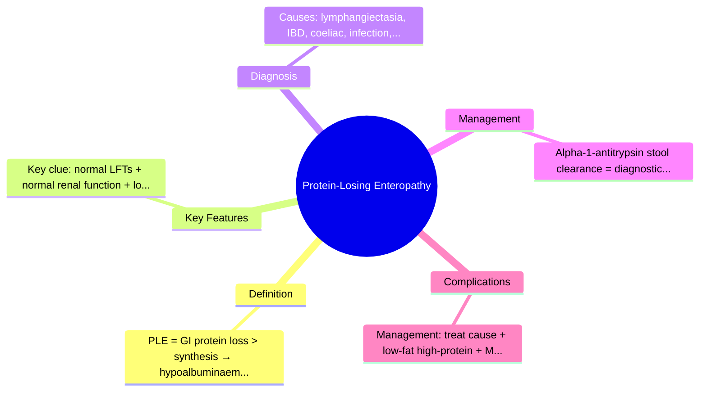
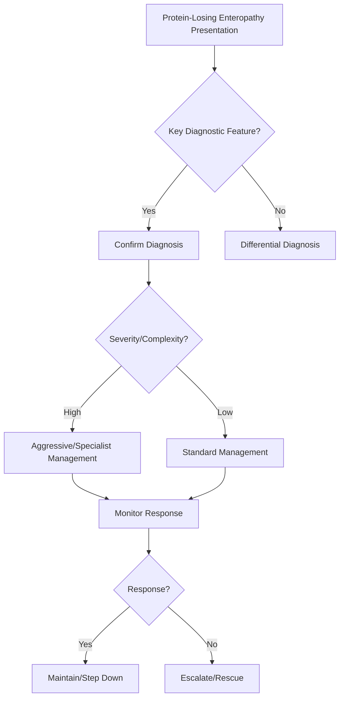

## Learning Objectives
- Define protein-losing enteropathy (PLE): excessive gastrointestinal protein loss causing hypoalbuminaemia.
- Recognize the triad: oedema, hypoalbuminaemia, normal liver/kidney function.
- Identify major GI causes: intestinal lymphangiectasia, inflammatory bowel disease, coeliac disease, infections, malignancy.
- Apply the alpha-1-antitrypsin clearance test (stool) or faecal alpha-1-antitrypsin as diagnostic tools.
- Outline management: treat underlying cause, low-fat high-protein diet, MCT oil, octreotide for lymphangiectasia.# Protein-losing enteropathy

## Definition
Protein-losing enteropathy is excessive loss of serum proteins into the gastrointestinal tract causing hypoalbuminaemia and oedema without primary liver failure, nephrotic syndrome, or severe malnutrition alone.

## Causes
- Intestinal mucosal disease: coeliac, IBD, lymphoma
- Intestinal lymphatic obstruction: intestinal lymphangiectasia
- Congestive / raised venous pressure states in selected patients

## Clinical features
- Peripheral oedema
- Diarrhoea or steatorrhoea may coexist
- Weight loss, effusions, deficiency states
- Low albumin with preserved liver synthetic context and no major proteinuria

## Investigation approach
1. Exclude nephrotic syndrome and liver failure.
2. Check albumin, total protein, CBC, lymphocyte count.
3. Stool alpha-1 antitrypsin clearance where available.
4. Endoscopic and imaging search for causative bowel disorder.

## Management
- Treat underlying cause
- Nutritional support with high-protein diet where appropriate
- Replace micronutrients
- Manage oedema/effusions symptomatically if needed

## Differential diagnosis
- Nephrotic syndrome
- Cirrhosis
- Severe protein-calorie malnutrition
- Heart failure-related oedema

## One-page summary
Protein-losing enteropathy should be suspected in **unexplained hypoalbuminaemia with oedema** when liver and kidney explanations are not sufficient. Diagnosis is confirmatory with enteric protein-loss assessment where available and treatment is **cause-directed**.

## MCQs (10)
1. Hallmark lab? **Low albumin**.
2. Key clinical sign? **Oedema**.
3. Important renal differential? **Nephrotic syndrome**.
4. Confirmatory stool-related test? **Alpha-1 antitrypsin clearance**.
5. One mucosal cause? **Coeliac disease**.
6. One lymphatic cause? **Intestinal lymphangiectasia**.
7. Main management principle? **Treat underlying cause**.
8. Cirrhosis must be? **Excluded**.
9. Protein loss occurs where? **GI tract**.
10. Diarrhoea may or may not be present? **Yes**.

## SBA Questions (10)
1. Generalized oedema with low albumin, no proteinuria, normal synthetic liver context: likely syndrome? **Protein-losing enteropathy**.
2. Best next investigation if available? **Stool alpha-1 antitrypsin clearance**.
3. Why is nephrotic syndrome a key differential? **It also causes oedema and hypoalbuminaemia**.
4. Underlying coeliac disease can cause PLE by? **Mucosal protein loss**.
5. Main treatment? **Address the underlying bowel/lymphatic disease**.
6. Ascites and oedema do not automatically mean? **Liver disease only**.
7. Low albumin with chronic diarrhoea should prompt? **Enteric protein loss consideration**.
8. Symptomatic management may include? **Nutrition and oedema control**.
9. Best exam-safe phrase? **PLE is a syndrome, not a single disease**.
10. Protein-losing enteropathy is likely when albumin is low despite absence of? **Major renal or hepatic explanation**.

## Flashcards
- Q: Core lab abnormality in PLE?  
  A: Hypoalbuminaemia.
- Q: Key symptom/sign?  
  A: Oedema.
- Q: Important exclusion diagnoses?  
  A: Nephrotic syndrome and liver failure.
- Q: Useful confirmatory test?  
  A: Stool alpha-1 antitrypsin clearance.
- Q: Main treatment principle?  
  A: Treat the cause.

## Mind Map

## Flowchart

## Must Know / Should Know / Nice to Know
### Must Know
- PLE = GI protein loss > synthesis → hypoalbuminaemia + oedema
- Key clue: normal LFTs + normal renal function + low albumin
- Causes: lymphangiectasia, IBD, coeliac, infection, cancer, Ménétrier
- Alpha-1-antitrypsin stool clearance = diagnostic
- Management: treat cause + low-fat high-protein + MCT + octreotide

### Should Know
- Lymphangiectasia: primary (congenital) vs secondary
- Ménétrier disease: giant gastric folds + hypoalbuminaemia
- PLE in Fontan circulation

### Nice to Know
- Faecal alpha-1-antitrypsin vs plasma clearance
- Somatostatin analogs beyond octreotide

## Self-Test Scorecard
- Can I define Protein-Losing Enteropathy correctly? /10
- Can I list 4 key features? /10
- Can I explain the diagnostic approach? /10
- Can I outline the management? /10

**Interpretation:**
- **<35/40** = weak topic
- **35-36/40** = acceptable but insecure
- **37+/40** = exam-ready

## Revision Prompts
- What is Protein-Losing Enteropathy?
- What are the key diagnostic features?
- What is the management approach?

## Answer Key with Explanations

