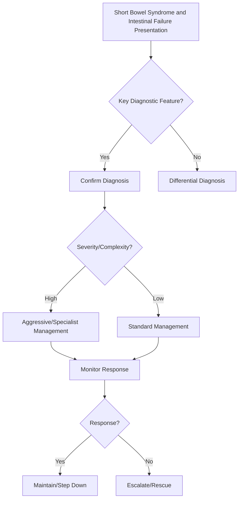

## Learning Objectives
- Define short bowel syndrome (SBS): <200cm functional small bowel (or <100cm with colon) causing malabsorption.
- Define intestinal failure: inability to maintain nutrition/hydration without parenteral support.
- Classify by anatomy: end-jejunostomy (worst), jejuno-ileal anastomosis, jejuno-colic anastomosis.
- Recognize metabolic consequences: diarrhoea, dehydration, electrolyte loss, oxalate stones, D-lactic acidosis, gallstones.
- Outline management: fluid/electrolyte replacement, antidiarrhoeals, PERT, H2 blockers, teduglutide (GLP-2 analog), parenteral nutrition, transplant criteria.# Short bowel syndrome and intestinal failure

## Definition
Short bowel syndrome is malabsorption and fluid/nutrient failure resulting from major loss of functional small intestine. Intestinal failure occurs when the gut cannot maintain adequate nutrition, hydration, or electrolyte balance without supplementation.

## Causes
- Extensive bowel resection
- Mesenteric ischaemia
- Crohn disease surgery
- Trauma or radiation injury

## Pathophysiology
Reduced absorptive surface causes diarrhoea, dehydration, electrolyte loss, micronutrient deficiency, and energy failure. Ileal loss especially worsens bile acid and vitamin B12 absorption.

## Clinical features
- High-output diarrhoea/stoma
- Weight loss and dehydration
- Magnesium deficiency
- B12 deficiency if terminal ileum removed
- Renal stones/gallstones in some settings

## Management framework
- Specialist nutrition involvement
- Oral rehydration / electrolyte strategy
- Antidiarrhoeal and antisecretory therapy
- Diet modification
- Micronutrient replacement
- Parenteral nutrition when required

## Important physiology pearls
- Colon in continuity improves fluid salvage.
- Ileal preservation matters for bile salt and B12 absorption.
- Adaptation occurs over time but may be incomplete.

## Complications
- Catheter-related sepsis in PN users
- Liver complications of long-term PN
- Bone disease and micronutrient deficits
- Renal dysfunction from dehydration

## One-page summary
Short bowel syndrome is the **failure of absorptive capacity after major small-bowel loss**. Key exam points are **dehydration, high-output losses, deficiency states, specialist nutrition support, and the role of parenteral nutrition**.

## MCQs (10)
1. Core problem? **Reduced absorptive surface**.
2. Ileal loss causes deficiency of? **B12**.
3. Common fluid issue? **Dehydration**.
4. Colon in continuity is generally? **Helpful**.
5. Severe cases may need? **Parenteral nutrition**.
6. Common electrolyte issue? **Magnesium loss**.
7. Cause example? **Crohn resection**.
8. Adaptation may occur? **Yes**.
9. PN complication? **Catheter sepsis**.
10. Syndrome often follows? **Extensive bowel resection**.

## SBA Questions (10)
1. High-output diarrhoea after major ileal resection: likely syndrome? **Short bowel syndrome**.
2. Important vitamin deficiency after terminal ileal loss? **B12**.
3. Best management team? **Specialist intestinal/nutrition support**.
4. Why is colon continuity useful? **Improves water and energy salvage**.
5. Major long-term risk in PN-dependent patient? **Catheter sepsis/liver complications**.
6. Main initial clinical priority? **Hydration and electrolyte stabilization**.
7. Antidiarrhoeal therapy is used because it helps? **Reduce output**.
8. Renal stones may occur due to? **Malabsorption/dehydration changes**.
9. Best exam-safe phrase? **Short bowel syndrome is a structural cause of intestinal failure**.
10. Adaptation means? **Residual bowel may increase absorptive capacity over time**.

## Flashcards
- Q: Main mechanism of SBS?  
  A: Loss of absorptive surface area.
- Q: Ileal loss particularly affects which vitamin?  
  A: Vitamin B12.
- Q: Major supportive therapy in severe disease?  
  A: Parenteral nutrition.
- Q: Helpful anatomical feature?  
  A: Colon in continuity.
- Q: Common clinical problem?  
  A: Dehydration/high-output losses.


## Mind Map
```mermaid
mindmap
  root((Short Bowel Syndrome and Intestinal Failure))
    Definition
      SBS = <200cm (or <100cm with colon) → malabsorptio...
    Key Features
      Intestinal failure = PN-dependent...
    Diagnosis
      Colon presence = major adaptive benefit (SCFA abso...
    Management
      Key complications: dehydration, oxalate stones, D-...
    Complications
      Teduglutide (GLP-2) enhances adaptation; PN weanin...
```

## Flowchart


## Must Know / Should Know / Nice to Know
### Must Know
- SBS = <200cm (or <100cm with colon) → malabsorption
- Intestinal failure = PN-dependent
- Colon presence = major adaptive benefit (SCFA absorption, fluid salvage)
- Key complications: dehydration, oxalate stones, D-lactic acidosis, gallstones, catheter sepsis
- Teduglutide (GLP-2) enhances adaptation; PN weaning goal

### Should Know
- Adaptation phase: 12-24 months
- Cholestyramine for bile acid diarrhoea in colon-intact
- Intestinal transplant criteria: PN failure, catheter infections, liver disease

### Nice to Know
- Serial transverse enteroplasty (STEP)
- GLP-2 analogs in development
- Intestinal rehabilitation centers

## Self-Test Scorecard
- Can I define Short Bowel Syndrome and Intestinal Failure correctly? /10
- Can I list 4 key features? /10
- Can I explain the diagnostic approach? /10
- Can I outline the management? /10

**Interpretation:**
- **<35/40** = weak topic
- **35-36/40** = acceptable but insecure
- **37+/40** = exam-ready

## Revision Prompts
- What is Short Bowel Syndrome and Intestinal Failure?
- What are the key diagnostic features?
- What is the management approach?

## Answer Key with Explanations


