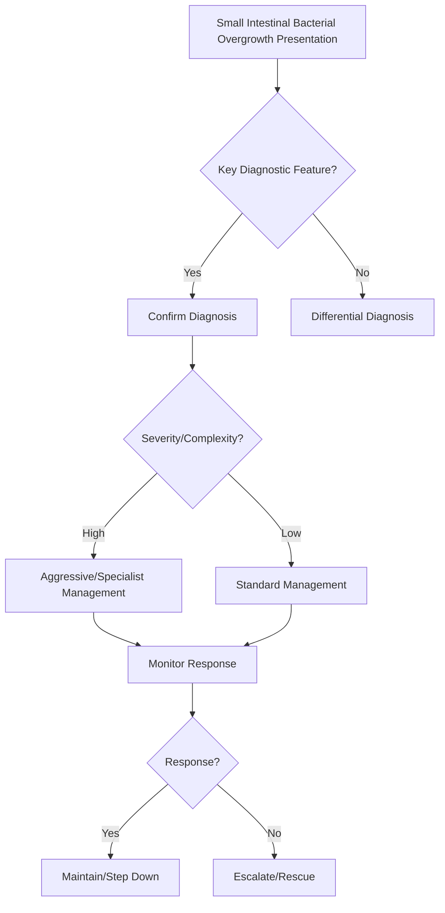

## Learning Objectives
- Define SIBO: excessive colonic-type bacteria in small bowel (>10^5 CFU/mL aspirate).
- Identify predisposing factors: motility disorders (scleroderma, diabetes), anatomical (strictures, blind loops, diverticula), achlorhydria, ileocecal valve dysfunction.
- Recognize symptoms: bloating, diarrhoea, steatorrhoea, weight loss, B12 deficiency.
- Apply diagnostic tests: glucose/lactulose hydrogen breath test (>20ppm rise), jejunal aspirate culture (gold standard).
- Outline management: antibiotics (rifaximin, metronidazole, rotating), prokinetics, treat underlying cause, nutritional support.# Small intestinal bacterial overgrowth

## Definition
SIBO is excessive colonic-type bacterial colonization in the small bowel causing bloating, diarrhoea, malabsorption, or nutrient deficiency.

## Predisposing factors
- Dysmotility or blind loops
- Previous surgery
- Strictures, diverticula
- Scleroderma, diabetes, opioid use
- Hypochlorhydria / PPI overuse in selected settings

## Pathophysiology
Bacteria deconjugate bile salts, consume nutrients, injure mucosa, and ferment carbohydrates, leading to steatorrhoea, bloating, B12 deficiency, and diarrhoea.

## Clinical clues
- Bloating out of proportion to findings
- Chronic diarrhoea
- Weight loss or steatorrhoea
- B12 deficiency with folate normal/high pattern
- Symptoms in postsurgical or dysmotility patient

## Investigation
- Breath testing may help
- Jejunal aspirate culture is traditional but less practical
- Check CBC, B12, folate, iron, albumin
- Look for structural/motility cause

## Management
- Treat underlying predisposing factor where possible
- Antibiotic therapy, often empirical in appropriate context
- Nutritional support and deficiency correction
- Consider rotational therapy in recurrent disease

## Differential diagnosis
- Coeliac disease
- IBS with bloating
- Pancreatic insufficiency
- Lactose intolerance

## One-page summary
SIBO causes bloating, diarrhoea, and deficiency due to abnormal bacterial colonization of the small bowel. Think of it in **postsurgical, dysmotility, or blind-loop** patients. Manage with **cause correction + antibiotics + nutritional support**.

## MCQs (10)
1. Important vitamin deficiency pattern? **B12 deficiency**.
2. Key symptom? **Bloating**.
3. Common setting? **Blind loop/dysmotility**.
4. Traditional gold-standard test? **Jejunal aspirate culture**.
5. Practical noninvasive test? **Breath test**.
6. Bile salt effect causes? **Fat malabsorption**.
7. Management pillar? **Treat underlying cause**.
8. Folate may be? **Normal/high**.
9. Important differential? **Coeliac disease**.
10. Antibiotics may be used? **Yes**.

## SBA Questions (10)
1. Bloating, diarrhoea, and B12 deficiency after bowel surgery: likely diagnosis? **SIBO**.
2. Main pathophysiologic mechanism in steatorrhoea? **Bile salt deconjugation**.
3. Best next step after likely diagnosis? **Search for predisposing cause and treat**.
4. Breath testing assesses? **Bacterial fermentation products**.
5. In scleroderma with chronic bloating, likely explanation? **Dysmotility-related SIBO**.
6. Folate low in SIBO is classic? **No**.
7. Main treatment category? **Antibiotics**.
8. Which disease often mimics SIBO? **Coeliac disease**.
9. Postsurgical anatomy is important because it may create? **Stasis/blind loops**.
10. Best exam-safe phrase? **SIBO is a syndrome of stasis-associated abnormal bacterial colonization leading to malabsorption**.

## Flashcards
- Q: Classic deficiency in SIBO?  
  A: Vitamin B12.
- Q: Common symptom?  
  A: Bloating.
- Q: Predisposing anatomical problem?  
  A: Blind loop/stasis.
- Q: Practical test?  
  A: Breath test.
- Q: Treatment trio?  
  A: Cause correction, antibiotics, nutrition support.


## Mind Map
```mermaid
mindmap
  root((Small Intestinal Bacterial Overgrowth))
    Definition
      SIBO = colonic bacteria in small bowel → bloating,...
    Key Features
      Risk: dysmotility (scleroderma, DM), anatomy (blin...
    Diagnosis
      Breath test: glucose (proximal) or lactulose (whol...
    Management
      Rifaximin 550mg TDS 14d = first-line; rotate antib...
    Complications
      Treat underlying motility/anatomy; prokinetics hel...
```

## Flowchart


## Must Know / Should Know / Nice to Know
### Must Know
- SIBO = colonic bacteria in small bowel → bloating, diarrhoea, B12 deficiency
- Risk: dysmotility (scleroderma, DM), anatomy (blind loop, diverticula), achlorhydria, PPI long-term
- Breath test: glucose (proximal) or lactulose (whole SB); rise >20ppm H2/10ppm CH4
- Rifaximin 550mg TDS 14d = first-line; rotate antibiotics if recurrent
- Treat underlying motility/anatomy; prokinetics help

### Should Know
- Methane producers = constipation phenotype
- SIFO (fungal) differential
- Probiotics controversial in SIBO

### Nice to Know
- Refractory SIBO: elemental diet, cycling antibiotics
- Breath test limitations (false +/-, glucose vs lactulose)

## Self-Test Scorecard
- Can I define Small Intestinal Bacterial Overgrowth correctly? /10
- Can I list 4 key features? /10
- Can I explain the diagnostic approach? /10
- Can I outline the management? /10

**Interpretation:**
- **<35/40** = weak topic
- **35-36/40** = acceptable but insecure
- **37+/40** = exam-ready

## Revision Prompts
- What is Small Intestinal Bacterial Overgrowth?
- What are the key diagnostic features?
- What is the management approach?

## Answer Key with Explanations


