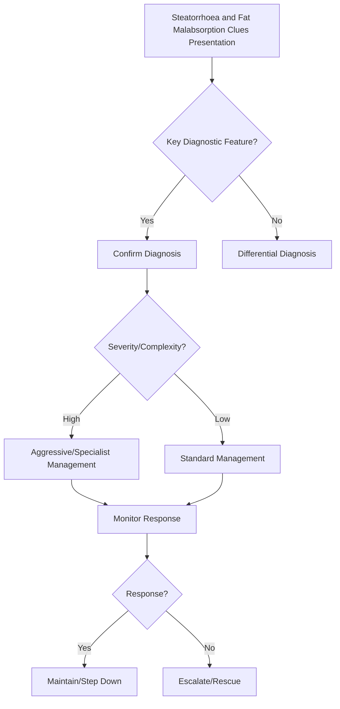

## Learning Objectives
- Define steatorrhoea: >7g fat/day in stool, bulky, pale, foul-smelling, floating, difficult-to-flush stools.
- Understand the pathophysiology: luminal fat maldigestion (lipase deficiency) or malabsorption (mucosal/lymphatic).
- Recognize the clinical clues: weight loss, fat-soluble vitamin deficiency (A,D,E,K), oxalate stones (enteric hyperoxaluria).
- Apply diagnostic tests: fecal fat (quantitative 72h >7g/day), fecal elastase (pancreatic), Sudan III stain (screening), SeHCAT (BAD).
- Outline management: treat cause, pancreatic enzyme replacement (PERT), low-fat diet, MCT oil, fat-soluble vitamin replacement.# Steatorrhoea and fat malabsorption clues

## Definition
Steatorrhoea is excess fat in stool causing bulky, pale, greasy, offensive, difficult-to-flush stools and reflects significant fat malabsorption.

## Key mechanisms
- Pancreatic enzyme deficiency
- Bile salt deficiency or interruption
- Small-bowel mucosal disease, e.g. coeliac disease
- Bacterial deconjugation of bile salts in SIBO

## Clinical clues
- Weight loss
- Fat-soluble vitamin deficiency
- Floating greasy stool
- Bloating and abdominal discomfort
- Osteomalacia, bruising, neuropathy depending on deficiency

## Investigation framework
- Stool description and nutritional history
- FBC, albumin, iron, B12/folate, calcium, vitamin D
- Consider faecal fat/elastase depending on suspected mechanism
- Coeliac serology, imaging, or breath tests based on context

## Differential logic
| Pattern | Suggestion |
|---|---|
| Steatorrhoea + diabetes/chronic pain | Pancreatic disease |
| Steatorrhoea + iron deficiency | Coeliac disease |
| Steatorrhoea + postsurgical anatomy/bloating | SIBO |
| Steatorrhoea + cholestatic context | Bile salt problem |

## Management
Treat the underlying mechanism and replace nutritional deficits, especially fat-soluble vitamins.

## One-page summary
Steatorrhoea is a **clue-pattern**, not a final diagnosis. The main exam task is distinguishing **pancreatic**, **bile salt**, **small-bowel mucosal**, and **bacterial overgrowth** causes.

## MCQs (10)
1. Stool character? **Greasy/bulky/foul**.
2. Vitamin group at risk? **Fat-soluble vitamins**.
3. One pancreatic test? **Faecal elastase**.
4. Iron deficiency with steatorrhoea suggests? **Coeliac disease**.
5. SIBO mechanism? **Bile salt deconjugation**.
6. Bile salt problem can cause? **Fat malabsorption**.
7. Steatorrhoea is a diagnosis by itself? **No**.
8. Weight loss is common? **Yes**.
9. Chronic pancreatitis is a cause? **Yes**.
10. Main approach? **Mechanism-based differential**.

## SBA Questions (10)
1. Bulky offensive stools and diabetes with epigastric pain: likely mechanism? **Pancreatic insufficiency**.
2. Greasy stools with iron deficiency anaemia: likely cause? **Coeliac disease**.
3. Fat-soluble vitamin deficiency suggests? **Chronic fat malabsorption**.
4. Bloating and steatorrhoea after surgery suggests? **SIBO**.
5. Main reason steatorrhoea matters? **It signals significant malabsorption**.
6. Pale floating stool should prompt review of? **Fat absorption mechanisms**.
7. Best initial test depends on? **Likely mechanism/context**.
8. Cholestatic disease may cause steatorrhoea because of? **Reduced bile salts in lumen**.
9. Best exam-safe phrase? **Steatorrhoea is a pattern requiring mechanistic classification**.
10. Long-term management should include? **Nutrient replacement**.

## Flashcards
- Q: Classic stool in steatorrhoea?  
  A: Bulky, greasy, difficult to flush.
- Q: Four major mechanisms?  
  A: Pancreatic, bile salt, mucosal, bacterial overgrowth.
- Q: Iron deficiency clue points toward?  
  A: Coeliac disease.
- Q: Common pancreatic test?  
  A: Faecal elastase.
- Q: Which vitamin group is threatened?  
  A: Fat-soluble vitamins.


## Mind Map
```mermaid
mindmap
  root((Steatorrhoea and Fat Malabsorption Clues))
    Definition
      Steatorrhoea = oily, pale, foul, floating, hard-to...
    Key Features
      Causes: pancreatic (chronic pancreatitis, CF), muc...
    Diagnosis
      Fecal fat 72h = gold standard; fecal elastase for ...
    Management
      Fat-soluble vitamins A/D/E/K always check in steat...
    Complications
      Oxalate stones = enteric hyperoxaluria (fat binds ...
```

## Flowchart


## Must Know / Should Know / Nice to Know
### Must Know
- Steatorrhoea = oily, pale, foul, floating, hard-to-flush stools; >7g/day
- Causes: pancreatic (chronic pancreatitis, CF), mucosal (coeliac, SIBO), lymphatic (lymphangiectasia), bile acid (BAD)
- Fecal fat 72h = gold standard; fecal elastase for pancreatic; Sudan III = screen
- Fat-soluble vitamins A/D/E/K always check in steatorrhoea
- Oxalate stones = enteric hyperoxaluria (fat binds calcium → free oxalate absorbed)

### Should Know
- MCT oil bypasses lymphatic absorption
- PERT dosing: with meals + acid suppression
- Differential: pancreatic vs mucosal vs lymphatic

### Nice to Know
- C-13 mixed triglyceride breath test
- Coefficient of fat absorption (CFA)

## Self-Test Scorecard
- Can I define Steatorrhoea and Fat Malabsorption Clues correctly? /10
- Can I list 4 key features? /10
- Can I explain the diagnostic approach? /10
- Can I outline the management? /10

**Interpretation:**
- **<35/40** = weak topic
- **35-36/40** = acceptable but insecure
- **37+/40** = exam-ready

## Revision Prompts
- What is Steatorrhoea and Fat Malabsorption Clues?
- What are the key diagnostic features?
- What is the management approach?

## Answer Key with Explanations


