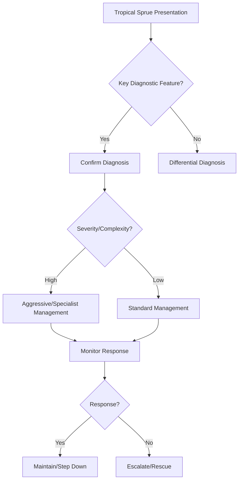

## Learning Objectives
- Define tropical sprue: acquired malabsorption syndrome in tropical regions, likely post-infectious.
- Recognize the presentation: chronic diarrhoea, steatorrhoea, weight loss, megaloblastic anaemia (B12 + folate), glossitis.
- Distinguish from coeliac disease: response to broad-spectrum antibiotics (tetracycline), not GFD; no HLA-DQ2/DQ8 restriction.
- Apply the empirical treatment approach: tetracycline + folic acid for 3-6 months.
- Understand the epidemiology: residents/long-term visitors to tropics (India, SE Asia, Caribbean); seasonal variation.# Tropical sprue

## Definition
Tropical sprue is an acquired malabsorption syndrome occurring in or after residence in tropical regions, characterized by chronic diarrhoea, weight loss, and folate/B12 deficiency with small-bowel mucosal abnormality.

## Clinical clues
- Travel or residence in tropical endemic areas
- Chronic diarrhoea and weight loss
- Macrocytic anaemia or combined deficiencies
- Steatorrhoea and bloating

## Differential diagnoses
- Coeliac disease
- Giardiasis
- SIBO
- HIV-related enteropathy
- Pancreatic insufficiency

## Investigations
- CBC, folate, B12, iron
- Stool examination for parasites/pathogens
- Endoscopy/biopsy showing villous abnormality
- Exclude coeliac disease and infection mimics

## Management
- Nutritional replacement, especially folate and B12
- Antibiotics such as tetracycline in appropriate settings
- Hydration and supportive nutrition

## Exam pearls
- Think of it in chronic malabsorption with **tropical exposure**.
- Folate deficiency may be prominent.
- It is a diagnosis of context plus exclusion.

## One-page summary
Tropical sprue is chronic malabsorption associated with tropical exposure. The exam pattern is **chronic diarrhoea + weight loss + folate/B12 deficiency + villous change after excluding coeliac and infection mimics**.

## MCQs (10)
1. Geographic clue? **Tropical residence/travel**.
2. Prominent deficiency? **Folate**.
3. Major symptom? **Chronic diarrhoea**.
4. Important mimic? **Giardiasis**.
5. Histology may show? **Villous abnormality**.
6. Treatment includes? **Antibiotics + vitamins**.
7. Weight loss common? **Yes**.
8. Coeliac disease must be? **Excluded**.
9. B12 can also be low? **Yes**.
10. Diagnosis relies partly on? **Epidemiologic context**.

## SBA Questions (10)
1. Chronic diarrhoea after long residence in tropics with folate deficiency: likely diagnosis? **Tropical sprue**.
2. First key exclusion in such patient? **Infective causes and coeliac disease**.
3. Nutritional treatment especially includes? **Folate/B12 replacement**.
4. Typical bowel symptom pattern? **Malabsorption with steatorrhoea/bloating**.
5. Endemic-context diagnosis is important because otherwise it may be confused with? **Coeliac disease**.
6. A useful antimicrobial option classically? **Tetracycline**.
7. Main exam framing? **Acquired post-tropical malabsorption syndrome**.
8. Stool tests matter mainly to rule out? **Parasitic/infective mimics**.
9. Anaemia pattern may be? **Macrocytic**.
10. Best phrase? **Consider tropical sprue when chronic malabsorption follows tropical exposure**.

## Flashcards
- Q: Key epidemiologic clue?  
  A: Tropical residence/travel.
- Q: Common vitamin deficiency?  
  A: Folate.
- Q: Important mimic?  
  A: Coeliac disease or giardiasis.
- Q: Treatment includes?  
  A: Vitamins plus antibiotics.
- Q: Main syndrome?  
  A: Chronic malabsorption.


## Mind Map
```mermaid
mindmap
  root((Tropical Sprue))
    Definition
      Tropical sprue = acquired malabsorption in tropics...
    Key Features
      Bimodal: acute (diarrhoea → chronic) or insidious...
    Diagnosis
      Megaloblastic anaemia = B12 + folate deficiency (b...
    Management
      Antibiotics (tetracycline/doxy) + folic acid = cur...
    Complications
      No HLA association; NOT responsive to GFD...
```

## Flowchart


## Must Know / Should Know / Nice to Know
### Must Know
- Tropical sprue = acquired malabsorption in tropics/visitors
- Bimodal: acute (diarrhoea → chronic) or insidious
- Megaloblastic anaemia = B12 + folate deficiency (both!)
- Antibiotics (tetracycline/doxy) + folic acid = curative in most
- No HLA association; NOT responsive to GFD

### Should Know
- Coliform contamination hypothesis
- Relapse if re-exposed to tropics
- Differential: coeliac, SIBO, Whipple, giardia

### Nice to Know
- Seasonal variation in incidence
- Folates before antibiotics for megaloblastosis

## Self-Test Scorecard
- Can I define Tropical Sprue correctly? /10
- Can I list 4 key features? /10
- Can I explain the diagnostic approach? /10
- Can I outline the management? /10

**Interpretation:**
- **<35/40** = weak topic
- **35-36/40** = acceptable but insecure
- **37+/40** = exam-ready

## Revision Prompts
- What is Tropical Sprue?
- What are the key diagnostic features?
- What is the management approach?

## Answer Key with Explanations


