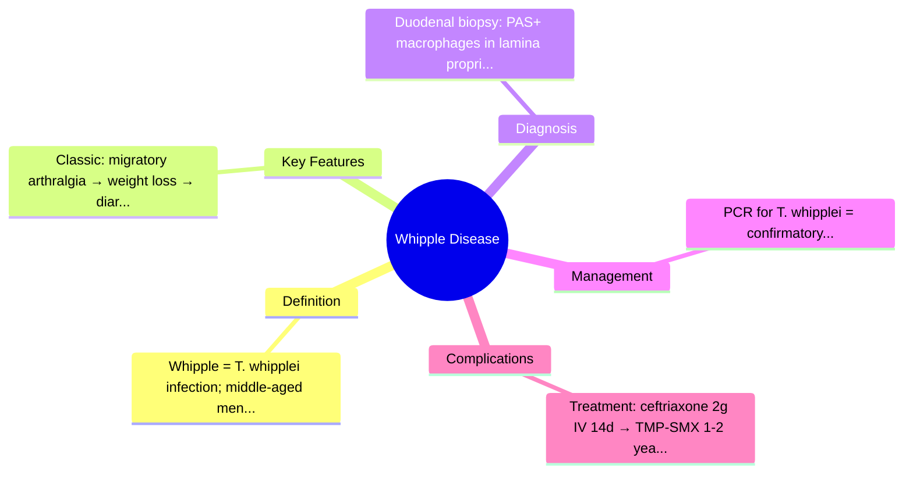
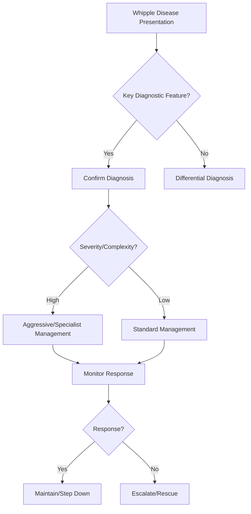

## Learning Objectives
- Define Whipple disease: rare systemic infection by Tropheryma whipplei, affecting small bowel and multiple organs.
- Recognize the classic tetrad: arthralgia/arthritis (often years before GI), weight loss, diarrhoea/steatorrhoea, lymphadenopathy.
- Identify extraintestinal features: neurological (oculomasticatory myorhythmia, cognitive), cardiac (endocarditis), ocular, pulmonary.
- Apply the diagnostic pathway: duodenal biopsy with PAS-positive macrophages + PCR for T. whipplei.
- Outline management: long-term antibiotics (ceftriaxone induction → TMP-SMX/trimethoprim maintenance 1-2 years), monitor for IRIS/relapse.# Whipple disease

## Definition
Whipple disease is a rare systemic infection caused by *Tropheryma whipplei* causing malabsorption, weight loss, diarrhoea, arthralgia, and multisystem involvement.

## Classic clinical pattern
- Chronic diarrhoea and weight loss
- Arthralgia often precedes GI symptoms
- Fever, lymphadenopathy
- Hyperpigmentation, neurological or cardiac involvement in some patients

## Pathology clue
Small-bowel biopsy shows PAS-positive macrophages in the lamina propria.

## Investigations
- Endoscopy with small-bowel biopsy
- PCR where available
- Assess nutritional deficiency and systemic involvement
- Consider CNS/cardiac assessment if symptomatic

## Differential diagnosis
- Coeliac disease
- Intestinal TB
- Lymphoma
- Tropical sprue

## Management
- Prolonged antibiotic therapy is required
- Nutritional rehabilitation
- Monitor for relapse, especially neurological relapse

## Red flags
- Neurological symptoms
- Endocarditis features
- Profound weight loss

## One-page summary
Whipple disease is a **rare infective multisystem malabsorption syndrome**. Think of it when diarrhoea and weight loss coexist with **arthralgia or systemic features**. Diagnosis rests on **small-bowel biopsy/PCR** and treatment needs **prolonged antibiotics**.

## MCQs (10)
1. Causative organism? ***Tropheryma whipplei***.
2. Common extraintestinal clue? **Arthralgia**.
3. Histology clue? **PAS-positive macrophages**.
4. Systemic disease? **Yes**.
5. Main treatment? **Prolonged antibiotics**.
6. Important complication area? **Neurological/cardiac**.
7. Rare or common? **Rare**.
8. Key symptom pair? **Diarrhoea + weight loss**.
9. Biopsy is useful? **Yes**.
10. Important mimic? **Coeliac disease**.

## SBA Questions (10)
1. Diarrhoea, weight loss, and longstanding arthralgia: uncommon diagnosis? **Whipple disease**.
2. Biopsy stain clue? **PAS-positive macrophages**.
3. Main management principle? **Long antibiotic course**.
4. System review should include? **Neurological and cardiac symptoms**.
5. Why can it be missed? **It is multisystem and rare**.
6. Best confirmatory tissue site in GI presentation? **Small bowel**.
7. Coeliac serology negative with systemic features and malabsorption should raise? **Whipple disease possibility**.
8. Arthralgia preceding diarrhoea is classically linked to? **Whipple disease**.
9. Risk after incomplete treatment? **Relapse**.
10. Best exam-safe phrase? **Whipple disease is a systemic infective cause of malabsorption with PAS-positive macrophages**.

## Flashcards
- Q: Organism in Whipple disease?  
  A: *Tropheryma whipplei*.
- Q: Classic extraintestinal clue?  
  A: Arthralgia.
- Q: Histology hallmark?  
  A: PAS-positive macrophages.
- Q: Treatment duration?  
  A: Prolonged antibiotics.
- Q: Disease scope?  
  A: Multisystem.

## Mind Map

## Flowchart

## Must Know / Should Know / Nice to Know
### Must Know
- Whipple = T. whipplei infection; middle-aged men
- Classic: migratory arthralgia → weight loss → diarrhoea → neuro
- Duodenal biopsy: PAS+ macrophages in lamina propria
- PCR for T. whipplei = confirmatory
- Treatment: ceftriaxone 2g IV 14d → TMP-SMX 1-2 years

### Should Know
- IRIS (immune reconstitution) on treatment
- Neuro: oculomasticatory myorhythmia, dementia
- Relapse common if inadequate duration

### Nice to Know
- T. whipplei in sewage/environment
- Endocarditis culture-negative

## Self-Test Scorecard
- Can I define Whipple Disease correctly? /10
- Can I list 4 key features? /10
- Can I explain the diagnostic approach? /10
- Can I outline the management? /10

**Interpretation:**
- **<35/40** = weak topic
- **35-36/40** = acceptable but insecure
- **37+/40** = exam-ready

## Revision Prompts
- What is Whipple Disease?
- What are the key diagnostic features?
- What is the management approach?

## Answer Key with Explanations

