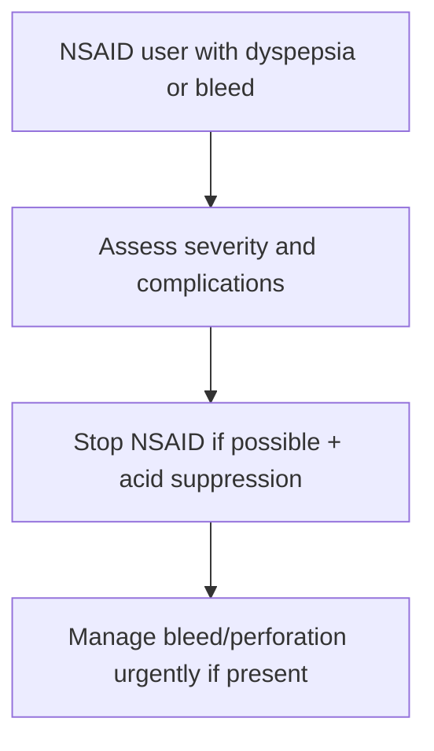

# NSAID-associated ulcer disease

Related: [[../Gastroenterology MOC|Gastroenterology MOC]] · [[../Stomach and Duodenal Disorders|Stomach and Duodenal Disorders]] · [[Gastric ulcer disease]] · [[Duodenal ulcer disease]]

> [!important]
> NSAIDs can cause peptic ulcer disease **silently** until bleeding or perforation occurs; pain severity does not reliably reflect risk.

## Learning Objectives
- Explain how NSAIDs cause ulcers.
- Recognize risk factors and presentations.
- Understand prevention principles.
- Outline management.

## Pathophysiology
NSAIDs reduce prostaglandin-mediated mucosal protection, impairing mucus/bicarbonate defense and mucosal blood flow, allowing acid-peptic injury.

## Risk Factors
- older age
- prior ulcer/bleeding history
- high-dose or multiple NSAIDs
- concomitant antiplatelet/anticoagulant/steroid use
- severe comorbidity

## Clinical Features
- dyspepsia/epigastric pain
- occult or overt GI bleeding
- perforation may be first presentation
- some patients are minimally symptomatic

## Investigations
- medication history is central
- endoscopy when alarm features, bleeding, or ulcer suspicion exists
- hemoglobin assessment and H pylori consideration

## Management
- stop NSAID if possible
- acid suppression
- treat bleeding/perforation complications urgently
- review need for future gastroprotection if NSAID must continue

## Prevention
- avoid unnecessary NSAIDs
- use gastroprotection in high-risk patients when indicated
- consider alternative analgesic strategies where possible

## FCPS/MRCP High-Yield Points
- NSAID ulcers may be silent until a complication occurs.
- Medication review is critical.
- Prevention matters as much as treatment.

## Common Viva Traps
- Asking about pain but forgetting bleeding risk.
- Missing combined-risk drugs.
- Restarting NSAIDs without protection or review.

## One-Page Summary
- NSAIDs weaken gastric/duodenal mucosal defense.
- Ulcers may present with pain, bleeding, or perforation.
- Stop NSAIDs if possible and protect the mucosa.

## Mind Map
- NSAID ulcer
  - prostaglandin loss
  - mucosal defense failure
  - silent bleeding
  - perforation
  - stop drug
  - protect stomach

## Flowchart

## MCQs (10)
1. NSAIDs cause ulcers mainly by:
   - A. Reducing prostaglandin-mediated mucosal protection
   - B. Increasing insulin
   - C. Causing portal hypertension
   - D. Producing candidiasis
   - **Answer: A**
2. A dangerous feature of NSAID ulcers is that they:
   - A. May be silent until bleeding/perforation
   - B. Always cause severe pain first
   - C. Never bleed
   - D. Never perforate
   - **Answer: A**
3. A major risk factor is:
   - A. Previous ulcer disease
   - B. Myopia
   - C. Rhinitis
   - D. Acne
   - **Answer: A**
4. Which drug combination increases ulcer risk?
   - A. NSAID + steroid/antiplatelet/anticoagulant context
   - B. Saline spray + emollient
   - C. Eye drops + shampoo
   - D. Vitamin C only
   - **Answer: A**
5. Management includes:
   - A. Stop NSAID if possible and use acid suppression
   - B. Increase NSAID dose
   - C. Ignore bleeding
   - D. Avoid medication review
   - **Answer: A**
6. A common trap is:
   - A. Missing ulcer risk because pain is mild
   - B. Asking about GI bleed
   - C. Reviewing drugs
   - D. Considering gastroprotection
   - **Answer: A**
7. Which complication can be first presentation?
   - A. Perforation
   - B. Otitis externa
   - C. Rhinitis
   - D. Cataract
   - **Answer: A**
8. Prevention in high-risk patients may include:
   - A. Gastroprotection
   - B. Automatic higher NSAID dose
   - C. No review ever
   - D. Avoiding any history taking
   - **Answer: A**
9. Which investigation becomes urgent if melaena occurs?
   - A. Upper-GI bleed evaluation/endoscopy pathway
   - B. Spirometry
   - C. Audiogram
   - D. EEG
   - **Answer: A**
10. Best summary?
   - A. NSAID ulcers result from impaired mucosal defense and may bleed silently
   - B. NSAIDs protect against ulcer complications
   - C. Ulcer pain always predicts severity
   - D. Drug history is irrelevant
   - **Answer: A**

## SBA Questions (10)
1. An elderly patient on ibuprofen and aspirin presents with melaena but little pain. Best interpretation?
   - A. NSAID-associated ulcer bleeding is possible despite minimal pain
   - B. Ulcer disease is unlikely without pain
   - C. It must be hemorrhoids
   - D. No drug review is needed
   - **Answer: A**
2. What is the best first management principle?
   - A. Stop the NSAID if possible and start ulcer-directed management
   - B. Continue NSAID and reassure
   - C. Give laxatives only
   - D. Ignore stool color
   - **Answer: A**
3. Which is a dangerous error?
   - A. Forgetting NSAID risk because symptoms are mild
   - B. Asking about aspirin use
   - C. Considering bleed risk
   - D. Reviewing prior ulcer history
   - **Answer: A**
4. Which pathophysiological concept is most important?
   - A. Prostaglandin loss weakens mucosal protection
   - B. Excess bile production causes all cases
   - C. Motility failure is primary
   - D. Portal pressure is primary in all cases
   - **Answer: A**
5. Which patient is high risk?
   - A. Older patient with previous ulcer and concurrent antiplatelet therapy
   - B. Young healthy patient with no drug exposure
   - C. Rhinitis-only patient
   - D. Mild acne patient
   - **Answer: A**
6. Which complication can be catastrophic?
   - A. Perforation
   - B. Dry mouth
   - C. Sneezing
   - D. Tinnitus
   - **Answer: A**
7. Best prevention principle?
   - A. Avoid unnecessary NSAIDs and use gastroprotection when indicated
   - B. Combine multiple NSAIDs
   - C. Never review comedications
   - D. Ignore prior bleeding history
   - **Answer: A**
8. Best exam pearl?
   - A. NSAID ulcer severity is not predicted reliably by pain intensity
   - B. No pain excludes serious NSAID injury
   - C. Bleeding requires no drug history
   - D. Gastroprotection has no role
   - **Answer: A**
9. Which cofactor should be considered alongside NSAID history?
   - A. H pylori and prior ulcer history
   - B. Hair color
   - C. Foot size
   - D. Eye dominance
   - **Answer: A**
10. Best summary?
   - A. Identify the drug, estimate the risk, treat the ulcer, and prevent recurrence
   - B. Focus only on symptoms and ignore medication exposure
   - C. Continue all NSAIDs indefinitely
   - D. Endoscopy never matters
   - **Answer: A**

## Flashcards
- Q: How do NSAIDs cause ulcer disease?
  A: By reducing prostaglandin-mediated mucosal protection.
- Q: Why are NSAID ulcers dangerous?
  A: They may be silent until bleeding or perforation.
- Q: Name 3 major risk factors.
  A: Older age, prior ulcer/bleed, concurrent antiplatelet/anticoagulant/steroid use.
- Q: What is the core treatment principle?
  A: Stop NSAID if possible and start acid suppression/complication management.
- Q: What is the key prevention principle?
  A: Use gastroprotection in high-risk patients when indicated.

## Must Know / Should Know / Nice to Know
### Must Know
- NSAIDs inhibit COX-1 → ↓ prostaglandins → ↓ mucosal defense → ulcer
- Risk: age >65, high dose, concurrent steroid/anticoagulant, H. pylori co-infection
- Often silent (no pain) due to analgesic effect
- Prevention: PPI/COX-2 selective, H. pylori eradication
- Topical injury + systemic effect

### Should Know
- Misoprostol for prevention (diarrhea limits use)
- Celecoxib in cardiovascular risk patients
- Even low-dose aspirin causes ulcers

### Nice to Know
- H. pylori + NSAID = synergistic risk
- HP eradication before chronic NSAID reduces ulcer risk

## Self-Test Scorecard
- Can I explain the mechanism of NSAID-induced ulcer? /10
- Can I list 4 risk factors for NSAID ulcer? /10
- Can I outline prevention strategies? /10

**Interpretation:**
- **<35/40** = weak topic
- **35-36/40** = acceptable but insecure
- **37+/40** = exam-ready

## Revision Prompts
Why do NSAIDs cause peptic ulcers?
How can NSAID ulcers be prevented?

## Answer Key with Explanations

