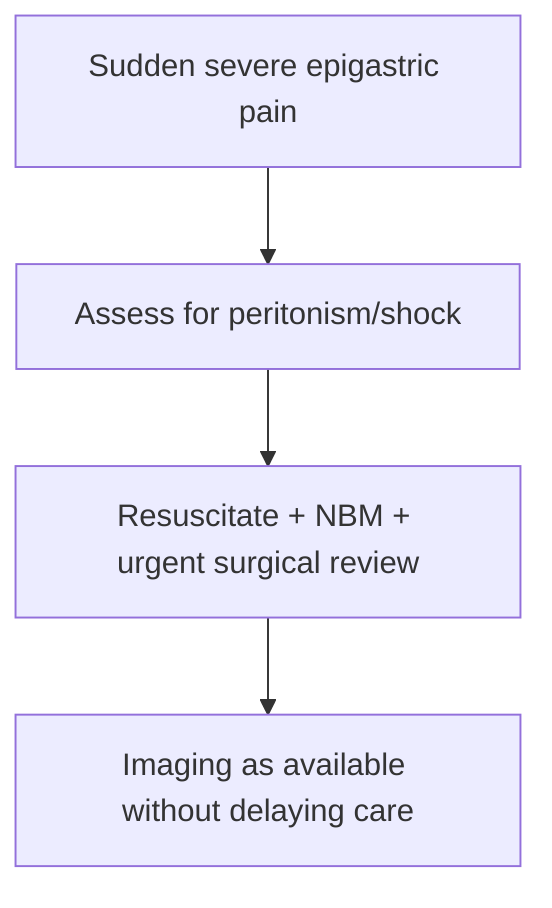

# Perforated peptic ulcer

Related: [[../Gastroenterology MOC|Gastroenterology MOC]] · [[../Stomach and Duodenal Disorders|Stomach and Duodenal Disorders]] · [[Acute abdominal pain and peritonism red flags]]

> [!warning]
> Perforated peptic ulcer is an **acute abdomen**: sudden severe epigastric pain with peritonism should trigger immediate surgical-style resuscitation thinking.

## Learning Objectives
- Recognize the emergency presentation.
- Understand why free perforation is dangerous.
- Outline immediate priorities.
- Distinguish it from uncomplicated dyspepsia/ulcer pain.

## Definition
Perforated peptic ulcer is full-thickness ulcer penetration through the stomach or duodenal wall into the peritoneal cavity.

## Clinical Features
- sudden severe epigastric pain
- generalized abdominal pain/peritonism as leakage spreads
- rigid abdomen/guarding
- shock, sepsis, tachycardia in advanced cases

## Etiology / Risk Factors
- peptic ulcer disease
- NSAIDs
- H pylori background
- delayed or untreated ulcer disease

## Why It Is Dangerous
Perforation causes leakage of gastric/duodenal contents into the peritoneum, leading to chemical then bacterial peritonitis, sepsis, and death if untreated.

## Investigations
- urgent clinical diagnosis first
- erect chest/abdominal imaging and CT pathways may show free air depending on setting
- do not delay surgery/resuscitation for exhaustive testing

## Management Priorities
- ABC/resuscitation
- nil by mouth
- IV fluids, analgesia, antibiotics, PPIs as appropriate pathway support
- urgent surgical review

## FCPS/MRCP High-Yield Points
- Sudden epigastric pain + board-like abdomen = perforation until proved otherwise.
- This is not routine dyspepsia.
- Early resuscitation and surgery save life.

## Common Viva Traps
- Treating severe peritonitic pain as simple peptic disease.
- Delaying surgical referral.
- Forgetting NSAID history.

## One-Page Summary
- Perforated peptic ulcer is an acute surgical abdomen.
- Think sudden pain, peritonism, free air, shock.
- Resuscitate and refer urgently.

## Mind Map
- Perforated ulcer
  - sudden pain
  - peritonism
  - free air
  - shock
  - fluids
  - surgery

## Flowchart

## MCQs (10)
1. Perforated peptic ulcer typically presents with:
   - A. Sudden severe epigastric pain
   - B. Chronic rhinitis
   - C. Polyuria
   - D. Hematuria
   - **Answer: A**
2. A classic abdominal sign is:
   - A. Peritonism/guarding
   - B. Clubbing
   - C. Pedal edema only
   - D. Tremor
   - **Answer: A**
3. The major danger is:
   - A. Peritonitis and sepsis
   - B. Cataract
   - C. Asthma
   - D. UTI
   - **Answer: A**
4. Initial management includes:
   - A. Resuscitation and urgent surgical review
   - B. Reassurance only
   - C. Oral feeding
   - D. Stool softeners only
   - **Answer: A**
5. A risk factor is:
   - A. NSAID use
   - B. Earwax
   - C. Rhinitis
   - D. Dry skin
   - **Answer: A**
6. A common trap is:
   - A. Mistaking peritonitic ulcer perforation for simple dyspepsia
   - B. Assessing shock
   - C. Asking about NSAIDs
   - D. Calling surgeons early
   - **Answer: A**
7. Imaging may show:
   - A. Free air
   - B. Cataract
   - C. Pleural plaque only
   - D. Nephrosis only
   - **Answer: A**
8. Which is true?
   - A. Perforation is a surgical emergency
   - B. It is managed as outpatient dyspepsia
   - C. Shock never occurs
   - D. Antibiotics never help
   - **Answer: A**
9. Which symptom progression best fits?
   - A. Abrupt pain then generalized peritonitis
   - B. Months of mild belching only
   - C. Pure constipation only
   - D. Isolated dysuria only
   - **Answer: A**
10. Best summary?
   - A. Recognize sudden pain, peritonism, resuscitate fast, and involve surgery fast
   - B. Delay until endoscopy clinic
   - C. Treat with antacids alone
   - D. Ignore abdominal rigidity
   - **Answer: A**

## SBA Questions (10)
1. A patient with known ulcer disease suddenly develops severe epigastric pain and rigid abdomen. Most likely complication?
   - A. Perforated peptic ulcer
   - B. Functional dyspepsia
   - C. IBS
   - D. Hemorrhoids
   - **Answer: A**
2. Best first principle?
   - A. Resuscitate and call surgery urgently
   - B. Schedule routine clinic follow-up
   - C. Encourage oral intake
   - D. Reassure only
   - **Answer: A**
3. Which is a dangerous error?
   - A. Managing a perforation as simple gastritis
   - B. Checking vital signs
   - C. Keeping the patient NBM
   - D. Considering free air imaging
   - **Answer: A**
4. Why does perforation kill?
   - A. Leakage causes peritonitis and sepsis
   - B. It only causes mild dyspepsia
   - C. It never destabilizes the patient
   - D. It improves with food
   - **Answer: A**
5. Which drug history is particularly important?
   - A. NSAIDs
   - B. Shampoo
   - C. Eye drops
   - D. Nasal saline
   - **Answer: A**
6. Which imaging clue may support diagnosis?
   - A. Free subdiaphragmatic air
   - B. Pleural effusion only
   - C. Renal cyst only
   - D. Cerebral edema
   - **Answer: A**
7. What should not be delayed?
   - A. Surgical referral
   - B. Haircut
   - C. Ear cleaning
   - D. Outpatient calprotectin
   - **Answer: A**
8. Best exam pearl?
   - A. Board-like abdomen in a peptic-ulcer patient should make you think perforation first
   - B. Severe pain excludes perforation
   - C. Perforation is a chronic outpatient issue
   - D. Rigidity is unrelated
   - **Answer: A**
9. Which systemic state may accompany advanced perforation?
   - A. Shock
   - B. Hyperacusis
   - C. Alopecia only
   - D. Dry mouth only
   - **Answer: A**
10. Best summary?
   - A. Acute abdomen + ulcer context = perforation until excluded
   - B. Sudden severe pain is usually benign dyspepsia
   - C. Peritonism does not matter
   - D. Surgery is never involved
   - **Answer: A**

## Flashcards
- Q: What is the classic presentation of perforated peptic ulcer?
  A: Sudden severe epigastric pain with peritonism.
- Q: What life-threatening process follows perforation?
  A: Peritonitis and sepsis.
- Q: What 3 immediate priorities matter?
  A: Resuscitation, nil by mouth, urgent surgical review.
- Q: What imaging clue may be seen?
  A: Free air.
- Q: What common drug risk factor exists?
  A: NSAID use.

## Must Know / Should Know / Nice to Know
### Must Know
- Perforation = full-thickness ulcer penetration → free air + peritonitis
- Sudden severe epigastric pain, board-like rigidity, absent bowel sounds
- Erect CXR: free air under diaphragm (pneumoperitoneum)
- Emergency surgery: omental patch (Graham patch) + H. pylori eradication
- Mortality high in elderly, delayed presentation, comorbidities

### Should Know
- Boey score for risk stratification
- Non-operative management for sealed perforations (selective)
- Post-op H. pylori eradication essential

### Nice to Know
- Laparoscopic vs open repair
- Fibrin glue for small perforations

## Self-Test Scorecard
- Can I describe the classic presentation of perforated ulcer? /10
- Can I name the diagnostic imaging finding? /10
- Can I outline the surgical management? /10

**Interpretation:**
- **<35/40** = weak topic
- **35-36/40** = acceptable but insecure
- **37+/40** = exam-ready

## Revision Prompts
What is the classic presentation of a perforated peptic ulcer?
What is the Boey score?

## Answer Key with Explanations

