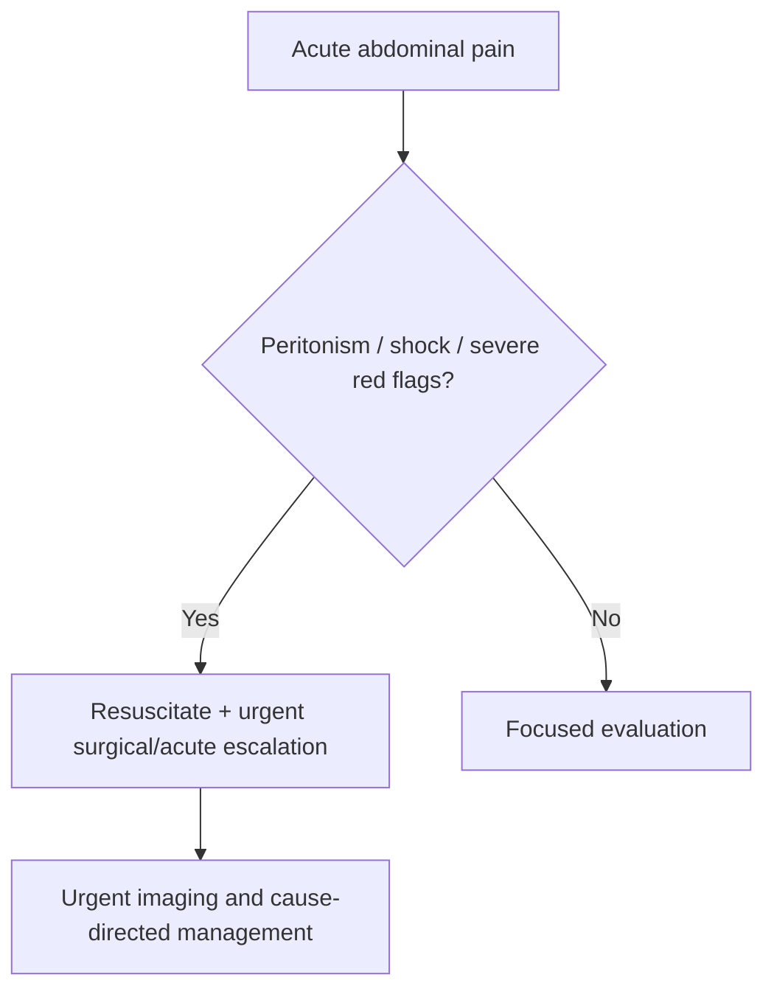

# Acute abdominal pain and peritonism red flags

Related: [[../Gastroenterology MOC|Gastroenterology MOC]] · [[../Symptom Patterns and Diagnostic Approach|Symptom Patterns and Diagnostic Approach]] · [[Acute diarrhoea initial approach]] · [[Constipation and altered bowel habit]] · [[../Upper Gastrointestinal Bleeding/Upper GI bleeding resuscitation priorities|Upper GI bleeding resuscitation priorities]]

> [!warning]
> Acute abdominal pain becomes a medical-surgical emergency when there is **peritonism, shock, GI perforation pattern, bowel ischemia/obstruction concern, or sepsis**. The exam priority is triage and escalation, not premature symptom-labeling.

## Learning Objectives
- Recognize red flags in acute abdominal pain.
- Define peritonism and its clinical importance.
- Build an emergency assessment algorithm.
- Identify GI emergencies that must not be missed.

## Definition
Acute abdominal pain is new abdominal pain of rapid onset. Peritonism refers to signs suggesting peritoneal irritation, such as guarding, rebound/percussion tenderness, rigidity, or pain worsened by movement/cough.

## Pathophysiology
Peritoneal irritation occurs with:
- perforation
- severe inflammation
- ischemia
- blood, bile, gastric or intestinal contents in the peritoneal cavity

## High-Risk GI Causes
- perforated peptic ulcer
- bowel obstruction with ischemia/perforation risk
- severe pancreatitis complications
- ischemic bowel / mesenteric ischemia
- severe colitis with toxic features
- intra-abdominal sepsis

## History Framework
Ask about:
- onset: sudden or progressive
- site and radiation
- relation to meals or vomiting
- GI bleeding symptoms
- abdominal distension
- obstipation
- fever
- medication history including NSAIDs
- prior surgery / adhesions

## Examination
### Red-flag findings
- involuntary guarding
- rebound / percussion tenderness
- rigid abdomen
- shock, tachycardia, hypotension
- absent perfusion / toxic appearance
- distension with pain

## Red Flags / Emergencies
- peritonism
- hemodynamic instability
- severe persistent vomiting with distension
- GI bleed with collapse
- sepsis or fever with toxic appearance
- pain out of proportion to findings suggesting ischemia
- sudden severe epigastric pain with perforation concern

## Investigations
### Immediate priorities
- CBC
- U&E / creatinine
- CRP / lactate where relevant
- group and save / crossmatch if bleeding possible
- urgent imaging tailored to suspected cause

### Practical GI imaging logic
- erect chest/abdominal imaging for free air in selected contexts
- CT abdomen for obstruction, perforation, ischemia, complicated inflammatory pathology, or unclear severe pain
- endoscopy has a role only after stabilization and when appropriate to the suspected pathology

## Interpretation Framework
### Emergency algorithm
1. Assess ABCs and hemodynamic status.
2. Decide whether peritonism or shock is present.
3. Start resuscitation: IV access, fluids, analgesia, monitoring, urgent labs.
4. Urgently involve surgical/acute team when perforation, ischemia, obstruction, or generalized peritonitis is suspected.
5. Use urgent imaging to define the cause while continuing stabilization.

## Differential Diagnosis
- perforated peptic ulcer
- bowel obstruction
- mesenteric ischemia
- acute pancreatitis complication
- severe infectious/inflammatory colitis
- biliary/pancreatic emergencies
- non-GI mimics such as ACS or rupturing AAA should remain in the broader emergency differential

## Management
### First principles
- resuscitate first
- keep nil by mouth
- IV fluids and electrolyte correction
- adequate analgesia
- early senior review and urgent surgical discussion when red flags exist

### Cautions
- analgesia should not be withheld
- do not be falsely reassured by temporary symptom improvement in a sick patient
- peritonism is a severity sign, not a diagnosis

## Complications
- septic shock
- bowel necrosis
- perforation-related peritonitis
- multiorgan failure
- death if escalation is delayed

## FCPS/MRCP High-Yield Points
- Peritonism means urgent escalation.
- Pain out of proportion suggests ischemia.
- Distension + vomiting + obstipation suggests obstruction until proved otherwise.
- NSAID history matters when perforated ulcer is possible.

## Common Viva Traps
- Treating shocky abdominal pain as simple gastritis.
- Ignoring lactate/ischemia clues.
- Delaying escalation while chasing a perfect diagnosis.

## One-Page Summary
- Acute abdominal pain + **peritonism or shock** = emergency.
- Key GI causes: perforation, obstruction, ischemia, severe pancreatitis/colitis.
- Resuscitate, keep NBM, obtain urgent labs/imaging, and escalate early.
- Analgesia is appropriate and should not be withheld.

## Mind Map
- Acute abdominal pain
  - red flags
    - guarding
    - rebound
    - rigidity
    - shock
    - distension
  - causes
    - perforation
    - obstruction
    - ischemia
    - pancreatitis
  - action
    - resuscitate
    - NBM
    - urgent imaging
    - surgical review

## Flowchart

## Revision Prompts
- Define peritonism.
- Name 5 red flags in acute abdominal pain.
- What does pain out of proportion suggest?
- Why should escalation not wait for a perfect diagnosis?

## MCQs (10)
1. Peritonism refers to:
   - A. Signs of peritoneal irritation
   - B. Mild bloating only
   - C. Hemorrhoids
   - D. Jaundice only
   - **Answer: A**
2. Which is a red flag in abdominal pain?
   - A. Hypotension
   - B. Mild isolated flatulence
   - C. Seasonal sneezing
   - D. Dry scalp
   - **Answer: A**
3. Pain out of proportion to examination suggests:
   - A. Ischemia
   - B. Simple constipation only
   - C. Eczema
   - D. Otitis externa
   - **Answer: A**
4. Distension with vomiting and obstipation suggests:
   - A. Obstruction
   - B. Functional dyspepsia
   - C. Migraine
   - D. Asthma
   - **Answer: A**
5. A classic perforation clue is:
   - A. Sudden severe abdominal pain with peritonism
   - B. Mild chronic itch
   - C. Stable appetite
   - D. Tinnitus
   - **Answer: A**
6. The first management principle is:
   - A. Resuscitation and escalation
   - B. Reassurance only
   - C. Delay all treatment for imaging
   - D. Laxatives
   - **Answer: A**
7. Analgesia in acute abdomen should:
   - A. Be given appropriately
   - B. Always be withheld
   - C. Never be used
   - D. Replace diagnosis entirely
   - **Answer: A**
8. NSAID history is especially relevant to:
   - A. Peptic ulcer perforation risk
   - B. Hearing loss
   - C. Astigmatism
   - D. Dermatitis only
   - **Answer: A**
9. Which investigation type is often required urgently?
   - A. CT abdomen in severe unclear/high-risk cases
   - B. Routine audiogram
   - C. Spirometry only
   - D. Bone densitometry only
   - **Answer: A**
10. Which statement is correct?
   - A. Peritonism is a severity sign requiring urgent action
   - B. Peritonism means no emergency exists
   - C. Shock is irrelevant in abdominal pain
   - D. Acute abdominal pain is always benign
   - **Answer: A**

## SBA Questions (10)
1. A 59-year-old man has sudden severe epigastric pain, rigid abdomen, and tachycardia. Best next principle?
   - A. Resuscitate and urgently escalate for suspected perforation/peritonitis
   - B. Discharge with antacids only
   - C. Treat as IBS
   - D. Ignore vitals
   - **Answer: A**
2. A patient has diffuse abdominal pain, lactate elevation, and pain worse than expected from the examination. What must be considered?
   - A. Mesenteric ischemia
   - B. Simple dyspepsia
   - C. Allergic rhinitis
   - D. Tension headache
   - **Answer: A**
3. Which feature most strongly indicates peritoneal irritation?
   - A. Involuntary guarding
   - B. Mild belching
   - C. Stable appetite
   - D. Dry lips only
   - **Answer: A**
4. Which combination suggests obstruction?
   - A. Distension, vomiting, obstipation
   - B. Sneezing, itching, yawning
   - C. Dysuria only
   - D. Photophobia only
   - **Answer: A**
5. A dangerous error is to:
   - A. Delay escalation until the diagnosis is perfect
   - B. Assess hemodynamics
   - C. Obtain IV access
   - D. Keep the patient nil by mouth
   - **Answer: A**
6. Which statement about analgesia is correct?
   - A. Appropriate analgesia should not be withheld
   - B. It should always be denied
   - C. It makes assessment impossible in all cases
   - D. It replaces resuscitation
   - **Answer: A**
7. Which cause is a key GI surgical emergency?
   - A. Perforated peptic ulcer
   - B. IBS-C
   - C. Functional dyspepsia
   - D. Hemorrhoids
   - **Answer: A**
8. Which investigation pair is high yield in severe cases?
   - A. Lactate and urgent imaging
   - B. Audiogram and vision test
   - C. Spirometry and patch test
   - D. Nail microscopy and ESR only
   - **Answer: A**
9. Shock in acute abdominal pain means:
   - A. Immediate urgent management priority
   - B. Harmless anxiety only
   - C. Delay fluids
   - D. No escalation needed
   - **Answer: A**
10. Best exam phrase?
   - A. Peritonism transforms abdominal pain into an emergency triage problem
   - B. Peritonism is a minor symptom only
   - C. Abdominal pain never needs senior review
   - D. Imaging replaces clinical assessment
   - **Answer: A**

## Flashcards
- Q: What is peritonism?
  A: Clinical signs of peritoneal irritation such as guarding, rebound/percussion tenderness, rigidity, and pain on movement.
- Q: Name 4 emergency red flags in acute abdominal pain.
  A: Shock, guarding/rigidity, distension with vomiting, pain out of proportion.
- Q: What does pain out of proportion to findings suggest?
  A: Mesenteric ischemia.
- Q: What is the first management principle in a shocky acute abdomen?
  A: Resuscitation and urgent escalation.
- Q: Should analgesia be withheld in acute abdominal pain?
  A: No, appropriate analgesia should be given.

## Must Know / Should Know / Nice to Know
### Must Know
- Key red flags and alarm features for this presentation
- Systematic assessment approach (ABCDE for acute, structured for chronic)
- Investigation logic: stepwise from non-invasive to invasive
- Core management principles: treat underlying cause + symptomatic relief

### Should Know
- Special populations (elderly, immunocompromised, pregnancy)
- Refractory/recurrent management strategies
- Multidisciplinary involvement criteria

### Nice to Know
- Advanced diagnostic modalities
- Emerging treatment options
- Health economic considerations

## Self-Test Scorecard
- Can I list 4 key red flags? /10
- Can I outline the assessment algorithm? /10
- Can I explain the investigation strategy? /10
- Can I describe the management approach? /10

**Interpretation:**
- **<35/40** = weak topic
- **35-36/40** = acceptable but insecure
- **37+/40** = exam-ready

## Answer Key with Explanations

