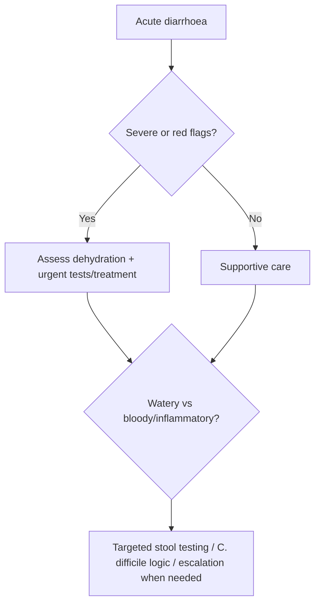

# Acute diarrhoea initial approach

Related: [[../Gastroenterology MOC|Gastroenterology MOC]] · [[../Symptom Patterns and Diagnostic Approach|Symptom Patterns and Diagnostic Approach]] · [[Chronic diarrhoea framework]] · [[Acute abdominal pain and peritonism red flags]] · [[Constipation and altered bowel habit]]

> [!important]
> Acute diarrhoea is usually brief and self-limited, but the exam priority is to identify **dehydration, dysentery, sepsis, severe abdominal pain, recent antibiotics, immunocompromise, and public-health/infective clues**.

## Learning Objectives
- Define acute diarrhoea and classify the initial syndrome.
- Recognize red flags requiring admission or urgent investigation.
- Distinguish watery disease from inflammatory/dysenteric disease.
- Build a practical first-line management algorithm.

## Definition
Acute diarrhoea is diarrhoea of **less than 14 days' duration**, most often infectious, inflammatory, toxic, or medication-related. Persistent diarrhoea occupies an intermediate zone, while chronic diarrhoea lasts more than 4 weeks.

## Physiology / Pathophysiology
Acute diarrhoea occurs through one or more mechanisms:
- increased secretion
- osmotic load
- reduced absorption
- inflammatory mucosal injury
- altered motility

## Practical Classification
### Watery diarrhoea
- secretory/infective watery illness
- toxin-related disease
- medication-related diarrhoea

### Inflammatory / dysenteric diarrhoea
- blood or mucus in stool
- fever, tenesmus, systemic upset
- invasive infection or colitis pattern

## History Framework
Ask about:
- onset and duration
- stool frequency and volume
- blood or mucus
- fever and vomiting
- severe abdominal pain
- travel / food exposure / sick contacts
- recent antibiotic use
- immunosuppression
- dehydration symptoms
- pregnancy, frailty, age extremes

## Examination Priorities
- hydration status
- pulse, BP, postural drop
- temperature
- abdominal tenderness / guarding
- mental state and perfusion in severe cases

## Red Flags / Emergencies
- hypotension or shock
- severe dehydration
- bloody diarrhoea
- high fever / sepsis
- significant abdominal pain or peritonism
- immunocompromised patient
- recent antibiotic exposure with concern for *C. difficile*
- elderly / frail patient with rapid deterioration

## Investigations
### Most mild cases
- no extensive investigation initially if clearly mild and self-limiting

### Investigate when severe / persistent / high-risk
- CBC
- U&E / creatinine
- CRP where relevant
- stool studies when dysentery, outbreak, persistent symptoms, or immunocompromise is present
- *C. difficile* testing when there is recent antibiotic or healthcare exposure

## Interpretation Framework
### Initial approach algorithm
1. Confirm acute onset.
2. Assess severity and hydration.
3. Decide watery vs dysenteric/inflammatory pattern.
4. Look for travel, antibiotic, food-borne, and immunocompromised clues.
5. Investigate only when severity or risk justifies it.
6. Rehydrate, treat complications, and escalate when red flags are present.

## Differential Diagnosis
- infective gastroenteritis
- food poisoning / toxin-mediated illness
- antibiotic-associated diarrhoea / *C. difficile*
- early inflammatory colitis
- medication-related diarrhoea
- ischemic or surgical abdomen mimic when pain dominates

## Management
### First-line principles
- oral rehydration if able
- IV fluids when severe dehydration or inability to maintain intake exists
- correct electrolytes
- continue feeding as tolerated rather than prolonged starvation

### Symptom control / cautions
- avoid indiscriminate antimotility therapy in bloody diarrhoea or severe systemic illness
- targeted antimicrobials only when clinically indicated
- infection-control advice is important in suspected infectious diarrhoea

### When to admit / escalate
- shock, severe dehydration, inability to take oral fluids
- marked systemic toxicity
- significant pain or guarding
- frailty or major comorbidity

## Complications
- dehydration
- AKI
- electrolyte disturbance
- sepsis
- hemolytic or colitic complications in selected infectious etiologies

## FCPS/MRCP High-Yield Points
- Assess hydration first.
- Bloody diarrhoea is not simple gastroenteritis until proven otherwise.
- Recent antibiotic use should trigger *C. difficile* thinking.
- Many mild cases do not need broad testing.

## Common Viva Traps
- Over-investigating a mild self-limited case.
- Under-recognizing dehydration and AKI risk.
- Giving antimotility drugs in dysenteric illness without caution.

## One-Page Summary
- Acute diarrhoea = **<14 days**.
- First priorities: **severity, dehydration, blood, fever, antibiotic history, immunocompromise**.
- Mild watery disease is often supportive-care only.
- Bloody diarrhoea, severe pain, or shock requires urgent evaluation.
- Think *C. difficile* after antibiotics.

## Mind Map
- Acute diarrhoea
  - watery
  - dysenteric
  - red flags
    - dehydration
    - blood
    - fever
    - pain
    - antibiotics
  - tests
    - U&E
    - stool tests
    - C. difficile
  - treatment
    - ORS / IV fluids

## Flowchart

## Revision Prompts
- Define acute diarrhoea.
- Name 5 red flags.
- When do you think of *C. difficile*?
- Why avoid blind antimotility therapy in dysentery?

## MCQs (10)
1. Acute diarrhoea usually means duration of:
   - A. Less than 14 days
   - B. More than 4 weeks
   - C. Exactly 1 year
   - D. More than 6 months
   - **Answer: A**
2. The first priority in acute diarrhoea is assessment of:
   - A. Hydration and severity
   - B. Hair colour
   - C. Visual acuity
   - D. Hearing threshold
   - **Answer: A**
3. Bloody diarrhoea should suggest:
   - A. Inflammatory/dysenteric illness
   - B. Always IBS
   - C. Migraine
   - D. Eczema
   - **Answer: A**
4. Recent antibiotic use raises concern for:
   - A. *C. difficile*
   - B. Gallstones only
   - C. Achalasia
   - D. Coeliac disease only
   - **Answer: A**
5. Severe dehydration may cause:
   - A. AKI
   - B. Glaucoma only
   - C. Psoriasis only
   - D. Tinnitus only
   - **Answer: A**
6. In mild self-limited watery diarrhoea, the main treatment is often:
   - A. Rehydration and supportive care
   - B. Emergency laparotomy
   - C. Chemotherapy
   - D. Dialysis
   - **Answer: A**
7. Antimotility drugs should be used cautiously in:
   - A. Bloody diarrhoea
   - B. Mild thirst only
   - C. Dry skin only
   - D. Seasonal rhinitis
   - **Answer: A**
8. Which is a red flag?
   - A. Shock
   - B. One soft stool only
   - C. Mild yawning
   - D. Dry lips alone without symptoms
   - **Answer: A**
9. Stool studies are especially useful when symptoms are:
   - A. Severe, persistent, or high-risk
   - B. Trivial and resolved
   - C. Unrelated to gut symptoms
   - D. Always unnecessary
   - **Answer: A**
10. Which statement is correct?
   - A. Acute diarrhoea management is pattern- and severity-based
   - B. Every case needs admission
   - C. Every case needs antibiotics
   - D. Blood in stool is unimportant
   - **Answer: A**

## SBA Questions (10)
1. A 78-year-old man has acute diarrhoea, tachycardia, dry tongue, oliguria, and postural dizziness. Best immediate priority?
   - A. Rehydration and severity assessment
   - B. Routine discharge only
   - C. Laxatives
   - D. Colonoscopy before fluids
   - **Answer: A**
2. A patient develops diarrhoea 5 days after broad-spectrum antibiotics. Key diagnosis to consider?
   - A. *C. difficile* infection
   - B. Achalasia
   - C. Acute pancreatitis
   - D. Hemorrhoids
   - **Answer: A**
3. Which feature most strongly suggests dysenteric illness?
   - A. Blood and mucus in stool
   - B. Isolated bloating only
   - C. Stable appetite only
   - D. Mild belching
   - **Answer: A**
4. Which patient most needs admission?
   - A. Hypotensive patient with severe dehydration
   - B. Young adult with one day of mild loose stool and good intake
   - C. Patient with no systemic symptoms
   - D. Patient already improving
   - **Answer: A**
5. In a mild watery case with no red flags, the best first management is:
   - A. Oral rehydration and supportive care
   - B. Automatic IV antibiotics
   - C. Emergency surgery
   - D. Ignore fluid balance
   - **Answer: A**
6. Which is a dangerous mistake?
   - A. Missing dehydration and AKI risk
   - B. Checking vitals
   - C. Asking about antibiotic use
   - D. Assessing stool pattern
   - **Answer: A**
7. Which history item is high yield for outbreak/infectious clues?
   - A. Travel and food exposure
   - B. Shoe size only
   - C. Handwriting style only
   - D. Hair texture only
   - **Answer: A**
8. Which statement is true?
   - A. Not every acute diarrhoea case needs extensive testing
   - B. Every case is inflammatory bowel disease
   - C. Every case needs colonoscopy
   - D. Blood in stool is always harmless
   - **Answer: A**
9. A patient with diarrhea and guarding should trigger concern for:
   - A. More serious abdominal pathology
   - B. Pure functional disease only
   - C. Harmless food intolerance only
   - D. Primary skin disease
   - **Answer: A**
10. Best exam principle?
   - A. Classify severity first, then pattern and cause
   - B. Start with endoscopy in all cases
   - C. Never assess hydration
   - D. Ignore comorbidity
   - **Answer: A**

## Flashcards
- Q: What duration defines acute diarrhoea?
  A: Less than 14 days.
- Q: Name 4 red flags in acute diarrhoea.
  A: Shock, severe dehydration, bloody diarrhoea, severe pain/peritonism.
- Q: What diagnosis should be considered after recent antibiotics?
  A: *Clostridioides difficile* infection.
- Q: What is first-line therapy in most mild cases?
  A: Oral rehydration and supportive care.
- Q: Why is bloody diarrhoea important?
  A: It suggests inflammatory/dysenteric disease and needs more careful evaluation.

## Must Know / Should Know / Nice to Know
### Must Know
- Key red flags and alarm features for this presentation
- Systematic assessment approach (ABCDE for acute, structured for chronic)
- Investigation logic: stepwise from non-invasive to invasive
- Core management principles: treat underlying cause + symptomatic relief

### Should Know
- Special populations (elderly, immunocompromised, pregnancy)
- Refractory/recurrent management strategies
- Multidisciplinary involvement criteria

### Nice to Know
- Advanced diagnostic modalities
- Emerging treatment options
- Health economic considerations

## Self-Test Scorecard
- Can I list 4 key red flags? /10
- Can I outline the assessment algorithm? /10
- Can I explain the investigation strategy? /10
- Can I describe the management approach? /10

**Interpretation:**
- **<35/40** = weak topic
- **35-36/40** = acceptable but insecure
- **37+/40** = exam-ready

## Answer Key with Explanations

