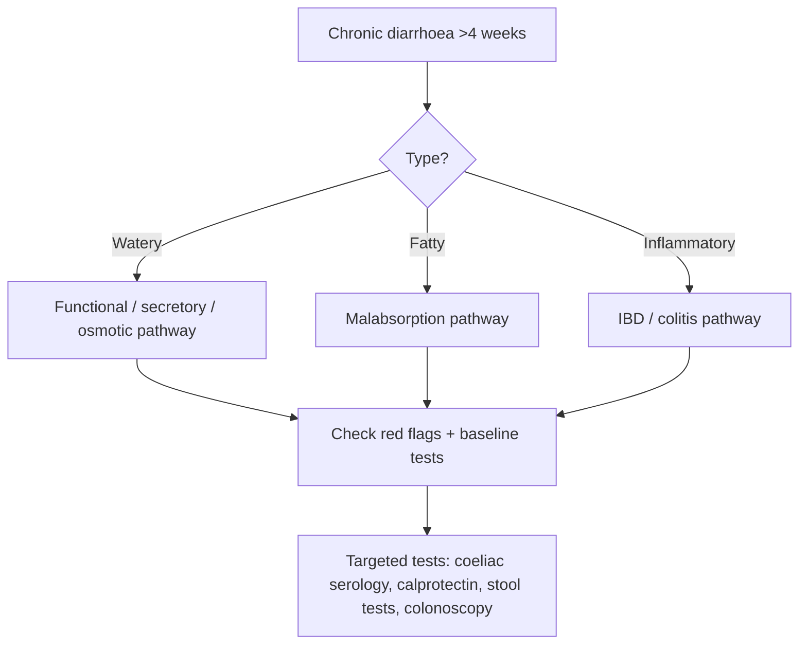

# Chronic diarrhoea framework

Related: [[../Gastroenterology MOC|Gastroenterology MOC]] · [[../Symptom Patterns and Diagnostic Approach|Symptom Patterns and Diagnostic Approach]] · [[../Small Bowel Malabsorption and Coeliac Disease/Coeliac disease|Coeliac disease]] · [[../Inflammatory and Functional Bowel Disorders/Ulcerative colitis|Ulcerative colitis]] · [[../Inflammatory and Functional Bowel Disorders/Crohn disease|Crohn disease]] · [[Constipation and altered bowel habit]]

## Learning Objectives
- Define chronic diarrhoea and organize causes logically.
- Distinguish watery, fatty, and inflammatory diarrhoea.
- Recognize alarm features and red-flag pathways.
- Build an exam-ready investigation algorithm.

## Definition
Chronic diarrhoea is diarrhoea persisting for **more than 4 weeks**.

## Anatomy / Physiology
Normal stool consistency depends on:
- small-bowel absorption
- colonic water reclamation
- normal motility
- intact mucosal surface

Chronic diarrhoea occurs when there is:
- impaired absorption
- excessive secretion
- inflammation
- rapid transit
- osmotic load

## Classification
### Practical classification
1. **Watery diarrhoea**
   - secretory
   - osmotic
   - functional
2. **Fatty / malabsorptive diarrhoea**
   - steatorrhoea
3. **Inflammatory diarrhoea**
   - blood/mucus/systemic inflammation

## Etiology / Differential Logic
### Watery
- IBS-D / functional bowel disease
- bile acid diarrhoea
- microscopic colitis
- endocrine/secretory causes (selected cases)
- medication-related causes

### Malabsorptive / fatty
- [[../Small Bowel Malabsorption and Coeliac Disease/Coeliac disease|Coeliac disease]]
- pancreatic exocrine insufficiency
- small intestinal bacterial overgrowth
- carbohydrate malabsorption

### Inflammatory
- [[../Inflammatory and Functional Bowel Disorders/Ulcerative colitis|Ulcerative colitis]]
- [[../Inflammatory and Functional Bowel Disorders/Crohn disease|Crohn disease]]
- chronic infection
- colorectal inflammatory/neoplastic causes

## Pathophysiology
- **Secretory** diarrhoea continues despite fasting.
- **Osmotic** diarrhoea improves with fasting/removal of offending substrate.
- **Malabsorptive** diarrhoea causes bulky pale/fatty stool and deficiency states.
- **Inflammatory** diarrhoea causes mucosal injury, exudation, blood, fever, and systemic features.

## Clinical Features
### History framework
Ask about:
- duration >4 weeks
- stool frequency, volume, nocturnal symptoms
- blood, mucus, pus
- steatorrhoea
- weight loss
- abdominal pain
- tenesmus
- urgency
- travel/medication/diet
- family history of IBD/coeliac/CRC

### Pattern clues
- nocturnal diarrhoea → organic disease more likely
- weight loss / anaemia → red flag
- greasy floating stool → malabsorption
- blood + urgency → inflammatory/colitic process
- pain relieved by defecation without red flags → functional possibility

## Red Flags
- weight loss
- iron-deficiency anaemia
- rectal bleeding
- nocturnal diarrhoea
- fever
- dehydration
- family history of colorectal cancer or IBD
- older age with new persistent change in bowel habit

## Investigations
### Baseline
- CBC
- CRP/ESR where relevant
- U&E
- albumin
- stool studies if infection suspected

### GI-focused tests
- coeliac serology
- faecal calprotectin when inflammatory disease is possible
- colonoscopy/flexible sigmoidoscopy when red flags or inflammatory pattern exist
- stool fat / malabsorption-oriented testing in selected cases

## Interpretation Framework
### Chronic diarrhoea algorithm
1. Confirm chronicity (>4 weeks).
2. Decide: watery vs fatty vs inflammatory.
3. Screen for red flags.
4. Check CBC, inflammatory markers, coeliac serology, and stool-focused tests as needed.
5. Use calprotectin/colonoscopy when IBD or colonic inflammation is suspected.
6. If no red flags and functional pattern dominates, consider IBS after exclusion of major organic disease.

## Diagnosis
Diagnosis is framework-based first, then cause-specific after targeted tests.

## Differential Diagnosis
- IBS-D
- coeliac disease
- ulcerative colitis
- Crohn disease
- microscopic colitis
- bile acid diarrhoea
- chronic infection
- colorectal neoplasia

## Management
### First principles
- correct dehydration/electrolyte problems
- stop offending medications if possible
- investigate red flags urgently
- treat underlying cause rather than giving blind chronic antimotility treatment alone

### Cause-based examples
- coeliac disease → gluten-free diet
- IBD → anti-inflammatory / specialist pathway
- bile acid diarrhoea → bile acid binder strategy
- IBS-D → functional bowel approach after exclusion

## Complications
- dehydration
- electrolyte disturbance
- weight loss
- micronutrient deficiency
- missed colorectal/IBD diagnosis if under-investigated

## One-Page Summary
- Chronic diarrhoea = **>4 weeks**.
- Classify into **watery, fatty, inflammatory**.
- Red flags: **weight loss, anaemia, blood, nocturnal symptoms, fever, older age/new change**.
- Coeliac serology and faecal calprotectin are key high-yield tools.
- Colonoscopy is important when inflammatory/neoplastic concern exists.
- IBS is a diagnosis of pattern plus reasonable exclusion, not laziness.

## FCPS/MRCP High-Yield Points
- Always classify first.
- Steatorrhoea points to malabsorption.
- Bloody diarrhoea/urgency suggests inflammation.
- Nocturnal diarrhoea usually argues against simple functional disease.

## Common Viva Traps
- Calling weight-loss diarrhoea IBS.
- Forgetting coeliac screening.
- Ignoring drug history.
- Not separating watery from fatty from inflammatory stool patterns.

## Mind Map
- Chronic diarrhoea
  - watery
  - fatty
  - inflammatory
  - red flags
    - weight loss
    - anaemia
    - blood
    - nocturnal symptoms
  - tests
    - CBC
    - coeliac serology
    - calprotectin
    - colonoscopy

## Flowchart

## Revision Prompts
- Define chronic diarrhoea.
- What are the 3 major stool-pattern classes?
- Name 5 red flags.
- How do you separate IBS-D from organic disease?

## MCQs (10)
1. Chronic diarrhoea means diarrhoea lasting more than:
A. 4 weeks
B. 4 hours
C. 2 days
D. 1 year only

2. Greasy bulky stool most suggests:
A. Malabsorption
B. Migraine
C. Asthma
D. UTI

3. Bloody diarrhoea with urgency most suggests:
A. Inflammatory diarrhoea
B. Functional constipation
C. Tension headache
D. Renal colic

4. A key red flag is:
A. Weight loss
B. Hair loss only
C. Sneezing
D. Ankle sprain

5. Nocturnal diarrhoea usually suggests:
A. Organic disease
B. Always IBS
C. Sinusitis
D. Pure hemorrhoids

6. A key screen in chronic diarrhoea is:
A. Coeliac serology
B. PSA only
C. ECG only
D. MRI knee

7. Faecal calprotectin is most helpful when suspecting:
A. Inflammatory bowel disease
B. Glaucoma
C. Kidney stone
D. Otitis media

8. IBS-D should be diagnosed:
A. After reasonable exclusion of major organic disease
B. Whenever stool is loose once
C. Only after surgery
D. Never clinically

9. Which classification is practical?
A. Watery, fatty, inflammatory
B. Red, blue, green
C. Day, night only
D. Acute, subacute only

10. Chronic diarrhoea may cause:
A. Electrolyte disturbance
B. Cataract only
C. Fracture only
D. Epistaxis only

## SBA Questions (10)
1. A 32-year-old woman has 3 months of loose stool, weight loss, and iron-deficiency anaemia. Best principle?
A. Investigate for organic disease including coeliac disease
B. Label IBS immediately
C. Give laxatives
D. Ignore anaemia

2. A patient has chronic diarrhoea that wakes him at night. Best interpretation?
A. Organic pathology is more likely
B. This confirms functional disease
C. It proves hemorrhoids
D. It excludes IBD

3. A 25-year-old with bloody diarrhoea and urgency most needs evaluation for:
A. Inflammatory bowel disease
B. Migraine
C. Nephrotic syndrome
D. Asthma

4. Which patient is most likely to have malabsorptive diarrhoea?
A. Greasy floating stools with weight loss
B. Isolated sore throat
C. Ankle pain
D. Tinnitus

5. Which is a good baseline blood test set?
A. CBC and inflammatory/biochemical assessment
B. PSA and CK-MB only
C. Amylase only
D. None ever

6. Coeliac serology should be considered in:
A. Chronic diarrhoea work-up
B. Only acute appendicitis
C. Only epistaxis
D. Only gout

7. A patient has chronic loose stool, no weight loss, no nocturnal symptoms, and pain relieved by defecation. Best general interpretation?
A. Functional bowel disease is possible after reasonable exclusion
B. Cancer is proven
C. Variceal bleed is likely
D. Peritonitis is certain

8. Which feature argues most against simple IBS?
A. Rectal bleeding and anaemia
B. Stress association
C. Intermittent bloating
D. Relief after defecation

9. A practical first step is to:
A. Classify the diarrhoea phenotype
B. Jump straight to surgery
C. Ignore duration
D. Avoid history taking

10. Why is colonoscopy important in some chronic diarrhoea cases?
A. To assess inflammatory or neoplastic colonic disease
B. To diagnose pneumonia
C. To treat cataract
D. To measure creatinine directly

## Flashcards
- Q: What duration defines chronic diarrhoea?  
  A: More than 4 weeks.
- Q: What are the 3 practical classes?  
  A: Watery, fatty, inflammatory.
- Q: Name 3 red flags.  
  A: Weight loss, anaemia, rectal bleeding.
- Q: What stool feature suggests malabsorption?  
  A: Greasy/fatty bulky stool.
- Q: What test helps distinguish inflammatory disease from functional disease?  
  A: Faecal calprotectin.

## Answer Key with Explanations
### MCQs
1. **A** — >4 weeks is standard.
2. **A** — greasy bulky stool suggests fat malabsorption.
3. **A** — blood and urgency suggest inflammation.
4. **A** — weight loss is a major red flag.
5. **A** — nocturnal symptoms point to organic pathology.
6. **A** — coeliac screening is high yield.
7. **A** — calprotectin is used in suspected inflammatory disease.
8. **A** — IBS requires sensible exclusion of red-flag organic disease.
9. **A** — this is the key framework.
10. **A** — chronic diarrhoea may cause dehydration/electrolyte issues.

### SBAs
1. **A** — weight loss and anaemia demand organic work-up.
2. **A** — nocturnal stool suggests organic disease.
3. **A** — this is classic inflammatory bowel disease logic.
4. **A** — malabsorptive stool pattern is classic.
5. **A** — baseline hematologic/biochemical assessment is appropriate.
6. **A** — coeliac disease must be considered.
7. **A** — that pattern can fit functional disease after reasonable exclusion.
8. **A** — bleeding and anaemia are strong alarm features.
9. **A** — classification guides everything else.
10. **A** — colonoscopy helps identify colitis or neoplasia.

## Must Know / Should Know / Nice to Know
### Must Know
- Definition and diagnostic criteria for this presentation
- Key differential diagnoses and distinguishing features
- Stepwise investigation and management algorithm
- Red flags requiring urgent referral or intervention

### Should Know
- Special populations and atypical presentations
- Refractory management
- Cost-effectiveness of investigation pathways

### Nice to Know
- Emerging biomarkers and diagnostics
- Novel therapeutic targets
- Quality metrics

## Self-Test Scorecard
- Can I define the condition? /10
- Can I list 4 differential diagnoses? /10
- Can I outline the investigation strategy? /10
- Can I describe the management approach? /10

**Interpretation:**
- **<35/40** = weak topic
- **35-36/40** = acceptable but insecure
- **37+/40** = exam-ready

## Answer Key with Explanations

