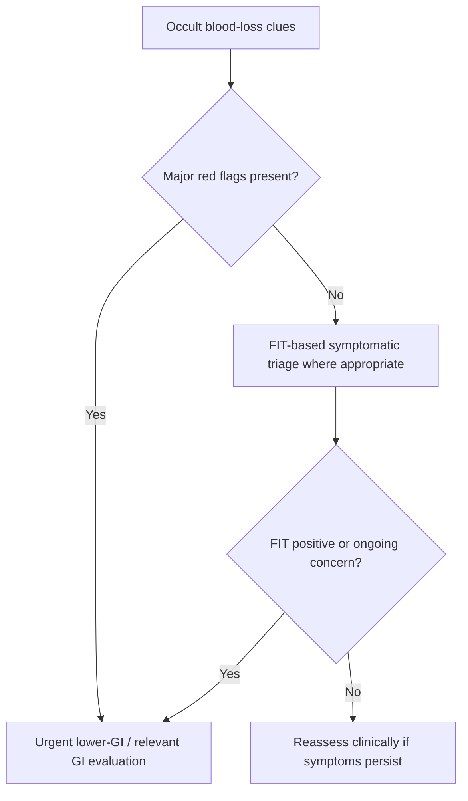

# Occult GI bleeding and FIT-based triage

Related: [[../Gastroenterology MOC|Gastroenterology MOC]] · [[../Symptom Patterns and Diagnostic Approach|Symptom Patterns and Diagnostic Approach]] · [[Iron-deficiency anaemia as a GI clue]] · [[Change in bowel habit with colorectal cancer red flags]] · [[../Lower GI Bleeding, Colorectal, and Anal Disorders/Colorectal cancer|Colorectal cancer]]

> [!important]
> Occult GI bleeding is bleeding not obvious to the patient or examiner but revealed by **iron-deficiency anaemia, fecal blood testing, or cancer-triage pathways**. FIT helps risk-stratify lower-GI investigation but does **not** replace clinical judgment when alarm features exist.

## Learning Objectives
- Define occult GI bleeding and its clinical significance.
- Understand the role and limits of FIT-based triage.
- Recognize when urgent lower-GI investigation is needed despite test results.
- Integrate occult blood-loss clues with colorectal cancer suspicion.

## Definition
Occult GI bleeding is blood loss from the GI tract that is not visibly apparent but manifests through laboratory, stool-test, or cancer-clue pathways.

## Clinical Importance
Occult bleeding may indicate:
- colorectal neoplasia
- advanced adenoma or other bleeding lesions
- inflammatory bowel disease
- angiodysplasia or chronic mucosal bleeding sources
- occasionally upper-GI sources depending on the clinical context

## FIT in Practice
FIT (fecal immunochemical testing) detects human hemoglobin in stool and is used in many symptomatic lower-GI triage pathways.

### Strengths
- helps stratify patients with subtle lower-GI symptoms
- improves selection for urgent colorectal evaluation in some pathways

### Limitations
- a negative FIT does not cancel strong clinical red flags
- it is not a substitute for investigating overt alarming features such as marked anaemia, weight loss, or persistent change in bowel habit
- it is one tool within a broader diagnostic assessment

## Clinical Clues Suggesting Occult GI Bleeding
- iron-deficiency anaemia
- unexplained fatigue / pallor
- altered bowel habit
- weight loss
- positive FIT
- recurrent subtle abdominal symptoms with no visible bleeding

## Red Flags
- iron-deficiency anaemia with bowel symptoms
- persistent change in bowel habit
- weight loss
- older patient with new lower-GI symptoms
- strong family history of colorectal cancer
- palpable mass or clear ongoing anaemia progression

## Investigations
### Core approach
- CBC and iron studies if anaemia is suspected
- FIT where appropriate within symptomatic triage pathways
- colonoscopy / lower GI investigation when risk is high

### Additional logic
- upper-GI evaluation if symptom pattern or anaemia profile suggests proximal source
- repeat assessment if symptoms evolve despite an initially reassuring test

## Interpretation Framework
### Practical algorithm
1. Decide whether there are occult blood-loss clues.
2. Assess for major colorectal cancer red flags.
3. Use FIT as a triage adjunct when appropriate.
4. Do not let negative FIT override strong clinical concern.
5. Proceed to definitive lower-GI evaluation when risk remains significant.

## Differential Diagnosis / Cause Logic
- colorectal cancer
- advanced adenoma or colonic bleeding lesion
- inflammatory bowel disease
- angiodysplasia
- upper-GI chronic blood loss in selected patients

## Management Principles
- investigate the cause of occult bleeding, not just the test result
- expedite lower-GI evaluation when clinical risk is high
- correct iron deficiency / anaemia supportively while continuing the diagnostic pathway

## FCPS/MRCP High-Yield Points
- FIT is a **triage tool**, not an absolute rule-out test.
- Occult bleeding often declares itself first as iron-deficiency anaemia.
- Persistent change in bowel habit plus occult blood-loss clues should heighten colorectal cancer concern.

## Common Viva Traps
- Treating a negative FIT as “no cancer possible.”
- Forgetting that occult bleeding may be upper GI in some contexts.
- Separating anemia from bowel-history clues instead of integrating them.

## One-Page Summary
- Occult GI bleeding is hidden blood loss revealed by tests or indirect clues.
- FIT is useful for symptomatic lower-GI triage, especially cancer pathways.
- Negative FIT does **not** overrule strong red flags.
- Iron-deficiency anaemia, altered bowel habit, and weight loss remain major triggers for GI investigation.

## Mind Map
- Occult GI bleeding
  - clues
    - IDA
    - positive FIT
    - fatigue/pallor
    - bowel change
  - causes
    - CRC
    - adenoma/lesion
    - IBD
    - angiodysplasia
  - rule
    - FIT helps triage
    - red flags override reassurance

## Flowchart

## Revision Prompts
- Define occult GI bleeding.
- What is FIT used for?
- Why can a negative FIT be misleading?
- Name 4 clues that should still trigger concern.

## MCQs (10)
1. FIT stands for:
   - A. Fecal immunochemical test
   - B. Functional intestinal transit
   - C. Ferrous index trial
   - D. Fasting inflammation test
   - **Answer: A**
2. Occult GI bleeding is best defined as:
   - A. Hidden GI blood loss not visibly apparent
   - B. Massive hematemesis only
   - C. Any abdominal pain
   - D. Pure constipation
   - **Answer: A**
3. A negative FIT means:
   - A. Clinical red flags can still justify investigation
   - B. Cancer is impossible
   - C. Anaemia is irrelevant
   - D. Colonoscopy is never needed
   - **Answer: A**
4. A key clue to occult bleeding is:
   - A. Iron-deficiency anaemia
   - B. Sneezing
   - C. Cataract
   - D. Tinnitus
   - **Answer: A**
5. FIT is mainly used as:
   - A. A triage adjunct in lower-GI symptom pathways
   - B. A liver synthetic test
   - C. A test for achalasia
   - D. A treatment
   - **Answer: A**
6. Which symptom combination should increase colorectal concern?
   - A. Altered bowel habit and weight loss
   - B. Mild thirst and dandruff
   - C. Brief hiccups only
   - D. Dry eyes only
   - **Answer: A**
7. Which statement is correct?
   - A. FIT does not replace clinical judgment
   - B. FIT is always definitive
   - C. FIT excludes all upper GI disease
   - D. FIT is unrelated to cancer triage
   - **Answer: A**
8. Which cause may present with occult bleeding?
   - A. Colorectal cancer
   - B. Asthma
   - C. Migraine only
   - D. Otitis externa
   - **Answer: A**
9. If symptoms persist despite a reassuring test, the next principle is:
   - A. Reassess and continue cause-based evaluation
   - B. Ignore symptoms forever
   - C. Stop all follow-up
   - D. Diagnose IBS immediately
   - **Answer: A**
10. Best exam phrase?
   - A. FIT supports risk stratification but cannot overrule strong alarm features
   - B. FIT replaces history and examination
   - C. FIT is unnecessary in all triage
   - D. Occult bleeding has no clinical value
   - **Answer: A**

## SBA Questions (10)
1. A 71-year-old woman has altered bowel habit, weight loss, and iron-deficiency anaemia but a negative FIT. Best next principle?
   - A. Investigate because clinical risk remains high
   - B. Discharge because FIT is negative
   - C. Diagnose IBS immediately
   - D. Ignore the anaemia
   - **Answer: A**
2. What is the main role of FIT in symptomatic practice?
   - A. Lower-GI cancer-risk triage adjunct
   - B. Confirming pancreatitis
   - C. Diagnosing achalasia
   - D. Treating anemia
   - **Answer: A**
3. Which clue may reveal occult GI bleeding before visible bleeding occurs?
   - A. Iron-deficiency anaemia
   - B. Polyuria only
   - C. Epistaxis only
   - D. Tinnitus only
   - **Answer: A**
4. Which is a dangerous error?
   - A. Letting a negative FIT overrule strong alarm symptoms
   - B. Integrating bowel history with anaemia
   - C. Considering colonoscopy when risk is high
   - D. Reassessing persistent symptoms
   - **Answer: A**
5. A positive FIT in a symptomatic patient should generally prompt:
   - A. Relevant lower-GI evaluation
   - B. Automatic reassurance only
   - C. Eye examination only
   - D. Dermatology referral only
   - **Answer: A**
6. Which cause is high yield for occult lower-GI bleeding?
   - A. Colorectal neoplasia
   - B. Astigmatism
   - C. Hay fever
   - D. Acne
   - **Answer: A**
7. Which statement is true?
   - A. Occult bleeding can be clinically silent until anaemia or testing reveals it
   - B. It always causes obvious hematochezia
   - C. FIT is useful only in hepatology
   - D. Occult bleeding never matters clinically
   - **Answer: A**
8. Which patient should still worry you even with a negative FIT?
   - A. Older patient with persistent bowel change and weight loss
   - B. Young person with one day of mild bloating
   - C. Patient already fully better
   - D. Person with isolated sneezing
   - **Answer: A**
9. Which principle is correct?
   - A. Test results must be interpreted in clinical context
   - B. History is unnecessary if FIT exists
   - C. Anaemia and bowel symptoms should never be linked
   - D. Colon cancer cannot bleed occultly
   - **Answer: A**
10. Best summary?
   - A. Occult GI bleeding plus FIT belongs to a risk-stratified diagnostic pathway, not a single-test shortcut
   - B. FIT ends all diagnostic thinking
   - C. Hidden bleeding is not a real entity
   - D. Clinical judgment is obsolete
   - **Answer: A**

## Flashcards
- Q: What does FIT stand for?
  A: Fecal immunochemical test.
- Q: What is occult GI bleeding?
  A: Hidden GI blood loss not visibly apparent but suggested by tests or indirect clues.
- Q: What common lab clue suggests occult GI bleeding?
  A: Iron-deficiency anaemia.
- Q: Does a negative FIT rule out colorectal pathology when red flags exist?
  A: No.
- Q: What is FIT mainly used for?
  A: Lower-GI symptomatic risk stratification/triage.

## Must Know / Should Know / Nice to Know
### Must Know
- Key red flags and alarm features for this presentation
- Systematic assessment approach (ABCDE for acute, structured for chronic)
- Investigation logic: stepwise from non-invasive to invasive
- Core management principles: treat underlying cause + symptomatic relief

### Should Know
- Special populations (elderly, immunocompromised, pregnancy)
- Refractory/recurrent management strategies
- Multidisciplinary involvement criteria

### Nice to Know
- Advanced diagnostic modalities
- Emerging treatment options
- Health economic considerations

## Self-Test Scorecard
- Can I list 4 key red flags? /10
- Can I outline the assessment algorithm? /10
- Can I explain the investigation strategy? /10
- Can I describe the management approach? /10

**Interpretation:**
- **<35/40** = weak topic
- **35-36/40** = acceptable but insecure
- **37+/40** = exam-ready

## Answer Key with Explanations

