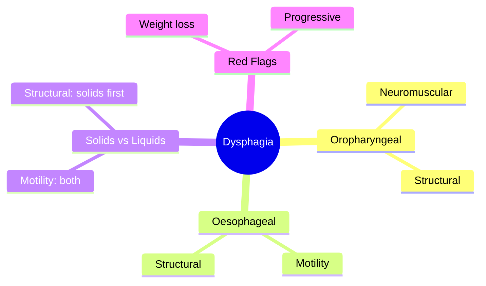
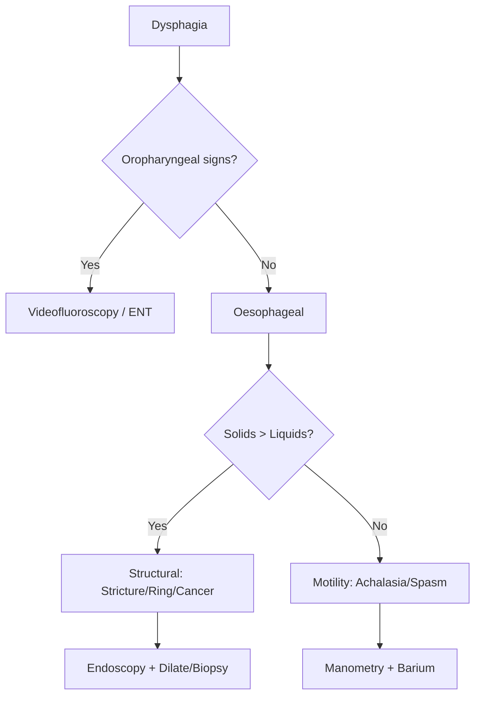

## Learning Objectives
- Distinguish oropharyngeal from oesophageal dysphagia by history and examination
- Recognize the significance of solids vs liquids dysphagia pattern
- Apply the appropriate investigation strategy for each type
- Identify red flags requiring urgent endoscopic evaluation
- Outline the management principles for common causes# Solids vs liquids dysphagia pattern

Related: [[../Gastroenterology MOC|Gastroenterology MOC]] · [[../Symptom Patterns and Diagnostic Approach|Symptom Patterns and Diagnostic Approach]] · [[Oropharyngeal vs oesophageal dysphagia]]

> [!important]
> In oesophageal dysphagia, the **solids-vs-liquids pattern** is a classic bedside clue. It helps separate **mechanical obstruction** from **motility disorder** before confirmatory testing.

## Definition
This is a symptom-pattern approach that interprets whether dysphagia affects **solids first** or **solids and liquids from the start**.

## Physiology
- Solid boluses are harder to pass through a narrowed lumen.
- Liquids can often pass a mild mechanical narrowing.
- Motility disorders disrupt propulsion of both solids and liquids.

## Core Interpretation Rule
### Solids first, later liquids
Suggests **mechanical obstruction**, for example:
- esophageal cancer
- peptic stricture
- Schatzki ring
- eosinophilic esophagitis with narrowing

### Solids and liquids from the beginning
Suggests **motility disorder**, for example:
- achalasia
- diffuse esophageal spasm
- severe ineffective motility patterns

## Clinical Features
### Mechanical pattern
- Progressive dysphagia
- Initially solids only
- Later liquids as narrowing worsens
- Weight loss if malignant cause
- Food bolus impaction may occur

### Motility pattern
- Intermittent dysphagia
- Solids and liquids both affected early
- Chest pain/regurgitation may coexist
- Symptoms may vary from meal to meal

## Red Flags
- Progressive dysphagia
- weight loss
- age with new-onset symptoms
- food bolus obstruction
- anemia or alarm features suggesting malignancy

## Investigations
- Endoscopy for obstruction/alarm features
- Barium swallow in selected structural/motility contexts
- Manometry for motility disorders after structural lesions are excluded

## Interpretation Framework
1. Confirm true dysphagia, not globus or odynophagia.
2. Decide whether onset pattern is:
   - solids first → obstruction
   - solids + liquids from onset → motility
3. Check alarm features.
4. Investigate accordingly.

## Diagnosis
This pattern does not give the final diagnosis by itself, but it is a highly useful clinical discriminator guiding the next test.

## Differential Diagnosis
- Oropharyngeal dysphagia
- Globus
- Odynophagia
- Functional symptoms

## Management Principles
- Investigate urgently if malignant obstruction is possible.
- Treat the underlying structural or motility disorder.
- Manage food impaction as an emergency when present.

## Complications
- Missed cancer
- Aspiration/regurgitation complications in motility disease
- Acute food bolus obstruction
- Malnutrition/weight loss

## Common Exam / Viva Traps
- Forgetting that motility disorders affect both solids and liquids early
- Forgetting progressive solid dysphagia suggests mechanical narrowing
- Using the pattern without checking red flags

## One-Page Summary
- **Solids first** → think mechanical obstruction.
- **Solids + liquids from onset** → think motility disorder.
- Mechanical causes often progress.
- Motility causes often fluctuate.
- Always combine the pattern with alarm-feature assessment.

## Revision Prompts
- What does solid-only early dysphagia suggest?
- What does solids-and-liquids-from-start suggest?
- Name 3 mechanical and 2 motility causes.

## MCQs (10)
1. Dysphagia to solids first usually suggests:
   - A. Mechanical obstruction
   - B. Pure motility disorder
   - C. IBS
   - D. Hemorrhoids
   - **Answer: A**
2. Dysphagia to solids and liquids from onset suggests:
   - A. Motility disorder
   - B. Anal fissure
   - C. UC
   - D. Pancreatic cancer
   - **Answer: A**
3. A classic mechanical cause is:
   - A. Peptic stricture
   - B. Achalasia
   - C. Bulbar palsy
   - D. Stroke
   - **Answer: A**
4. A classic motility cause is:
   - A. Achalasia
   - B. Schatzki ring
   - C. Peptic stricture
   - D. Esophageal cancer only
   - **Answer: A**
5. Progressive solid dysphagia with weight loss should raise concern for:
   - A. Esophageal cancer
   - B. IBS-C
   - C. UC
   - D. Hemorrhoids
   - **Answer: A**
6. Best initial test when alarm obstruction is suspected is often:
   - A. Endoscopy
   - B. EEG
   - C. Spirometry
   - D. DXA
   - **Answer: A**
7. Manometry is especially useful for:
   - A. Motility disorders
   - B. Pancreatic pseudocyst
   - C. Gallstones
   - D. Rectal bleeding
   - **Answer: A**
8. A typical complication of mechanical narrowing is:
   - A. Food bolus impaction
   - B. Hyperthyroidism
   - C. Hematuria
   - D. Seizure
   - **Answer: A**
9. Which statement is correct?
   - A. Pattern helps guide investigation but is not the whole diagnosis
   - B. Pattern alone replaces all testing
   - C. All dysphagia is motility-related
   - D. Red flags are irrelevant
   - **Answer: A**
10. Solids and liquids both affected from the start are more typical of:
   - A. Achalasia
   - B. Schatzki ring
   - C. Peptic stricture
   - D. Esophageal carcinoma always
   - **Answer: A**

## SBA Questions (10)
1. A 63-year-old man has progressive dysphagia that began with solids and now includes liquids, with weight loss. Best interpretation?
   - A. Mechanical obstruction, likely malignancy until excluded
   - B. Pure IBS
   - C. Functional constipation
   - D. Pancreatitis
   - **Answer: A**
2. A 35-year-old woman has intermittent dysphagia affecting solids and liquids equally from the start. Best broad category?
   - A. Motility disorder
   - B. Mechanical ring only
   - C. Hemorrhoids
   - D. UC flare
   - **Answer: A**
3. Which cause best fits mechanical solid-predominant dysphagia?
   - A. Peptic stricture
   - B. Achalasia
   - C. Myasthenia
   - D. Stroke
   - **Answer: A**
4. Which cause best fits solids-and-liquids dysphagia?
   - A. Achalasia
   - B. Schatzki ring
   - C. Esophageal web
   - D. Peptic stricture only
   - **Answer: A**
5. Which investigation is most useful after structural lesions are excluded and motility remains likely?
   - A. Esophageal manometry
   - B. Colonoscopy
   - C. CT brain
   - D. MRCP
   - **Answer: A**
6. Which symptom pattern most strongly suggests cancer?
   - A. Progressive solids-to-liquids dysphagia with weight loss
   - B. Stable lifelong mild choking only
   - C. Flatulence only
   - D. Watery diarrhea only
   - **Answer: A**
7. Which is a classic exam takeaway?
   - A. Solids first = obstruction; solids and liquids from outset = motility
   - B. Solids first always means motility
   - C. Liquids first always means peptic ulcer
   - D. Pattern has no value
   - **Answer: A**
8. Which emergency may occur in structural narrowing?
   - A. Food bolus impaction
   - B. Acute appendicitis
   - C. Pancreatic sepsis
   - D. Renal colic
   - **Answer: A**
9. Which differential must be separated before applying this rule?
   - A. Oropharyngeal dysphagia
   - B. Hemorrhoids
   - C. Gallstone ileus
   - D. VIPoma
   - **Answer: A**
10. Why is this pattern clinically useful?
   - A. It guides the next investigation pathway
   - B. It replaces history taking
   - C. It replaces endoscopy always
   - D. It has no role in triage
   - **Answer: A**

## Flashcards
- Q: Solids first dysphagia suggests what?  
  A: Mechanical obstruction.
- Q: Solids and liquids from onset suggest what?  
  A: Motility disorder.
- Q: Classic mechanical example?  
  A: Peptic stricture or esophageal cancer.
- Q: Classic motility example?  
  A: Achalasia.
- Q: Post-structural exclusion motility test?  
  A: Esophageal manometry.

## Mind Map

## Flowchart

## Must Know / Should Know / Nice to Know
### Must Know
- Oropharyngeal: nasal regurgitation, cough, voice change; neurological/structural causes
- Oesophageal: retrosternal, both solids/liquids if motility, solids first if structural
- Solids > liquids = structural (stricture, ring, cancer, web)
- Both equally = motility (achalasia, spasm, scleroderma)
- Urgent endoscopy for progressive dysphagia + weight loss

### Should Know
- Videofluoroscopy for oropharyngeal
- Manometry for motility disorders
- EoE: rings/furrows, biopsy despite normal endoscopy
- Pill oesophagitis: bisphosphonates, doxycycline

### Nice to Know
- POEM for achalasia
- EndoFLIP for distensibility
- Cricopharyngeal myotomy

## Self-Test Scorecard
- Can I distinguish oropharyngeal from oesophageal? /10
- Can I explain solids vs liquids pattern? /10
- Can I list 3 causes of each type? /10
- Can I outline the investigation algorithm? /10

**Interpretation:**
- **<35/40** = weak topic
- **35-36/40** = acceptable but insecure
- **37+/40** = exam-ready

## Revision Prompts
- How do you distinguish oropharyngeal from oesophageal dysphagia?
- What does solids > liquids pattern indicate?
- What are the urgent endoscopy criteria?

## Answer Key with Explanations

## Answer Key Pearls
- The classic viva line is: **“Solid dysphagia progressing later to liquids suggests obstruction; simultaneous solid and liquid dysphagia suggests motility disorder.”**