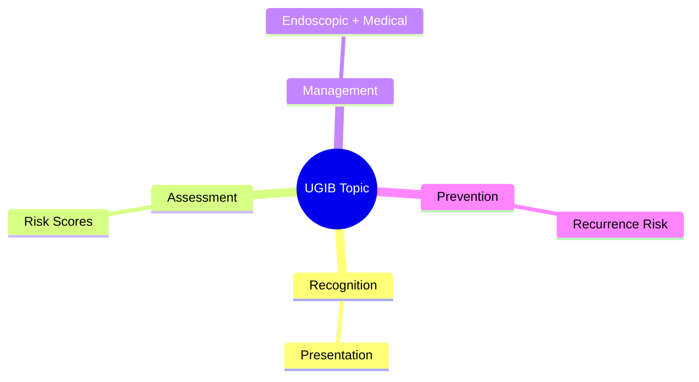
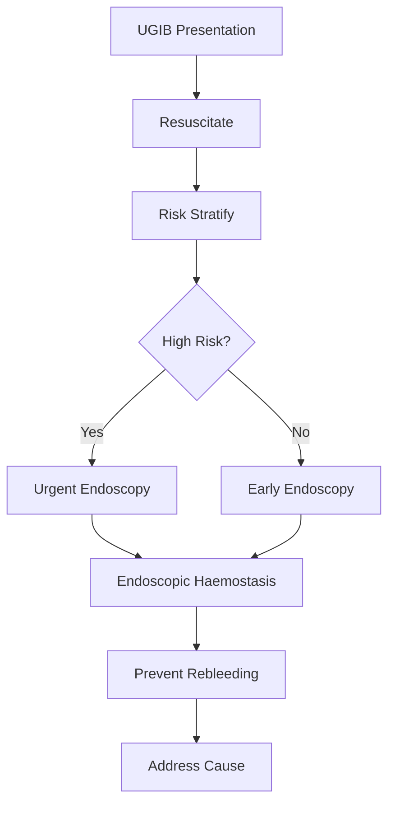

## Learning Objectives
- Recognize the clinical presentation and urgency of this UGIB scenario
- Apply the appropriate risk stratification and investigation strategy
- Outline the endoscopic and medical management principles
- Identify when escalation or specialist referral is required
- Understand the prevention and long-term management# Anticoagulant and antiplatelet-associated upper GI bleeding

Related: [[../Gastroenterology MOC|Gastroenterology MOC]] · [[../Upper Gastrointestinal Bleeding|Upper Gastrointestinal Bleeding]] · [[Pattern recognition and special contexts|Pattern recognition and special contexts]]

## Definition
Upper GI bleeding occurring in the context of anticoagulant or antiplatelet exposure is important because these drugs increase severity, complicate haemostasis, and force a balance between rebleeding risk and thrombosis risk.

## Common drugs
- Warfarin
- DOACs
- Aspirin
- Clopidogrel and other P2Y12 inhibitors
- Dual antiplatelet therapy

## Clinical implications
- Bleeding may be more severe or prolonged.
- Endoscopic therapy may still succeed, but reversal/support strategies become crucial.
- Underlying lesion is often still peptic ulcer, erosive disease, or Mallory-Weiss tear.

## Immediate approach
1. Stop the offending antithrombotic temporarily.
2. Resuscitate as usual.
3. Check when last dose was taken.
4. Review indication: AF, VTE, mechanical valve, recent ACS/stent.
5. Reverse when bleeding is severe or life-threatening.

## Reversal principles
- **Warfarin**: vitamin K + PCC if severe.
- **Dabigatran**: idarucizumab if indicated.
- **Factor Xa inhibitors**: protocol-based reversal or PCC depending on severity/availability.
- Antiplatelet decisions are individualized; platelet transfusion is not a blanket solution.

## Endoscopy and restart decisions
Urgent endoscopy is often still needed. After haemostasis, restarting therapy depends on why the patient was taking it:
- Recent coronary stent = high thrombosis risk
- Mechanical valve = very high thrombosis risk
- AF/VTE = individualized restart based on bleed severity and thromboembolic risk

## Prevention issues
- PPI co-therapy when appropriate
- Avoid combined NSAID use
- Treat *H. pylori*
- Review necessity of dual therapy duration

## Exam traps
- Thinking antithrombotic exposure itself explains the source; it often magnifies bleeding from another lesion.
- Stopping all antithrombotics indefinitely without assessing thrombotic risk.
- Reversing mild/self-limited bleeding too aggressively without context.

## Red flags
- Recent stent/ACS
- Mechanical valve
- INR markedly elevated
- Ongoing major haematemesis
- Elderly frail patient on multiple haemorrhagic-risk drugs

## One-page summary
Anticoagulants and antiplatelets worsen upper GI bleeding but rarely define the lesion by themselves. Management requires **resuscitation, source control, selective reversal, and careful restart planning** with attention to thrombosis risk.

## MCQs (10)
1. Common severe warfarin bleed reversal? **Vitamin K + PCC**.
2. Drug exposure usually indicates what? **Modified severity, not necessarily source**.
3. Dabigatran antidote? **Idarucizumab**.
4. Antiplatelet users always need platelets? **No**.
5. Recent coronary stent mainly raises concern for? **Thrombosis if therapy withheld**.
6. Common co-lesion causing bleed? **Peptic ulcer**.
7. Key management balance? **Rebleeding vs thrombosis**.
8. NSAID combination should generally be? **Avoided if possible**.
9. Urgent endoscopy still needed? **Often yes**.
10. Major exam error? **Stopping drugs indefinitely without indication review**.

## SBA Questions (10)
1. Warfarin user with shock and haematemesis: best immediate reversal? **PCC plus vitamin K**.
2. Dual antiplatelet therapy after recent stent and ulcer bleed controlled: who should guide restart? **GI plus cardiology**.
3. Atrial fibrillation patient on apixaban with melaena, stable: next key historical point? **Timing of last dose and indication**.
4. Anticoagulated patient with endoscopically proven ulcer: lesion source is? **Ulcer, amplified by anticoagulation**.
5. Mechanical valve patient after bleed control: prolonged interruption risk? **Valve thrombosis/embolism**.
6. Best long-term prevention? **Cause treatment + gastroprotection + medication review**.
7. Routine immediate permanent cessation of aspirin after all bleeds is? **Unsafe oversimplification**.
8. Which extra infection test matters in ulcer prevention? ***H. pylori***.
9. Main reason to avoid simplistic antiplatelet cessation? **Major cardiovascular harm**.
10. Best exam phrase? **Management must individualize reversal and restart according to bleed severity and thrombotic indication**.

## Flashcards
- Q: Main management tension?  
  A: Rebleeding versus thrombosis.
- Q: Severe warfarin bleed reversal?  
  A: PCC + vitamin K.
- Q: Dabigatran antidote?  
  A: Idarucizumab.
- Q: Do these drugs identify the lesion source?  
  A: Not usually; they worsen bleeding from an underlying lesion.
- Q: Who often needs joint input for restart?  
  A: Recent stent/ACS patients.

## Answer key with explanations
The best exam answer always mentions both sides of the problem: **control the bleed** and **avoid catastrophic thrombosis**. Drug-associated UGIB is therefore a multidisciplinary, indication-aware management problem.

## Mind Map

## Flowchart

## Must Know / Should Know / Nice to Know
### Must Know
- Resuscitation before endoscopy
- Rockall/Glasgow-Blatchford scores for risk
- Endoscopic haemostasis for high-risk stigmata
- PPI for non-variceal; vasoactives for variceal
- Restrictive transfusion (Hb <70-80)

### Should Know
- Timing: <24h for high-risk
- Antithrombotic management
- Rebleeding prediction

### Nice to Know
- Novel haemostatic agents
- Early enteral nutrition
- Transfusion threshold debates

## Self-Test Scorecard
- Can I state the resuscitation priorities? /10
- Can I apply Rockall/B modified? /10
- Can I list high-risk endoscopic stigmata? /10
- Can I outline the antithrombotic plan? /10

**Interpretation:**
- **<35/40** = weak topic
- **35-36/40** = acceptable but insecure
- **37+/40** = exam-ready

## Revision Prompts
- What is the first priority in UGIB?
- Which risk score do you use and why?
- When is urgent endoscopy indicated?
- How do you manage antithrombotics?

## Answer Key with Explanations

