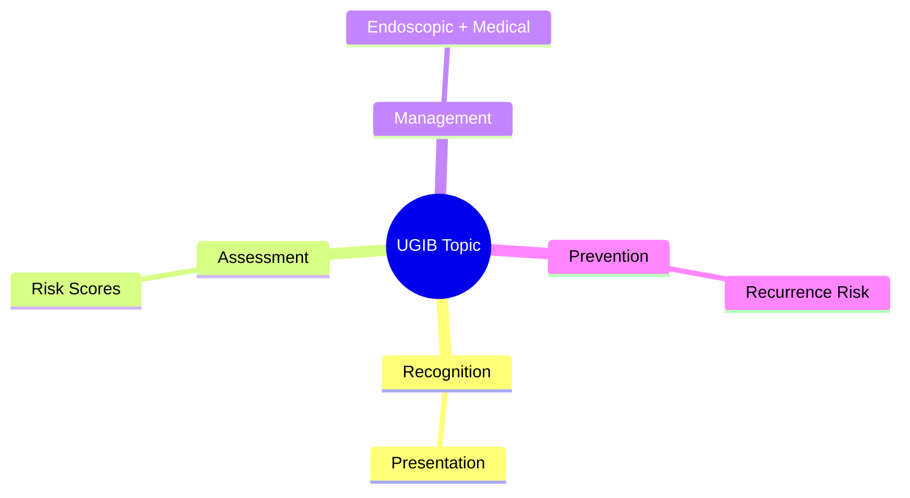
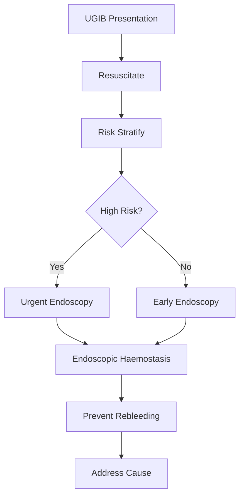

## Learning Objectives
- Recognize the clinical presentation and urgency of this UGIB scenario
- Apply the appropriate risk stratification and investigation strategy
- Outline the endoscopic and medical management principles
- Identify when escalation or specialist referral is required
- Understand the prevention and long-term management# Endoscopic haemostasis methods

Related: [[../Gastroenterology MOC|Gastroenterology MOC]] · [[../Upper Gastrointestinal Bleeding|Upper Gastrointestinal Bleeding]] · [[Endoscopic and post-endoscopic care|Endoscopic and post-endoscopic care]]

## Aim
Endoscopic haemostasis stops active bleeding, prevents rebleeding, and reduces surgery or radiological rescue in upper GI bleeding.

## Main methods
### Injection therapy
- Dilute adrenaline/epinephrine causes tamponade and vasoconstriction.
- Often used as an adjunct, not the sole definitive therapy for high-risk ulcer stigmata.

### Mechanical therapy
- Clips physically close or compress the bleeding point.
- Very useful for visible vessels, focal tears, and some Dieulafoy-type lesions.

### Thermal therapy
- Contact or non-contact coagulation achieves vessel sealing.
- Requires expertise to avoid deep injury.

### Combination therapy
Using adrenaline plus clip or thermal treatment is commonly more effective than adrenaline alone in focal high-risk lesions.

## Lesion-specific thinking
- **Peptic ulcer with visible vessel/active spurting**: combination or definitive focal therapy.
- **Mallory-Weiss tear**: clips, injection, or thermal if actively bleeding.
- **Diffuse erosive oozing**: sometimes little focal target; medical therapy still important.
- **Varices**: band ligation rather than non-variceal techniques.

## Indications
- Active bleeding seen at endoscopy
- Non-bleeding visible vessel or high-risk stigmata
- Lesion judged likely to rebleed without therapy

## Contraindications / limitations
- Haemodynamic collapse not yet stabilized
- Poor visualization due to massive blood burden until suction/wash/prokinetics/airway management optimized
- Lesion inaccessible or unsuitable: may need IR or surgery

## After haemostasis
- Continue acid suppression for peptic ulcer bleeding
- Monitor for rebleeding: fresh haematemesis, melaena, tachycardia, Hb fall
- Escalate to repeat endoscopy, interventional radiology, or surgery if endoscopic control fails

## Viva pearls
- Adrenaline alone is often **temporary**, not always definitive.
- Endoscopic method depends on **lesion type**.
- A successful procedure still requires **post-endoscopy observation and prevention strategy**.

## Complications
- Perforation
- Rebleeding
- Procedure-related aspiration/sedation risk
- Thermal injury or clip maldeployment

## One-page summary
Endoscopic haemostasis in UGIB uses **injection, mechanical, thermal, or combination therapy**. Choose the method according to lesion type. For ulcers, definitive focal treatment is preferred over adrenaline alone. Failure of endoscopic control requires escalation to IR or surgery.

## MCQs (10)
1. Adrenaline injection acts mainly by? **Tamponade/vasoconstriction**.
2. Best focal mechanical method? **Clip**.
3. Adrenaline alone is often? **Insufficient as definitive therapy**.
4. Variceal haemostasis standard? **Band ligation**.
5. Thermal therapy risk? **Deep tissue injury/perforation**.
6. High-risk ulcer stigma should usually get? **Definitive haemostasis**.
7. Main post-procedure concern? **Rebleeding**.
8. Failed endoscopic haemostasis may require? **IR or surgery**.
9. Diffuse erosive bleeding may have what problem? **No clear focal target**.
10. Endoscopic choice depends primarily on? **Lesion type**.

## SBA Questions (10)
1. Active spurting duodenal ulcer: best principle? **Definitive endoscopic haemostasis**.
2. Visible vessel after injection alone still seen: next step? **Add clip/thermal therapy**.
3. Suspected variceal source: non-variceal clip strategy replaced by? **Band ligation**.
4. Rebleeding after initial endoscopic control: next management? **Reassess and consider repeat endoscopy**.
5. Main limitation to haemostasis in exsanguinating patient? **Poor visualization and instability**.
6. Erosive diffuse oozing without focal point: helpful co-therapy? **Medical acid suppression and trigger treatment**.
7. Clip therapy is best described as? **Mechanical haemostasis**.
8. Common exam trap? **Calling adrenaline alone definitive for all ulcers**.
9. Failed second endoscopy should prompt? **Escalation to IR/surgery**.
10. Sedation-related airway problems are an example of? **Procedure complication**.

## Flashcards
- Q: Four broad haemostasis modes?  
  A: Injection, mechanical, thermal, combination.
- Q: Why is adrenaline alone often not enough?  
  A: It may only give temporary control.
- Q: Standard endoscopic therapy for varices?  
  A: Band ligation.
- Q: What follows failed endoscopic control?  
  A: IR or surgery.
- Q: Post-haemostasis key risk?  
  A: Rebleeding.

## Answer key with explanations
The key exam distinction is that endoscopic haemostasis is **lesion-specific**. For focal ulcer bleeding, **definitive therapy** with clips and/or thermal methods is stronger than injection alone. Variceal bleeding uses a different endoscopic strategy.

## Mind Map

## Flowchart

## Must Know / Should Know / Nice to Know
### Must Know
- Resuscitation before endoscopy
- Rockall/Glasgow-Blatchford scores for risk
- Endoscopic haemostasis for high-risk stigmata
- PPI for non-variceal; vasoactives for variceal
- Restrictive transfusion (Hb <70-80)

### Should Know
- Timing: <24h for high-risk
- Antithrombotic management
- Rebleeding prediction

### Nice to Know
- Novel haemostatic agents
- Early enteral nutrition
- Transfusion threshold debates

## Self-Test Scorecard
- Can I state the resuscitation priorities? /10
- Can I apply Rockall/B modified? /10
- Can I list high-risk endoscopic stigmata? /10
- Can I outline the antithrombotic plan? /10

**Interpretation:**
- **<35/40** = weak topic
- **35-36/40** = acceptable but insecure
- **37+/40** = exam-ready

## Revision Prompts
- What is the first priority in UGIB?
- Which risk score do you use and why?
- When is urgent endoscopy indicated?
- How do you manage antithrombotics?

## Answer Key with Explanations

