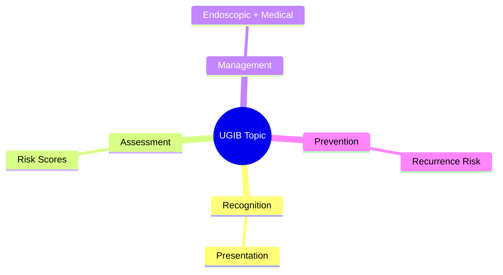
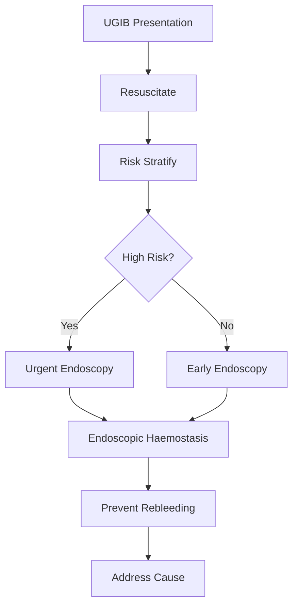

## Learning Objectives
- Recognize the clinical presentation and urgency of this UGIB scenario
- Apply the appropriate risk stratification and investigation strategy
- Outline the endoscopic and medical management principles
- Identify when escalation or specialist referral is required
- Understand the prevention and long-term management# Mallory-Weiss tear

Related: [[../Gastroenterology MOC|Gastroenterology MOC]] · [[../Upper Gastrointestinal Bleeding|Upper Gastrointestinal Bleeding]] · [[Non-variceal bleeding syndromes|Non-variceal bleeding syndromes]]

## Definition
Mallory-Weiss tear is a longitudinal mucosal laceration, usually at the gastro-oesophageal junction, caused by forceful retching, vomiting, or sudden rise in intra-abdominal pressure.

## Pathophysiology
Repeated retching generates abrupt transmural pressure changes against a closed glottis, splitting vulnerable mucosa at the cardia/GE junction. The lesion is usually mucosal rather than full-thickness.

## Typical clinical pattern
- History of repeated vomiting/retching followed by haematemesis
- Alcohol binge or acute gastritis may precede it
- May follow coughing, seizures, labour, or heavy lifting
- Usually self-limited but can occasionally bleed significantly

## Distinguishing points
| Feature | Mallory-Weiss tear | Boerhaave syndrome |
|---|---|---|
| Depth | Mucosal tear | Full-thickness perforation |
| Main issue | Bleeding | Mediastinal contamination/sepsis |
| Presentation | Haematemesis after retching | Severe chest pain, shock, surgical emergency |

## Investigations
- FBC, urea/creatinine, group and save
- Endoscopy confirms diagnosis and excludes ulcer/varices
- If perforation is suspected because of severe chest pain, subcutaneous emphysema, or sepsis, investigate urgently for Boerhaave instead of assuming simple tear

## Management
1. Resuscitate if needed.
2. Most cases settle with supportive care and PPI.
3. Endoscopic haemostasis if bleeding is active or significant.
4. Treat the trigger: antiemetics, alcohol withdrawal care, gastritis management.

## Endoscopic therapy options
- Injection therapy
- Clips
- Thermal therapy depending on lesion and expertise

## Prognosis
Usually excellent. Rebleeding risk is lower than many peptic ulcer bleeds if the tear is small and the provoking event resolves.

## Red flags
- Ongoing haemodynamic instability
- Large-volume haematemesis
- Suspicion of oesophageal perforation
- Underlying portal hypertension or coagulopathy

## FCPS/MRCP pearls
- Classic vignette: **retching followed by haematemesis**.
- Do not confuse with peptic ulcer bleed or Boerhaave syndrome.
- Many cases are **self-limiting**, but severe bleeding can still occur.

## One-page summary
Mallory-Weiss tear = mucosal laceration at the GE junction after forceful vomiting/retching. Presents with haematemesis, is diagnosed by endoscopy, and is often treated supportively, with endoscopic haemostasis only when bleeding persists or is significant.

## MCQs (10)
1. Classical trigger? **Retching/vomiting**.
2. Usual site? **Gastro-oesophageal junction**.
3. Lesion depth? **Mucosal**.
4. Main symptom? **Haematemesis**.
5. Surgical emergency look-alike? **Boerhaave syndrome**.
6. Best diagnostic test? **Upper GI endoscopy**.
7. Many cases stop spontaneously? **Yes**.
8. Alcohol binge is a common association? **Yes**.
9. Full-thickness rupture occurs in Mallory-Weiss? **No**.
10. Ongoing active bleed requires? **Endoscopic haemostasis**.

## SBA Questions (10)
1. After repeated vomiting, a patient develops small-volume haematemesis and is stable: likely diagnosis? **Mallory-Weiss tear**.
2. Retching followed by chest pain, fever, and shock: alternative diagnosis? **Boerhaave syndrome**.
3. Best test to confirm bleeding tear? **Upper endoscopy**.
4. Stable patient with resolved bleed: initial treatment? **Supportive care and acid suppression**.
5. Continuing bleed from visible tear: next step? **Endoscopic therapy**.
6. Lesion most commonly lies where? **GE junction/cardia**.
7. Why not diagnose clinically only? **Need to exclude other important causes of UGIB**.
8. Common precipitant besides vomiting? **Alcohol excess**.
9. The prognosis is usually? **Good**.
10. Which feature suggests more than a simple tear? **Severe chest pain with systemic toxicity**.

## Flashcards
- Q: Classic sequence in Mallory-Weiss tear?  
  A: Retching followed by haematemesis.
- Q: Typical site?  
  A: Gastro-oesophageal junction.
- Q: Mucosal or transmural?  
  A: Mucosal.
- Q: Key dangerous differential?  
  A: Boerhaave syndrome.
- Q: Many cases need only?  
  A: Supportive care.

## Answer key with explanations
The hallmark is haematemesis after retching. Endoscopy confirms the lesion and excludes other causes. Severe chest pain or sepsis after vomiting must raise concern for **perforation**, not a simple mucosal tear.

## Mind Map

## Flowchart

## Must Know / Should Know / Nice to Know
### Must Know
- Resuscitation before endoscopy
- Rockall/Glasgow-Blatchford scores for risk
- Endoscopic haemostasis for high-risk stigmata
- PPI for non-variceal; vasoactives for variceal
- Restrictive transfusion (Hb <70-80)

### Should Know
- Timing: <24h for high-risk
- Antithrombotic management
- Rebleeding prediction

### Nice to Know
- Novel haemostatic agents
- Early enteral nutrition
- Transfusion threshold debates

## Self-Test Scorecard
- Can I state the resuscitation priorities? /10
- Can I apply Rockall/B modified? /10
- Can I list high-risk endoscopic stigmata? /10
- Can I outline the antithrombotic plan? /10

**Interpretation:**
- **<35/40** = weak topic
- **35-36/40** = acceptable but insecure
- **37+/40** = exam-ready

## Revision Prompts
- What is the first priority in UGIB?
- Which risk score do you use and why?
- When is urgent endoscopy indicated?
- How do you manage antithrombotics?

## Answer Key with Explanations

