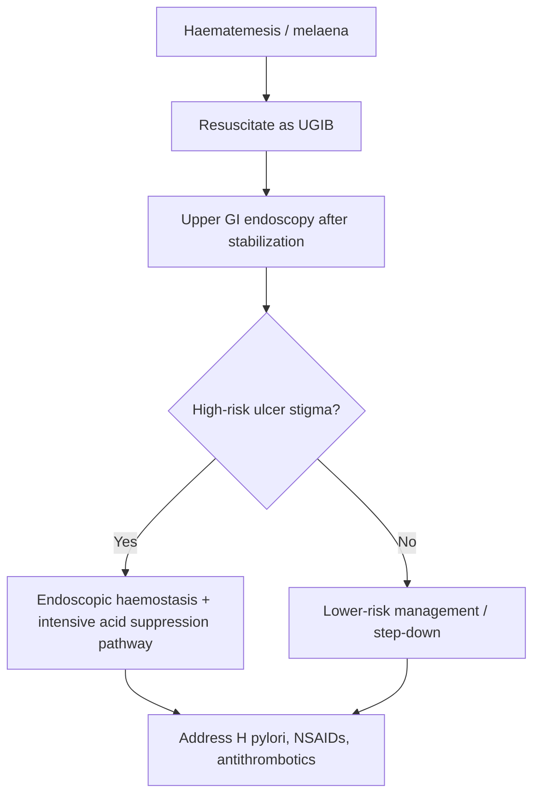
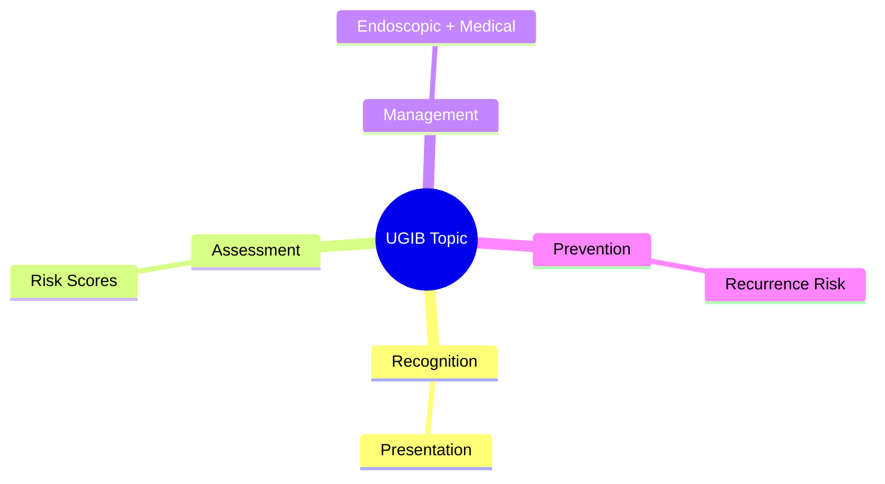
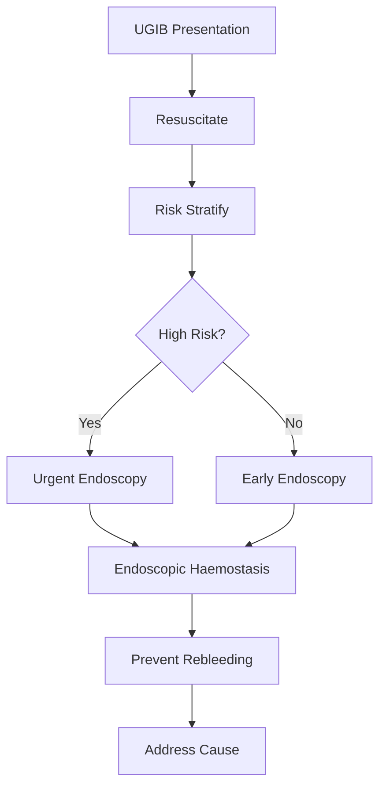

# Peptic ulcer bleeding

Related: [[../Gastroenterology MOC|Gastroenterology MOC]] · [[../Upper Gastrointestinal Bleeding|Upper Gastrointestinal Bleeding]] · [[Upper GI bleeding resuscitation priorities]] · [[Risk stratification scores in upper GI bleeding]] · [[Restrictive transfusion and coagulopathy reversal]] · [[../Stomach and Duodenal Disorders/Duodenal ulcer disease|Duodenal ulcer disease]]

> [!danger]
> Peptic ulcer bleeding is the **commonest major cause of non-variceal upper GI bleeding**. In exams, always state: **resuscitate first, endoscopy after stabilization, endoscopic haemostasis when indicated, then prevent rebleeding**.

## Learning Objectives
- Define peptic ulcer bleeding and relate it to non-variceal UGIB.
- Recognize bleeding severity and high-risk stigmata.
- Use investigation and endoscopy logic appropriately.
- Outline acute management, haemostatic therapy, and secondary prevention.

## Definition
Peptic ulcer bleeding is haemorrhage from a gastric or duodenal ulcer due to erosion into a submucosal or larger vessel, presenting as **haematemesis, melaena, or both**.

## Anatomy
- bleeding arises from gastric or duodenal ulcer beds
- duodenal ulcers may erode posterior vessels and bleed briskly
- gastric ulcers can also bleed significantly, especially with visible-vessel lesions

## Physiology / Pathophysiology
- acid-peptic injury disrupts mucosal integrity
- vessel erosion leads to acute blood loss
- risk is increased by **H. pylori**, NSAIDs, antiplatelets, anticoagulants, and severe ulcer stigmata
- rebleeding risk depends heavily on endoscopic appearance

## Classification
### Clinical
- minor/self-limited bleed
- significant UGIB with haemodynamic compromise
- recurrent or refractory bleed

### Endoscopic risk logic
High-risk ulcer stigmata include:
- active spurting bleeding
- active oozing bleeding
- non-bleeding visible vessel
- adherent clot in some cases

Low-risk stigmata:
- clean base
- flat pigmented spot

## Etiology / Risk Factors
- [[../Stomach and Duodenal Disorders/Helicobacter pylori infection|H. pylori infection]]
- NSAID use
- antiplatelet therapy
- anticoagulants
- prior ulcer disease
- smoking
- older age / comorbidity

## Clinical Features
- haematemesis
- coffee-ground vomiting
- melaena
- dizziness / syncope
- epigastric pain may be absent or present
- shock if severe

## Red Flags / Severity Clues
- hypotension
- tachycardia
- oliguria
- recurrent haematemesis
- large melaena burden
- low perfusion / altered consciousness
- significant anaemia or rising urea pattern in UGIB context

## Investigations
### Initial
- CBC
- U&E
- coagulation profile
- group and crossmatch
- lactate / VBG if shocked

### Definitive investigation
- **upper GI endoscopy** after resuscitation and stabilization

### Endoscopy goals
- identify ulcer site
- classify bleeding stigma
- deliver haemostatic therapy
- estimate rebleeding risk

## Interpretation Framework
### Practical ulcer-bleed logic
1. Treat as UGIB emergency.
2. Resuscitate first.
3. Endoscope once stabilized.
4. High-risk ulcer stigma → endoscopic haemostasis + high-dose acid suppression pathway.
5. Low-risk stigma → lower rebleeding risk; earlier step-down/discharge logic may apply.
6. After control, address cause: **H. pylori**, NSAIDs, antithrombotics.

## Diagnosis
Diagnosis is made by:
- clinical UGIB syndrome
- upper GI endoscopic confirmation of bleeding peptic ulcer

## Differential Diagnosis
- variceal bleed
- Mallory-Weiss tear
- erosive gastritis/duodenitis bleed
- malignancy-related bleeding
- swallowed blood / haemoptysis mimic

## Management
### Immediate priorities
- ABC resuscitation
- large-bore IV access
- bloods + crossmatch
- transfuse appropriately
- nil by mouth

### Pre-endoscopic care
- IV PPI strategy is commonly used in non-variceal UGIB pathways
- correct major coagulopathy / anticoagulant effect when needed

### Endoscopic haemostasis
Common methods include combination approaches such as:
- adrenaline injection (adjunct)
- thermal therapy
- clips

### Post-endoscopic care
- continue acid suppression according to risk/endoscopic finding
- monitor for rebleeding
- restart/withhold antithrombotics with risk-balanced planning
- test for and eradicate **H. pylori** if present
- stop NSAIDs if possible

### Rebleeding / failure
- repeat endoscopy may be required
- radiologic or surgical salvage in refractory cases

## Complications
- shock
- recurrent bleeding
- transfusion need
- myocardial/renal complications from hypoperfusion
- death in severe cases

## One-Page Summary
- Peptic ulcer bleeding is a leading cause of **non-variceal UGIB**.
- Resuscitation comes first.
- Endoscopy confirms source and gives haemostasis.
- **Active bleed / visible vessel** = high rebleeding risk.
- After control, prevent recurrence: **eradicate H. pylori**, avoid NSAIDs, optimize antithrombotic plan, use acid suppression.

## FCPS/MRCP High-Yield Points
- Non-variceal UGIB commonly = peptic ulcer.
- High-risk endoscopic stigma predicts rebleeding.
- Endoscopic therapy + PPI strategy reduces rebleeding.
- Always mention H. pylori eradication and NSAID review.

## Common Viva Traps
- Talking about diagnosis before resuscitation.
- Forgetting secondary prevention.
- Not distinguishing high-risk vs low-risk ulcer stigmata.

## Mind Map
- Peptic ulcer bleeding
  - emergency UGIB
  - resuscitation
  - endoscopy
  - high-risk stigma
  - haemostasis
  - rebleeding prevention

## Flowchart

## Revision Prompts
- What are the high-risk endoscopic stigmata in peptic ulcer bleeding?
- What are the pillars of management?
- How do you prevent rebleeding?
- Which causes must be corrected after haemostasis?

## MCQs (10)
1. The commonest major cause of non-variceal UGIB is:
A. Peptic ulcer bleeding
B. Coeliac disease
C. Haemorrhoids
D. Ulcerative colitis

2. The key first principle is:
A. Immediate colonoscopy
B. Resuscitation before definitive therapy
C. Oral feeding
D. Stool culture

3. Which endoscopic feature predicts high rebleeding risk?
A. Clean ulcer base
B. Active spurting vessel
C. Flat pigmented spot only
D. Normal duodenum

4. A major secondary prevention step is:
A. Ignore ulcer cause
B. H. pylori eradication if present
C. Start NSAID
D. Stop all follow-up

5. Which of the following is high risk?
A. Non-bleeding visible vessel
B. Clean-based ulcer
C. Simple dyspepsia
D. Normal stool color

6. Main definitive investigation is:
A. Upper GI endoscopy
B. Sigmoidoscopy
C. Echocardiography
D. EEG

7. Which drug exposure is important in causation?
A. NSAIDs
B. Levothyroxine only
C. Saline only
D. Vitamin C only

8. Refractory bleeding after endoscopy may require:
A. No further action ever
B. Repeat endoscopy / radiologic or surgical salvage
C. Eye examination only
D. Dialysis only

9. Which statement is correct?
A. Peptic ulcer bleeding is variceal bleeding
B. Endoscopic haemostasis has no role
C. Rebleeding risk depends on ulcer stigmata
D. H. pylori is irrelevant

10. A low-risk ulcer stigma is:
A. Clean base
B. Active oozing
C. Visible vessel
D. Spurting artery

## SBA Questions (10)
1. A 58-year-old man presents with melaena and haematemesis. Endoscopy shows a duodenal ulcer with visible vessel. Best statement?
A. This is low risk
B. This is high risk for rebleeding and needs endoscopic haemostasis pathway
C. Discharge immediately
D. No acid suppression needed

2. A patient with peptic ulcer bleed is stabilized. Best next definitive step?
A. Upper GI endoscopy
B. Colonoscopy first
C. Gluten-free diet
D. No investigation

3. A patient has peptic ulcer bleed and H. pylori is positive. Long-term key step?
A. Eradicate H. pylori
B. Ignore the result
C. Start aspirin permanently without review
D. Give laxatives only

4. Which finding is least concerning for rebleeding?
A. Clean ulcer base
B. Active spurting
C. Active oozing
D. Visible vessel

5. A man continues NSAIDs after ulcer bleed. This mainly increases risk of:
A. Recurrence/rebleeding
B. Cure
C. Stroke rehabilitation need only
D. Coeliac disease

6. Which approach is most correct?
A. Diagnose first, resuscitate later
B. Resuscitate, then endoscopy and haemostasis
C. Avoid endoscopy always
D. Use antibiotics only

7. A patient rebleeds after initial endoscopic control. Best principle?
A. Repeat evaluation and haemostatic strategy is often needed
B. Nothing more can be done
C. Hemorrhoids are likely cause
D. Only stool softeners help

8. Peptic ulcer bleeding belongs to:
A. Non-variceal UGIB
B. Lower GI bleeding only
C. Pancreatitis only
D. Functional bowel disease

9. Which factor should be reviewed after bleed control?
A. Antiplatelet/anticoagulant need
B. Hair style
C. Shoe brand
D. Handwriting

10. The main role of endoscopy here is:
A. Source diagnosis plus therapeutic haemostasis
B. Kidney biopsy
C. Pleural drainage
D. Cataract extraction

## Flashcards
- Q: What is the commonest major cause of non-variceal UGIB?  
  A: Peptic ulcer bleeding.
- Q: Name 3 high-risk ulcer stigmata.  
  A: Spurting bleed, oozing bleed, non-bleeding visible vessel.
- Q: What is the key first management principle?  
  A: Resuscitate before definitive endoscopic therapy.
- Q: Name 2 major recurrence-prevention steps.  
  A: Eradicate H. pylori and avoid NSAIDs.
- Q: What does a clean-based ulcer imply?  
  A: Low rebleeding risk.

## Answer Key with Explanations
### MCQs
1. **A** — this is the classic major non-variceal cause.
2. **B** — stabilization comes first.
3. **B** — active spurting is high risk.
4. **B** — eradication reduces recurrence.
5. **A** — a visible vessel is high risk.
6. **A** — endoscopy is the key definitive test.
7. **A** — NSAIDs are a major risk factor.
8. **B** — refractory bleed may need further intervention.
9. **C** — risk is strongly tied to endoscopic stigma.
10. **A** — clean base indicates low rebleeding risk.

### SBAs
1. **B** — visible vessel = high-risk lesion.
2. **A** — endoscopy confirms and treats.
3. **A** — H. pylori eradication is essential.
4. **A** — clean base is lowest risk.
5. **A** — NSAIDs increase recurrence/rebleeding.
6. **B** — correct acute sequence.
7. **A** — further haemostatic strategy is often required.
8. **A** — this is non-variceal UGIB.
9. **A** — antithrombotics must be reviewed carefully.
10. **A** — endoscopy both diagnoses and treats.

## Mind Map

## Flowchart

## Must Know / Should Know / Nice to Know
### Must Know
- Resuscitation before endoscopy
- Rockall/Glasgow-Blatchford scores for risk
- Endoscopic haemostasis for high-risk stigmata
- PPI for non-variceal; vasoactives for variceal
- Restrictive transfusion (Hb <70-80)

### Should Know
- Timing: <24h for high-risk
- Antithrombotic management
- Rebleeding prediction

### Nice to Know
- Novel haemostatic agents
- Early enteral nutrition
- Transfusion threshold debates

## Self-Test Scorecard
- Can I state the resuscitation priorities? /10
- Can I apply Rockall/B modified? /10
- Can I list high-risk endoscopic stigmata? /10
- Can I outline the antithrombotic plan? /10

**Interpretation:**
- **<35/40** = weak topic
- **35-36/40** = acceptable but insecure
- **37+/40** = exam-ready

## Revision Prompts
- What is the first priority in UGIB?
- Which risk score do you use and why?
- When is urgent endoscopy indicated?
- How do you manage antithrombotics?

## Answer Key with Explanations

