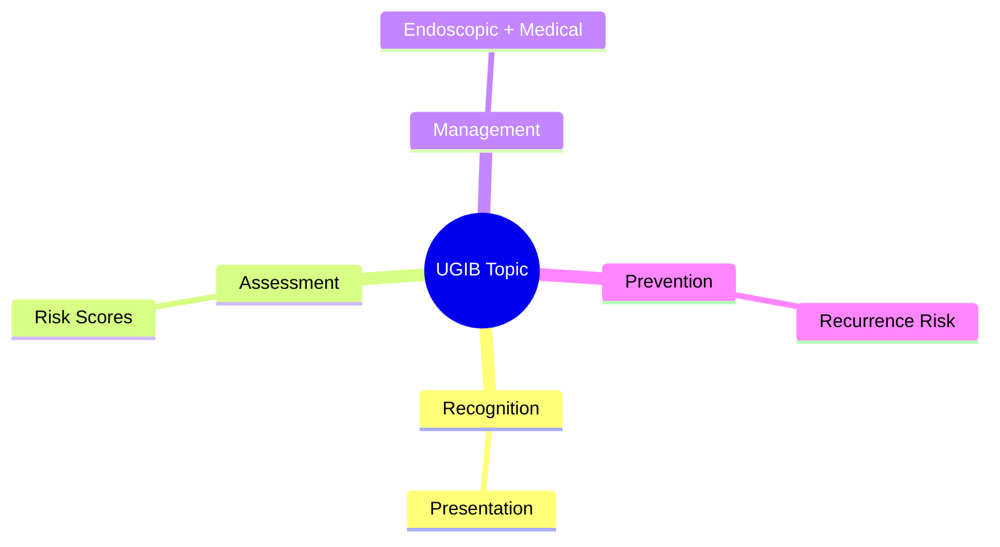
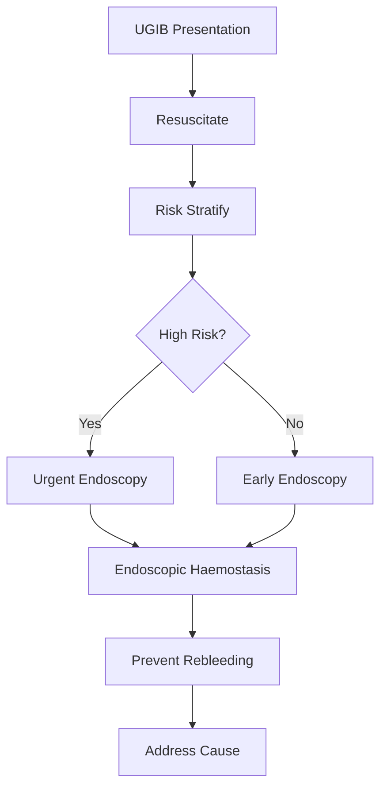

## Learning Objectives
- Recognize the clinical presentation and urgency of this UGIB scenario
- Apply the appropriate risk stratification and investigation strategy
- Outline the endoscopic and medical management principles
- Identify when escalation or specialist referral is required
- Understand the prevention and long-term management# Rebleeding prevention and PPI strategy

Related: [[../Gastroenterology MOC|Gastroenterology MOC]] · [[../Upper Gastrointestinal Bleeding|Upper Gastrointestinal Bleeding]] · [[Endoscopic and post-endoscopic care|Endoscopic and post-endoscopic care]]

## Core aim
After initial control of upper GI bleeding, management shifts to preventing early rebleeding and addressing the cause.

## PPI logic
Proton pump inhibitors stabilize clot formation by increasing intragastric pH and reducing acid-peptic dissolution of recently formed haemostatic plugs, especially in peptic ulcer bleeding.

## Practical use
- Start PPI when upper GI bleeding is suspected, especially if peptic ulcer is likely.
- After endoscopic therapy for high-risk ulcer stigmata, use high-intensity acid suppression according to protocol.
- Step down to oral therapy when stable and bleeding has settled.

## Rebleeding risk factors
- Active spurting/oozing ulcer or visible vessel
- Large ulcer size
- Posterior duodenal or lesser-curve gastric location
- Shock on presentation
- Ongoing NSAID/anticoagulant exposure
- Major comorbidity

## Prevention beyond PPI
- Eradicate *H. pylori* if present.
- Stop or minimize NSAIDs.
- Review antiplatelet/anticoagulant restart timing.
- Ensure definitive endoscopic therapy was adequate.
- Arrange secondary prevention in recurrent-risk patients.

## Monitoring for rebleeding
- Recurrent haematemesis
- Fresh melaena with tachycardia
- New hypotension
- Falling haemoglobin after initial stabilization

## What to do if rebleeding occurs
1. Resuscitate again.
2. Repeat blood tests/cross-match.
3. Repeat endoscopy in many patients.
4. Escalate to interventional radiology or surgery if endoscopic control fails.

## Special points
### Variceal bleeding
PPI is not the central disease-modifying therapy; vasoactive drugs, antibiotics, and band ligation are more important.

### Antithrombotic users
The best prevention strategy balances thrombotic risk against rebleeding. Blanket prolonged interruption is often unsafe.

## Exam traps
- Treating PPI as sufficient without haemostasis where haemostasis is needed.
- Forgetting *H. pylori* eradication.
- Applying peptic-ulcer PPI logic identically to all variceal bleeds.

## One-page summary
PPI reduces rebleeding risk mainly in **peptic ulcer bleeding**, especially after endoscopic therapy. Prevent rebleeding by combining acid suppression with lesion-specific haemostasis, *H. pylori* eradication, NSAID avoidance, and rational antithrombotic decisions.

## MCQs (10)
1. PPIs help by? **Raising gastric pH and stabilizing clot**.
2. Main condition where PPI strategy is most central? **Peptic ulcer bleeding**.
3. Rebleeding sign? **Fresh haematemesis after initial control**.
4. *H. pylori* management role? **Reduces recurrence**.
5. PPI alone replaces haemostasis in high-risk ulcer? **No**.
6. Variceal bleed central therapy is? **Banding/vasoactive therapy**, not PPI alone.
7. Major preventable drug contributor? **NSAIDs**.
8. Rebleeding after endoscopy often needs? **Repeat endoscopy**.
9. Falling Hb after stabilization suggests? **Possible rebleeding**.
10. Best prevention is? **Cause-specific secondary prevention**.

## SBA Questions (10)
1. Successful endoscopic treatment of high-risk duodenal ulcer: next medication principle? **High-intensity PPI regimen**.
2. Bleeding controlled but *H. pylori* positive: essential prevention step? **Eradication therapy**.
3. New tachycardia and melaena 12 h after haemostasis: concern? **Rebleeding**.
4. Chronic NSAID user with ulcer bleed: prevention? **Stop/minimize NSAID plus gastroprotection**.
5. Controlled variceal bleed: most important ongoing therapy besides supportive care? **Variceal-specific treatment**.
6. Recurrent haematemesis after initial endoscopy: best next step? **Repeat resuscitation and reassessment/endoscopy**.
7. PPI works best through what mechanism? **Clot stabilization in less acidic environment**.
8. Blanket indefinite cessation of anticoagulation is wrong because of? **Thrombotic risk**.
9. Which patient has higher rebleeding risk? **Shock plus large ulcer plus visible vessel**.
10. Best phrase for exams? **PPI is necessary adjunctive therapy, not a substitute for definitive haemostasis when indicated**.

## Flashcards
- Q: Main use of PPI after UGIB?  
  A: Reduce rebleeding in peptic ulcer bleeding.
- Q: What infection must be addressed?  
  A: *H. pylori*.
- Q: What clinical clue suggests rebleeding?  
  A: Recurrent haematemesis or Hb fall.
- Q: What drug group commonly needs stopping?  
  A: NSAIDs.
- Q: If rebleeding occurs after endoscopy, next step?  
  A: Repeat endoscopy/resuscitation.

## Answer key with explanations
PPI strategy is most important in **peptic ulcer bleeding** and works best when paired with effective haemostasis and cause control. Rebleeding prevention is therefore a **bundle**, not a single drug prescription.

## Mind Map

## Flowchart

## Must Know / Should Know / Nice to Know
### Must Know
- Resuscitation before endoscopy
- Rockall/Glasgow-Blatchford scores for risk
- Endoscopic haemostasis for high-risk stigmata
- PPI for non-variceal; vasoactives for variceal
- Restrictive transfusion (Hb <70-80)

### Should Know
- Timing: <24h for high-risk
- Antithrombotic management
- Rebleeding prediction

### Nice to Know
- Novel haemostatic agents
- Early enteral nutrition
- Transfusion threshold debates

## Self-Test Scorecard
- Can I state the resuscitation priorities? /10
- Can I apply Rockall/B modified? /10
- Can I list high-risk endoscopic stigmata? /10
- Can I outline the antithrombotic plan? /10

**Interpretation:**
- **<35/40** = weak topic
- **35-36/40** = acceptable but insecure
- **37+/40** = exam-ready

## Revision Prompts
- What is the first priority in UGIB?
- Which risk score do you use and why?
- When is urgent endoscopy indicated?
- How do you manage antithrombotics?

## Answer Key with Explanations

