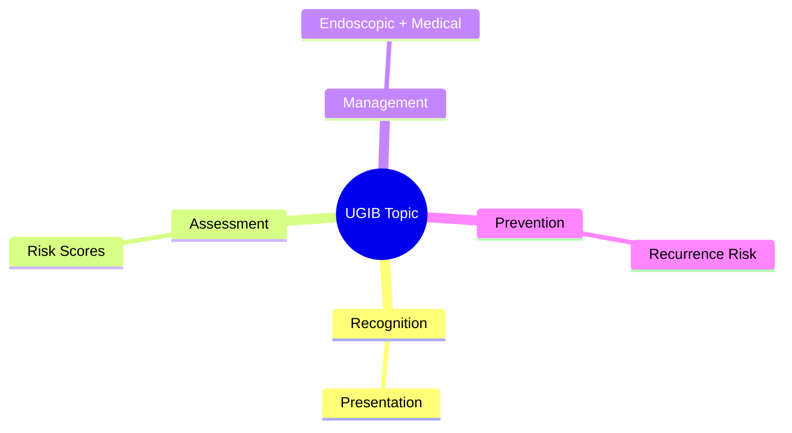
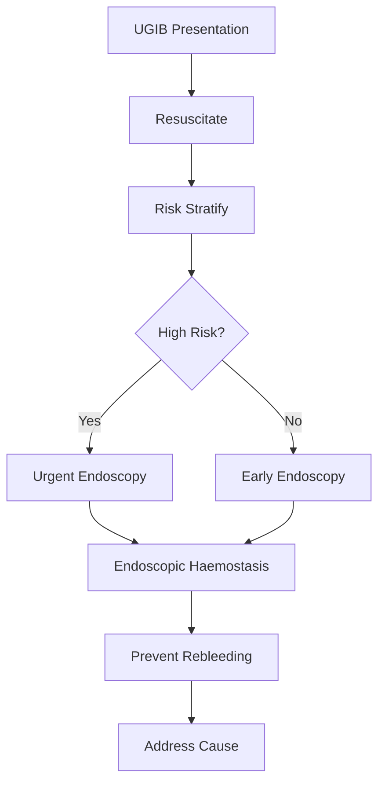

## Learning Objectives
- Recognize the clinical presentation and urgency of this UGIB scenario
- Apply the appropriate risk stratification and investigation strategy
- Outline the endoscopic and medical management principles
- Identify when escalation or specialist referral is required
- Understand the prevention and long-term management# Timing of endoscopy in upper GI bleeding

Related: [[../Gastroenterology MOC|Gastroenterology MOC]] · [[../Upper Gastrointestinal Bleeding|Upper Gastrointestinal Bleeding]] · [[Endoscopic and post-endoscopic care|Endoscopic and post-endoscopic care]]

## Core question
When should a patient with upper GI bleeding undergo endoscopy? The answer depends on **stability, severity, and suspected cause**, not on a single clock time alone.

## General principle
- Endoscopy should occur **after initial resuscitation**, not before ABC stabilization.
- Most admitted upper GI bleeding patients need endoscopy **within 24 hours**.
- Suspected variceal bleeding or uncontrolled severe bleeding needs **more urgent** endoscopy.

## Practical timing framework
### Immediate/very urgent
- Ongoing haemodynamic instability despite resuscitation
- Persistent haematemesis
- Suspected variceal bleeding after vasoactive/antibiotic initiation
- Need for airway-protected emergency endoscopy

### Early within 24 hours
- Most non-variceal upper GI bleeds after stabilization
- Melaena with falling Hb or high GBS
- Significant comorbidity needing diagnosis and haemostatic planning

### Not “rushed before resuscitation”
A shocked patient should first get IV access, fluids/blood, labs, and airway assessment. “Emergency endoscopy” without stabilization can worsen outcomes.

## Why timing matters
Early endoscopy confirms the source, permits haemostasis, guides risk stratification, and shortens hospital stay in appropriate patients. Delayed endoscopy risks missed therapeutic windows and recurrent bleeding.

## Variceal nuance
Suspected variceal bleed usually requires urgent endoscopy after starting resuscitation, vasoactive therapy, and antibiotics. Do not delay while waiting for perfect correction of every abnormal lab if the patient is actively bleeding.

## Pre-endoscopy preparation
- ABC and monitoring
- Cross-match/group and save
- Restrictive transfusion strategy where appropriate
- Consider intubation if major aspiration risk or encephalopathy
- Prokinetic therapy may be considered in selected cases to improve visualization

## Post-endoscopy consequences
Timing affects whether the lesion is seen clearly, whether haemostasis can be applied, and whether the patient can move to discharge versus monitored care.

## Exam traps
- “Every bleed needs immediate endoscopy.” False.
- “All can wait >24 hours if on PPI.” False.
- “Endoscopy timing is identical for variceal and low-risk coffee-ground emesis.” False.

## Red flags requiring expedited care
- Shock
- Active ongoing haematemesis
- Suspected varices
- Rapid Hb fall/transfusion need
- Severe comorbidity

## One-page summary
Most UGIB patients: **endoscopy within 24 hours after stabilization**. If there is ongoing severe bleed or suspected varices, perform **more urgent** endoscopy. Never let the clock overrule airway, circulation, and resuscitation.

## MCQs (10)
1. Standard timing for most admitted UGIB cases? **Within 24 h**.
2. First priority before endoscopy? **Resuscitation**.
3. Condition often needing more urgent endoscopy? **Suspected variceal bleed**.
4. Reason not to rush unstable patient straight to scope? **ABC compromise**.
5. Benefit of early endoscopy? **Diagnosis plus haemostasis**.
6. Coffee-ground emesis in stable low-risk patient may be less urgent than? **Shock with haematemesis**.
7. PPI alone does not justify? **Excessive delay**.
8. Aspiration-risk patient may need? **Airway protection**.
9. Timing decision depends on? **Severity and cause suspicion**.
10. Common exam-safe statement? **Within 24 h for most, sooner if severe/variceal**.

## SBA Questions (10)
1. Stable melaena, Hb drop, GBS high: timing? **Endoscopy within 24 h**.
2. Cirrhotic with haematemesis and hypotension: timing? **Urgent endoscopy after initial stabilization**.
3. Persisting active haematemesis in ED: next move? **Resuscitate and expedite endoscopy**.
4. Shocked patient with no IV access arriving in endoscopy suite: error? **Skipping stabilization**.
5. Main value of timely endoscopy? **Diagnosis, prognosis, and haemostasis**.
6. Very low-risk patient after review may not need? **Immediate emergency overnight endoscopy in all cases**.
7. Prokinetic before endoscopy may help by? **Improving visualization**.
8. Main timing principle in exams? **Urgent when severe, within 24 h for most**.
9. Low-risk stable patient can still need endoscopy because? **Diagnosis/source confirmation matters**.
10. A clock-only approach is wrong because? **Patient physiology matters more**.

## Flashcards
- Q: Standard timing for most UGIB admissions?  
  A: Within 24 hours after stabilization.
- Q: Who needs more urgent endoscopy?  
  A: Ongoing severe bleed or suspected varices.
- Q: What comes before endoscopy?  
  A: ABC resuscitation.
- Q: Why may intubation be needed?  
  A: Airway/aspiration protection.
- Q: Why not delay too long?  
  A: You may miss therapeutic haemostasis opportunities.

## Answer key with explanations
Timing in UGIB is a balance between **not scoping too early in an unstable unprepared patient** and **not delaying definitive diagnosis/haemostasis**. Most exam answers should state: **endoscopy within 24 hours for most patients, earlier if unstable or variceal bleeding is suspected**.

## Mind Map

## Flowchart

## Must Know / Should Know / Nice to Know
### Must Know
- Resuscitation before endoscopy
- Rockall/Glasgow-Blatchford scores for risk
- Endoscopic haemostasis for high-risk stigmata
- PPI for non-variceal; vasoactives for variceal
- Restrictive transfusion (Hb <70-80)

### Should Know
- Timing: <24h for high-risk
- Antithrombotic management
- Rebleeding prediction

### Nice to Know
- Novel haemostatic agents
- Early enteral nutrition
- Transfusion threshold debates

## Self-Test Scorecard
- Can I state the resuscitation priorities? /10
- Can I apply Rockall/B modified? /10
- Can I list high-risk endoscopic stigmata? /10
- Can I outline the antithrombotic plan? /10

**Interpretation:**
- **<35/40** = weak topic
- **35-36/40** = acceptable but insecure
- **37+/40** = exam-ready

## Revision Prompts
- What is the first priority in UGIB?
- Which risk score do you use and why?
- When is urgent endoscopy indicated?
- How do you manage antithrombotics?

## Answer Key with Explanations

