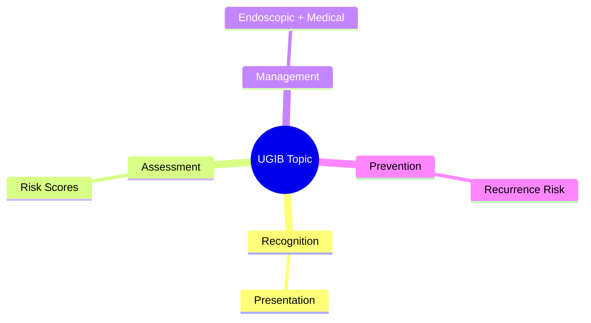
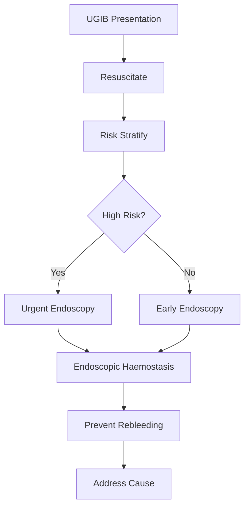

## Learning Objectives
- Recognize the clinical presentation and urgency of this UGIB scenario
- Apply the appropriate risk stratification and investigation strategy
- Outline the endoscopic and medical management principles
- Identify when escalation or specialist referral is required
- Understand the prevention and long-term management# Variceal vs non-variceal bleeding clue pattern

Related: [[../Gastroenterology MOC|Gastroenterology MOC]] · [[../Upper Gastrointestinal Bleeding|Upper Gastrointestinal Bleeding]] · [[Pattern recognition and special contexts|Pattern recognition and special contexts]]

## Why this matters
The early bedside distinction between variceal and non-variceal bleeding changes resuscitation priorities, drug therapy, endoscopic planning, and risk framing.

## Variceal clues
- Known cirrhosis or portal hypertension
- Previous variceal bleed or banding
- Stigmata of chronic liver disease
- Large-volume painless haematemesis
- Splenomegaly, ascites, thrombocytopenia
- Alcohol-related liver disease history

## Non-variceal clues
- NSAID/aspirin use
- Dyspepsia or prior ulcer disease
- Retching before bleed suggesting Mallory-Weiss tear
- Known malignancy or erosive disease
- Less obvious portal hypertension background

## Important caution
Variceal vs non-variceal is a **working pattern**, not a definitive diagnosis. Endoscopy confirms the source.

## Immediate management differences
| Feature | Variceal tendency | Non-variceal tendency |
|---|---|---|
| Early drugs | Vasoactive agent + antibiotics | PPI-centered early strategy |
| Endoscopic goal | Band ligation/injection depending lesion | Ulcer/tear haemostasis |
| Transfusion caution | Restrictive strategy especially important | Restrictive still preferred |

## Investigations and bedside hints
- LFT abnormality, INR prolongation, low platelets, low albumin may support liver disease.
- Raised urea supports upper GI source but not the subtype.
- Shock severity does not distinguish reliably.

## Differential traps
- Cirrhosis does not guarantee varices are the source.
- Portal hypertensive patient can still bleed from peptic ulcer.
- Non-variceal looking dyspeptic patient may still have unexpected varices if chronic liver disease was missed.

## Red flags
- Massive bleed with chronic liver disease features
- Encephalopathy/aspiration risk
- Severe coagulopathy
- Sepsis risk in cirrhosis

## Exam pearls
- In suspected variceal bleed, start **vasoactive therapy and antibiotics early**.
- Do not delay endoscopy waiting for perfect labs.
- Use endoscopy to confirm source and provide therapy.

## One-page summary
Variceal bleed is suggested by cirrhosis/portal hypertension clues and needs **vasoactive drugs, antibiotics, restrictive transfusion, and urgent endoscopy**. Non-variceal bleed is more often linked to ulcer disease, NSAIDs, erosive pathology, or tears, with **PPI-led early medical therapy** plus lesion-specific endoscopic haemostasis.

## MCQs (10)
1. Strong bedside clue to variceal bleed? **Cirrhosis**.
2. NSAID history favours? **Non-variceal bleed**.
3. Early antibiotic role is especially important in? **Variceal bleeding**.
4. Retching before haematemesis suggests? **Mallory-Weiss/non-variceal source**.
5. Definitive differentiation is by? **Endoscopy**.
6. Restrictive transfusion is especially emphasized in? **Variceal bleed**.
7. Portal hypertensive patient may still bleed from? **Peptic ulcer**.
8. Raised urea distinguishes upper from lower GI source, but not? **Variceal vs non-variceal**.
9. Early vasoactive drug use suggests suspicion of? **Variceal bleed**.
10. Common exam error? **Assuming all cirrhotics bleed from varices**.

## SBA Questions (10)
1. Haematemesis in a patient with ascites and splenomegaly: most likely initial pattern? **Variceal**.
2. Haematemesis after ibuprofen and epigastric pain: likely pattern? **Non-variceal**.
3. Cirrhotic with acute haematemesis in ED: early additional medication besides resuscitation? **Antibiotics and vasoactive therapy**.
4. Chronic liver disease but endoscopy shows duodenal ulcer: lesson? **Do not assume source without endoscopy**.
5. Which feature least helps distinguish subtype? **Degree of tachycardia alone**.
6. Main bedside purpose of this distinction? **Early targeted management before endoscopy**.
7. Prior band ligation points toward? **Variceal source**.
8. Prior retching, small tear at GE junction indicates? **Non-variceal source**.
9. Antibiotics are not routinely central in uncomplicated peptic ulcer bleed because? **They are mainly a variceal/cirrhosis-related adjunct**.
10. Best exam-safe phrase? **Use bedside clues for early treatment, but confirm with endoscopy**.

## Flashcards
- Q: Strongest context clue to variceal bleed?  
  A: Cirrhosis/portal hypertension.
- Q: Drug class often pointing to non-variceal ulcer bleed?  
  A: NSAIDs.
- Q: What drugs are started early in suspected variceal bleed?  
  A: Vasoactive agent and antibiotics.
- Q: What confirms the source?  
  A: Endoscopy.
- Q: Main trap?  
  A: Assuming cirrhosis means varices are always the source.

## Answer key with explanations
This is a **pattern-recognition** note. Bedside clues shape early therapy, but endoscopy remains the definitive differentiator. The exam favorite is the patient with cirrhosis, haematemesis, and urgent need for **antibiotics + vasoactive therapy** before confirmation.

## Mind Map

## Flowchart

## Must Know / Should Know / Nice to Know
### Must Know
- Resuscitation before endoscopy
- Rockall/Glasgow-Blatchford scores for risk
- Endoscopic haemostasis for high-risk stigmata
- PPI for non-variceal; vasoactives for variceal
- Restrictive transfusion (Hb <70-80)

### Should Know
- Timing: <24h for high-risk
- Antithrombotic management
- Rebleeding prediction

### Nice to Know
- Novel haemostatic agents
- Early enteral nutrition
- Transfusion threshold debates

## Self-Test Scorecard
- Can I state the resuscitation priorities? /10
- Can I apply Rockall/B modified? /10
- Can I list high-risk endoscopic stigmata? /10
- Can I outline the antithrombotic plan? /10

**Interpretation:**
- **<35/40** = weak topic
- **35-36/40** = acceptable but insecure
- **37+/40** = exam-ready

## Revision Prompts
- What is the first priority in UGIB?
- Which risk score do you use and why?
- When is urgent endoscopy indicated?
- How do you manage antithrombotics?

## Answer Key with Explanations

