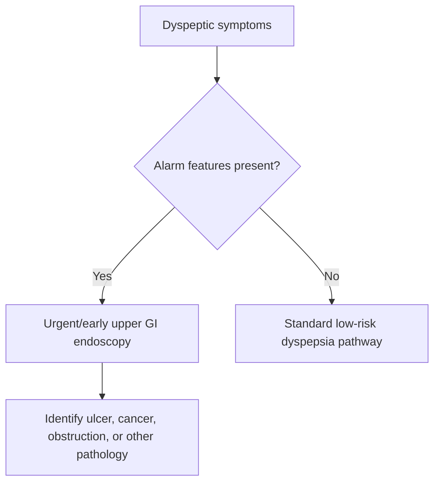

# Alarm features in dyspepsia and weight loss

Related: [[../Gastroenterology MOC|Gastroenterology MOC]] · [[../Symptom Patterns and Diagnostic Approach|Symptom Patterns and Diagnostic Approach]] · [[Dyspepsia approach]] · [[../Stomach and Duodenal Disorders/Functional dyspepsia|Functional dyspepsia]] · [[../Stomach and Duodenal Disorders/Duodenal ulcer disease|Duodenal ulcer disease]]

> [!warning]
> Dyspepsia becomes dangerous when it is accompanied by **alarm features**, especially **weight loss, anaemia, bleeding, persistent vomiting, dysphagia, or a mass**. These features push the case out of the simple empiric pathway and toward urgent investigation.

## 1. Learning Objectives
- List the major alarm features in dyspepsia.
- Explain why weight loss is a key red flag.
- Identify patients needing urgent endoscopy.
- Avoid common under-triage mistakes.

## 2. Definition / Scope
This note focuses on the red-flag triage of dyspeptic presentations, especially when associated with weight loss or suspicion of serious upper GI pathology.

## 3. Why Weight Loss Matters
Weight loss in dyspepsia suggests one or more of:
- upper GI malignancy
- gastric outlet obstruction
- severe ulcer disease
- chronic inflammation or systemic illness
- reduced intake from early satiety, pain, nausea, or obstruction

## 4. Major Alarm Features
- Unintentional weight loss
- Progressive dysphagia
- Persistent vomiting
- Haematemesis, melaena, or iron-deficiency anaemia
- Palpable abdominal mass
- Older patient with new or changing persistent symptoms
- Family history suggesting upper GI malignancy risk

## 5. Clinical Assessment
### Key history
- Amount and tempo of weight loss
- Appetite loss versus fear of eating
- Early satiety
- Vomiting and postprandial fullness
- Dysphagia or odynophagia
- GI bleeding symptoms
- NSAID use
- Constitutional symptoms

### Focused examination
- Cachexia
- Pallor
- Dehydration
- Epigastric fullness or mass
- Virchow-type advanced disease clues if obvious

## 6. Differential Diagnosis Behind the Red Flags
- Gastric cancer
- Oesophageal cancer
- Peptic ulcer disease with complication
- Gastric outlet obstruction
- Severe reflux/stricture overlap if dysphagia dominates
- Pancreatic or extra-gastric disease mimicking dyspepsia

## 7. Investigations
### Priority investigation
- **Upper GI endoscopy** is the key test when alarm features are present.

### Supporting tests
- CBC for anaemia
- U&E if vomiting/dehydration
- LFTs and other tests if alternative pathology is suspected
- CT or staging tests after endoscopic diagnosis when malignancy is found

## 8. Interpretation Framework
### Red-flag dyspepsia algorithm
1. Confirm dyspeptic symptom pattern.
2. Look actively for alarm features.
3. If any major red flag is present, lower threshold for urgent endoscopy.
4. Stabilize dehydration/bleeding if needed.
5. Do not mislabel the case as functional before exclusion of serious pathology.

## 9. Management Principles
- Escalate early to endoscopy.
- Correct dehydration and electrolyte abnormalities when vomiting is significant.
- Stop NSAIDs/aspirin if contributory and safe to do so.
- Arrange malignancy pathway if endoscopy suggests cancer.

## 10. What Not to Miss
- New dyspepsia plus weight loss in older adults
- Iron-deficiency anaemia with upper GI symptoms
- Progressive vomiting suggesting outlet obstruction
- Progressive dysphagia suggesting oesophageal or proximal gastric pathology

## 11. FCPS/MRCP High-Yield Points
- Weight loss is an exam-favorite trigger for urgent endoscopy in dyspepsia.
- “Alarm features” are not a decorative list; they directly change management.
- Persistent vomiting may signal obstruction, not just benign gastritis.

## 12. Common Viva Traps
- Treating all dyspepsia with PPIs before checking for red flags.
- Dismissing weight loss as “poor appetite” without urgent evaluation.
- Forgetting anaemia as a hidden bleed clue.

## 13. One-Page Summary
- Dyspepsia + **weight loss** is high risk until proven otherwise.
- Other major alarm features: **dysphagia, vomiting, bleeding, anaemia, mass, older age with new symptoms**.
- Main action: **urgent or early upper GI endoscopy**.
- Do not label as functional dyspepsia before excluding dangerous pathology.

## 14. Mind Map
- Alarm dyspepsia
  - weight loss
  - dysphagia
  - vomiting
  - GI bleed / anaemia
  - mass
  - urgent endoscopy

## 15. Flowchart

## 16. Revision Prompts
- Name 6 alarm features in dyspepsia.
- Why is weight loss especially important?
- What investigation is prioritized?
- Why is persistent vomiting a red flag?

## 17. MCQs (10)
1. The most important investigation for dyspepsia with alarm features is:
   - A. Upper GI endoscopy
   - B. Stool softener trial
   - C. Spirometry
   - D. EEG
   - **Answer: A**
2. Weight loss in dyspepsia should raise concern for:
   - A. Serious organic pathology including malignancy
   - B. Guaranteed IBS
   - C. Migraine
   - D. Asthma
   - **Answer: A**
3. Which is an alarm feature?
   - A. Progressive dysphagia
   - B. Isolated hiccups once
   - C. Mild dandruff
   - D. Sneezing
   - **Answer: A**
4. Persistent vomiting may indicate:
   - A. Gastric outlet obstruction or serious disease
   - B. Only healthy appetite
   - C. Pure dermatologic disease
   - D. Hyperopia
   - **Answer: A**
5. Iron-deficiency anaemia in dyspepsia is important because it may indicate:
   - A. GI blood loss
   - B. Eczema only
   - C. Vertigo only
   - D. Tendon rupture
   - **Answer: A**
6. Functional dyspepsia should be diagnosed:
   - A. After serious pathology is reasonably excluded
   - B. Before taking history
   - C. In all older patients automatically
   - D. When weight loss is present
   - **Answer: A**
7. A palpable epigastric mass is:
   - A. A red flag
   - B. Reassuring
   - C. Irrelevant
   - D. Typical of IBS
   - **Answer: A**
8. New dyspepsia in an older person should:
   - A. Lower threshold for endoscopy
   - B. Always be ignored
   - C. Be called functional immediately
   - D. Be treated only with antacids forever
   - **Answer: A**
9. Which symptom pair is most alarming?
   - A. Weight loss and progressive dysphagia
   - B. Mild flatus and thirst
   - C. Dry skin and rhinitis
   - D. Hair loss and itching
   - **Answer: A**
10. Main exam principle?
   - A. Alarm features change the management pathway
   - B. Alarm features never matter
   - C. All dyspepsia is benign
   - D. Weight loss is unrelated
   - **Answer: A**

## 18. SBA Questions (10)
1. A 66-year-old man has 3 months of dyspepsia, early satiety, and 7-kg weight loss. Best next step?
   - A. Upper GI endoscopy
   - B. Reassurance only
   - C. High-fibre diet alone
   - D. Colonoscopy first for all cases
   - **Answer: A**
2. A 52-year-old woman reports epigastric discomfort and recurrent vomiting with inability to keep meals down. What must be considered?
   - A. Obstructive or serious organic pathology
   - B. Simple functional bowel disease only
   - C. Primary nephrotic syndrome
   - D. Otitis media
   - **Answer: A**
3. Which hidden clue may represent upper GI bleeding?
   - A. Iron-deficiency anaemia
   - B. Hyperreflexia
   - C. Polyuria
   - D. Diplopia
   - **Answer: A**
4. Which finding most strongly pushes dyspepsia out of the low-risk pathway?
   - A. Progressive dysphagia
   - B. Stable appetite
   - C. Mild abdominal noise
   - D. Intermittent yawning
   - **Answer: A**
5. Best explanation for concern with weight loss?
   - A. It may signal malignancy, obstruction, or severe ulcer disease
   - B. It proves IBS
   - C. It excludes cancer
   - D. It means only anxiety
   - **Answer: A**
6. A dangerous error is to:
   - A. Call red-flag dyspepsia functional without investigation
   - B. Arrange endoscopy
   - C. Check CBC
   - D. Assess hydration
   - **Answer: A**
7. Which patient is highest risk?
   - A. Older patient with new persistent dyspepsia and anaemia
   - B. Teenager with one spicy meal and transient fullness
   - C. Person with isolated hiccups
   - D. Person with mild constipation only
   - **Answer: A**
8. If endoscopy finds a tumour, the next principle is:
   - A. Specialist staging and cancer pathway
   - B. Ignore the finding
   - C. Treat as IBS
   - D. Start laxatives only
   - **Answer: A**
9. What is the key practical role of alarm features?
   - A. Triage for urgent investigation
   - B. Cosmetic documentation only
   - C. Differentiating asthma from COPD
   - D. Screening kidney stones
   - **Answer: A**
10. Which statement is correct?
   - A. Weight loss in dyspepsia should never be minimized
   - B. Weight loss always means functional dyspepsia
   - C. Dysphagia is not relevant
   - D. Vomiting is always benign
   - **Answer: A**

## 19. Flashcards
- Q: Name 4 alarm features in dyspepsia.
  A: Weight loss, dysphagia, persistent vomiting, GI bleed/anaemia.
- Q: What is the key investigation for red-flag dyspepsia?
  A: Upper GI endoscopy.
- Q: Why is weight loss important in dyspepsia?
  A: It suggests serious organic disease such as malignancy, obstruction, or severe ulcer disease.
- Q: What anaemia pattern is a hidden GI alarm clue?
  A: Iron-deficiency anaemia.
- Q: What common mistake must be avoided?
  A: Labeling red-flag dyspepsia as functional before excluding dangerous pathology.

## 20. Must Know / Should Know / Nice to Know
### Must Know
- Key red flags and alarm features for this presentation
- Systematic assessment approach (ABCDE for acute, structured for chronic)
- Investigation logic: stepwise from non-invasive to invasive
- Core management principles: treat underlying cause + symptomatic relief

### Should Know
- Special populations (elderly, immunocompromised, pregnancy)
- Refractory/recurrent management strategies
- Multidisciplinary involvement criteria

### Nice to Know
- Advanced diagnostic modalities
- Emerging treatment options
- Health economic considerations

## 21. Self-Test Scorecard
- Can I list 4 key red flags? /10
- Can I outline the assessment algorithm? /10
- Can I explain the investigation strategy? /10
- Can I describe the management approach? /10

**Interpretation:**
- **<35/40** = weak topic
- **35-36/40** = acceptable but insecure
- **37+/40** = exam-ready

## 22. Answer Key with Explanations

## PasTest Scenario SBAs (Clinical Vignettes)

> **Auto-generated PasTest/Mediscope-style scenario SBAs** grounded in the authored source. Each scenario tests a real clinical fact (triad, specific sign, contraindication, trial, first-line Rx) extracted from the topic. *Source: Ch 22: Gastroenterology — Alarm features in dyspepsia and weight loss*

**Q1.** Which of the following features is most specific or characteristic of Alarm features in dyspepsia and weight loss?

  - **A.** Upper GI endoscopy
  - **B.** A feature common to many acute inflammatory conditions
  - **C.** A non-specific sign that does not localise the diagnosis
  - **D.** An investigation finding rather than a clinical feature

  > **Answer: A** — Upper GI endoscopy
  >
  > *Source:* ia dominates
- Pancreatic or extra-gastric disease mimicking dyspepsia
### Priority investigation
- **Upper GI endoscopy** is the key test when alarm features are present

