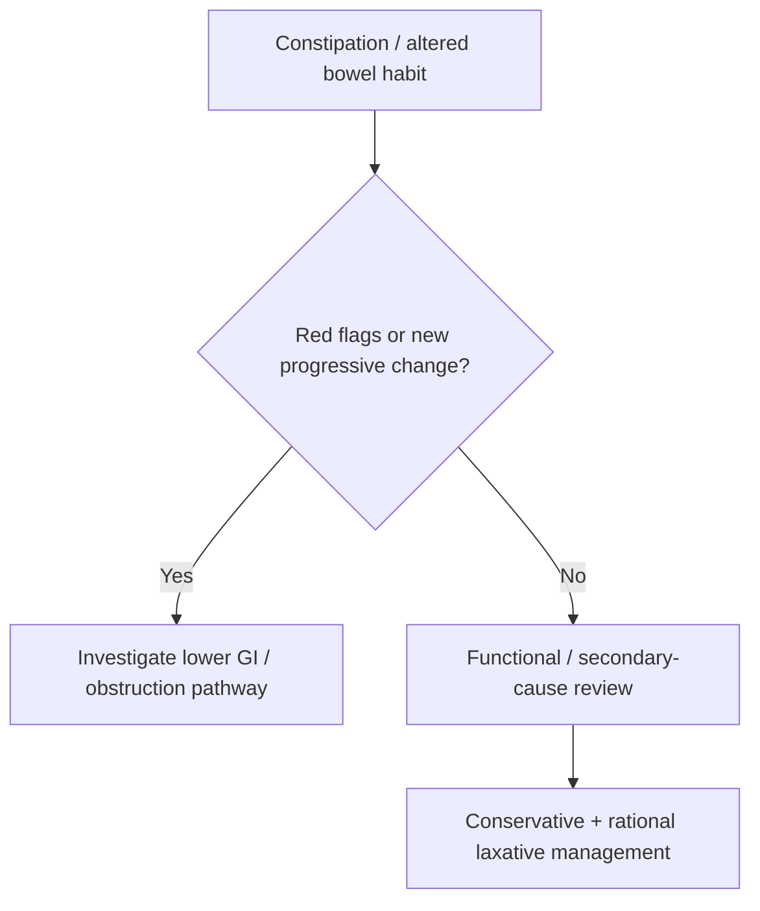

# Constipation and altered bowel habit

Related: [[../Gastroenterology MOC|Gastroenterology MOC]] · [[../Symptom Patterns and Diagnostic Approach|Symptom Patterns and Diagnostic Approach]] · [[Acute abdominal pain and peritonism red flags]] · [[Iron-deficiency anaemia as a GI clue]]

> [!important]
> Constipation is common and often benign, but **new change in bowel habit**, especially in older adults or with **weight loss, bleeding, or iron-deficiency anaemia**, should trigger colorectal pathology evaluation rather than casual symptomatic treatment alone.

## 1. Learning Objectives
- Define constipation and the clinical meaning of altered bowel habit.
- Distinguish primary functional constipation from secondary causes.
- Recognize alarm features suggesting colorectal disease or obstruction.
- Build a practical evaluation and management approach.

## 2. Definition
Constipation usually refers to infrequent, difficult, or incomplete defecation, hard stools, straining, or a sense of incomplete evacuation. “Altered bowel habit” is broader and includes a new sustained change in stool frequency, form, or ease of passage.

## 3. Physiology / Pathophysiology
Constipation results from:
- slow colonic transit
- impaired rectal evacuation
- low stool bulk or dehydration
- medication effects
- mechanical narrowing or obstruction

## 4. Etiology
### Common benign / functional causes
- dietary fibre or fluid inadequacy
- functional constipation
- IBS-C pattern
- reduced mobility

### Secondary causes
- opioids and constipating drugs
- metabolic causes such as hypercalcaemia or hypothyroidism
- neurological disease
- colorectal cancer
- stricture or obstructive lesion

## 5. History Framework
Ask about:
- duration and baseline bowel pattern
- stool frequency and form
- straining, pain, incomplete evacuation
- abdominal distension
- weight loss
- rectal bleeding
- mucus or tenesmus
- medication history
- neurological symptoms
- family history of colorectal cancer

## 6. Alarm Features
- new onset constipation/change in bowel habit in older age
- weight loss
- rectal bleeding
- iron-deficiency anaemia
- abdominal mass
- progressive distension / vomiting
- family history of colorectal cancer

## 7. Examination
- hydration and nutritional status
- abdominal distension / palpable mass
- focal tenderness
- digital rectal examination when clinically appropriate

## 8. Investigations
### Mild likely functional pattern
- often minimal initial testing if no red flags

### When alarm features are present
- CBC, especially for anaemia
- colonoscopy or lower GI investigation as indicated
- metabolic tests in selected secondary-cause scenarios
- abdominal imaging if obstruction is suspected

## 9. Interpretation Framework
### Practical algorithm
1. Confirm true constipation or altered bowel habit.
2. Separate long-standing functional symptoms from new progressive change.
3. Screen for bleeding, weight loss, anaemia, and obstructive symptoms.
4. Review drugs and secondary causes.
5. Investigate colorectal pathology promptly when red flags are present.

## 10. Differential Diagnosis
- functional constipation
- IBS-C
- colorectal cancer
- colonic stricture
- metabolic / drug-induced constipation
- pelvic floor evacuation disorder

## 11. Management
### First principles
- address alarm features before labeling as functional
- optimize fibre, fluids, activity when appropriate
- review constipating drugs
- use laxatives rationally according to mechanism and severity

### Cautions
- do not repeatedly treat “constipation” without evaluating new change in bowel habit
- distension plus vomiting raises obstruction concern, not simple constipation

## 12. Complications
- fecal impaction
- hemorrhoidal symptoms/fissure from straining
- missed colorectal malignancy
- bowel obstruction if underlying lesion is ignored

## 13. FCPS/MRCP High-Yield Points
- Altered bowel habit is more important than constipation alone when it is **new**.
- Iron-deficiency anaemia and rectal bleeding are major cancer clues.
- Drug history is high yield.

## 14. Common Viva Traps
- Treating new-onset constipation in an older patient as functional without workup.
- Forgetting opioids and metabolic causes.
- Missing distension/vomiting as obstruction clues.

## 15. One-Page Summary
- Constipation = difficult/infrequent/incomplete defecation.
- First ask: **long-standing functional or new altered bowel habit?**
- Red flags: **bleeding, weight loss, anaemia, older age, mass, distension/vomiting**.
- Functional cases may be managed conservatively; red-flag cases need colorectal evaluation.

## 16. Mind Map
- Constipation
  - functional
  - secondary
    - drugs
    - metabolic
    - neurological
    - colorectal cancer
  - red flags
    - weight loss
    - bleeding
    - anaemia
    - distension
  - treatment
    - fibre/fluids
    - laxatives
    - investigate cause

## 17. Flowchart

## 18. Revision Prompts
- Define altered bowel habit.
- Name 5 red flags in constipation.
- Which drug class commonly causes constipation?
- When should colorectal cancer be suspected?

## 19. MCQs (10)
1. A major red flag in constipation is:
   - A. Iron-deficiency anaemia
   - B. Sneezing
   - C. Mild dandruff
   - D. Seasonal allergies
   - **Answer: A**
2. New altered bowel habit in an older patient raises concern for:
   - A. Colorectal pathology
   - B. Always benign IBS
   - C. Migraine
   - D. Asthma
   - **Answer: A**
3. Which drug group commonly causes constipation?
   - A. Opioids
   - B. Saline nasal spray
   - C. Artificial tears
   - D. Topical emollients
   - **Answer: A**
4. Distension and vomiting with constipation suggest:
   - A. Obstruction
   - B. Functional health only
   - C. Allergic rhinitis
   - D. Otitis media
   - **Answer: A**
5. A functional pattern is more likely when:
   - A. Long-standing symptoms without red flags
   - B. Weight loss and anaemia are present
   - C. There is a palpable mass
   - D. There is progressive vomiting
   - **Answer: A**
6. A key investigation when cancer clues exist is:
   - A. Colonoscopy / lower GI evaluation
   - B. Audiogram only
   - C. Spirometry only
   - D. Eye pressure test only
   - **Answer: A**
7. Which statement is correct?
   - A. Altered bowel habit is broader than simple constipation
   - B. All constipation means cancer
   - C. Red flags do not matter
   - D. Medication review is unnecessary
   - **Answer: A**
8. Which history item is high yield?
   - A. Rectal bleeding
   - B. Favourite colour
   - C. Hand dominance only
   - D. Shoe brand only
   - **Answer: A**
9. An important conservative measure is:
   - A. Fibre and fluid optimization where appropriate
   - B. Emergency laparotomy for all
   - C. Chemotherapy
   - D. No lifestyle advice ever
   - **Answer: A**
10. A dangerous mistake is to:
   - A. Miss new change in bowel habit with alarm features
   - B. Take a drug history
   - C. Assess for bleeding
   - D. Check for anaemia
   - **Answer: A**

## 20. SBA Questions (10)
1. A 68-year-old man develops new constipation, weight loss, and narrower stools over 3 months. Best next principle?
   - A. Investigate for colorectal pathology
   - B. Reassure and discharge only
   - C. Treat indefinitely with fibre alone
   - D. Ignore the history
   - **Answer: A**
2. A patient on opioids develops constipation without bleeding or weight loss. Most likely explanation?
   - A. Drug-induced constipation
   - B. UC
   - C. Acute pancreatitis
   - D. Achalasia
   - **Answer: A**
3. Which combination suggests obstruction rather than simple functional constipation?
   - A. Distension, vomiting, and progressive pain
   - B. Stable long-standing hard stools alone
   - C. Mild bloating after beans only
   - D. Seasonal itching
   - **Answer: A**
4. Which finding most pushes evaluation beyond functional constipation?
   - A. Iron-deficiency anaemia
   - B. Stable appetite
   - C. Mild flatus
   - D. One missed stool only
   - **Answer: A**
5. In a long-standing functional case, a sensible first management element is:
   - A. Fibre/fluid optimization and rational laxatives
   - B. Emergency colectomy
   - C. Brain MRI
   - D. No review ever
   - **Answer: A**
6. Which history is especially high-yield for colorectal cancer risk?
   - A. Family history of colorectal cancer
   - B. Hair texture only
   - C. Eye colour only
   - D. Foot size only
   - **Answer: A**
7. What is a dangerous error?
   - A. Calling older-age new bowel change benign without investigating
   - B. Reviewing medications
   - C. Assessing abdominal distension
   - D. Checking CBC
   - **Answer: A**
8. Which statement is true?
   - A. Constipation may be functional, secondary, or obstructive in origin
   - B. It is always functional
   - C. It never needs examination
   - D. It excludes malignancy
   - **Answer: A**
9. A digital rectal examination may be useful because it helps assess:
   - A. Distal obstruction / evacuation issues / rectal pathology
   - B. Pancreatic enzymes only
   - C. Vestibular disease
   - D. Renal artery stenosis
   - **Answer: A**
10. Best exam phrase?
   - A. New altered bowel habit requires red-flag triage before symptomatic treatment alone
   - B. Constipation is never important
   - C. All patients need surgery
   - D. Laxatives replace diagnosis
   - **Answer: A**

## 21. Flashcards
- Q: Name 4 red flags in constipation.
  A: Weight loss, rectal bleeding, iron-deficiency anaemia, abdominal mass/distension.
- Q: What common drug class causes constipation?
  A: Opioids.
- Q: What key cancer clue accompanies new altered bowel habit?
  A: Iron-deficiency anaemia or rectal bleeding.
- Q: When is functional constipation more likely?
  A: Long-standing symptoms without alarm features.
- Q: What symptom combination suggests obstruction?
  A: Constipation with distension, vomiting, and progressive pain.

## 22. Must Know / Should Know / Nice to Know
### Must Know
- Key red flags and alarm features for this presentation
- Systematic assessment approach (ABCDE for acute, structured for chronic)
- Investigation logic: stepwise from non-invasive to invasive
- Core management principles: treat underlying cause + symptomatic relief

### Should Know
- Special populations (elderly, immunocompromised, pregnancy)
- Refractory/recurrent management strategies
- Multidisciplinary involvement criteria

### Nice to Know
- Advanced diagnostic modalities
- Emerging treatment options
- Health economic considerations

## 23. Self-Test Scorecard
- Can I list 4 key red flags? /10
- Can I outline the assessment algorithm? /10
- Can I explain the investigation strategy? /10
- Can I describe the management approach? /10

**Interpretation:**
- **<35/40** = weak topic
- **35-36/40** = acceptable but insecure
- **37+/40** = exam-ready

## 24. Answer Key with Explanations

## PasTest Scenario SBAs (Clinical Vignettes)

> **Auto-generated PasTest/Mediscope-style scenario SBAs** grounded in the authored source. Each scenario tests a real clinical fact (triad, specific sign, contraindication, trial, first-line Rx) extracted from the topic. *Source: Ch 22: Gastroenterology — Constipation and altered bowel habit*

**Q1.** What is the most appropriate first-line therapy for Constipation and altered bowel habit?

  - **A.** use laxatives rationally according to mechanism and severity
  - **B.** An advanced/surgical therapy reserved for refractory disease
  - **C.** Symptomatic treatment only, no disease-modifying therapy
  - **D.** Empiric broad-spectrum therapy without specific indication

  > **Answer: A** — use laxatives rationally according to mechanism and severity
  >
  > *Source:* use laxatives rationally according to mechanism and severity

