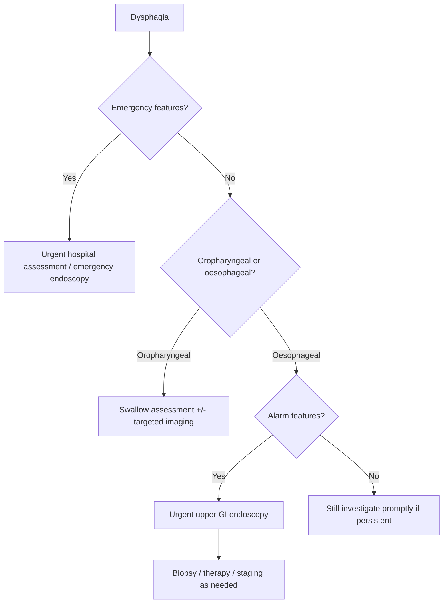

# Dysphagia alarm features and urgent endoscopy

Related: [[../Gastroenterology MOC|Gastroenterology MOC]] · [[../Symptom Patterns and Diagnostic Approach|Symptom Patterns and Diagnostic Approach]] · [[Oropharyngeal vs oesophageal dysphagia]] · [[Solids vs liquids dysphagia pattern]] · [[Food bolus obstruction and acute impaction]] · [[../Oesophageal Disorders/Oesophageal cancer|Oesophageal cancer]]

> [!warning]
> Dysphagia is a **high-risk symptom**. In adult Gastroenterology work, especially when progressive or associated with weight loss, GI bleeding, anaemia, vomiting, or aspiration, it should be treated as a possible **structural or malignant oesophageal lesion until proven otherwise**.

## 1. Learning Objectives
- Define dysphagia and separate oropharyngeal from oesophageal dysphagia.
- Recognize alarm features that require urgent endoscopy or emergency escalation.
- Use symptom pattern logic to narrow the differential.
- Know the role of upper GI endoscopy, biopsy, and adjunct tests.
- Outline emergency and non-emergency management pathways.

## 2. Definition
**Dysphagia** = difficulty swallowing or the sensation that food is delayed or obstructed in transit from mouth to stomach.

## 3. Anatomy
### Relevant anatomy
- mouth, pharynx, upper oesophageal sphincter
- oesophageal body
- lower oesophageal sphincter and gastro-oesophageal junction

### Applied anatomy
- **Oropharyngeal dysphagia**: problem initiating swallow; often neuromuscular/pharyngeal.
- **Oesophageal dysphagia**: food sticks after swallow is initiated; structural or motility cause in oesophagus.

## 4. Physiology
Normal swallowing has 3 phases:
1. oral phase
2. pharyngeal phase
3. oesophageal phase

Normal oesophageal transit depends on:
- coordinated peristalsis
- lumen patency
- intact sphincter relaxation

## 5. Classification
### By level
- **Oropharyngeal dysphagia**
- **Oesophageal dysphagia**

### By mechanism
- **Mechanical obstruction**
- **Motility disorder**
- **Inflammatory/mucosal pain-related narrowing**

## 6. Etiology / Differential Diagnosis
### Oropharyngeal causes
- stroke / bulbar disease
- Parkinsonism / neuromuscular disease
- pharyngeal pouch
- cricopharyngeal dysfunction

### Oesophageal mechanical causes
- oesophageal cancer
- peptic stricture
- Schatzki ring / webs
- eosinophilic oesophagitis with narrowing
- extrinsic compression

### Oesophageal motility causes
- achalasia
- diffuse oesophageal spasm
- severe ineffective motility / connective tissue disease

### Mucosal/inflammatory causes
- reflux oesophagitis
- pill oesophagitis
- infective oesophagitis

## 7. Pathophysiology
- **Mechanical lesions** progressively narrow the lumen, so solids stick first.
- **Motility disorders** impair coordinated transit, so both solids and liquids may cause symptoms early.
- **Inflammatory disease** causes pain, oedema, and mucosal fragility; odynophagia may coexist.

## 8. Clinical Features
### History logic
Ask:
- difficulty initiating swallow or food sticking after swallowing?
- solids only or solids and liquids?
- progressive or intermittent?
- weight loss?
- vomiting/regurgitation?
- aspiration/coughing/choking?
- odynophagia?
- anaemia or bleeding?

### Key pattern clues
- **Solids first, then liquids** → mechanical obstruction
- **Solids and liquids from onset** → motility disorder
- **Intermittent food impaction** → ring/web or eosinophilic oesophagitis
- **Progressive dysphagia + weight loss** → malignancy until proven otherwise

## 9. Alarm Features / Red Flags
- progressive dysphagia
- age >50 with new persistent dysphagia
- weight loss
- iron-deficiency anaemia
- haematemesis / melaena
- recurrent vomiting
- odynophagia
- recurrent aspiration / choking
- inability to swallow saliva
- food bolus obstruction
- supraclavicular nodes / systemic cancer clues

## 10. Urgent / Emergency Triggers
### Emergency same-day escalation
- complete obstruction / unable to swallow saliva
- food bolus impaction with ongoing obstruction
- severe aspiration risk
- suspected perforation
- haemodynamic instability with bleeding

### Urgent endoscopy pathway
- progressive dysphagia
- dysphagia with weight loss or anaemia
- dysphagia with GI bleed
- persistent dysphagia without benign explanation

## 11. Investigations
### First-line in gastroenterology
**Upper GI endoscopy** is usually the key first test in adult oesophageal dysphagia, especially with alarm features.

### What endoscopy does
- identifies cancer, stricture, ring, erosions, Barrett-related lesions
- permits biopsy
- may allow therapeutic action in selected cases

### Other tests
- **Barium swallow**: helpful in suspected high pharyngeal lesion, ring/web, pouch, or when motility pattern needs structural overview
- **Oesophageal manometry**: for suspected motility disorder after structural lesion excluded
- **CT chest/abdomen**: staging if malignancy found/suspected
- blood tests: CBC, ferritin, U&E if dehydration/nutrition issues

## 12. Interpretation Framework
### Bedside dysphagia algorithm
1. Confirm true dysphagia vs globus/odynophagia alone.
2. Separate **oropharyngeal** from **oesophageal**.
3. Check for emergency features: complete obstruction, saliva pooling, aspiration.
4. Check for alarm features: progression, weight loss, anaemia, bleeding.
5. If oesophageal/alarm present → urgent **upper GI endoscopy**.
6. If endoscopy negative but symptoms persist → consider eosinophilic disease, manometry, or barium study.

## 13. Diagnosis
Diagnosis is syndrome-based initially, then cause-specific after investigation:
- oesophageal cancer
- peptic stricture
- eosinophilic oesophagitis
- achalasia
- ring/web
- reflux-related inflammation

## 14. Management
### Immediate priorities
- aspiration prevention
- nil by mouth if complete obstruction/perforation suspected
- urgent endoscopy when indicated
- IV fluids if dehydrated

### Cause-specific management overview
- cancer → biopsy, staging, oncology/surgical pathway
- peptic stricture → PPI + endoscopic dilatation as appropriate
- eosinophilic oesophagitis → biopsy-based diagnosis, dietary/anti-inflammatory therapy
- achalasia → manometry-confirmed therapy pathway
- food bolus impaction → urgent endoscopic removal if persistent obstruction

## 15. Complications
- aspiration pneumonia
- malnutrition / dehydration
- perforation (rare but catastrophic)
- delayed cancer diagnosis if ignored

## 16. One-Page Summary
- Dysphagia is a **red-flag GI symptom**.
- First separate **oropharyngeal** from **oesophageal** dysphagia.
- **Solids → liquids progression** suggests mechanical obstruction.
- **Solids + liquids from onset** suggests motility disorder.
- **Progressive dysphagia + weight loss/anaemia** = malignancy until proven otherwise.
- **Upper GI endoscopy** is the key first investigation in adult oesophageal dysphagia with alarm features.
- **Unable to swallow saliva** or persistent food impaction requires emergency action.

## 17. FCPS/MRCP High-Yield Points
- Dysphagia is not the same as globus.
- Alarm features should push you toward urgent endoscopy.
- Oropharyngeal dysphagia = difficulty initiating swallow.
- Oesophageal dysphagia = food sticks after swallowing begins.
- Mechanical vs motility pattern is a classic viva question.

## 18. Common Viva Traps
- Reassuring dysphagia away as reflux without evaluation.
- Forgetting to ask solids vs liquids.
- Missing aspiration risk in oropharyngeal dysphagia.
- Delaying endoscopy in progressive dysphagia.

## 19. Mind Map
- Dysphagia
  - Level
    - oropharyngeal
    - oesophageal
  - Pattern
    - solids first
    - solids + liquids
  - Alarm features
    - weight loss
    - anaemia
    - bleeding
    - progressive course
  - Tests
    - endoscopy
    - barium swallow
    - manometry
  - Emergencies
    - saliva not swallowed
    - food bolus impaction
    - aspiration

## 20. Flowchart

## 21. Revision Prompts
- Define dysphagia and classify it.
- What symptoms suggest oesophageal cancer?
- What pattern suggests motility disorder?
- When is endoscopy urgent?
- What constitutes an emergency dysphagia presentation?

## 22. MCQs (10)
1. Progressive dysphagia to solids followed later by liquids most strongly suggests:
A. Mechanical obstruction
B. IBS
C. Functional constipation
D. Coeliac disease

2. The key first investigation in adult oesophageal dysphagia with alarm features is:
A. Colonoscopy
B. Upper GI endoscopy
C. ERCP
D. Spirometry

3. Inability to swallow saliva suggests:
A. Benign globus only
B. Complete obstruction requiring urgent action
C. Mild reflux disease
D. Functional dyspepsia

4. Dysphagia with weight loss should be treated as:
A. Harmless until proven otherwise
B. Possible malignancy until excluded
C. IBS equivalent
D. Drug side effect only

5. Difficulty initiating swallowing most suggests:
A. Oropharyngeal dysphagia
B. Peptic ulcer disease
C. Chronic pancreatitis
D. Biliary colic

6. Dysphagia to solids and liquids from onset suggests:
A. Motility disorder
B. Duodenal ulcer
C. Haemorrhoids
D. Coeliac disease

7. Which is an emergency feature?
A. Mild occasional heartburn
B. Food bolus impaction with inability to swallow
C. Bloating after meals
D. Intermittent constipation

8. Which test best confirms achalasia after structural disease is excluded?
A. Manometry
B. Stool culture
C. Colonoscopy
D. Serum amylase

9. Which is a classic malignant alarm combination?
A. Dysphagia + weight loss + anaemia
B. Dysphagia + relief with antacid
C. Nausea only
D. Diarrhoea after milk

10. Which statement is correct?
A. Endoscopy has no role in dysphagia
B. Progressive dysphagia can be observed for months without investigation
C. Dysphagia is a red-flag symptom in gastroenterology
D. All dysphagia is neurological

## 23. SBA Questions (10)
1. A 62-year-old man reports 3 months of progressive difficulty swallowing solid food and 6 kg weight loss. Best next step?
A. Reassure and review later
B. Start laxatives
C. Urgent upper GI endoscopy
D. Stool O&P

2. A patient presents unable to swallow saliva after a meat bolus. Best immediate action?
A. Outpatient PPI only
B. Urgent emergency assessment and likely endoscopy
C. Colonoscopy booking
D. Gluten-free diet

3. A 35-year-old woman has intermittent dysphagia to solids and liquids from onset, with normal endoscopy. Best next investigation?
A. MRCP
B. Oesophageal manometry
C. Faecal calprotectin
D. Flexible sigmoidoscopy

4. An elderly patient coughs and chokes immediately on trying to swallow water. This most suggests:
A. Oropharyngeal dysphagia
B. Duodenal ulcer disease
C. IBS
D. Peptic ulcer bleed

5. Which history is most typical of mechanical oesophageal obstruction?
A. Solids and liquids equally from first day
B. Solids first, later liquids
C. Diarrhoea after meals
D. Pain in right iliac fossa

6. Dysphagia plus iron-deficiency anaemia should prompt:
A. Observation only
B. Urgent structural evaluation
C. Antidiarrhoeal therapy only
D. Immediate colectomy

7. A 40-year-old with intermittent food impaction and atopy may have:
A. Eosinophilic oesophagitis
B. Chronic pancreatitis
C. Ulcerative colitis
D. Tropical sprue

8. The best general statement is:
A. Globus and dysphagia are identical
B. Dysphagia is usually low risk
C. Alarm-feature dysphagia needs urgent endoscopic assessment
D. Manometry always comes before endoscopy

9. A patient with odynophagia after doxycycline most likely has:
A. Pill oesophagitis
B. Colorectal cancer
C. Acute pancreatitis
D. IBS

10. The main danger of ignoring progressive dysphagia is:
A. Missing colorectal polyps
B. Missing oesophageal malignancy
C. Missing haemorrhoids
D. Missing coeliac disease only

## 24. Flashcards
- Q: What is the first key split in dysphagia?  
  A: Oropharyngeal vs oesophageal.
- Q: What pattern suggests mechanical obstruction?  
  A: Solids first, then liquids.
- Q: What pattern suggests motility disorder?  
  A: Solids and liquids from onset.
- Q: What is the main first test for adult alarm-feature oesophageal dysphagia?  
  A: Upper GI endoscopy.
- Q: What does inability to swallow saliva imply?  
  A: Possible complete obstruction needing emergency action.

## 25. Answer Key with Explanations
### MCQs
1. **A** — progressive narrowing classically causes solids-first dysphagia.
2. **B** — upper GI endoscopy is the central first investigation.
3. **B** — inability to swallow saliva suggests high-grade obstruction.
4. **B** — malignancy must be excluded urgently.
5. **A** — initiation difficulty is oropharyngeal.
6. **A** — motility disorders commonly affect solids and liquids early.
7. **B** — persistent impaction is an emergency.
8. **A** — manometry confirms achalasia after structural exclusion.
9. **A** — this combination is highly concerning for cancer.
10. **C** — dysphagia is a key GI alarm symptom.

### SBAs
1. **C** — urgent endoscopy is required.
2. **B** — saliva pooling/impaction needs emergency care.
3. **B** — manometry is appropriate after normal endoscopy.
4. **A** — coughing/choking at swallow onset suggests oropharyngeal dysfunction.
5. **B** — classic for mechanical narrowing.
6. **B** — anaemia plus dysphagia requires urgent structural assessment.
7. **A** — food impaction with atopy suggests eosinophilic oesophagitis.
8. **C** — alarm-feature dysphagia warrants urgent endoscopic evaluation.
9. **A** — doxycycline is a classic cause of pill oesophagitis.
10. **B** — the major safety issue is delayed cancer diagnosis.

## 26. Must Know / Should Know / Nice to Know
### Must Know
- Definition and diagnostic criteria for this presentation
- Key differential diagnoses and distinguishing features
- Stepwise investigation and management algorithm
- Red flags requiring urgent referral or intervention

### Should Know
- Special populations and atypical presentations
- Refractory management
- Cost-effectiveness of investigation pathways

### Nice to Know
- Emerging biomarkers and diagnostics
- Novel therapeutic targets
- Quality metrics

## 27. Self-Test Scorecard
- Can I define the condition? /10
- Can I list 4 differential diagnoses? /10
- Can I outline the investigation strategy? /10
- Can I describe the management approach? /10

**Interpretation:**
- **<35/40** = weak topic
- **35-36/40** = acceptable but insecure
- **37+/40** = exam-ready

## 28. Answer Key with Explanations

## PasTest Scenario SBAs (Clinical Vignettes)

> **Auto-generated PasTest/Mediscope-style scenario SBAs** grounded in the authored source. Each scenario tests a real clinical fact (triad, specific sign, contraindication, trial, first-line Rx) extracted from the topic. *Source: Ch 22: Gastroenterology — Dysphagia alarm features and urgent endoscopy*

**Q1.** Which of the following features is most specific or characteristic of Dysphagia alarm features and urgent endoscopy?

  - **A.** Upper GI endoscopy
  - **B.** A feature common to many acute inflammatory conditions
  - **C.** A non-specific sign that does not localise the diagnosis
  - **D.** An investigation finding rather than a clinical feature

  > **Answer: A** — Upper GI endoscopy
  >
  > *Source:* ve dysphagia + weight loss** → malignancy until proven otherwise
### First-line in gastroenterology
**Upper GI endoscopy** is usually the key first test in adult oesophageal dysphagia, especially with

