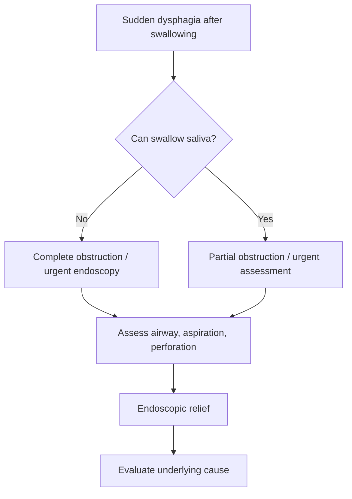

# Food bolus obstruction and acute impaction

Related: [[../Gastroenterology MOC|Gastroenterology MOC]] · [[../Symptom Patterns and Diagnostic Approach|Symptom Patterns and Diagnostic Approach]] · [[Oropharyngeal vs oesophageal dysphagia]] · [[Solids vs liquids dysphagia pattern]] · [[Dysphagia alarm features and urgent endoscopy]]

> [!important]
> Acute food bolus obstruction is a **time-sensitive obstructive dysphagia emergency**. The exam priority is to recognize **complete obstruction**, aspiration risk, and the need for **urgent endoscopic relief**.

## 1. Learning Objectives
- Define food bolus obstruction and distinguish it from chronic dysphagia.
- Recognize complete versus partial esophageal obstruction.
- Identify common underlying causes.
- Outline urgent management and endoscopic priorities.

## 2. Definition
Food bolus obstruction is acute lodgement of swallowed material within the oesophagus causing sudden dysphagia, retrosternal discomfort, regurgitation, and sometimes inability to handle saliva. Acute impaction is the emergency end of this spectrum.

## 3. Anatomy
- Common impaction points are the upper oesophagus, a narrowed mid-oesophagus, and the distal oesophagus near the gastro-oesophageal junction.
- Structural narrowing and disordered peristalsis predispose to impaction.

## 4. Physiology
- Normal swallowing requires coordinated peristalsis and luminal patency.
- Food impaction occurs when a large bolus meets fixed narrowing, inflammatory narrowing, or major motility failure.

## 5. Etiology / Predisposing Causes
### Structural causes
- Peptic stricture
- Oesophageal carcinoma
- Schatzki ring
- Eosinophilic oesophagitis with rings/strictures
- Post-surgical or caustic stricture

### Motility-related causes
- Achalasia
- Severe spasm / major motility disorder

### Practical clues
- Meat impaction in a young or atopic patient suggests eosinophilic oesophagitis.
- Progressive previous solids dysphagia suggests cancer or peptic stricture.

## 6. Clinical Features
### Typical presentation
- Sudden onset inability to swallow solids
- Retrosternal discomfort or pain
- Repeated regurgitation of saliva or ingested material
- Sensation of food stuck in chest

### Complete obstruction clues
- Cannot swallow saliva
- Constant spitting / drooling
- Severe distress
- Regurgitation immediately after attempting liquids

### Associated history
- Prior intermittent solids dysphagia
- Reflux history
- Atopy / recurrent impactions
- Weight loss
- Previous endoscopic dilation

## 7. Red Flags / Emergencies
- Inability to handle secretions
- Suspected complete obstruction
- Aspiration or respiratory compromise
- Sharp-object or bone impaction
- Hemodynamic instability or severe chest pain suggesting perforation
- Fever, subcutaneous emphysema, or sepsis suggesting perforation/mediastinitis

## 8. Investigations
### First-line approach
- History and focused examination
- Urgent upper GI endoscopy when obstruction is significant or persistent

### Additional tests
- Plain radiograph only if radiopaque foreign body is suspected
- CT chest if perforation or alternative thoracic pathology is suspected

### Tests to avoid delaying urgent care
- Do not delay endoscopy with unnecessary contrast studies in a clear obstructive emergency.

## 9. Interpretation Framework
### Acute dysphagia algorithm
1. Confirm acute onset after swallowing.
2. Decide complete versus partial obstruction.
3. Assess airway, aspiration risk, saliva handling, and perforation features.
4. Arrange urgent endoscopy for persistent or complete obstruction.
5. After relief, investigate the underlying cause to prevent recurrence.

## 10. Differential Diagnosis
- Acute food bolus obstruction
- Foreign body impaction
- Oesophageal cancer with acute superimposed obstruction
- Achalasia with retained food
- Severe odynophagia without obstruction
- Globus sensation
- Cardiac chest pain mimicking retrosternal discomfort

## 11. Management
### Initial priorities
- Keep nil by mouth
- Assess airway and aspiration risk
- Provide IV access and supportive care
- Avoid blind repeated swallowing attempts

### Definitive management
- **Urgent endoscopic removal or push-through by experienced endoscopist** is the main treatment.
- Endoscopic assessment should look for ring, stricture, eosinophilic oesophagitis, tumour, or motility-related stasis.

### Medical cautions
- Pharmacologic relaxation strategies are unreliable and should not replace timely endoscopy.
- Do not give oral intake to “test” passage in complete obstruction.

### After the acute event
- Treat the cause:
  - peptic stricture → acid suppression ± dilation
  - Schatzki ring → dilation when appropriate
  - eosinophilic oesophagitis → biopsy-based confirmation and long-term management
  - malignancy → staging and specialist pathway

## 12. Complications
- Aspiration
- Mucosal ulceration
- Oesophageal perforation
- Missed malignancy or eosinophilic oesophagitis
- Recurrent impaction

## 13. FCPS/MRCP High-Yield Points
- Sudden dysphagia after a meal with inability to swallow saliva = urgent endoscopy.
- Always ask about prior solids dysphagia and reflux.
- Recurrent food impaction should trigger evaluation for eosinophilic oesophagitis or structural disease.

## 14. Common Viva Traps
- Reassuring a patient with complete obstruction because vitals are initially normal.
- Forgetting perforation as a cause of severe chest pain after impaction.
- Removing the bolus but failing to evaluate the underlying lesion.

## 15. One-Page Summary
- Acute food bolus obstruction presents with sudden dysphagia and retrosternal sticking.
- **Complete obstruction** = inability to swallow saliva, drooling, urgent action.
- Main causes: stricture, ring, eosinophilic oesophagitis, cancer, achalasia.
- Urgent upper GI endoscopy is the key management step.
- Always investigate the cause after relief.

## 16. Mind Map
- Food bolus obstruction
  - acute onset
  - complete vs partial
  - causes
    - peptic stricture
    - ring
    - eosinophilic oesophagitis
    - cancer
    - achalasia
  - red flags
    - drooling
    - aspiration
    - perforation
  - management
    - NBM
    - urgent endoscopy

## 17. Flowchart

## 18. Revision Prompts
- What makes food impaction an emergency?
- Name 4 underlying causes.
- What finding suggests complete obstruction?
- What is the definitive treatment?

## 19. MCQs (10)
1. A patient with food bolus obstruction most urgently needs assessment of:
   - A. Saliva handling and airway risk
   - B. Knee reflexes only
   - C. Thyroid size only
   - D. Urine microscopy
   - **Answer: A**
2. Inability to swallow saliva suggests:
   - A. Complete oesophageal obstruction
   - B. Mild dyspepsia
   - C. IBS
   - D. Anal fissure
   - **Answer: A**
3. A common structural cause is:
   - A. Peptic stricture
   - B. Migraine
   - C. Asthma
   - D. Cystitis
   - **Answer: A**
4. Recurrent meat impaction in a young atopic patient suggests:
   - A. Eosinophilic oesophagitis
   - B. Haemorrhoids
   - C. Appendicitis
   - D. UC
   - **Answer: A**
5. The key definitive management is:
   - A. Urgent upper GI endoscopy
   - B. Routine colonoscopy
   - C. Laxatives
   - D. Bed rest alone
   - **Answer: A**
6. Severe chest pain with fever after impaction raises concern for:
   - A. Perforation
   - B. IBS
   - C. Coeliac disease
   - D. Gallstones only
   - **Answer: A**
7. Which is a motility-related predisposing cause?
   - A. Achalasia
   - B. Diverticulosis
   - C. Ulcerative colitis
   - D. Pancreatic cyst
   - **Answer: A**
8. A dangerous mistake is to:
   - A. Delay endoscopy unnecessarily in complete obstruction
   - B. Keep patient nil by mouth
   - C. Take focused history
   - D. Assess aspiration risk
   - **Answer: A**
9. After bolus relief, the next principle is to:
   - A. Search for the underlying cause
   - B. Discharge all patients without follow-up
   - C. Start laxatives
   - D. Ignore prior dysphagia
   - **Answer: A**
10. Which symptom best supports acute impaction?
   - A. Sudden retrosternal food sticking after a meal
   - B. Chronic isolated pruritus
   - C. Polyuria
   - D. Hematuria
   - **Answer: A**

## 20. SBA Questions (10)
1. A 58-year-old man suddenly cannot swallow meat and is repeatedly spitting saliva into a bowl. Best next step?
   - A. Urgent upper GI endoscopy
   - B. Reassure and discharge
   - C. Start oral fluids repeatedly
   - D. Arrange elective colonoscopy
   - **Answer: A**
2. A young atopic adult has recurrent meat impactions. Most likely underlying disorder?
   - A. Eosinophilic oesophagitis
   - B. IBS
   - C. UC
   - D. Coeliac disease
   - **Answer: A**
3. Which feature most strongly suggests complete obstruction?
   - A. Inability to handle secretions
   - B. Mild bloating
   - C. Pruritus
   - D. Polyphagia
   - **Answer: A**
4. After successful endoscopic relief, which is most important?
   - A. Determine the underlying lesion
   - B. No further thought needed
   - C. Start diuretics
   - D. Stop all follow-up
   - **Answer: A**
5. Which history supports peptic stricture?
   - A. Long reflux history with progressive solids dysphagia
   - B. Night sweats alone
   - C. Rectal pain only
   - D. Hemoptysis
   - **Answer: A**
6. Which complication is life-threatening?
   - A. Oesophageal perforation
   - B. Mild belching
   - C. Halitosis
   - D. Constipation
   - **Answer: A**
7. What is the best immediate diet advice in complete obstruction?
   - A. Nil by mouth
   - B. Force carbonated drinks
   - C. High-fibre meal
   - D. Normal dinner
   - **Answer: A**
8. Which test should not delay urgent treatment when the diagnosis is obvious and severe?
   - A. Contrast study done purely out of habit
   - B. Focused examination
   - C. Observation of respiratory status
   - D. Endoscopy planning
   - **Answer: A**
9. Retrosternal discomfort after a swallowed bolus is most localizing for:
   - A. Oesophageal obstruction
   - B. Colonic obstruction
   - C. Gastric outlet obstruction only
   - D. Renal colic
   - **Answer: A**
10. Which statement is correct?
   - A. Food bolus impaction may reveal cancer, ring, stricture, or eosinophilic oesophagitis
   - B. It is always benign and self-limited
   - C. It never recurs
   - D. Endoscopy has no role
   - **Answer: A**

## 21. Flashcards
- Q: What clinical sign strongly suggests complete food bolus obstruction?
  A: Inability to swallow saliva with drooling/spitting.
- Q: What is the definitive treatment for acute food impaction?
  A: Urgent upper GI endoscopy.
- Q: Name 3 common structural causes of food impaction.
  A: Peptic stricture, Schatzki ring, oesophageal carcinoma.
- Q: What disease should be considered in recurrent meat impaction in a young atopic patient?
  A: Eosinophilic oesophagitis.
- Q: What dangerous complication must be considered when chest pain and fever occur after impaction?
  A: Oesophageal perforation.

## 22. Must Know / Should Know / Nice to Know
### Must Know
- Key red flags and alarm features for this presentation
- Systematic assessment approach (ABCDE for acute, structured for chronic)
- Investigation logic: stepwise from non-invasive to invasive
- Core management principles: treat underlying cause + symptomatic relief

### Should Know
- Special populations (elderly, immunocompromised, pregnancy)
- Refractory/recurrent management strategies
- Multidisciplinary involvement criteria

### Nice to Know
- Advanced diagnostic modalities
- Emerging treatment options
- Health economic considerations

## 23. Self-Test Scorecard
- Can I list 4 key red flags? /10
- Can I outline the assessment algorithm? /10
- Can I explain the investigation strategy? /10
- Can I describe the management approach? /10

**Interpretation:**
- **<35/40** = weak topic
- **35-36/40** = acceptable but insecure
- **37+/40** = exam-ready

## 24. Answer Key with Explanations

## PasTest Scenario SBAs (Clinical Vignettes)

> **Auto-generated PasTest/Mediscope-style scenario SBAs** grounded in the authored source. Each scenario tests a real clinical fact (triad, specific sign, contraindication, trial, first-line Rx) extracted from the topic. *Source: Ch 22: Gastroenterology — Food bolus obstruction and acute impaction*

**Q1.** What is the most appropriate first-line therapy for Food bolus obstruction and acute impaction?

  - **A.** Do not give oral intake to “test” passage in complete obstruction
  - **B.** An advanced/surgical therapy reserved for refractory disease
  - **C.** Symptomatic treatment only, no disease-modifying therapy
  - **D.** Empiric broad-spectrum therapy without specific indication

  > **Answer: A** — Do not give oral intake to “test” passage in complete obstruction
  >
  > *Source:* Do not give oral intake to “test” passage in complete obstruction.

