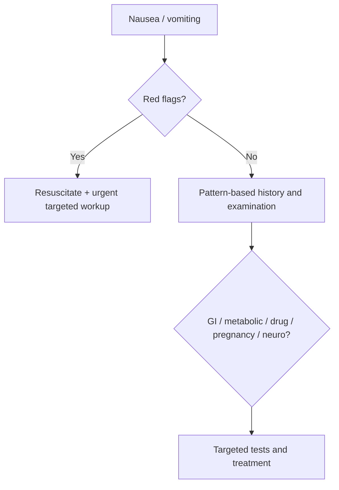

# Nausea and vomiting differential diagnosis

Related: [[../Gastroenterology MOC|Gastroenterology MOC]] · [[../Symptom Patterns and Diagnostic Approach|Symptom Patterns and Diagnostic Approach]] · [[Dyspepsia approach]] · [[Gastroparesis clue pattern]] · [[Acute abdominal pain and peritonism red flags]]

> [!important]
> Nausea and vomiting are **pattern-recognition symptoms**. The high-yield task is to decide whether the cause is **GI luminal disease, obstruction, gastric stasis, toxin/drug effect, metabolic/systemic disease, or intracranial/other non-GI pathology**.

## 1. Learning Objectives
- Organize causes of nausea and vomiting logically.
- Identify red flags requiring urgent escalation.
- Distinguish obstruction, gastroparesis, and functional/benign patterns.
- Build an exam-ready initial investigation plan.

## 2. Definition
- **Nausea** is the unpleasant sensation of impending vomiting.
- **Vomiting** is forceful expulsion of gastric contents.

## 3. Physiology
Vomiting is mediated by integrated central and peripheral pathways involving:
- gastric/intestinal afferents
- vestibular inputs
- higher cortical triggers
- metabolic/toxin-related chemoreceptor pathways

## 4. Practical Classification of Causes
### GI causes
- Gastroenteritis / acute upper GI irritation
- Peptic ulcer disease
- Gastric outlet obstruction
- Small-bowel obstruction
- Pancreatitis
- Biliary disease
- [[Gastroparesis clue pattern]]

### Functional / symptom overlap causes
- Functional dyspepsia overlap
- Cyclical vomiting patterns in selected cases

### Drug / toxin causes
- NSAIDs
- Opioids
- Alcohol
- Chemotherapy / other medications

### Metabolic / systemic causes
- Uraemia
- Diabetic ketoacidosis
- Hypercalcaemia
- Sepsis
- Pregnancy

### Non-GI / neurological causes
- Raised intracranial pressure
- Migraine
- Vestibular disorders

## 5. History Framework
Ask about:
- onset: acute or chronic
- relation to meals
- bilious versus non-bilious vomiting
- projectile or persistent pattern
- abdominal pain and distension
- constipation / obstipation
- headache or neurological symptoms
- drugs, alcohol, toxins
- pregnancy possibility
- diabetes, renal disease, infection

## 6. Pattern Clues
- Vomiting of old food hours after meals → gastroparesis or outlet obstruction
- Colicky pain + distension + obstipation → bowel obstruction
- Epigastric pain radiating to back → pancreatitis
- Morning headache + vomiting → intracranial pathology clue
- Ketotic/dehydrated diabetic patient → DKA clue

## 7. Red Flags / Emergencies
- Severe dehydration
- Hematemesis
- Persistent vomiting with electrolyte disturbance
- Abdominal distension and obstipation
- Peritonism
- Severe headache or focal neurological signs
- Shock / sepsis

## 8. Investigations
### Core tests
- CBC
- U&E / creatinine
- glucose
- pregnancy test where relevant
- LFTs, amylase/lipase when indicated

### Imaging / procedures guided by pattern
- Upper GI endoscopy for upper GI structural disease or bleeding concern
- Abdominal imaging for obstruction/perforation concern
- Brain imaging if intracranial pathology is suspected

## 9. Interpretation Framework
### Stepwise approach
1. Confirm nausea/vomiting pattern and severity.
2. Decide acute benign-looking illness versus serious pathology.
3. Look for obstruction, peritonism, pancreatitis, bleeding, metabolic disease, pregnancy, or neuro signs.
4. Correct fluids/electrolytes while investigating.
5. Use targeted imaging/endoscopy based on the dominant pattern.

## 10. Differential Diagnosis Summary Table
| Pattern | Important causes |
|---|---|
| Postprandial fullness + old food vomitus | Gastroparesis, gastric outlet obstruction |
| Colicky pain + distension + obstipation | Mechanical obstruction |
| Epigastric pain + back radiation | Pancreatitis |
| Headache / neuro signs | Intracranial cause |
| Polyuria, dehydration, ketotic state | DKA |
| Drug exposure | Medication-induced vomiting |

## 11. Management Principles
- Rehydrate and correct electrolytes.
- Treat the cause, not nausea alone.
- Use antiemetics appropriately but do not let them mask surgical or neurological disease.
- Escalate early when obstruction, peritonitis, GI bleeding, or CNS red flags exist.

## 12. FCPS/MRCP High-Yield Points
- Vomiting is a symptom, not a final diagnosis.
- Pattern matters: timing, content, pain, obstruction signs, systemic clues.
- Always think beyond GI causes.

## 13. Common Viva Traps
- Forgetting pregnancy test in appropriate patients.
- Giving antiemetics without considering obstruction.
- Missing metabolic causes such as DKA or uraemia.

## 14. One-Page Summary
- Nausea/vomiting differentials include GI, metabolic, drug-related, pregnancy, and neurological causes.
- Red flags: dehydration, distension/obstipation, hematemesis, peritonism, neuro signs, shock.
- Vomiting of retained food suggests stasis/obstruction.
- Initial management = fluids + electrolyte correction + targeted investigation.

## 15. Mind Map
- Nausea/vomiting
  - GI
    - ulcer / obstruction / pancreatitis / gastroparesis
  - metabolic
    - DKA / uraemia / hypercalcaemia
  - drug / toxin
  - pregnancy
  - neurological
  - red flags
    - distension
    - dehydration
    - bleeding
    - neuro signs

## 16. Flowchart

## 17. Revision Prompts
- Classify 5 major cause groups of vomiting.
- What clues suggest obstruction?
- What clues suggest a metabolic cause?
- Why should antiemetics not replace diagnosis?

## 18. MCQs (10)
1. A major non-GI cause of vomiting is:
   - A. Diabetic ketoacidosis
   - B. Haemorrhoids
   - C. Varicose veins
   - D. Otitis externa only
   - **Answer: A**
2. Distension plus obstipation suggests:
   - A. Obstruction
   - B. Functional dyspepsia only
   - C. Tension headache
   - D. Eczema
   - **Answer: A**
3. Vomiting old food hours after meals suggests:
   - A. Gastric stasis or outlet obstruction
   - B. Appendicitis only
   - C. Migraine only
   - D. Cystitis
   - **Answer: A**
4. A red flag is:
   - A. Severe dehydration
   - B. One isolated belch
   - C. Mild itch
   - D. Sneezing
   - **Answer: A**
5. Which test is important in relevant patients?
   - A. Pregnancy test
   - B. Spirometry only
   - C. Skin biopsy only
   - D. PSA only
   - **Answer: A**
6. Headache with vomiting should raise concern for:
   - A. Intracranial pathology
   - B. Anal fissure
   - C. IBS-C
   - D. Pancreatic insufficiency only
   - **Answer: A**
7. A key treatment principle is to:
   - A. Correct fluids and electrolytes
   - B. Ignore dehydration
   - C. Avoid history taking
   - D. Diagnose everything as gastritis
   - **Answer: A**
8. Bilious or persistent vomiting with pain may indicate:
   - A. Serious GI pathology
   - B. Guaranteed benign disease
   - C. Pure anxiety only
   - D. Alopecia
   - **Answer: A**
9. Which drug class commonly causes nausea?
   - A. Opioids
   - B. Emollients only
   - C. Saline spray only
   - D. Artificial tears only
   - **Answer: A**
10. Best exam principle?
   - A. Vomiting differential is pattern-based and broad
   - B. Vomiting is always gastric infection
   - C. Vomiting excludes metabolic disease
   - D. Vomiting never needs escalation
   - **Answer: A**

## 19. SBA Questions (10)
1. A 45-year-old diabetic has vomiting, dehydration, abdominal pain, and deep breathing. Most important systemic differential?
   - A. Diabetic ketoacidosis
   - B. IBS
   - C. Peptic stricture
   - D. Haemorrhoids
   - **Answer: A**
2. A patient has vomiting, abdominal distension, colicky pain, and no passage of stool. Most likely broad diagnosis?
   - A. Bowel obstruction
   - B. Functional dyspepsia
   - C. GERD only
   - D. Migraine only
   - **Answer: A**
3. A patient vomits undigested food several hours after eating and has long-standing diabetes. Best GI mechanism?
   - A. Gastroparesis
   - B. Acute lower GI bleed
   - C. Ulcerative colitis
   - D. Anal fissure
   - **Answer: A**
4. Which feature should prompt urgent escalation?
   - A. Peritonism
   - B. Mild isolated bloating
   - C. Brief hiccups
   - D. Dry lips alone
   - **Answer: A**
5. Which history item is high-yield in women of child-bearing age?
   - A. Pregnancy possibility
   - B. Foot size only
   - C. Hair colour only
   - D. Hand dominance only
   - **Answer: A**
6. Which cause is extra-gastrointestinal?
   - A. Raised intracranial pressure
   - B. Duodenal ulcer
   - C. Gastritis
   - D. Gallstone pancreatitis
   - **Answer: A**
7. What is a dangerous error?
   - A. Masking obstruction with antiemetics and no workup
   - B. Assessing hydration
   - C. Checking glucose
   - D. Taking a drug history
   - **Answer: A**
8. Which combination most suggests pancreatitis?
   - A. Vomiting with epigastric pain radiating to the back
   - B. Vomiting with itchy scalp
   - C. Vomiting with isolated elbow pain
   - D. Vomiting with tinnitus only
   - **Answer: A**
9. Which principle is correct?
   - A. Nausea and vomiting may arise from GI, metabolic, drug, pregnancy, or neurological causes
   - B. All vomiting is upper GI ulcer disease
   - C. Neurological causes are irrelevant
   - D. Metabolic causes never matter
   - **Answer: A**
10. First management step in a dehydrated vomiting patient?
   - A. Rehydrate and assess cause urgently
   - B. Discharge immediately
   - C. Ignore electrolytes
   - D. Give laxatives
   - **Answer: A**

## 20. Flashcards
- Q: Name 5 broad differential groups for nausea/vomiting.
  A: GI, metabolic/systemic, drug/toxin, pregnancy, neurological/vestibular.
- Q: What pattern suggests bowel obstruction?
  A: Colicky pain, distension, vomiting, and obstipation.
- Q: What pattern suggests gastroparesis?
  A: Vomiting retained food hours after meals with postprandial fullness.
- Q: What metabolic emergency must be remembered in vomiting diabetics?
  A: Diabetic ketoacidosis.
- Q: What is the first management principle in significant vomiting?
  A: Rehydrate, correct electrolytes, and investigate the cause.

## 21. Must Know / Should Know / Nice to Know
### Must Know
- Key red flags and alarm features for this presentation
- Systematic assessment approach (ABCDE for acute, structured for chronic)
- Investigation logic: stepwise from non-invasive to invasive
- Core management principles: treat underlying cause + symptomatic relief

### Should Know
- Special populations (elderly, immunocompromised, pregnancy)
- Refractory/recurrent management strategies
- Multidisciplinary involvement criteria

### Nice to Know
- Advanced diagnostic modalities
- Emerging treatment options
- Health economic considerations

## 22. Self-Test Scorecard
- Can I list 4 key red flags? /10
- Can I outline the assessment algorithm? /10
- Can I explain the investigation strategy? /10
- Can I describe the management approach? /10

**Interpretation:**
- **<35/40** = weak topic
- **35-36/40** = acceptable but insecure
- **37+/40** = exam-ready

## 23. Answer Key with Explanations

## PasTest Scenario SBAs (Clinical Vignettes)

> **Auto-generated PasTest/Mediscope-style scenario SBAs** grounded in the authored source. Each scenario tests a real clinical fact (triad, specific sign, contraindication, trial, first-line Rx) extracted from the topic. *Source: Ch 22: Gastroenterology — Nausea and vomiting differential diagnosis*

**Q1.** What is the most appropriate first-line therapy for Nausea and vomiting differential diagnosis?

  - **A.** Use antiemetics appropriately but do not let them mask surgical or neurological disease
  - **B.** An advanced/surgical therapy reserved for refractory disease
  - **C.** Symptomatic treatment only, no disease-modifying therapy
  - **D.** Empiric broad-spectrum therapy without specific indication

  > **Answer: A** — Use antiemetics appropriately but do not let them mask surgical or neurological disease
  >
  > *Source:* Use antiemetics appropriately but do not let them mask surgical or neurological disease.

