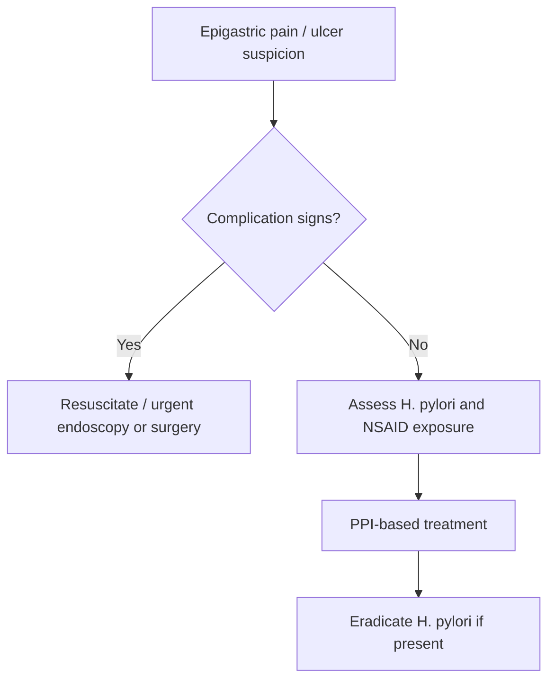

# Duodenal ulcer disease

Related: [[../Gastroenterology MOC|Gastroenterology MOC]] · [[../Stomach and Duodenal Disorders|Stomach and Duodenal Disorders]] · [[Helicobacter and ulcer disease|Helicobacter and ulcer disease]] · [[Helicobacter pylori infection]] · [[Gastric ulcer disease]] · [[NSAID-associated ulcer disease]] · [[Peptic ulcer complications]]

## 1. Learning Objectives
- Define duodenal ulcer disease and its major causes.
- Understand the H. pylori–acid relationship.
- Recognize classical symptoms, complications, and alarm features.
- Use investigation logic and management priorities in exams.

## 2. Definition
**Duodenal ulcer disease** is mucosal ulceration in the duodenum, usually due to imbalance between acid-peptic injury and mucosal defense, most commonly related to **H. pylori** or NSAID exposure.

## 3. Anatomy
- usually affects the **first part of the duodenum**
- posterior ulcers may bleed from adjacent vessels
- anterior ulcers are classically associated with perforation risk

## 4. Physiology
Duodenal mucosa is exposed to gastric acid. Protection depends on:
- bicarbonate secretion
- mucus
- epithelial integrity
- adequate perfusion

When acid load rises or mucosal defense falls, ulceration occurs.

## 5. Classification
- uncomplicated duodenal ulcer
- H. pylori-associated ulcer
- NSAID-associated ulcer
- complicated ulcer: bleeding, perforation, obstruction, penetration

## 6. Etiology / Risk Factors
- **H. pylori** infection
- NSAIDs
- smoking
- severe physiological stress in selected contexts
- hypersecretory states such as Zollinger-Ellison syndrome (less common)

## 7. Pathophysiology
- H. pylori antral-predominant gastritis can increase acid drive
- excess acid injures duodenal mucosa
- gastric metaplasia in duodenum allows H. pylori-related inflammatory injury
- NSAIDs reduce prostaglandin-mediated mucosal defense

## 8. Clinical Features
### Typical symptoms
- epigastric pain or burning
- classically pain relieved temporarily by food or antacids, then recurring
- nocturnal pain may occur
- dyspepsia and bloating may coexist

### Alarm / complication clues
- melaena or haematemesis
- sudden severe generalized abdominal pain (perforation)
- persistent vomiting (possible obstruction)
- weight loss or anaemia

## 9. Investigations
### Basic tests
- CBC if bleeding/anaemia suspected
- H. pylori testing
- U&E if vomiting/dehydration

### Endoscopy indications
- alarm features
- suspected bleeding
- recurrent/refractory symptoms
- older/high-risk patients

### Endoscopic findings
- duodenal ulcer crater
- stigmata of recent haemorrhage if bleeding
- associated duodenitis

## 10. Interpretation Framework
### Ulcer logic
1. Confirm upper abdominal symptom pattern.
2. Look for complications: bleed, perforation, obstruction.
3. Think of main causes: **H. pylori** and **NSAIDs**.
4. Endoscope if alarm/complication/high-risk features exist.
5. Treat cause + heal ulcer + prevent recurrence.

## 11. Diagnosis
Diagnosis is made by:
- endoscopic visualization when indicated
- clinical and testing correlation with H. pylori/NSAID exposure

## 12. Differential Diagnosis
- functional dyspepsia
- gastric ulcer disease
- GERD
- biliary pain
- pancreatobiliary disease
- gastric malignancy

## 13. Management
### Core principles
- acid suppression, usually with **PPI**
- identify and eradicate **H. pylori** if present
- stop NSAIDs if possible
- avoid smoking

### If H. pylori positive
- give eradication regimen
- confirm eradication when appropriate

### If NSAID-related
- stop NSAID if possible
- use protective acid suppression
- reconsider analgesic strategy

### Complicated ulcer
- bleeding → resuscitation + urgent endoscopic haemostasis pathway
- perforation → surgical emergency
- gastric outlet obstruction → decompress/stabilize and specialist care

## 14. Complications
- upper GI bleeding
- perforation
- penetration
- gastric outlet obstruction
- recurrent ulcer disease

## 15. Red Flags / Emergencies
- haematemesis / melaena
- acute abdomen / perforation suspicion
- persistent vomiting
- weight loss / anaemia
- haemodynamic instability

## 16. One-Page Summary
- Duodenal ulcer disease is most commonly caused by **H. pylori** or **NSAIDs**.
- Pain is often epigastric and classically may improve briefly with food.
- Think of complications early: **bleeding, perforation, obstruction**.
- **Posterior** ulcers bleed; **anterior** ulcers perforate more classically.
- PPI heals ulcer; H. pylori eradication prevents recurrence.

## 17. FCPS/MRCP High-Yield Points
- H. pylori + NSAIDs = core causes.
- Posterior duodenal ulcer → bleeding risk.
- Anterior duodenal ulcer → perforation risk.
- Do not miss upper GI bleed or perforation.

## 18. Common Viva Traps
- Treating recurrent ulcer without addressing H. pylori.
- Forgetting NSAIDs.
- Missing perforation in sudden severe pain.

## 19. Mind Map
- Duodenal ulcer
  - causes
    - H. pylori
    - NSAID
  - symptoms
    - epigastric pain
    - nocturnal pain
  - complications
    - bleeding
    - perforation
    - obstruction
  - treatment
    - PPI
    - eradicate H. pylori
    - stop NSAID

## 20. Flowchart

## 21. Revision Prompts
- What are the 2 major causes of duodenal ulcer disease?
- Which ulcer surface is classically linked to bleeding vs perforation?
- What complications must be named in exams?
- How do you prevent recurrence?

## 22. MCQs (10)
1. The commonest 2 causes of duodenal ulcer disease are:
A. H. pylori and NSAIDs
B. IBS and lactose intolerance
C. Gallstones and asthma
D. Haemorrhoids and fissure

2. Duodenal ulcer pain is classically:
A. Purely lower abdominal
B. Epigastric, sometimes relieved transiently by food/antacid
C. Always painless
D. Only right iliac fossa pain

3. Posterior duodenal ulcers are classically associated with:
A. Bleeding
B. Splenomegaly
C. Ascites
D. Constipation only

4. Anterior duodenal ulcers are classically associated with:
A. Perforation
B. Microscopic colitis
C. Coeliac disease
D. Hemorrhoids

5. Which test/assessment is important in almost all ulcer patients?
A. H. pylori evaluation
B. EEG
C. Spirometry
D. Bone scan

6. The main acid-healing drug class is:
A. PPI
B. Insulin
C. Beta-blocker
D. Diuretic

7. A complication of duodenal ulcer disease is:
A. Upper GI bleeding
B. Stroke only
C. Pleural effusion only
D. Nephrotic syndrome

8. Which history factor must always be asked?
A. NSAID use
B. Hair color
C. Hand dominance
D. Shoe size

9. Sudden severe generalized abdominal pain in a known ulcer patient suggests:
A. Perforation
B. IBS
C. Coeliac disease
D. Functional dyspepsia

10. Which statement is correct?
A. Eradicating H. pylori can reduce ulcer recurrence
B. H. pylori has no relevance to duodenal ulcer disease
C. Duodenal ulcers never bleed
D. NSAIDs are protective

## 23. SBA Questions (10)
1. A 34-year-old man has recurrent epigastric pain relieved briefly by meals. H. pylori test is positive. Best principle?
A. Treat with eradication regimen plus ulcer-healing strategy
B. Reassure only
C. Start anticoagulation
D. Give laxatives

2. A patient with melaena and known duodenal ulcer disease requires:
A. Upper GI bleed resuscitation pathway
B. Fibre only
C. Colon transit study only
D. No investigation

3. A woman on chronic NSAIDs develops endoscopically proven duodenal ulcer. Best step?
A. Stop/reduce NSAID if possible and give PPI-based therapy
B. Continue NSAID unchanged always
C. Ignore it if pain settles
D. Treat as IBS only

4. Which feature is most concerning for perforation?
A. Mild bloating
B. Sudden severe abdominal pain with peritonism
C. Early satiety alone
D. Belching only

5. The most common location is:
A. First part of duodenum
B. Rectum
C. Terminal ileum
D. Ascending colon

6. A patient with recurrent ulcers despite therapy should prompt review of:
A. H. pylori eradication success and NSAID use
B. Skin moisturizers only
C. Contact lens use
D. Audiometry

7. Which complication may cause persistent vomiting?
A. Gastric outlet obstruction from peptic disease
B. Haemorrhoids
C. Anal fissure
D. IBS alone

8. Which statement about management is correct?
A. PPI heals ulcers and cause-directed therapy prevents recurrence
B. Antibiotics alone are enough for all ulcers
C. Surgery is first-line for all uncomplicated ulcers
D. Endoscopy has no role

9. Posterior duodenal ulcers are classically feared because of:
A. Hemorrhage
B. Jaundice only
C. Megacolon
D. Renal failure

10. If H. pylori is absent and NSAID use continues, ulcer recurrence risk may:
A. Persist
B. Vanish completely always
C. Become irrelevant
D. Convert to pancreatitis automatically

## 24. Flashcards
- Q: What are the 2 classic major causes of duodenal ulcer disease?  
  A: H. pylori and NSAIDs.
- Q: Which surface is classically associated with bleeding?  
  A: Posterior duodenal ulcer.
- Q: Which surface is classically associated with perforation?  
  A: Anterior duodenal ulcer.
- Q: What is the main ulcer-healing drug class?  
  A: PPI.
- Q: Name 3 major complications of duodenal ulcer disease.  
  A: Bleeding, perforation, obstruction.

## 25. Answer Key with Explanations
### MCQs
1. **A** — H. pylori and NSAIDs dominate ulcer causation.
2. **B** — this is the classic pain pattern.
3. **A** — posterior ulcers are classically associated with bleeding.
4. **A** — anterior ulcers classically perforate.
5. **A** — H. pylori evaluation is central.
6. **A** — PPIs are key ulcer-healing drugs.
7. **A** — upper GI bleeding is a major complication.
8. **A** — NSAID history is essential.
9. **A** — sudden severe pain suggests perforation.
10. **A** — eradication reduces recurrence.

### SBAs
1. **A** — cause-directed eradication plus healing therapy is required.
2. **A** — melaena requires upper GI bleed management.
3. **A** — address NSAIDs and heal the ulcer.
4. **B** — this suggests perforation.
5. **A** — the first part of the duodenum is the usual site.
6. **A** — review eradication success and continued NSAID exposure.
7. **A** — obstruction can cause persistent vomiting.
8. **A** — heal the ulcer and remove the cause.
9. **A** — hemorrhage is the classic posterior-ulcer danger.
10. **A** — ongoing NSAID exposure keeps recurrence risk high.

## 26. Must Know / Should Know / Nice to Know
### Must Know
- DU = H. pylori + acid/pepsin > mucosal defence; anterior duodenal bulb; nocturnal pain relieved by food
- H. pylori eradication = cure (90%+); PPI 4-8w + clarithromycin + amoxicillin/metronidazole
- Bleeding/perforation/penetration = complications; endoscopic haemostasis for bleeding
- NSAID/ASA: stop if possible; PPI co-therapy if continued
- Refractory/recurrent: check H. pylori (Urease breath test), NSAID use, Zollinger-Ellison

### Should Know
- Advanced management options
- Special populations (pregnancy, elderly)
- Emerging therapies

### Nice to Know
- Molecular pathogenesis
- Genetic risk scores
- Global epidemiology

## 27. Self-Test Scorecard
- Can I define the condition? /10
- Can I list 4 diagnostic criteria? /10
- Can I outline the management algorithm? /10
- Can I name 3 complications? /10

**Interpretation:**
- **<35/40** = weak topic
- **35-36/40** = acceptable but insecure
- **37+/40** = exam-ready

## PasTest Scenario SBAs (Clinical Vignettes)

> **Auto-generated PasTest/Mediscope-style scenario SBAs** grounded in the authored source. Each scenario tests a real clinical fact (triad, specific sign, contraindication, trial, first-line Rx) extracted from the topic. *Source: Ch 22: Gastroenterology — Duodenal ulcer disease*

**Q1.** What is the most appropriate first-line therapy for Duodenal ulcer disease?

  - **A.** give eradication regimen
  - **B.** An advanced/surgical therapy reserved for refractory disease
  - **C.** Symptomatic treatment only, no disease-modifying therapy
  - **D.** Empiric broad-spectrum therapy without specific indication

  > **Answer: A** — give eradication regimen
  >
  > *Source:* give eradication regimen

