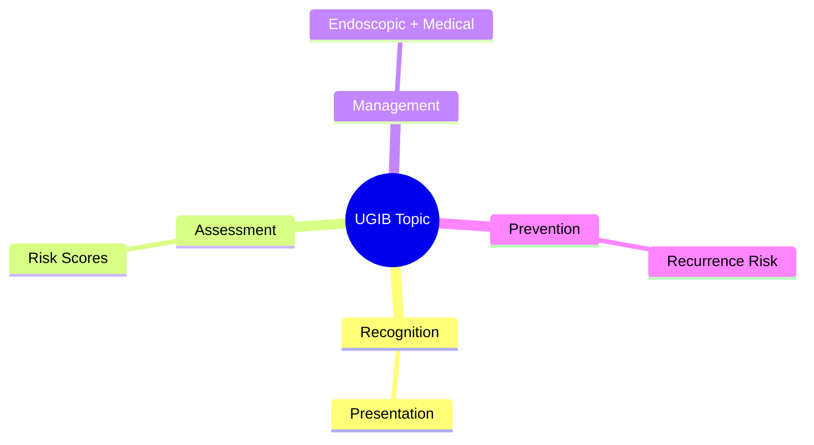
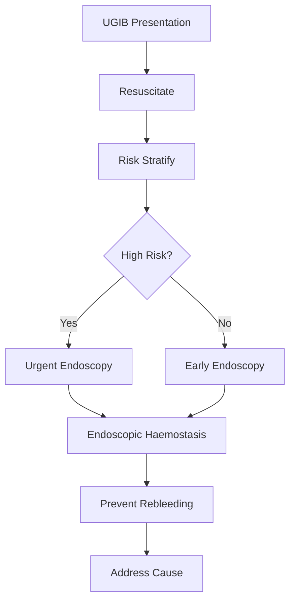

## 1. Learning Objectives
- Recognize the clinical presentation and urgency of this UGIB scenario
- Apply the appropriate risk stratification and investigation strategy
- Outline the endoscopic and medical management principles
- Identify when escalation or specialist referral is required
- Understand the prevention and long-term management# Risk stratification scores in upper GI bleeding

Related: [[../Gastroenterology MOC|Gastroenterology MOC]] · [[../Upper Gastrointestinal Bleeding|Upper Gastrointestinal Bleeding]] · [[Initial assessment and stabilization|Initial assessment and stabilization]]

## 2. Learning objectives
- Use pre-endoscopy and post-endoscopy scores safely in upper GI bleeding.
- Separate **triage tools** from **resuscitation priorities**.
- Know where **Glasgow-Blatchford score (GBS)**, **Rockall**, and **AIMS65** help and where they can mislead.

## 3. Definition
Risk stratification in upper GI bleeding means estimating the probability of needing intervention, rebleeding, death, or safe early discharge using bedside clinical and laboratory variables.

## 4. Core principle
> [!important]
> A score does **not** replace ABC resuscitation, haemodynamic assessment, or urgent endoscopy when clinically required.

## 5. Relevant physiology
Mortality is driven by shock, continuing blood loss, organ hypoperfusion, comorbidity, aspiration risk, and failure of haemostasis. Scores try to summarize these using pulse, blood pressure, haemoglobin, urea, mental state, age, liver disease, and cardiac failure.

## 6. Major scores
### Glasgow-Blatchford score
- Best for **initial triage before endoscopy**.
- Predicts need for transfusion, endoscopic therapy, or admission.
- Uses urea, haemoglobin, systolic BP, pulse, melaena, syncope, liver disease, and heart failure.
- **GBS 0** classically identifies very-low-risk patients who may be suitable for outpatient management if clinically stable.
- Some services accept **GBS 0–1**, but local policy and comorbidity matter.

### Rockall score
- Combines age, shock, comorbidity, diagnosis, and endoscopic stigmata.
- More useful **after endoscopy** for rebleeding and mortality estimation.
- Pre-endoscopy Rockall is less discriminating than GBS for discharge decisions.

### AIMS65
- Albumin low, INR elevated, mental status altered, systolic BP low, age ≥65.
- Simple bedside mortality predictor.
- Helpful for identifying high-risk frail patients, but less specific for need for endoscopic therapy.

## 7. Clinical use approach
1. Confirm this is probable upper GI bleeding: haematemesis, coffee-ground vomiting, melaena, or brisk bleeding with raised urea.
2. Assess haemodynamic state first: airway risk, shock, ongoing bleed.
3. Send urgent labs: FBC, urea/creatinine, LFT, coagulation profile, group and save/cross-match.
4. Calculate **GBS early**.
5. Do **not** discharge purely because a score is low if there is active haematemesis, syncope, severe comorbidity, unreliable follow-up, or anticoagulation complexity.
6. After endoscopy, use **Rockall** for rebleeding/death framing.

## 8. High-yield interpretation
| Situation | Best score logic |
|---|---|
| Deciding who may avoid admission | GBS |
| Predicting need for intervention before endoscopy | GBS |
| Mortality framing in frail/critically ill patient | AIMS65 |
| Rebleeding risk after endoscopy | Rockall |

## 9. Red flags overriding score comfort
- Persistent haemodynamic instability
- Fresh haematemesis in hospital
- Massive transfusion requirement
- Altered mental state or aspiration risk
- Suspected variceal bleed
- Significant liver disease or cardiac disease
- Anticoagulant-associated bleed

## 10. Differential nuance
- Brisk lower GI bleed can mimic upper GI bleed.
- Raised urea favours upper GI source but is not diagnostic.
- Low score does not exclude important lesions such as malignancy or ulcer.

## 11. Management implications
- **Low risk**: consider early endoscopy and possible outpatient pathway if genuinely stable.
- **Intermediate/high risk**: admit, resuscitate, monitor, arrange timely endoscopy.
- **Very high risk**: HDU/ICU consideration, urgent endoscopy, blood products as needed.

## 12. FCPS/MRCP exam traps
- Saying Rockall is the best pre-endoscopy discharge tool.
- Forgetting that GBS predicts **need for intervention/admission**, not just death.
- Treating scores as more important than shock index and bedside instability.

## 13. One-page summary
- **GBS** = best early triage score.
- **Rockall** = stronger after endoscopy, especially for rebleeding/mortality.
- **AIMS65** = quick mortality signal in older/sicker patients.
- Scores support decisions; they do not replace resuscitation or clinical judgment.

## 14. MCQs (10)
1. Best pre-endoscopy triage score? **Glasgow-Blatchford**.
2. Best post-endoscopy rebleeding framework? **Rockall**.
3. Score using albumin, INR, mental status, systolic BP, age? **AIMS65**.
4. GBS 0 mainly suggests? **Very low risk**.
5. Shock with low score should prompt? **Resuscitation/admission**.
6. Score most linked to need for intervention pre-endoscopy? **GBS**.
7. Endoscopic findings appear in which score? **Rockall**.
8. Suspected variceal bleed with “good” score should still get? **Urgent specialist care**.
9. Main error with scoring systems? **Using them instead of clinical assessment**.
10. Altered mental state increases concern mainly because of? **Mortality and airway risk**.

## 15. SBA Questions (10)
1. A stable patient with melaena, normal BP, no comorbidity, GBS 0: best next step? **Consider outpatient/early endoscopy pathway**.
2. Elderly patient with haematemesis, systolic BP 85, confusion: first priority? **Resuscitation, not score discussion**.
3. After endoscopy confirms high-risk ulcer stigmata, best score for rebleeding framing? **Rockall**.
4. Cirrhotic patient with haematemesis and low albumin: bedside mortality predictor? **AIMS65**.
5. Patient with low pre-endoscopy score but recurrent fresh haematemesis in ED: disposition? **Admit and urgent endoscopy**.
6. Which score is least useful for safe discharge before endoscopy? **Rockall**.
7. Main purpose of GBS? **Predict need for treatment/admission**.
8. Score component not used in AIMS65? **Urea**.
9. A high score should trigger? **Closer monitoring and expedited definitive care**.
10. The commonest exam-safe statement? **Scores complement but do not replace clinical judgment**.

## 16. Flashcards
- Q: Best early triage score in UGIB?  
  A: Glasgow-Blatchford score.
- Q: Which score needs endoscopic data?  
  A: Full Rockall score.
- Q: What does AIMS65 mainly estimate?  
  A: Mortality risk.
- Q: What score can support outpatient management when 0?  
  A: GBS.
- Q: What overrides any reassuring score?  
  A: Haemodynamic instability and active bleeding.

## 17. Answer key with explanations
- GBS is the classic **pre-endoscopy triage tool**.
- Rockall becomes more useful **after endoscopy** because diagnosis/stigmata are included.
- AIMS65 is attractive because it is quick and highlights **mortality risk**, especially in older/comorbid patients.

## 18. Mind Map

## 19. Flowchart

## 20. Must Know / Should Know / Nice to Know
### Must Know
- Resuscitation before endoscopy
- Rockall/Glasgow-Blatchford scores for risk
- Endoscopic haemostasis for high-risk stigmata
- PPI for non-variceal; vasoactives for variceal
- Restrictive transfusion (Hb <70-80)

### Should Know
- Timing: <24h for high-risk
- Antithrombotic management
- Rebleeding prediction

### Nice to Know
- Novel haemostatic agents
- Early enteral nutrition
- Transfusion threshold debates

## 21. Self-Test Scorecard
- Can I state the resuscitation priorities? /10
- Can I apply Rockall/B modified? /10
- Can I list high-risk endoscopic stigmata? /10
- Can I outline the antithrombotic plan? /10

**Interpretation:**
- **<35/40** = weak topic
- **35-36/40** = acceptable but insecure
- **37+/40** = exam-ready

## 22. Revision Prompts
- What is the first priority in UGIB?
- Which risk score do you use and why?
- When is urgent endoscopy indicated?
- How do you manage antithrombotics?

## 23. Answer Key with Explanations

## PasTest Scenario SBAs (Clinical Vignettes)

> **Auto-generated PasTest/Mediscope-style scenario SBAs** grounded in the authored source. Each scenario tests a real clinical fact (triad, specific sign, contraindication, trial, first-line Rx) extracted from the topic. *Source: Ch 22: Gastroenterology — Risk stratification scores in upper GI bleeding*

**Q1.** What is the most appropriate first-line therapy for Risk stratification scores in upper GI bleeding?

  - **A.** Low risk + Intermediate/high risk + Very high risk
  - **B.** An advanced/surgical therapy reserved for refractory disease
  - **C.** Symptomatic treatment only, no disease-modifying therapy
  - **D.** Empiric broad-spectrum therapy without specific indication

  > **Answer: A** — Low risk + Intermediate/high risk + Very high risk
  >
  > *Source:* - **Low risk**: consider early endoscopy and possible outpatient pathway if genuinely stable.
- **Intermediate/high risk**: admit, resuscitate, monitor, arrange timely endoscopy.
- **Very high risk**:

