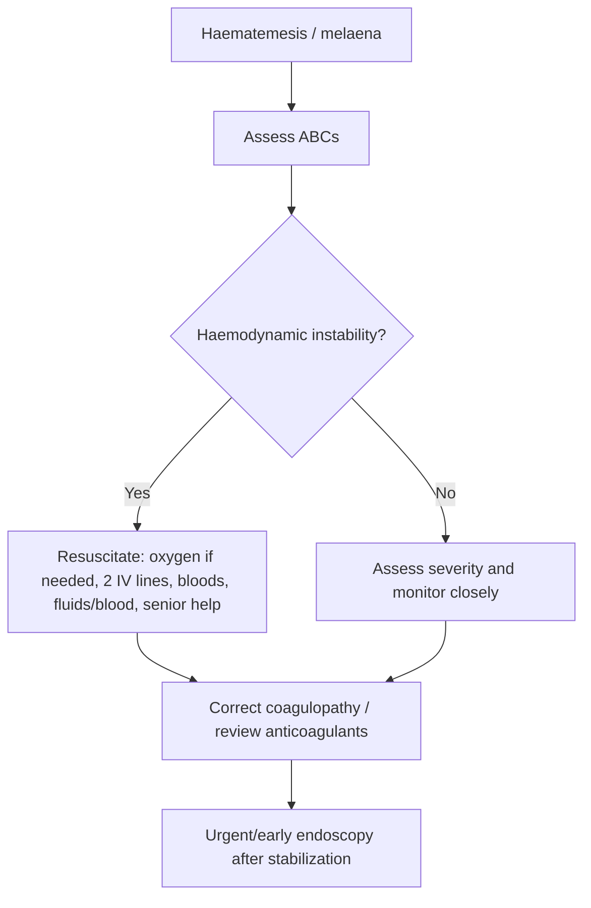
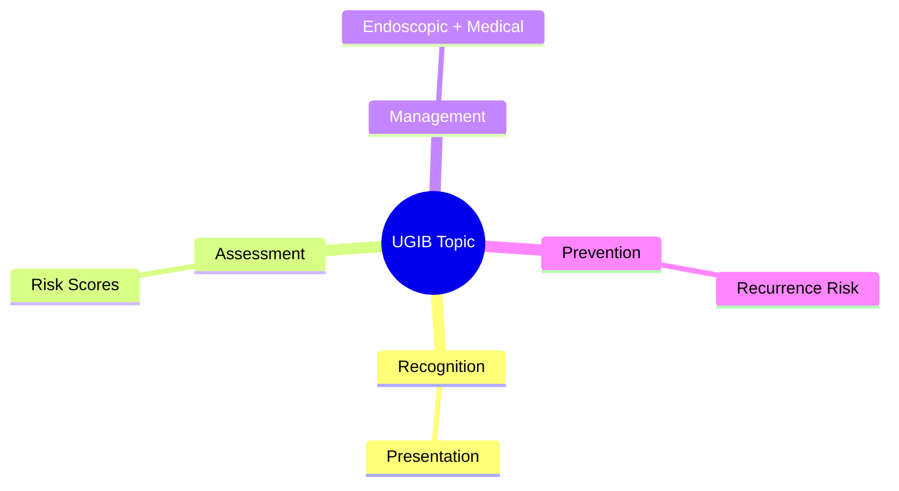
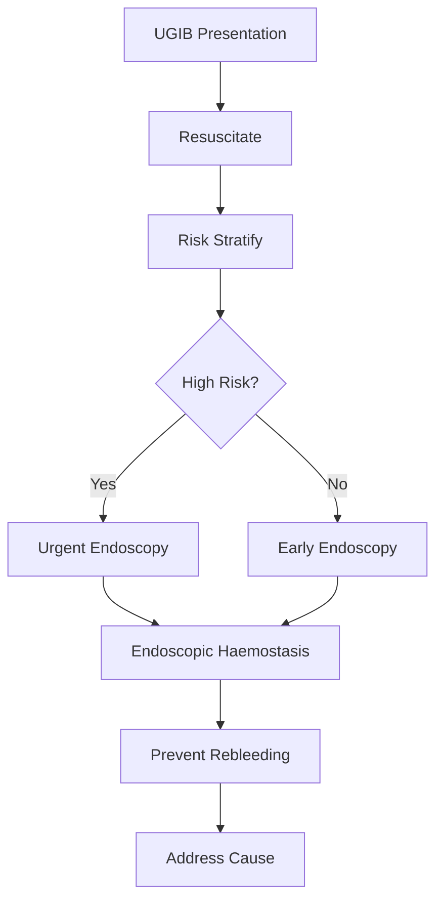

# Upper GI bleeding resuscitation priorities

Related: [[../Gastroenterology MOC|Gastroenterology MOC]] · [[../Upper Gastrointestinal Bleeding|Upper Gastrointestinal Bleeding]] · [[Initial assessment and stabilization|Initial assessment and stabilization]] · [[Risk stratification scores in upper GI bleeding]] · [[Restrictive transfusion and coagulopathy reversal]] · [[Peptic ulcer bleeding]]

> [!danger]
> In FCPS/MRCP logic, **resuscitation comes before definitive diagnosis** in upper GI bleeding.

## 1. Learning Objectives
- Recognize upper GI bleeding severity quickly.
- Apply ABC resuscitation priorities.
- Know transfusion, access, monitoring, and escalation principles.
- Understand when urgent endoscopy follows stabilization.

## 2. Definition
**Upper GI bleeding (UGIB)** refers to haemorrhage arising proximal to the ligament of Treitz, presenting typically with haematemesis, coffee-ground vomiting, melaena, or occasionally brisk haematochezia if severe.

## 3. Anatomy
Potential sources include:
- oesophagus
- stomach
- duodenum

This note focuses on **resuscitation priorities**, not source-specific pathology.

## 4. Physiology
Acute blood loss causes:
- reduced circulating volume
- tachycardia, vasoconstriction
- hypotension/shock if severe
- impaired organ perfusion

Airway risk increases because blood can be vomited and aspirated.

## 5. Severity / Classification
### Clinical severity clues
- haemodynamic instability
- syncope or pre-syncope
- ongoing haematemesis
- shock index elevation / poor perfusion
- low urine output
- altered mental state

### Important clinical categories
- stable bleed
- major bleed with haemodynamic compromise
- exsanguinating bleed / peri-arrest scenario

## 6. Etiology Snapshot
Common upper GI causes include:
- peptic ulcer bleeding
- erosive disease
- Mallory-Weiss tear
- variceal bleeding

But resuscitation principles are similar initially.

## 7. Clinical Features
- haematemesis
- coffee-ground vomiting
- melaena
- dizziness/syncope
- palpitations
- weakness
- hypotension/shock

## 8. Resuscitation Priorities
### 1. Airway
- assess risk of aspiration
- consider airway protection in massive haematemesis, reduced consciousness, ongoing active vomiting of blood

### 2. Breathing
- oxygen if hypoxaemic or critically unwell
- monitor saturation and respiratory effort

### 3. Circulation
- **two large-bore IV cannulas**
- send bloods urgently: CBC, U&E, coagulation, group and save / crossmatch
- start crystalloid resuscitation while arranging blood products as needed
- continuous pulse/BP monitoring
- urinary catheter if shock/severe bleed to monitor output when appropriate

### 4. Blood product strategy
- follow a generally **restrictive transfusion strategy** unless massive bleeding/shock dictates urgent blood replacement
- transfuse packed red cells when clinically indicated and according to haemoglobin plus haemodynamic context
- correct major coagulopathy/anticoagulant effect when appropriate

### 5. Senior help / escalation
- early senior review
- alert endoscopy and critical care teams early in major bleed

## 9. Investigations During Resuscitation
- CBC / haemoglobin
- U&E
- coagulation profile
- blood group and crossmatch
- lactate/VBG or ABG in shocked patients
- ECG in older/comorbid patients

## 10. Interpretation Framework
### UGIB bedside algorithm
1. Recognize bleed: haematemesis/melaena.
2. Assess shock and mental state.
3. Secure ABCs.
4. Obtain large-bore access and bloods.
5. Start fluid/blood resuscitation as indicated.
6. Reverse anticoagulation/coagulopathy where necessary.
7. Risk-stratify and plan urgent endoscopy after stabilization.

### Important exam principle
A normal early haemoglobin does **not** exclude major acute bleeding.

## 11. Diagnosis
The syndrome diagnosis is **upper GI bleeding**.
Source diagnosis comes after stabilization via endoscopy and clinical context.

## 12. Differential Diagnosis
- swallowed blood from epistaxis
- haemoptysis misidentified as haematemesis
- iron/bismuth black stool vs melaena
- lower GI bleeding with rapid transit (in severe cases)

## 13. Management
### Immediate management bundle
- resuscitate first
- keep patient nil by mouth
- monitor vitals frequently
- arrange urgent endoscopy after stabilization
- start targeted pharmacologic measures if specific source strongly suspected per protocol

### Pharmacologic principles
- IV PPI is commonly used when non-variceal ulcer bleeding is suspected/after endoscopy depending on pathway
- vasoactive/antibiotic strategies are considered if variceal bleeding suspected, but source-specific details belong elsewhere

### Endoscopy timing
- urgent/early endoscopy after initial stabilization
- unstable patients may need ICU-level support before or during definitive management

## 14. Complications
- shock
- myocardial ischemia
- acute kidney injury
- aspiration
- death
- recurrent bleeding

## 15. Red Flags / Emergencies
- haemodynamic instability
- ongoing brisk haematemesis
- altered consciousness
- chest pain during bleed
- oliguria
- rising lactate / poor perfusion

## 16. One-Page Summary
- UGIB is a **resuscitation emergency**.
- **ABC first**, source diagnosis second.
- Use **2 large-bore IV lines**, send bloods and crossmatch.
- Monitor BP, pulse, mental state, and urine output.
- Restrictive transfusion is common, but active shock/massive bleeding overrides hesitation.
- Early senior/endoscopy/critical-care escalation saves lives.
- A single normal Hb early on does **not** rule out major acute blood loss.

## 17. FCPS/MRCP High-Yield Points
- Resuscitation before endoscopy.
- Airway protection matters in massive haematemesis.
- Shock may be present before Hb falls significantly.
- Crossmatch and coagulation assessment are essential.
- Early escalation is a major exam point.

## 18. Common Viva Traps
- Rushing to endoscopy before stabilizing the patient.
- Using Hb alone to judge severity.
- Forgetting aspiration risk.
- Failing to secure large-bore access.

## 19. Mind Map
- UGIB resuscitation
  - ABC
  - 2 IV cannulas
  - blood tests / crossmatch
  - fluids / blood
  - monitor urine output
  - urgent endoscopy after stabilization

## 20. Flowchart

## 21. Revision Prompts
- What are the first 5 actions in major UGIB?
- Why can Hb be initially misleading?
- When do you worry about airway protection?
- What monitoring is essential in shock?

## 22. MCQs (10)
1. In major upper GI bleeding, the first priority is:
A. Colonoscopy
B. Resuscitation using ABC principles
C. Oral feeding
D. Stool culture

2. Large-volume haematemesis mainly threatens which immediate complication?
A. Aspiration
B. Appendicitis
C. Renal stones
D. Coeliac disease

3. Best vascular access in severe UGIB is:
A. Two large-bore IV cannulas
B. One small butterfly needle
C. No IV access needed
D. Intramuscular injection only

4. A normal early haemoglobin in acute UGIB means:
A. Major bleed is excluded
B. Bleeding is always chronic
C. Major bleeding may still be present
D. Endoscopy is unnecessary

5. Which blood tests are important initially?
A. CBC, U&E, coagulation, group and crossmatch
B. Thyroid antibodies only
C. ANA only
D. Vitamin D only

6. Which is a sign of major bleed severity?
A. Syncope and hypotension
B. Mild bloating only
C. Flatulence only
D. Chronic constipation

7. Resuscitation should generally occur:
A. After discharge
B. Before definitive diagnostic procedures
C. Only after colonoscopy
D. Only after biopsy report

8. Which monitoring may help assess resuscitation response in severe bleed?
A. Urine output
B. Hair growth
C. Visual acuity
D. Finger length

9. Ongoing brisk haematemesis with altered consciousness should prompt concern for:
A. Airway compromise
B. IBS
C. Lactose intolerance
D. Haemorrhoids

10. Which statement is correct?
A. Endoscopy always precedes stabilization
B. Shock may develop from acute UGIB
C. UGIB cannot cause AKI
D. Crossmatching is unnecessary

## 23. SBA Questions (10)
1. A 68-year-old man presents with haematemesis, BP 85/55, pulse 122, and cool extremities. Best immediate approach?
A. Book outpatient endoscopy
B. ABC resuscitation with urgent IV access, bloods, and blood-product planning
C. Start oral iron
D. Reassure only

2. A patient with massive haematemesis becomes drowsy. Most immediate concern?
A. Aspiration and airway protection
B. Coeliac disease
C. IBS
D. Chronic pancreatitis

3. Which action is most appropriate early in major UGIB?
A. Two large-bore IV cannulas and crossmatch
B. High-fibre diet
C. Colonoscopy prep
D. Discharge with antacid

4. A patient with melaena is stable but tachycardic. Best principle?
A. Bleeding severity still requires formal assessment and monitoring
B. Stable appearance excludes significant bleed
C. No blood tests are needed
D. Hb will always be low immediately

5. Which result may be misleadingly normal early in acute haemorrhage?
A. Haemoglobin
B. Stool color
C. Heart rate
D. Blood pressure in shock

6. Why is urine output useful in severe UGIB?
A. It reflects end-organ perfusion
B. It diagnoses ulcer cause directly
C. It replaces endoscopy
D. It confirms H. pylori

7. Which team should often be involved early in a major bleed?
A. Senior/endoscopy/critical-care support
B. Orthopedics only
C. Dermatology only
D. Ophthalmology only

8. A patient with active haematemesis and warfarin use may require:
A. Consideration of coagulopathy reversal
B. Gluten-free diet
C. Antidiarrhoeals only
D. No action on clotting

9. What is the correct sequence principle?
A. Stabilize first, then definitive diagnostic/therapeutic endoscopy
B. Endoscopy first regardless of shock
C. Colonoscopy first
D. CT brain first

10. A patient with UGIB develops chest pain and oliguria. This suggests:
A. Significant systemic hypoperfusion/complications
B. Harmless reflux only
C. Functional dyspepsia
D. Anal fissure

## 24. Flashcards
- Q: What is the first principle in major UGIB?  
  A: ABC resuscitation before definitive diagnosis.
- Q: How many IV lines are preferred in major UGIB?  
  A: Two large-bore IV cannulas.
- Q: Name 4 urgent blood tests in UGIB.  
  A: CBC, U&E, coagulation, group and crossmatch.
- Q: Why can Hb be initially normal in acute bleeding?  
  A: Hemodilution may not yet have occurred.
- Q: When is airway protection especially important?  
  A: Massive haematemesis or reduced consciousness.

## 25. Answer Key with Explanations
### MCQs
1. **B** — resuscitation is always the first priority.
2. **A** — blood aspiration is a major immediate danger.
3. **A** — adequate large-bore access is essential.
4. **C** — early Hb may not reflect full blood loss.
5. **A** — these are the core initial tests.
6. **A** — syncope and hypotension indicate severity.
7. **B** — stabilization precedes definitive procedures.
8. **A** — urine output reflects renal perfusion and response.
9. **A** — airway compromise is a critical concern.
10. **B** — severe UGIB can certainly cause shock and AKI.

### SBAs
1. **B** — this is shock from UGIB until proven otherwise.
2. **A** — drowsiness plus haematemesis raises aspiration risk.
3. **A** — prompt access and crossmatch are fundamental.
4. **A** — tachycardia may still indicate significant blood loss.
5. **A** — Hb can lag behind acute blood loss.
6. **A** — urine output is a perfusion marker.
7. **A** — major bleeds need early senior and endoscopy/critical-care involvement.
8. **A** — anticoagulant effect must be addressed appropriately.
9. **A** — stabilize first, then scope.
10. **A** — chest pain and oliguria imply significant systemic compromise.

## 26. Mind Map

## 27. Flowchart

## 28. Must Know / Should Know / Nice to Know
### Must Know
- Resuscitation before endoscopy
- Rockall/Glasgow-Blatchford scores for risk
- Endoscopic haemostasis for high-risk stigmata
- PPI for non-variceal; vasoactives for variceal
- Restrictive transfusion (Hb <70-80)

### Should Know
- Timing: <24h for high-risk
- Antithrombotic management
- Rebleeding prediction

### Nice to Know
- Novel haemostatic agents
- Early enteral nutrition
- Transfusion threshold debates

## 29. Self-Test Scorecard
- Can I state the resuscitation priorities? /10
- Can I apply Rockall/B modified? /10
- Can I list high-risk endoscopic stigmata? /10
- Can I outline the antithrombotic plan? /10

**Interpretation:**
- **<35/40** = weak topic
- **35-36/40** = acceptable but insecure
- **37+/40** = exam-ready

## 30. Revision Prompts
- What is the first priority in UGIB?
- Which risk score do you use and why?
- When is urgent endoscopy indicated?
- How do you manage antithrombotics?

## 31. Answer Key with Explanations

## PasTest Scenario SBAs (Clinical Vignettes)

> **Auto-generated PasTest/Mediscope-style scenario SBAs** grounded in the authored source. Each scenario tests a real clinical fact (triad, specific sign, contraindication, trial, first-line Rx) extracted from the topic. *Source: Ch 22: Gastroenterology — Upper GI bleeding resuscitation priorities*

**Q1.** What is the most appropriate first-line therapy for Upper GI bleeding resuscitation priorities?

  - **A.** start targeted pharmacologic measures if specific source strongly suspected per protocol
  - **B.** An advanced/surgical therapy reserved for refractory disease
  - **C.** Symptomatic treatment only, no disease-modifying therapy
  - **D.** Empiric broad-spectrum therapy without specific indication

  > **Answer: A** — start targeted pharmacologic measures if specific source strongly suspected per protocol
  >
  > *Source:* start targeted pharmacologic measures if specific source strongly suspected per protocol

