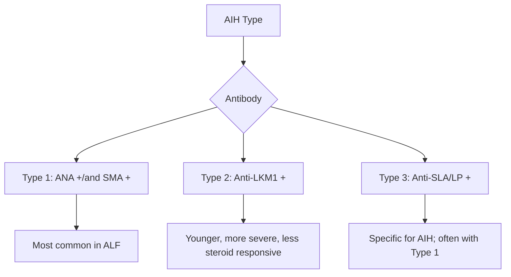
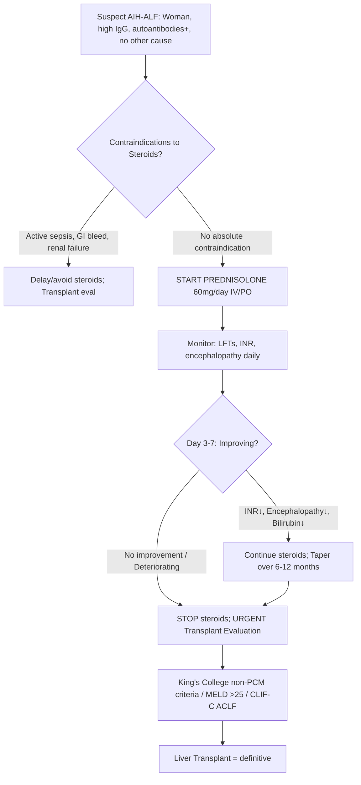
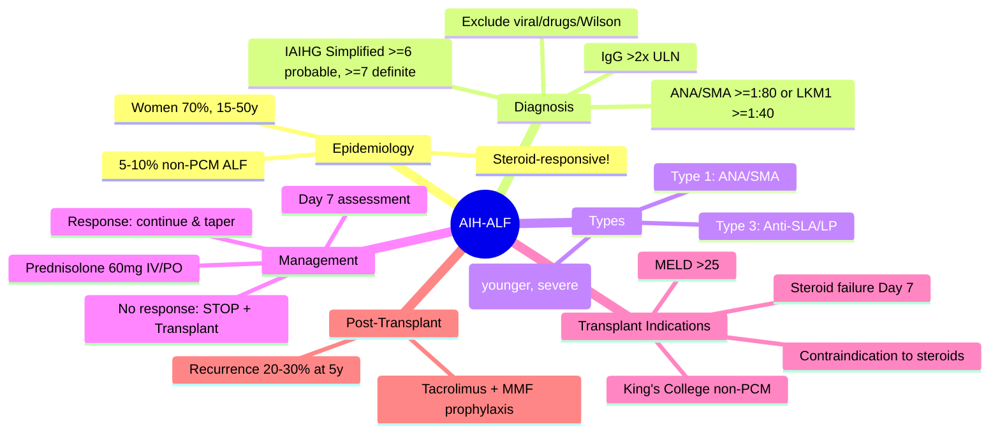

## 1. Learning Objectives
- [ ] Recognize AIH as cause of ALF (5-10% of non-paracetamol ALF)
- [ ] Apply IAIHG simplified criteria in acute setting
- [ ] Differentiate AIH-ALF from Wilson, viral, DILI
- [ ] Know steroid therapy indications and contraindications
- [ ] Identify transplant criteria for steroid-refractory AIH-ALF

---

## 2. Epidemiology & Clinical Context

| Feature | AIH-ALF |
|---------|---------|
| **% of non-PCM ALF** | 5-10% |
| **Demographic** | Women 70%, age 15-50 (bimodal: young & perimenopausal) |
| **Precipitants** | Infection, drugs, pregnancy, surgery, withdrawal of immunosuppression |
| **Presentation** | Acute/subacute jaundice, encephalopathy, coagulopathy |
| **Steroid response** | 60-80% if started early |
| **Transplant-free survival** | 60-80% with steroids |

> **FCPS/MRCP Pearl**: AIH-ALF is the **ONLY potentially steroid-responsive ALF** — early recognition is life-saving

---

## 3. Diagnostic Criteria (IAIHG Simplified) — Adapted for ALF

| Parameter | Cut-off | Points |
|-----------|---------|--------|
| **ANA or SMA** | ≥1:40 | +1 |
|  | ≥1:80 | +2 |
| **Anti-LKM1** | ≥1:40 | +2 |
| **IgG** | >ULN | +1 |
|  | >1.1×ULN | +2 |
| **Histology** | Compatible | +1 |
|  | Typical | +2 |
| **Exclusion of viral hepatitis** | Yes | +2 |

| Total Score | Interpretation |
|-------------|----------------|
| **≥7** | Definite AIH |
| **6** | Probable AIH |

> **In ALF setting**: Histology often unavailable (coagulopathy) → rely on serology + IgG + exclusion

---

## 4. Autoantibody Patterns in ALF

| Type | Antibody | Age | Severity | Steroid Response |
|------|----------|-----|----------|------------------|
| **Type 1** | ANA ± SMA | Any (peak 20-40) | Variable | Good |
| **Type 2** | Anti-LKM1 | Children/young adults | More severe | Less favourable |
| **Type 3** | Anti-SLA/LP | Adults | Severe | Good |

---

## 5. AIH-ALF vs Other ALF Causes

| Feature | AIH-ALF | Wilson ALF | Viral ALF | DILI-ALF |
|---------|---------|------------|-----------|----------|
| **Age/Sex** | Women 15-50 | <40, F>M | Any | Any (drug-specific) |
| **IgG** | **↑↑** | Normal | Normal | Normal |
| **Autoantibodies** | **ANA/SMA/LKM+** | Negative | Negative | Variable |
| **Ceruloplasmin** | Normal/↑ | Low | Normal | Normal |
| **Haemolysis** | Absent | **Coombs-neg (+)** | Absent | Absent |
| **ALP** | Normal/mild ↑ | **Very low (ratio <2)** | Normal | Variable |
| **History** | Prior AIH? Autoimmune disease? | Family history? | Risk factors | Drug temporal relationship |
| **Steroid trial** | **Indicated** | Contraindicated | Contraindicated | Contraindicated |

---

## 6. Management Algorithm for Suspected AIH-ALF

### Steroid Regimen
- **Prednisolone 60mg/day** (IV if encephalopathy grade 3-4, PO if grade 1-2)
- **Assess at Day 7** (Lille score equivalent)
- **Response**: INR <1.5, encephalopathy resolved, bilirubin falling
- **Non-response**: Stop steroids, list for transplant
- **Azathioprine**: NOT used in ALF (slow onset, myelosuppression risk)

---

## 7. Indications for Liver Transplant in AIH-ALF

| Criterion | Threshold |
|-----------|-----------|
| **King's College (non-PCM)** | pH <7.3 OR (INR >6.5 + Cr >200 + Grade 3-4 HE) |
| **MELD** | >25 (some use >30) |
| **CLIF-C ACLF** | Grade 2-3 |
| **Failure of steroid trial** | No improvement at Day 7 |
| **Contraindication to steroids** | Active sepsis, uncontrolled GI bleed |

> **Post-transplant**: AIH recurrence in 20-30% at 5 years — maintenance immunosuppression (tacrolimus + MMF) reduces risk

---

## 8. FCPS/MRCP High-Yield Summary

| Feature | AIH-ALF |
|---------|---------|
| **Demographic** | Women 15-50 |
| **IgG** | ↑↑ (often >2×ULN) |
| **Autoantibodies** | ANA/SMA ≥1:80 or LKM1 ≥1:40 |
| **Ceruloplasmin** | Normal/↑ |
| **Haemolysis** | Absent |
| **ALP** | Normal/mild ↑ |
| **Steroid trial** | **Pred 60mg → assess Day 7** |
| **Response rate** | 60-80% if early |
| **Transplant if** | Steroid failure Day 7 / King's College / MELD >25 |

---

## 9. Viva Questions

1. **What is the simplified IAIHG criteria? How does it apply in ALF?**
2. **Differentiate AIH-ALF from Wilson ALF.**
3. **What is the steroid regimen for AIH-ALF? When do you assess response?**
4. **What are contraindications to steroids in ALF?**
5. **What is the transplant-free survival with steroids in AIH-ALF?**
6. **Why is azathioprine not used in acute setting?**
7. **Describe Type 1 vs Type 2 AIH antibody patterns.**
8. **Diagnosis: Young woman, ALF, IgG 30g/L, ANA 1:320, ceruloplasmin normal. What is it?**
9. **How does AIH recurrence post-transplant present?**
10. **What autoantibody is specific for AIH but not in simplified criteria?**

---

## 10. Confusions & Mnemonics

| Confusion | Clarification |
|-----------|---------------|
| AIH-ALF vs Wilson ALF | AIH: high IgG, autoantibodies+, normal ceruloplasmin, NO haemolysis; Wilson: low ceruloplasmin, haemolysis, low ALP ratio |
| AIH-ALF vs DILI | DILI: temporal drug relationship, RUCAM probable, no autoantibodies (usually), no IgG elevation |
| Steroid trial timing | **Day 7** assessment (Lille equivalent) — if no improvement, STOP and list |
| Azathioprine in ALF | **Contraindicated** — slow onset (4-6 weeks), myelosuppression in liver failure |
| Anti-SLA/LP | Specific for AIH (95% specific) — not in simplified criteria but high yield |

---

## 11. Mind Map

---

## 12. One-Page Revision Card

| **AIH-ALF** | **Details** |
|-------------|-------------|
| % non-PCM ALF | 5-10% |
| Peak age/sex | Women 15-50 |
| IgG | ↑↑ (>2×ULN common) |
| Autoantibodies | ANA/SMA ≥1:80, LKM1 ≥1:40 |
| Ceruloplasmin | Normal/↑ |
| Haemolysis | Absent |
| ALP | Normal/mild ↑ |
| Steroid trial | Pred 60mg → Day 7 assess |
| Response rate | 60-80% |
| Transplant if | No response Day 7, King's College, MELD >25 |

---

## 13. Spaced Repetition Tracker

| Day | 1 | 3 | 7 | 15 | 30 |
|-----|---|---|---|----|----|
| IAIHG simplified criteria | ☐ | ☐ | ☐ | ☐ | ☐ |
| AIH vs Wilson ALF table | ☐ | ☐ | ☐ | ☐ | ☐ |
| Steroid regimen & Day 7 | ☐ | ☐ | ☐ | ☐ | ☐ |
| Transplant indications | ☐ | ☐ | ☐ | ☐ | ☐ |

---

## 14. Self-Test Scorecard

| Question | My Answer | Correct? |
|----------|-----------|----------|
| AIH-ALF IAIHG criteria |  |  |
| Steroid dose and Day 7 |  |  |
| AIH vs Wilson differentiation |  |  |
| Transplant criteria |  |  |

---

## 15. Local Navigation

- [[Autoimmune Liver Disease/Autoimmune hepatitis (AIH)|AIH]]
- [[Autoimmune Liver Disease/AIH diagnostic criteria (IAIHG simplified)|AIH Criteria]]
- [[Acute Liver Failure/Definition and Aetiology|ALF Definition]]
- [[Acute Liver Failure/King's College Criteria|King's College Criteria]]
- [[Acute Liver Failure/Wilson disease presenting as ALF|Wilson ALF]]