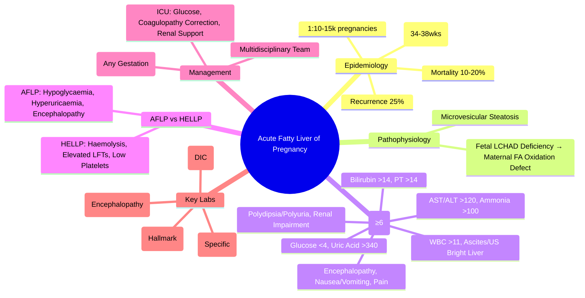

> [!tip] **FCPS/MRCP Priority: HIGH**
> **AFLP = Rare but catastrophic 3rd trimester liver failure** — **Swansea Criteria ≥6**, **hypoglycaemia**, **hyperuricaemia**, **coagulopathy**, **emergency delivery (C-section)**; **differentiate from HELLP** (AFLP = hypoglycaemia + hyperuricaemia + encephalopathy)

---

## 1. Learning Objectives
By the end of this note you should be able to:
- [ ] Diagnose AFLP using **Swansea Criteria (≥6)**
- [ ] Differentiate **AFLP vs HELLP vs Severe Pre-eclampsia**
- [ ] Initiate **emergency management**: delivery (C-section), ICU support, coagulation correction
- [ ] Recognise **recurrence risk** (~25%) in subsequent pregnancies

---

## 1. Definition & Epidemiology

| Feature | Detail |
|---------|--------|
| **Definition** | Acute liver failure due to microvesicular steatosis in 3rd trimester pregnancy |
| **Incidence** | **1:10,000-15,000** pregnancies |
| **Timing** | **3rd trimester** (typically 34-38 weeks) |
| **Maternal Mortality** | **10-20%** (improved with early recognition) |
| **Recurrence Risk** | **~25%** in subsequent pregnancies |

### Pathophysiology
| Mechanism | Detail |
|-----------|--------|
| **Mitochondrial FA Oxidation Defect** | **Fetal LCHAD deficiency** → maternal accumulation of toxic fatty acid metabolites |
| **Inheritance** | **Autosomal recessive** (fetal *HADHA* mutation); mother heterozygous carrier |

---

## 2. Swansea Diagnostic Criteria (≥6 = AFLP)

| Criterion | Threshold |
|-----------|-----------|
| Nausea / Vomiting | Present |
| Abdominal Pain | Present |
| Polydipsia / Polyuria | Present |
| Encephalopathy | Present |
| Bilirubin | **>14 µmol/L** |
| Hypoglycaemia | **<4 mmol/L** |
| Uric Acid | **>340 µmol/L** |
| Leukocytosis | **>11 ×10⁹/L** |
| Ascites / Bright Liver on US | Present |
| PT | **>14 seconds** |
| AST | **>120 U/L** |
| ALT | **>120 U/L** |
| Ammonia | **>100 µmol/L** |
| Renal Impairment (Cr) | **>150 µmol/L** |

**Score ≥6 = AFLP** (Sensitivity ~100%, Specificity ~95%)

---

## 3. Key Lab Findings

| Parameter | Typical Finding | Significance |
|----------|----------------|--------------|
| **Glucose** | **<4 mmol/L** (hypoglycaemia) | **Hallmark** — impaired gluconeogenesis |
| **Uric Acid** | **>340 µmol/L** | **Highly specific** (↑ purine degradation) |
| **PT/INR** | **Prolonged** (>14s / INR >1.5) | Coagulopathy (DIC common) |
| **AST/ALT** | **Mild-moderate** (120-500 U/L) | Less than viral/ALF |
| **Ammonia** | **>100 µmol/L** | Encephalopathy risk |
| **Creatinine** | **>150 µmol/L** | Renal impairment |
| **WBC** | **>11 ×10⁹/L** | Leukocytosis |

---

## 3. AFLP vs HELLP vs Severe Pre-eclampsia

| Feature | **AFLP** | **HELLP** | **Severe Pre-eclampsia** |
|---------|----------|-----------|--------------------------|
| **Timing** | **34-38 weeks** | **24-36 weeks** | **>20 weeks** |
| **Hypoglycaemia** | **Yes (common, <4 mmol/L)** | Rare | Rare |
| **Hyperuricaemia** | **Yes (>340 µmol/L)** | Mild/Normal | Normal/Mild ↑ |
| **Encephalopathy** | **Common** | Rare | Rare |
| **Coagulopathy** | **DIC common** | Thrombocytopenia | Mild/None |
| **Platelets** | Low (but >50) | **<100 ×10⁹/L** | Normal/Mild ↓ |
| **LDH** | Normal/Mild ↑ | **>600 U/L** | Normal/Mild ↑ |
| **Transaminases** | Mild ↑ (120-500) | **Marked ↑ (2-10×)** | Mild ↑ |
| **Hypertension** | Uncommon | Common | **Defining feature** |
| **Proteinuria** | Mild/None | Common | **Defining feature** |

> **Key Differentiators**: **AFLP = Hypoglycaemia + Hyperuricaemia + Encephalopathy**; **HELLP = Haemolysis + Elevated LFTs + Low Platelets**

---

## 4. Management

### Immediate Management
```mermaid
flowchart TD
    A[Suspected AFLP] --> B[**Swansea Criteria ≥6?**]
    B -->|Yes| C[**Emergency Delivery** — **C-Section** (regardless of gestation)]
    C --> D[**ICU Admission**]
    D --> E[**Glucose Infusion** (10% dextrose @ 100-150ml/h) — **Correct Hypoglycaemia**]
    E --> F[**Coagulopathy Correction** — FFP, Platelets, Cryoprecipitate, Vitamin K]
    F --> G[**Renal Support** — Fluids, CRRT if needed]
    G --> H[**Multidisciplinary Team** — Obstetrics, Hepatology, ICU, Neonatology, Haematology]
```

### Delivery
| Aspect | Recommendation |
|--------|----------------|
| **Mode** | **Caesarean Section** (preferred — faster, avoids labour stress) |
| **Timing** | **Immediate** — regardless of gestation (34-38 weeks) |
| **Neonatal** | **Neonatology team present** — preterm neonate likely |

### Supportive Care
| Support | Details |
|---------|---------|
| **Glucose** | **10% Dextrose 100-150ml/h** — maintain glucose >4mmol/L |
| **Coagulopathy** | **FFP 15-20ml/kg**, **Platelets** if <50, **Cryoprecipitate** if fibrinogen <1.5, **Vitamin K 10mg IV** |
| **Renal** | Fluids, **CRRT** if oliguria + rising Cr |
| **Encephalopathy** | Lactulose, rifaximin, intubation if Grade III/IV |
| **Infection** | Prophylactic antibiotics if prolonged labour/ruptured membranes |

---

## 4. AFLP vs HELLP vs Severe Pre-eclampsia

> **Key**: **AFLP = Hypoglycaemia + Hyperuricaemia + Encephalopathy**; **HELLP = Haemolysis + Elevated LFTs + Low Platelets**

| Feature | **AFLP** | **HELLP** | **Severe Pre-eclampsia** |
|---------|----------|-----------|--------------------------|
| **Hypoglycaemia** | **Yes** (<4 mmol/L) | No | No |
| **Hyperuricaemia** | **Yes** (>340 µmol/L) | Mild | Mild/None |
| **Encephalopathy** | **Yes** | Rare | Rare |
| **Platelets** | Low (but >50) | **<100 ×10⁹/L** | Normal |
| **LDH** | Normal/Mild ↑ | **>600 U/L** | Normal/Mild ↑ |
| **PT/INR** | **Prolonged** (DIC) | Normal/Mild ↑ | Normal |

---

## 5. FCPS/MRCP High-Yield Summary

| Topic | Key Points |
|-------|------------|
| **AFLP Incidence** | 1:10,000-15,000; 3rd trimester (34-38wks); mortality 10-20% |
| **Swansea Criteria** | **≥6 = AFLP** (hypoglycaemia, hyperuricaemia, encephalopathy, coagulopathy, leukocytosis, elevated AST/ALT, bilirubin >14, PT>14, ammonia>100, renal impairment) |
| **Key Labs** | **Hypoglycaemia (<4)**, **Hyperuricaemia (>340)**, **Prolonged PT**, **Leukocytosis**, **Elevated Ammonia** |
| **AFLP vs HELLP** | **AFLP**: Hypoglycaemia + Hyperuricaemia + Encephalopathy; **HELLP**: Haemolysis + Elevated LFTs + Low Platelets |
| **Management** | **Emergency C-Section** (regardless of gestation) + **ICU support** (glucose, coagulopathy correction, renal support) |
| **Maternal Mortality** | **10-20%** (improved with early recognition) |
| **Recurrence** | **~25%** in subsequent pregnancies |
| **Differential** | HELLP (no hypoglycaemia/hyperuricaemia), Severe Pre-eclampsia (hypertension + proteinuria), Acute Viral Hepatitis |

---

## 6. Viva Questions (MRCP PACES / FCPS)

| Question | Expected Answer |
|----------|-----------------|
| **AFLP — Swansea Criteria, Key Labs, Management?** | **≥6 of**: Nausea, Pain, Polydipsia, Encephalopathy, Bil>14, Glucose<4, Uric>340, WBC>11, Ascites/US, PT>14, AST>120, ALT>120, NH3>100, Cr>150; **Low glucose, High uric acid, Coagulopathy** → **Emergency Delivery**. |
| **AFLP vs HELLP — Key Differences?** | **AFLP**: Hypoglycaemia, Hyperuricaemia, Encephalopathy, DIC; **HELLP**: Haemolysis (LDH↑, Schistocytes), Elevated LFTs, Low Platelets. |
| **Swansea Criteria — Components, Threshold?** | **≥6 of 14 criteria**: Nausea, Pain, Polydipsia, Encephalopathy, Bil>14, Glucose<4, Uric>340, WBC>11, Ascites/US, PT>14, AST>120, ALT>120, NH3>100, Cr>150. |
| **AFLP — Hypoglycaemia Mechanism?** | **Mitochondrial fatty acid oxidation defect** (fetal LCHAD deficiency) → impaired gluconeogenesis → hypoglycaemia. |
| **AFLP vs HELLP vs Pre-eclampsia — Key Differences?** | **AFLP**: Hypoglycaemia + Hyperuricaemia + Encephalopathy; **HELLP**: Haemolysis + Elevated LFTs + Low Platelets; **Pre-eclampsia**: Hypertension + Proteinuria. |
| **AFLP — Recurrence Risk?** | **~25%** in subsequent pregnancies. |
| **AFLP — Maternal Mortality, Improvement?** | **10-20%**; improved with early recognition and multidisciplinary care. |
| **AFLP vs Acute Viral Hepatitis — Differentiation?** | **AFLP**: 3rd trimester, hypoglycaemia, hyperuricaemia, encephalopathy; **Viral**: Any trimester, no hypoglycaemia, normal uric acid. |

---

## 6. Confusions & Mnemonics

| Confusion | Clarification |
|-----------|---------------|
| **AFLP vs HELLP** | **AFLP**: Hypoglycaemia, Hyperuricaemia, Encephalopathy, DIC; **HELLP**: Haemolysis (LDH↑, Schistocytes), Elevated LFTs, Low Platelets |
| **AFLP vs Acute Viral Hepatitis** | **AFLP**: 3rd trimester, Hypoglycaemia, Hyperuricaemia, Encephalopathy; **Viral**: Any trimester, No hypoglycaemia, Normal uric acid |
| **AFLP vs HELLP — Platelets** | **AFLP**: Low but usually >50; **HELLP**: <100 (often <50) |
| **AFLP — Hypoglycaemia Mechanism** | **Fetal LCHAD deficiency** → maternal accumulation of toxic metabolites → impaired gluconeogenesis |
| **AFLP vs Acute Viral Hepatitis** | **AFLP**: 3rd trimester, Hypoglycaemia, High Uric Acid, Encephalopathy; **Viral**: Any trimester, No hypoglycaemia, Normal Uric Acid |

**Mnemonic: AFLP-SWANSEA**
- **A**FLP: **3rd Trimester (34-38wks), Rare (1:10-15k)**
- **F**atty Liver of **P**regnancy: **Microvesicular Steatosis, Mitochondrial FA Oxidation Defect (LCHAD)**
- **L**iver Failure: **Coagulopathy, Encephalopathy, Renal Impairment**
- **I**cterus: **Bilirubin >14, AST/ALT >120**
- **P**regnancy: **3rd Trimester (34-38wks), Recurrence 25%**
- **S**wansea Criteria: **≥6 of 14 = AFLP**
- **W**hite Cells: **WBC >11 (Leukocytosis)**
- **A**mmonia: **>100 µmol/L (Encephalopathy)**
- **N**ewborn: **Preterm Delivery, NICU**
- **S**ugar: **Glucose <4 (Hypoglycaemia — HALLMARK)**
- **E**lectric: **Uric Acid >340 (Hyperuricaemia — SPECIFIC)**
- **A**cid-Base: **PT >14 (Coagulopathy/DIC), Creatinine >150 (Renal)**
- **HALLMARKS**: **Hypoglycaemia + Hyperuricaemia + Encephalopathy = AFLP**
- **E**mergency Delivery: **C-Section Regardless of Gestation**
- **L**actate? No — **Uric Acid**
- **P**regnancy: **Recurrence 25%**
- **I**CU: **Multidisciplinary (Obstetrics, Hepatology, ICU, Neonatology, Haematology)**

---

## 8. Mind Map



---

## 10. One-Page Revision Card

| Domain | Key Points |
|--------|------------|
| **Epidemiology** | 1:10-15k, 3rd trimester, Mortality 10-20%, Recurrence 25% |
| **Swansea Criteria** | ≥6 of 14 → AFLP (Glucose<4, Uric>340, Bil>14, PT>14, AST/ALT>120, NH3>100, WBC>11, Encephalopathy) |
| **Hallmark Labs** | **Hypoglycaemia (<4)**, **Hyperuricaemia (>340)**, **Coagulopathy (PT>14)** |
| **AFLP vs HELLP** | AFLP: Hypoglycaemia + Hyperuricaemia + Encephalopathy; HELLP: Haemolysis + Elevated LFTs + Low Platelets |
| **Management** | **Emergency C-Section** (any gestation) + **ICU** (Glucose, Coagulopathy, Renal) |
| **Multidisciplinary** | Obstetrics, Hepatology, ICU, Neonatology, Haematology |
| **Recurrence** | **~25%** in subsequent pregnancies |
| **Mortality** | **10-20%** (improved with early recognition) |

---

## 8. Spaced Repetition Trackers

| Review Interval | Date Completed | Confidence (1-5) | Notes |
|-----------------|----------------|------------------|-------|
| 24 hours | | | |
| 7 days | | | |
| 15 days | | | |
| 30 days | | | |
| 90 days | | | |

---

## 9. Self-Test Scorecard

| Section | Score /5 | Last Attempt |
|---------|----------|--------------|
| Swansea Criteria | | |
| AFLP vs HELLP | | |
| Key Lab Findings | | |
| Management (Delivery + ICU) | | |
| Differential Diagnosis | | |
| Recurrence & Mortality | | |

---

## 2. Local Navigation
- **Parent Heading**: [[../Hepatology|Hepatology]]
- **Chapter Map": [[../Davidson Chapter 24 - Hepatology Hierarchy|Hepatology Hierarchy]]
- **Chapter MOC": [[../Hepatology MOC|Hepatology MOC]]
- **Drug Reference": [[../../Clinical Therapeutics and Good Prescribing|Drugs]]
- **Related": [[Hepatology in Special Situations]], [[Acute Liver Failure]], [[HELLP Syndrome]], [[ICP]], [[Viral Hepatitis in Pregnancy]]