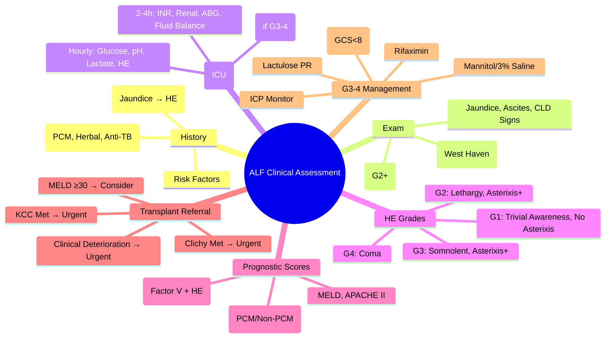

## 1. Learning Objectives
- [ ] Perform structured clinical assessment of ALF patient
- [ ] Apply monitoring protocols for ICU management
- [ ] Apply prognostic scores (King's College, CLIF-C, MELD, APACHE)
- [ ] Determine transplant referral timing
- [ ] Identify FCPS/MRCP high-yield monitoring parameters

---

## 2. Initial Clinical Assessment

```mermaid
flowchart TD
    A[Patient with Suspected ALF] --> B[History]
    B --> C[Drug History: Paracetamol, Herbal, Anti-TB, Antibiotics, Alcohol]
    B --> D[Risk Factors: Travel, Sexual, IVDU, Transfusion, Autoimmune]
    B --> E[Timeline: Jaundice Onset → Encephalopathy]
    B --> F[Past Liver Disease?]
    F -->|Yes| G[Consider ACLF Not ALF]
    F -->|No| H[Proceed ALF Workup]
    H --> I[Physical Exam]
    I --> J[Encephalopathy Grade (West Haven)]
    I --> K[Signs: Jaundice, Ascites, Hepatomegaly, Stigmata CLD]
    I --> L[Signs: Asterixis, Fetor Hepaticus, Collateral Veins]
```

---

## 3. Encephalopathy Grading (West Haven)

| Grade | Consciousness | Intellectual | Behaviour | Neurological |
|-------|---------------|--------------|-----------|--------------|
| **0** | Normal | Normal | Normal | Normal |
| **1** | Trivial lack of awareness | Short attention, Impaired arithmetic | Euphoria/Anxiety, Irritability | **Asterixis ABSENT** |
| **2** | **Lethargy** | Disorientation (Time), Personality change | Inappropriate | **Asterixis PRESENT** |
| **3** | **Somnolent but Rousable** | Confusion (Place), Gross disorientation | Bizarre | Asterixis, Hyperreflexia, Rigidity |
| **4** | **Coma (Unrousable)** | No response | No response | Decerebrate, Seizures |

> **FCPS/MRCP**: **Covert** = MHE/G1 (No asterixis); **Overt** = G2-4 (Asterixis present)

---

## 4. Essential Monitoring Parameters (ICU)

| Parameter | Frequency | Target / Action Threshold |
|-----------|-----------|---------------------------|
| **Encephalopathy Grade** | **Hourly (G3-4), 2-4h (G1-2)** | G3-4 → Intubation Consideration |
| **Arterial pH / Lactate** | **Hourly (Unstable), 2-4h** | pH <7.3 → KCC Met; Lactate >4 → Resuscitate |
| **Blood Glucose** | **Hourly** | **<3.5 mmol/L → IV Dextrose** (Hypoglycaemia common) |
| **INR / PT** | **2-4 Hourly** | Rising → KCC Assessment; FFP if Bleeding/Procedure |
| **Renal Function (Cr, Urea, K, Na, Mg, Phos)** | **2-4 Hourly** | Cr Rise → HRS Assessment; K/Mg/Phos Replace |
| **Fluid Balance** | **Hourly** | Target Euvolaemia; Avoid Overload (Cerebral Oedema) |
| **ABG / Electrolytes** | **2-4 Hourly** | Correct Acidosis, Hypokalaemia, Hypophosphataemia |
| **Cardiovascular (HR, BP, CVP, Vasopressors)** | **Continuous** | MAP ≥65; Norepinephrine First-Line |
| **Temperature** | **4 Hourly** | >38.3 → Cultures + Antibiotics |
| **ICP (if Monitored)** | **Continuous** | **>20 mmHg → Mannitol/Hypertonic Saline** |

---

## 5. Laboratory Monitoring Schedule

| Test | Frequency | Critical Values |
|------|-----------|-----------------|
| **ABG (pH, Lactate, Glucose)** | Hourly initially | pH <7.3, Lactate >4, Glucose <3.5 |
| **FBC** | 6-12 Hourly | Hb Drop (Bleeding), WBC (Infection) |
| **Coagulation (PT/INR, APTT, Fibrinogen)** | 4-6 Hourly | INR Rise → KCC; Fibrinogen <1.5 → Cryoprecipitate |
| **LFTs (ALT, AST, Bilirubin, ALP, GGT)** | 6-12 Hourly | Trend (Not prognostic alone) |
| **Renal (U&E, Cr, Urea, Mg, Phos)** | 6-12 Hourly | Cr Rise → HRS; Phos <0.5 Replace |
| **Ammonia** | 6-12 Hourly | Correlates Poorly; Supportive Only |
| **Blood Gas (Venous/Arterial)** | Hourly (Unstable) | pH, Lactate, Base Excess |
| **Blood/urine cultures** | On Admission + If Fever | Guide Antibiotics |

---

## 6. Encephalopathy Management

| Grade | Airway | Lactulose | Rifaximin | ICP Monitor | Antibiotics |
|-------|--------|-----------|-----------|-------------|-------------|
| **1-2** | Ward, Monitor | 15-30ml BD → 2-3 soft stools | Not Routine | No | If Infection Suspected |
| **3-4** | **ICU, Intubate (GCS<8)** | PR 300ml/700ml q4-6h | **550mg BD NG** | **Consider** | Prophylactic (Some Units) |

> **Cerebral Oedema**: Main risk in G3-4; Target ICP <20 mmHg; CPP >60 mmHg; Head Up 30°

---

## 7. Prognostic Scores in ALF

### 1. King's College Criteria (KCC)

| Population | Criteria | Action if Met |
|------------|----------|---------------|
| **Paracetamol** | **pH <7.30** (post-resuscitation) **OR** (PT >100s + Cr >300 μmol/L + HE Grade III/IV) | Urgent Transplant Referral |
| **Non-Paracetamol** | **PT >100s (INR >6.5)** **OR** Any 3 of: Age <10 or >40, Non-A/Non-B/Drug/Indeterminate, Jaundice→HE >7d, PT >50s, Bilirubin >300 μmol/L | Urgent Transplant Referral |

### 2. Clichy Criteria (Paracetamol Alternative)
| Criterion | Threshold |
|-----------|-----------|
| **Factor V** | **<20%** (if <30y) **or <30%** (if ≥30y) |
| **AND** | **HE Grade III/IV** |

### 3. MELD Score (General)
```
MELD = 3.78×ln(Bilirubin) + 11.2×ln(INR) + 9.57×ln(Creatinine) + 6.43
```
- **MELD ≥30**: High Mortality; Consider Transplant

### 4. APACHE II / SOFA
- **APACHE II ≥15** or **SOFA ≥8**: High ICU Mortality

---

## 8. Transplant Referral Criteria

```mermaid
flowchart TD
    A[ALF Diagnosis] --> B[KCC Assessment Daily]
    B --> C{KCC Met?}
    C -->|Yes| D[URGENT Transplant Referral]
    C -->|No| E[Clinical Deterioration?]
    E -->|Yes| D
    E -->|No| F[KCC Daily Reassessment]
    D --> G[Contact Transplant Centre]
    D --> H[Continue NAC (if PCM)]
    D --> I[ICU Optimisation]
```

### Indications for Urgent Transplant Referral
| Indication | Detail |
|------------|--------|
| **KCC Met** | Primary Indication |
| **Clichy Criteria Met** | Factor V <20/30% + HE III/IV |
| **MELD ≥30** | Alternative Threshold |
| **Clinical Deterioration** | Despite Max Medical Therapy |
| **Uncontrollable ICP** | >25 mmHg Despite Therapy |
| **Multi-organ Failure** | Progressive Despite Support |

---

## 9. FCPS/MRCP High-Yield Summary

| Concept | Key Points |
|---------|------------|
| **Encephalopathy Grading** | G1-2: No asterixis; G3-4: Asterixis present |
| **Monitoring** | Hourly: Glucose, pH, Lactate, Encephalopathy; 2-4h: INR, Renal |
| **Hypoglycaemia** | **Common** — Hourly Glucose, IV Dextrose |
| **KCC Paracetamol** | pH<7.3 OR (PT>100s + Cr>300 + HE III/IV) |
| **KCC Non-PCM** | PT>100s OR 3 of 5 Minor Criteria |
| **Clichy Criteria** | Factor V <20% (<30y) / <30% (≥30y) + HE III/IV |
| **Transplant Referral** | KCC Met → Urgent Super-Urgent Listing |
| **Cerebral Oedema** | G3-4 Risk; ICP >20 → Mannitol/3% Saline |

---

## 10. Viva Questions

1. **What are the monitoring parameters in ALF ICU?**
2. **How do you grade hepatic encephalopathy (West Haven)?**
3. **What are the King's College Criteria for paracetamol ALF?**
3. **What are the King's College Criteria for non-paracetamol ALF?**
4. **What is the difference between King's College and Clichy criteria?**
5. **When do you refer ALF for transplant?**
6. **How do you manage Grade 3-4 encephalopathy?**
7. **What is the role of lactate monitoring in ALF?**
8. **What is Factor V in Clichy criteria?**
9. **How often do you reassess KCC?**
10. **What is the management of hypoglycaemia in ALF?**

---

## 11. Confusions & Mnemonics

| Confusion | Clarification |
|-----------|---------------|
| Grade 1 vs 2 Asterixis | **G1: Absent; G2: Present** |
| KCC PCM vs Non-PCM | PCM: pH<7.3 OR (PT>100+Cr>300+HE III/IV); Non-PCM: PT>100 OR 3 of 5 Minor |
| Minor Criteria Non-PCM | AAIII: Age <10/>40, Aetiology, Interval>7d, INR>3.5, Icterus (Bil>300) |
| Factor V Clichy | <20% if <30y; <30% if ≥30y + HE III/IV |
| ICP Monitoring | G3-4 if Available; Target <20 mmHg; CPP >60 |
| Hypoglycaemia in ALF | **Hourly Glucose** — Gluconeogenesis Impaired; IV Dextrose |
| NAC in Non-PCM ALF | **Beneficial in Early HE (G1-2)** — ALFSG Trial |

---

## 12. Mind Map



---

## 13. One-Page Revision Card

| **Monitoring (ICU)** | **Frequency** |
|----------------------|---------------|
| Glucose | **Hourly** |
| pH / Lactate | **Hourly** |
| Encephalopathy | **Hourly** |
| INR / Coagulation | 2-4 Hourly |
| Renal Function | 2-4 Hourly |
| Fluid Balance | Hourly |

| **West Haven Grades** | **Features** | **Asterixis** |
|-----------------------|--------------|---------------|
| 1 | Trivial Awareness, Impaired Maths | **Absent** |
| 2 | Lethargy, Disorientation (Time) | **Present** |
| 3 | Somnolent, Confusion (Place) | Present |
| 4 | Coma | Untestable |

| **KCC Paracetamol** | **Threshold** |
|---------------------|---------------|
| Arterial pH | **<7.30** (Post-Resus) |
| **OR** PT >100s + Cr >300 + HE III/IV | **All 3 Required** |

| **KCC Non-Paracetamol** | |
|-------------------------|--|
| PT >100s (INR>6.5) | **OR** |
| Any 3 of 5 Minor | **AAIII** |

| **Transplant Referral** | |
|-------------------------|--|
| KCC Met | **Urgent Super-Urgent Listing** |
| Clichy Met | **Urgent** |
| MELD ≥30 | Consider |

| **Cerebral Oedema** | **G3-4**: ICP >20 → Mannitol/3% Saline |

---

## 14. Spaced Repetition Tracker

| Day | 1 | 3 | 7 | 15 | 30 |
|-----|---|---|---|----|----|
| Monitoring Parameters | ☐ | ☐ | ☐ | ☐ | ☐ |
| HE Grades + Asterixis | ☐ | ☐ | ☐ | ☐ | ☐ |
| KCC Paracetamol | ☐ | ☐ | ☐ | ☐ | ☐ |
| KCC Non-Paracetamol | ☐ | ☐ | ☐ | ☐ | ☐ |
| Transplant Referral Criteria | ☐ | ☐ | ☐ | ☐ | ☐ |

---

## 15. Self-Test Scorecard

| Question | My Answer | Correct? |
|----------|-----------|----------|
| Hourly Monitoring in ALF |  |  |
| HE Grade 1 vs 2 Asterixis |  |  |
| KCC PCM pH Threshold |  |  |
| KCC Non-PCM Minor Criteria |  |  |
| Transplant Referral Indications |  |  |

---

## 16. Local Navigation

- [[Acute Liver Failure/Definition and Aetiology|ALF Definition]]
- [[Acute Liver Failure/King's College Criteria|King's College Criteria]]
- [[Acute Liver Failure/CLIF-C ACLF and ACLF grades|CLIF-C ACLF]]
- [[Acute Liver Failure/N-acetylcysteine therapy|NAC Therapy]]
- [[Acute Liver Failure/Liver transplant referral and timing|Transplant Referral]]
---

> Auto-generated study sections for "Acute Liver Failure" — Ch 23: Hepatology.

## Flashcards (11 generated)

- Q: What is the definition of Acute Liver Failure?
  A: | Grade | Consciousness | Intellectual | Behaviour | Neurological |
- Q: What is Factor V of Acute Liver Failure?
  A: <20% (if <30y) or <30% (if ≥30y)
- Q: What is AND of Acute Liver Failure?
  A: HE Grade III/IV
- Q: What is Encephalopathy Grading of Acute Liver Failure?
  A: G1-2: No asterixis; G3-4: Asterixis present
- Q: How is Acute Liver Failure monitored?
  A: Hourly: Glucose, pH, Lactate, Encephalopathy; 2-4h: INR, Renal
- Q: What is Hypoglycaemia of Acute Liver Failure?
  A: Common — Hourly Glucose, IV Dextrose
- Q: What is KCC Paracetamol of Acute Liver Failure?
  A: pH<7.3 OR (PT>100s + Cr>300 + HE III/IV)
- Q: What is KCC Non-PCM of Acute Liver Failure?
  A: PT>100s OR 3 of 5 Minor Criteria
- Q: What is Clichy Criteria of Acute Liver Failure?
  A: Factor V <20% (<30y) / <30% (≥30y) + HE III/IV
- Q: What is Transplant Referral of Acute Liver Failure?
  A: KCC Met → Urgent Super-Urgent Listing
- Q: What is Cerebral Oedema of Acute Liver Failure?
  A: G3-4 Risk; ICP >20 → Mannitol/3% Saline

## MCQs (1 generated)

1. **Which of the following best describes Acute Liver Failure?**
   A. **| Grade | Consciousness | Intellectual | Behaviour | Neurological |**
   B. An unrelated condition not matching the clinical picture of Acute Liver Failure
   C. A complication seen late in the disease course of Acute Liver Failure
   D. A condition that mimics Acute Liver Failure but has a different underlying cause

## SBA Questions (1 generated)

1. A patient with suspected Acute Liver Failure presents with: A[Patient with Suspected ALF] --> B[History]; B --> C[Drug History: Paracetamol, Herbal, Anti-TB, Antibiotics, Alcohol]; B --> D[Risk Factors: Travel, Sexual, IVDU, Transfusion, Autoimmune]. What is the most likely diagnosis?
   A. **Acute Liver Failure**
   B. A condition that mimics Acute Liver Failure but is not the same entity
   C. A complication of Acute Liver Failure rather than the primary diagnosis
   D. An unrelated condition in the same clinical category as Acute Liver Failure

## PasTest Scenario SBAs (Clinical Vignettes)

> **Auto-generated PasTest/Mediscope-style scenario SBAs** grounded in the authored source. Each scenario tests a real clinical fact (triad, specific sign, contraindication, trial, first-line Rx) extracted from the topic. *Source: Ch 23: Hepatology — Clinical assessment and prognosis*

**Q1.** What is the most appropriate first-line therapy for Clinical assessment and prognosis?

  - **A.** 3-4 + ICU, Intubate + 550mg BD NG
  - **B.** An advanced/surgical therapy reserved for refractory disease
  - **C.** Symptomatic treatment only, no disease-modifying therapy
  - **D.** Empiric broad-spectrum therapy without specific indication

  > **Answer: A** — 3-4 + ICU, Intubate + 550mg BD NG
  >
  > *Source:* **3-4**   **ICU, Intubate (GCS<8)**   PR 300ml/700ml q4-6h   **550mg BD NG**   **Consider**   Prophylactic (Some Units)  

> **Cerebral Oedema**: Main risk in G3-4; Target ICP <20 mmHg; CPP >60 mmHg; 

