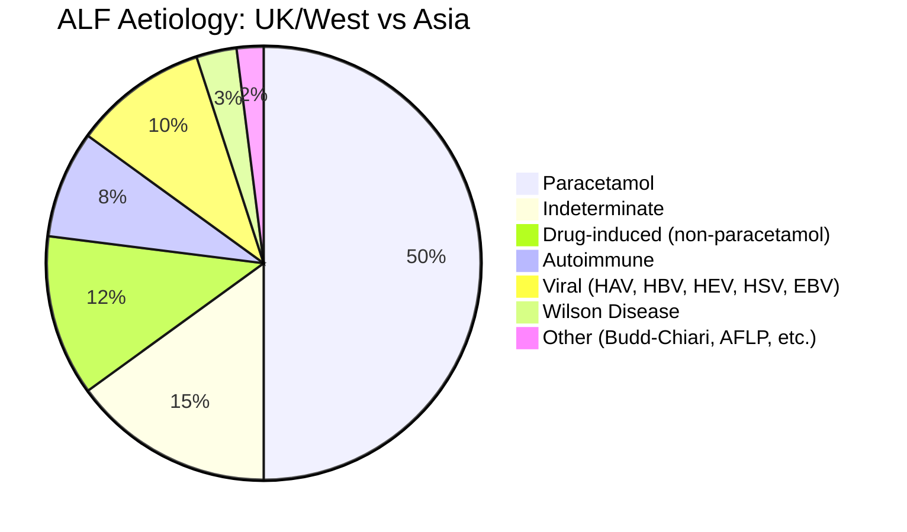
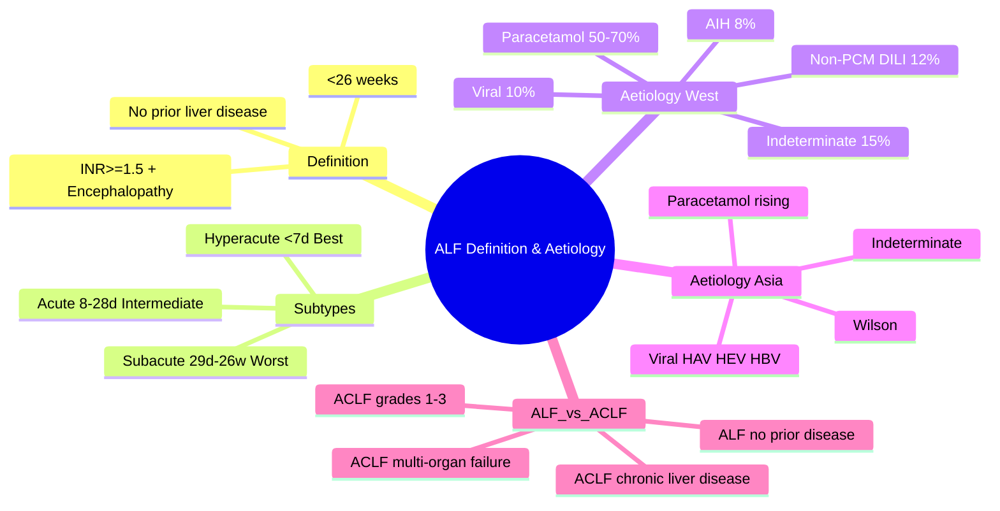

## 1. Learning Objectives
- [ ] Define ALF and ACLF with precise criteria
- [ ] Classify ALF by aetiology and hyperacute/acute/subacute
- [ ] Know UK vs Asian aetiology differences
- [ ] List precipitating factors for ACLF
- [ ] Apply diagnostic criteria (King's College, CLIF-C)
- [ ] Recognize FCPS/MRCP high-yield associations

---

## 2. Definitions

### Acute Liver Failure (ALF)
> **Coagulopathy (INR ≥1.5) + Encephalopathy (any grade) in a patient WITHOUT pre-existing liver disease AND illness duration <26 weeks**

| Subtype | Onset to Encephalopathy | Prognosis |
|---------|------------------------|-----------|
| **Hyperacute** | <7 days | Best (spontaneous recovery 40-50%) |
| **Acute** | 8-28 days | Intermediate |
| **Subacute** | 29 days - 26 weeks | Worst (less regeneration time) |

### Acute-on-Chronic Liver Failure (ACLF)
> **Acute deterioration in a patient WITH chronic liver disease (cirrhosis or chronic hepatitis) associated with organ failure(s) and high 28-day mortality**

**EASL-CLIF Definition (CANONIC study):**
- Cirrhosis + acute decompensation + **organ failure(s)** (liver, kidney, brain, coagulation, circulation, respiration)
- Graded ACLF-1, ACLF-2, ACLF-3 by number of organ failures

---

## 3. Aetiology of ALF

### Geographic Variation



| Region | Commonest Cause | Other Major Causes |
|--------|-----------------|---------------------|
| **UK/USA/Europe** | Paracetamol (50-70%) | Indeterminate, Non-paracetamol DILI, AIH, Viral |
| **India/Asia/Africa** | **Viral (HAV, HEV, HBV)** | Paracetamol rising, Wilson, Unknown |
| **Latin America** | Viral, DILI | Paracetamol |

### Detailed Aetiology List

| Category | Specific Causes | FCPS/MRCP Clues |
|----------|-----------------|-----------------|
| **Paracetamol** | Intentional OD, therapeutic excess, alcohol + paracetamol | ALT >5000, high lactate, metabolic acidosis |
| **Non-paracetamol DILI** | Anti-TB (isoniazid/rifampicin), Antibiotics (amox-clav, flucloxacillin), Anticonvulsants, Herbal, ICI | Latency 1-8 weeks, RUCAM scoring |
| **Viral** | HAV, HBV (acute), HEV, HSV, EBV, CMV, VZV | HAV/HEV in young; HBV reactivation in immunosuppressed |
| **Autoimmune** | AIH (type 1, 2), CHAID | Young women, hypergammaglobulinaemia, ANA/SMA/LKM+ |
| **Metabolic** | **Wilson disease** (5-10% of young ALF), Acute fatty liver of pregnancy | Wilson: low ceruloplasmin, Coombs-neg haemolysis, Kayser-Fleischer |
| **Vascular** | Budd-Chiari syndrome, Ischaemic hepatitis (shock liver), Veno-occlusive disease (SOS) | Abdominal pain + hepatomegaly + ascites |
| **Infiltrative** | Malignant infiltration, Lymphoma, TB | Weight loss, hepatomegaly |
| **Indeterminate** | No cause found after full workup | 15-20% in West; lower in Asia |

---

## 4. ALF vs ACLF: Key Distinctions

| Feature | ALF | ACLF |
|---------|-----|------|
| **Pre-existing liver disease** | NO | YES (cirrhosis or chronic hepatitis) |
| **Encephalopathy** | Required | Required (grade-dependent) |
| **Coagulopathy** | INR ≥1.5 | INR ≥1.5 |
| **Organ failures** | Liver only initially | Multi-organ (CLIF-SOFA) |
| **Duration** | <26 weeks | Acute on chronic |
| **Precipitant** | Direct hepatotoxin | Infection, alcohol, GI bleed, drugs |
| **Mortality (28-day)** | 30-50% | ACLF-1: 22%, ACLF-2: 32%, ACLF-3: 77% |
| **Transplant urgency** | King's College Criteria | MELD + CLIF-C ACLF score |

---

## 5. Diagnostic Workup for ALF

```mermaid
flowchart TD
    A[Suspect ALF: Jaundice + Coagulopathy + Encephalopathy] --> B[Exclude Chronic Liver Disease]
    B --> C{History: Drugs, Alcohol, Travel, Risk factors}
    C --> D[Core Labs]
    D --> E[LFTs, Clotting, Glucose, U&E, Lactate, ABG, FBC, CRP]
    D --> F[Viral Serology: HAV IgM, HBsAg, anti-HBc IgM, HCV Ab, HEV IgM, HSV, EBV, CMV]
    D --> G[Immunology: ANA, SMA, LKM-1, IgG, AMA]
    D --> H[Metabolic: Ceruloplasmin, Urinary Cu, Alpha-1 AT, TSH]
    D --> I[Imaging: US Doppler liver (vascular), CXR]
    D --> J[Screen: Paracetamol level, Drug screen, Ethanol]
    D --> K[Aetiology-specific: Wilson, AFLP, Budd-Chiari]
```

---

## 6. FCPS/MRCP High-Yield Summary

| Scenario | Likely Aetiology | Immediate Action |
|----------|------------------|------------------|
| Young woman, OD, metabolic acidosis | Paracetamol | NAC immediately |
| Young man, recent travel to India, fever | HAV/HEV | IgM serology, supportive |
| Woman on anti-TB, 4 weeks, jaundice | Isoniazid DILI | Stop all anti-TB, RUCAM |
| Young woman, high IgG, ANA+ | Autoimmune hepatitis | Steroids (if no contraindication) |
| Teenager, neuro features, low ceruloplasmin | Wilson disease | Penicillamine/trientine, transplant eval |
| Pregnant 3rd trimester, nausea, hepatic failure | AFLP / HEV | Delivery + supportive |
| Post-chemo, painful hepatomegaly, ascites | SOS/VOD | Defibrotide |

---

## 7. Viva Questions

1. **Define ALF. How does it differ from ACLF?**
2. **Classify ALF by time to encephalopathy. Which has best prognosis?**
3. **What is the commonest cause of ALF in UK vs India?**
4. **List 5 causes of non-paracetamol DILI causing ALF.**
5. **How do you diagnose Wilson disease presenting as ALF?**
5. **What are the King's College Criteria for paracetamol vs non-paracetamol ALF?**
6. **Define ACLF per EASL-CLIF. How is it graded?**
7. **What is the 28-day mortality for ACLF-1, -2, -3?**
8. **List precipitants for ACLF.**
9. **What is indeterminate ALF? What % in West?**
10. **What is the ALF definition?**

---

## 8. Confusions & Mnemonics

| Confusion | Clarification |
|-----------|---------------|
| ALF vs severe acute hepatitis | ALF = INR ≥1.5 + encephalopathy; Severe hepatitis = INR ≥1.5 NO encephalopathy |
| ALF vs ACLF | ALF: NO prior liver disease; ACLF: chronic liver disease present |
| Hyperacute vs acute vs subacute | Time to encephalopathy: <7d, 8-28d, 29d-26w. Hyperacute = best prognosis |
| Indeterminate ALF | Diagnosis of exclusion — no cause found after complete workup |

---

## 9. Mind Map



---

## 10. One-Page Revision Card

| **Feature** | **ALF** | **ACLF** |
|-------------|---------|----------|
| Pre-existing disease | NO | YES |
| Encephalopathy | Required | Required |
| INR | ≥1.5 | ≥1.5 |
| Organ failure | Liver | Multi-organ (CLIF-SOFA) |
| Time course | <26 weeks | Acute on chronic |
| Aetiology (West) | Paracetamol #1 | Infection, Alcohol, Bleed, Drugs |
| Aetiology (Asia) | Viral (HAV/HEV/HBV) | Infection, Alcohol, Bleed |
| Prognostic score | King's College | CLIF-C ACLF |
| 28-day mortality | 30-50% | ACLF-1 22%, -2 32%, -3 77% |

---

## 11. Spaced Repetition Tracker

| Day | 1 | 3 | 7 | 15 | 30 |
|-----|---|---|---|----|----|
| ALF definition & subtypes | ☐ | ☐ | ☐ | ☐ | ☐ |
| ALF vs ACLF table | ☐ | ☐ | ☐ | ☐ | ☐ |
| Aetiology West vs Asia | ☐ | ☐ | ☐ | ☐ | ☐ |
| King's College vs CLIF-C | ☐ | ☐ | ☐ | ☐ | ☐ |

---

## 12. Self-Test Scorecard

| Question | My Answer | Correct? |
|----------|-----------|----------|
| ALF definition |  |  |
| 3 ALF subtypes |  |  |
| ALF aetiology West |  |  |
| ACLF definition |  |  |
| Precipitants ACLF |  |  |

---

## 13. Local Navigation

- [[Acute Liver Failure/ALF vs ACLF|ALF vs ACLF]]
- [[Acute Liver Failure/King's College Criteria|King's College Criteria]]
- [[Acute Liver Failure/Paracetamol-induced hepatotoxicity|Paracetamol ALF]]
- [[Acute Liver Failure/Non-paracetamol drug-induced liver injury|Non-PCM DILI ALF]]
- [[Acute Liver Failure/Wilson disease presenting as ALF|Wilson ALF]]
- [[Acute Liver Failure/Autoimmune hepatitis presenting as ALF|AIH ALF]]
- [[Acute Liver Failure/Acute fatty liver of pregnancy|AFLP]]