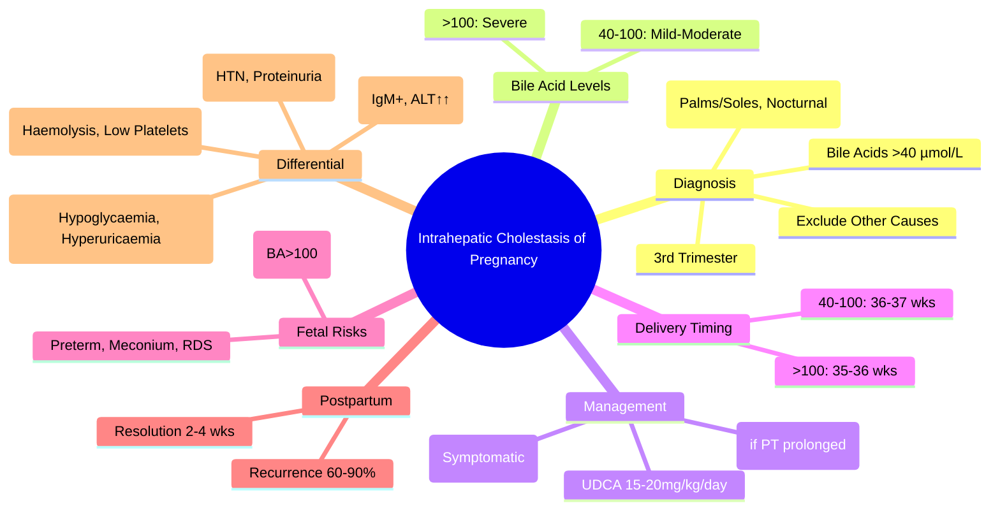

> [!tip] **FCPS/MRCP Priority: HIGH**
> **ICP = Pruritus + Bile Acids >40 µmol/L (3rd trimester)** — **UDCA 15-20mg/kg/day**, **Delivery 36-37 wks (BA>40)**, **>100 µmol/L → deliver 35-36 wks**; **no rash** (excoriations only); **fetal risk: stillbirth (BA>100), preterm, meconium, RDS**; **recurrence 60-90%**.

---

## 1. Learning Objectives
By the end of this note you should be able to:
- [ ] Diagnose ICP: **Pruritus + Bile Acids >40 µmol/L** in 3rd trimester
- [ ] Manage with **UDCA 15-20mg/kg/day** and **vitamin K** (if PT prolonged)
- [ ] Apply **delivery timing**: 36-37 wks (BA>40), 35-36 wks (BA>100)
- [ ] Counsel on **fetal risks** (stillbirth, preterm, meconium, RDS) and **recurrence risk (60-90%)**
- [ ] Differentiate from **AFLP, HELLP, Pre-eclampsia, Viral Hepatitis**

---

## 1. Definition & Epidemiology

| Feature | Detail |
|---------|--------|
| **Definition** | Reversible cholestasis of pregnancy with **pruritus** and **elevated bile acids** |
| **Incidence** | **0.5-1%** pregnancies (higher in South Asian, South American, Scandinavian) |
| **Timing** | **Late 2nd / 3rd trimester** (pruritus → LFTs) |
| **Pathophysiology** | **Hormonal (oestrogen/progesterone) + genetic (ABCB4, ABCB11)** → impaired bile acid transport |
| **Recurrence** | **60-90%** in subsequent pregnancies |
| **Family History** | Often positive |

---

## 2. Clinical Features

| Feature | Detail |
|---------|--------|
| **Pruritus** | **Most common symptom** — **palms/soles**, worse at night, **no rash** (excoriations only) |
| **Timing** | **Late 2nd / 3rd trimester** (usually >28 weeks) |
| **Dark Urine** | Common (bilirubinuria) |
| **Jaundice** | **Rare** (<10%) — if present, usually mild |
| **Steatorrhoea** | Rare (fat malabsorption from bile acid deficiency) |
| **Vitamin K Deficiency** | Possible (prolonged PT) — **give Vitamin K** |

---

## 3. Diagnosis

### Diagnostic Criteria
| Criterion | Threshold |
|---------|-----------|
| **Pruritus** | **Typical** (palms/soles, nocturnal, no rash) |
| **Serum Bile Acids** | **>40 µmol/L** (fasting) — **Diagnostic** |
| **LFTs** | **ALT/AST mildly ↑** (2-10× ULN), **Bilirubin normal/mild ↑** |
| **Exclusion** | **No other cause** (viral hepatitis, drugs, biliary obstruction) |

### Bile Acid Levels & Risk Stratification
| Bile Acids (µmol/L) | Risk Category | Management |
|---------------------|---------------|------------|
| **<40** | **Normal / No ICP** | Reassurance, repeat if symptomatic |
| **40-100** | **Mild-Moderate ICP** | UDCA, surveillance, deliver 36-37 wks |
| **>100** | **Severe ICP** | UDCA + consider early delivery 35-36 wks |

> **Bile Acids >100 µmol/L** → **Stillbirth risk ↑↑**, deliver 35-36 wks

---

## 3. Management

### Ursodeoxycholic Acid (UDCA) — First-Line
| Parameter | Detail |
|-----------|--------|
| **Dose** | **15-20 mg/kg/day** (divided doses) |
| **Effect** | ↓ Bile acids, ↓ pruritus, ↓ fetal risk |
| **Duration** | Until delivery |
| **Safety** | **Category B** — safe in pregnancy |

### Vitamin K
| Indication | Dose |
|-----------|------|
| **Prolonged PT / INR >1.5** | **Vitamin K 10mg IV/PO daily** until delivery |
| **Prophylactic** | Some give **10mg PO daily** from diagnosis |

### Antihistamines / Cholestyramine
| Agent | Role |
|-------|------|
| **Antihistamines** | **Sedating** (chlorphenamine) for nocturnal pruritus — **symptomatic only** |
| **Cholestyramine** | **Second-line** (binds bile acids in gut) — **constipation risk**, separate from UDCA by 4h |

---

## 3. Delivery Timing

| Bile Acids | Delivery Timing | Mode |
|------------|-----------------|------|
| **40-100 µmol/L** | **36-37 weeks** | Induction / C-section per obstetric indication |
| **>100 µmol/L** | **35-36 weeks** | Induction / C-section |
| **Rapidly rising / >100** | **35-36 weeks** | Individualised, earlier if fetal compromise |

> **Postpartum**: Bile acids normalise within **2-4 weeks**; **recurrence 60-90%** in subsequent pregnancies

---

## 3. Fetal Risks

| Risk | Mechanism | Monitoring |
|-------|-----------|------------|
| **Stillbirth** | **BA >100 µmol/L** → ↑↑ risk | **Delivery by 35-36 wks if BA>100** |
| **Preterm Delivery** | Elective delivery for maternal/fetal indications | **36-37 wks (BA>40), 35-36 wks (BA>100)** |
| **Meconium Staining** | Bile acids → fetal gut irritation | **Continuous CTG in labour** |
| **RDS** | Prematurity | **Steroids if <37wks** (betamethasone) |
| **Fetal Distress** | Acute hypoxia | **Continuous CTG, STAN if available** |

---

## 4. Differential Diagnosis

| Condition | Key Distinction from ICP |
|-------------|--------------------------|
| **AFLP** | **Hypoglycaemia, Hyperuricaemia, Encephalopathy, Coagulopathy** (Swansea ≥6) |
| **HELLP** | **Haemolysis (LDH↑, schistocytes), Elevated LFTs (AST/ALT>120), Low Platelets (<100)** |
| **Pre-eclampsia** | **Hypertension + Proteinuria**, no pruritus as dominant feature |
| **Viral Hepatitis** | **IgM anti-HAV/HEV positive**, transaminases ↑↑, bile acids normal/mild ↑ |
| **Drug-Induced** | Temporal relationship, drug history, improves on withdrawal |
| **Primary Biliary Cholangitis** | **AMA+, ALP>>>ALT**, pre-pregnancy diagnosis |
| **Obstructive Cholestasis** | **Dilated CBD on imaging**, pain, fever (cholangitis) |

---

## 6. FCPS/MRCP High-Yield Summary

| Topic | Key Points |
|-------|------------|
| **ICP Diagnosis** | **Pruritus (palms/soles, nocturnal) + Bile Acids >40 µmol/L** (3rd trimester) |
| **Management** | **UDCA 15-20mg/kg/day**, **Vitamin K if PT prolonged**, **Antihistamines for pruritus** |
| **Delivery Timing** | **BA 40-100: 36-37 wks**; **BA >100: 35-36 wks** |
| **Fetal Risk** | **Stillbirth (BA>100)**, **Preterm**, **Meconium, RDS** |
| **Postpartum** | **Resolution 2-4 weeks**, **Recurrence 60-90%** |
| **Differential** | AFLP (hypoglycaemia, hyperuricaemia), HELLP (haemolysis/thrombocytopenia), Pre-eclampsia (HTN/proteinuria), Viral Hepatitis (IgM+) |
| **UDCA Dose** | **15-20mg/kg/day** — improves pruritus, lowers bile acids |
| **Vitamin K** | **If PT prolonged** (10mg IV/PO daily) |
| **Recurrence** | **60-90%** in subsequent pregnancies |

---

## 6. Viva Questions (MRCP PACES / FCPS)

| Question | Expected Answer |
|----------|-----------------|
| **ICP — Diagnostic Criteria?** | **Pruritus (palms/soles, nocturnal) + Bile Acids >40 µmol/L** (3rd trimester). |
| **ICP — Bile Acid Thresholds, Delivery Timing?** | **BA >40 → UDCA, surveillance**; **BA 40-100 → Deliver 36-37 wks**; **BA >100 → Deliver 35-36 wks**. |
| **ICP — UDCA Dose, Effect?** | **15-20mg/kg/day** — lowers bile acids, reduces pruritus, improves fetal outcome. |
| **ICP — Fetal Risks?** | **Stillbirth (BA>100), Preterm delivery, Meconium, RDS** — deliver early if BA>100. |
| **ICP — Postpartum Course, Recurrence?** | **Resolution 2-4 weeks**, **Recurrence 60-90%** in subsequent pregnancies. |
| **ICP vs AFLP — Differentiation?** | **AFLP**: Hypoglycaemia (<4), Hyperuricaemia (>340), Encephalopathy, Coagulopathy; **ICP**: Pruritus, BA>40, normal glucose/uric acid. |
| **ICP vs HELLP — Differentiation?** | **HELLP**: Haemolysis (LDH↑, schistocytes), Elevated LFTs, Low Platelets; **ICP**: Pruritus, BA>40, Normal platelets. |
| **ICP vs Pre-eclampsia** | **Pre-eclampsia**: Hypertension + Proteinuria; **ICP**: Pruritus + BA>40, normal BP/proteinuria. |
| **ICP — Vitamin K Indication?** | **Prolonged PT / INR >1.5** → Vitamin K 10mg IV/PO daily. |
| **ICP — Recurrence Risk?** | **60-90%** in subsequent pregnancies. |

---

## 6. Confusions & Mnemonics

| Confusion | Clarification |
|-----------|---------------|
| **ICP vs AFLP** | **AFLP**: Hypoglycaemia, Hyperuricaemia, Encephalopathy, Coagulopathy; **ICP**: Pruritus, BA>40, Normal glucose/uric acid, no encephalopathy/coagulopathy |
| **ICP vs HELLP** | **HELLP**: Haemolysis (LDH↑, schistocytes), Elevated LFTs, Low Platelets; **ICP**: Pruritus, BA>40, Normal platelets/LFTs |
| **ICP vs Pre-eclampsia** | **Pre-eclampsia**: Hypertension + Proteinuria; **ICP**: Pruritus, BA>40, Normal BP/proteinuria |
| **ICP vs Viral Hepatitis** | **Viral Hepatitis**: IgM anti-HAV/HEV+, Transaminases ↑↑, Bile acids normal/mild ↑ |
| **ICP Bile Acid Thresholds** | **40 µmol/L** = diagnostic; **100 µmol/L** = severe, earlier delivery |
| **UDCA in Pregnancy** | **Safe (Category B)** — 15-20mg/kg/day; improves pruritus & bile acids |
| **Postpartum ICP** | **Resolves 2-4 weeks**; recurrence 60-90% next pregnancy |

**Mnemonic: ICP-CHOLESTASIS**
- **I**CP: **Pruritus + Bile Acids >40 µmol/L** (3rd Trimester)
- **C**holestasis: **Intrahepatic, Reversible**
- **P**ruritus: **Palms/Soles, Nocturnal, No Rash** (Excoriations Only)
- **H**igh Bile Acids: **>40 = Diagnostic; >100 = Severe (Deliver 35-36wks)**
- **O**bstetric Risks: **Stillbirth (BA>100), Preterm, Meconium, RDS**
- **L**iver Tests: **ALT/AST Mild↑, Bilirubin Normal/Mild↑**
- **E**arly Delivery: **BA>40 → 36-37wks; BA>100 → 35-36wks**
- **S**afe Drug: **UDCA 15-20mg/kg/day (Category B)**
- **T**reatment: **UDCA + Vitamin K (if PT↑) + Antihistamines**
- **A**ntihistamines: **Sedating (Chlorphenamine) for Nocturnal Pruritus**
- **S**tillbirth Risk: **BA>100 → Significant ↑**
- **I**CPs: **UDCA 15-20mg/kg, Vit K if PT↑, Delivery Timing by BA**
- **S**tillbirth: **BA>100 → Significant ↑ Risk**

---

## 8. Mind Map

---

## 11. One-Page Revision Card

| Domain | Key Points |
|--------|------------|
| **Diagnosis** | Pruritus + **BA >40 µmol/L** (3rd trimester) |
| **BA Levels** | 40-100: Mild-Mod; **>100: Severe** |
| **UDCA** | **15-20mg/kg/day** (lowers BA, ↓ pruritus, fetal benefit) |
| **Delivery** | **40-100: 36-37 wks**; **>100: 35-36 wks** |
| **Fetal Risks** | Stillbirth (BA>100), Preterm, Meconium, RDS |
| **Postpartum** | Resolves 2-4 wks; **Recurrence 60-90%** |
| **Differential** | AFLP (Hypoglycaemia), HELLP (Low Plts), Pre-ecl (HTN), Viral Hep (IgM+) |
| **UDCA Dose** | 15-20mg/kg/day |
| **Vitamin K** | If PT prolonged |

---

## 9. Spaced Repetition Trackers

| Review Interval | Date Completed | Confidence (1-5) | Notes |
|-----------------|----------------|------------------|-------|
| 24 hours | | | |
| 7 days | | | |
| 15 days | | | |
| 30 days | | | |
| 90 days | | | |

---

## 10. Self-Test Scorecard

| Section | Score /5 | Last Attempt |
|---------|----------|--------------|
| ICP Diagnosis | | |
| Bile Acid Thresholds | | |
| Delivery Timing | | |
| UDCA Dosing | | |
| Fetal Risks | | |
| Differential (AFLP, HELLP, Pre-ecl) | | |
| Postpartum/Recurrence | | |
| UDCA / Vitamin K | | |

---

## 2. Local Navigation
- **Parent Heading**: [[../Hepatology|Hepatology]]
- **Chapter Map": [[../Davidson Chapter 24 - Hepatology Hierarchy|Hepatology Hierarchy]]
- **Chapter MOC": [[../Hepatology MOC|Hepatology MOC]]
- **Drug Reference": [[../../Clinical Therapeutics and Good Prescribing|Drugs]]
- **Related": [[Hepatology in Special Situations]], [[AFLP]], [[HELLP Syndrome]], [[Pre-eclampsia]], [[Viral Hepatitis in Pregnancy]]
---

> Auto-generated study sections for "Hepatology in Special Situations" — Ch 23: Hepatology.

## Flashcards (23 generated)

- Q: What is the definition of Hepatology in Special Situations?
  A: ICP = Pruritus + Bile Acids >40 µmol/L (3rd trimester) — UDCA 15-20mg/kg/day, Delivery 36-37 wks (BA>40), >100 µmol/L → deliver 35-36 wks; no rash (excoriations only); fetal risk: stillbirth (BA>100), preterm, meconium, RDS; recurrence 60-90%.
- Q: What is Pruritus of Hepatology in Special Situations?
  A: Typical (palms/soles, nocturnal, no rash)
- Q: What is Serum Bile Acids of Hepatology in Special Situations?
  A: >40 µmol/L (fasting) — Diagnostic
- Q: What is LFTs of Hepatology in Special Situations?
  A: ALT/AST mildly ↑ (2-10× ULN), Bilirubin normal/mild ↑
- Q: What is Exclusion of Hepatology in Special Situations?
  A: No other cause (viral hepatitis, drugs, biliary obstruction)
- Q: What is Prolonged PT / INR >1.5 of Hepatology in Special Situations?
  A: Vitamin K 10mg IV/PO daily until delivery
- Q: What is Prophylactic of Hepatology in Special Situations?
  A: Some give 10mg PO daily from diagnosis
- Q: What is Antihistamines of Hepatology in Special Situations?
  A: Sedating (chlorphenamine) for nocturnal pruritus — symptomatic only
- Q: What is Cholestyramine of Hepatology in Special Situations?
  A: Second-line (binds bile acids in gut) — constipation risk, separate from UDCA by 4h
- Q: What is Pruritus of Hepatology in Special Situations?
  A: Typical (palms/soles, nocturnal, no rash)
- Q: What is Serum Bile Acids of Hepatology in Special Situations?
  A: >40 µmol/L (fasting) — Diagnostic
- Q: What is LFTs of Hepatology in Special Situations?
  A: ALT/AST mildly ↑ (2-10× ULN), Bilirubin normal/mild ↑
- Q: What is Antihistamines of Hepatology in Special Situations?
  A: Sedating (chlorphenamine) for nocturnal pruritus — symptomatic only
- Q: What is Cholestyramine of Hepatology in Special Situations?
  A: Second-line (binds bile acids in gut) — constipation risk, separate from UDCA by 4h
- Q: What is the investigation of choice for Hepatology in Special Situations?
  A: Pruritus (palms/soles, nocturnal) + Bile Acids >40 µmol/L (3rd trimester)
- Q: How is Hepatology in Special Situations managed?
  A: UDCA 15-20mg/kg/day, Vitamin K if PT prolonged, Antihistamines for pruritus
- Q: What is Delivery Timing of Hepatology in Special Situations?
  A: BA 40-100: 36-37 wks; BA >100: 35-36 wks
- Q: What is Fetal Risk of Hepatology in Special Situations?
  A: Stillbirth (BA>100), Preterm, Meconium, RDS
- Q: What is Postpartum of Hepatology in Special Situations?
  A: Resolution 2-4 weeks, Recurrence 60-90%
- Q: What is Differential of Hepatology in Special Situations?
  A: AFLP (hypoglycaemia, hyperuricaemia), HELLP (haemolysis/thrombocytopenia), Pre-eclampsia (HTN/proteinuria), Viral Hepatitis (IgM+)
- Q: What is the dose of Hepatology in Special Situations?
  A: 15-20mg/kg/day — improves pruritus, lowers bile acids
- Q: What is Vitamin K of Hepatology in Special Situations?
  A: If PT prolonged (10mg IV/PO daily)
- Q: What is Recurrence of Hepatology in Special Situations?
  A: 60-90% in subsequent pregnancies

## MCQs (1 generated)

1. **Which of the following best describes Hepatology in Special Situations?**
   A. **ICP = Pruritus + Bile Acids >40 µmol/L (3rd trimester) — UDCA 15-20mg/kg/day, Delivery 36-37 wks (BA>40), >100 µmol/L → deliver 35-36 wks; no rash (excoriations only); fetal risk: stillbirth (BA>100),**
   B. An unrelated condition not matching the clinical picture of Hepatology in Special Situations
   C. A complication seen late in the disease course of Hepatology in Special Situations
   D. A condition that mimics Hepatology in Special Situations but has a different underlying cause

## SBA Questions (1 generated)

1. A patient with suspected Hepatology in Special Situations presents with: Definition — Reversible cholestasis of pregnancy with pruritus and elevated bile acids; Incidence — 0.5-1% pregnancies (higher in South Asian, South American, Scandinavian); Timing — Late 2nd / 3rd trimester (pruritus → LFTs). What is the most likely diagnosis?
   A. **Hepatology in Special Situations**
   B. A condition that mimics Hepatology in Special Situations but is not the same entity
   C. A complication of Hepatology in Special Situations rather than the primary diagnosis
   D. An unrelated condition in the same clinical category as Hepatology in Special Situations

## PasTest Scenario SBAs (Clinical Vignettes)

> **Auto-generated PasTest/Mediscope-style scenario SBAs** grounded in the authored source content. Each scenario is a clinical vignette with 4 options. **Source: Ch 23: Hepatology / ICP**

**Q1.** A patient is being evaluated for ICP. Based on standard diagnostic approach, what is the most appropriate first-line investigation?

  - **A.** Approach described in standard diagnostic workup
  - **B.** An advanced/invasive test as first-line
  - **C.** Empirical treatment without investigation
  - **D.** Watchful waiting without further testing

  > **Answer: A** — Approach described in standard diagnostic workup

