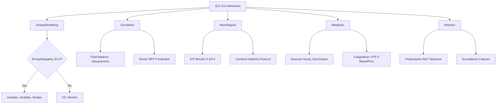

## 1. Learning Objectives
- [ ] Implement multi-organ support in ALF ICU
- [ ] Manage cerebral oedema and intracranial hypertension
- [ ] Prevent and treat infections
- [ ] Manage coagulopathy and bleeding
- [ ] Support renal, cardiovascular, and respiratory systems
- [ ] Identify FCPS/MRCP high-yield ICU management steps

---

## 2. Multi-Organ Support Framework

---

## 1. Neurological Support & Cerebral Oedema

### Pathophysiology
- **Ammonia → Astrocyte Swelling** (Glutamine accumulation)
- **Inflammation → BBB Disruption** (Cytokines, ROS)
- **Cerebral Blood Flow Dysregulation** (Loss of Autoregulation)

### Monitoring
| Parameter | Method | Target |
|-----------|--------|--------|
| **Encephalopathy** | Clinical (Hourly) | Detect Progression |
| **ICP** | Intraparenchymal Bolt (G3-4) | **<20 mmHg** |
| **CPP** | MAP - ICP | **>60 mmHg** |
| **Pupils** | Hourly | Symmetry, Reactivity |
| **EEG** | Continuous (If Available) | Non-Convulsive Seizures |

### Cerebral Oedema Management Protocol

| Step | Intervention | Target |
|------|--------------|--------|
| **1. Head Position** | **Head Up 30°**, Neutral Neck | ICP ↓ |
| **2. Sedation** | **Propofol** (Short-acting, ICP ↓) or **Midazolam** | RASS -2 to -3 |
| **3. Osmotherapy** | **Mannitol 0.5-1g/kg** (Bolus) OR **3% Saline 2-5 ml/kg** | ICP <20 mmHg |
| **4. Hyperventilation** | PaCO₂ 30-35 mmHg (Short-term) | Temporary ICP ↓ |
| **5. Barbiturates** | Thiopental (Refractory) | Last Resort |
| **6. Hypothermia** | 32-34°C (Controversial) | Refractory |

### Neurological Targets
| Parameter | Target |
|-----------|--------|
| **ICP** | **<20 mmHg** |
| **CPP** | **>60 mmHg** (MAP - ICP) |
| **PaCO₂** | 30-35 mmHg (If Hyperventilating) |
| **Temperature** | **35-36°C** (Mild Hypothermia) |
| **Glucose** | **4-7 mmol/L** (Tight Control) |

---

## 2. Coagulation Management

### Monitoring
| Test | Frequency | Transfusion Threshold |
|------|-----------|----------------------|
| **PT/INR** | 4-6 Hourly | INR >2.0 + Bleeding/Procedure |
| **Fibrinogen** | 6-12 Hourly | <1.5 g/L → Cryoprecipitate |
| **Platelets** | 6-12 Hourly | <50 ×10⁹/L (Bleeding) / <20 (Spontaneous) |
| **D-dimer / FDP** | Daily | DIC Screen |

### Transfusion Protocol
| Product | Indication | Dose |
|---------|------------|------|
| **FFP** | INR >2.0 + Active Bleeding / Invasive Procedure | 15-20 ml/kg |
| **Cryoprecipitate** | Fibrinogen <1.5 g/L | 1 Unit/10 kg |
| **Platelets** | <50 ×10⁹/L (Bleeding/Procedure) / <20 ×10⁹/L (Prophylactic) | 1 Adult Dose |
| **Vitamin K** | INR Rising / Prolonged | 10 mg IV (If Deficient) |
| **rFVIIa** | **NOT Routine** (Thrombosis Risk) | Life-Threatening Bleeding Only |

> **Do NOT Correct INR Routinely** — Only for Active Bleeding or Invasive Procedures

---

## 3. Renal Support

### HRS/AKI in ALF
| Parameter | Threshold for RRT |
|-----------|-------------------|
| **Creatinine** | >300 μmol/L (or Rising Rapidly) |
| **Urine Output** | <0.5 ml/kg/h for >6h |
| **Fluid Overload** | >10% FO, Pulmonary Oedema |
| **Electrolytes** | K >6.5, pH <7.15 |
| **Urea** | >40 mmol/L |

### RRT Modalities
| Modality | Indication | Advantage |
|----------|------------|-----------|
| **CVVH / CVVHDF** | **First-Line** (Haemodynamically Unstable) | Continuous, Haemodynamic Stability |
| **IHD** | Stable, Access Available | Efficient, Shorter |
| **PEX / MARS** | Bridge to Transplant | Ammonia/Toxin Removal |

---

## 4. Cardiovascular Support

### Haemodynamic Targets
| Parameter | Target |
|-----------|--------|
| **MAP** | **≥65 mmHg** |
| **CVP** | 8-12 mmHg (Avoid Overload) |
| **Lactate** | <2 mmol/L (Trending Down) |
| **ScvO₂** | >70% |

### Vasopressors
| Drug | Dose | Indication |
|------|------|------------|
| **Norepinephrine** | 0.01-3 μg/kg/min | **First-Line** (Alpha > Beta) |
| **Vasopressin** | 0.01-0.04 U/min | **Second-Line** (Vasodilatory Shock) |
| **Dobutamine** | 2-20 μg/kg/min | Cardiac Dysfunction + Low CO |

### Fluid Management
- **Goal**: **Euvolaemia** — Avoid Overload (Worsens Cerebral Oedema, Ascites)
- **Albumin** 20-40g/day (If Hypoalbuminaemic, HRS, Large Volume Paracentesis)
- **CVP Target**: 8-12 mmHg (Avoid High CVP → Portal Hypertension, Cerebral Oedema)

---

## 5. Respiratory Support

### Ventilation Strategy
| Parameter | Target |
|-----------|--------|
| **PaO₂** | >10 kPa (80 mmHg) |
| **PaCO₂** | **30-35 mmHg** (If Cerebral Oedema) |
| **FiO₂** | Minimum to Maintain Target |
| **PEEP** | Low (5-8 cmH₂O) — Avoid High PEEP (↑ ICP) |

### Indications for Intubation

*...continued (truncated for renderer performance)*
---

> Auto-generated study sections for "Acute Liver Failure" — Ch 23: Hepatology.

## Flashcards (12 generated)

- Q: What is the definition of Acute Liver Failure?
  A: - Cerebral Blood Flow Dysregulation (Loss of Autoregulation)
- Q: What is PaO₂ of Acute Liver Failure?
  A: >10 kPa (80 mmHg)
- Q: What is PaCO₂ of Acute Liver Failure?
  A: 30-35 mmHg (If Cerebral Oedema)
- Q: What is FiO₂ of Acute Liver Failure?
  A: Minimum to Maintain Target
- Q: What is PEEP of Acute Liver Failure?
  A: Low (5-8 cmH₂O) — Avoid High PEEP (↑ ICP)
- Q: What is Creatinine of Acute Liver Failure?
  A: >300 μmol/L (or Rising Rapidly)
- Q: What is Urine Output of Acute Liver Failure?
  A: <0.5 ml/kg/h for >6h
- Q: What is Fluid Overload of Acute Liver Failure?
  A: >10% FO, Pulmonary Oedema
- Q: What is Electrolytes of Acute Liver Failure?
  A: K >6.5, pH <7.15
- Q: What is PaO₂ of Acute Liver Failure?
  A: >10 kPa (80 mmHg)
- Q: What is PaCO₂ of Acute Liver Failure?
  A: 30-35 mmHg (If Cerebral Oedema)
- Q: What is FiO₂ of Acute Liver Failure?
  A: Minimum to Maintain Target

## MCQs (1 generated)

1. **Which of the following best describes Acute Liver Failure?**
   A. **- Cerebral Blood Flow Dysregulation (Loss of Autoregulation)**
   B. An unrelated condition not matching the clinical picture of Acute Liver Failure
   C. A complication seen late in the disease course of Acute Liver Failure
   D. A condition that mimics Acute Liver Failure but has a different underlying cause

