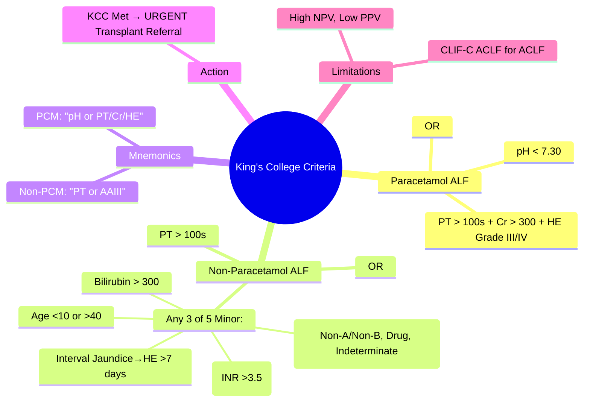

## 1. Learning Objectives
- [ ] Apply King's College Criteria for paracetamol and non-paracetamol ALF
- [ ] Differentiate criteria for transplant referral
- [ ] Understand limitations and modern context (CLIF-C ACLF)
- [ ] Apply in clinical decision-making for urgent transplant listing
- [ ] Identify FCPS/MRCP high-yield criteria and numbers

---

## 2. Overview

> **King's College Criteria (KCC)** = Established 1989, used to identify ALF patients who need **urgent liver transplant referral**

| Population | Criteria | Action if Met |
|------------|----------|---------------|
| **Paracetamol ALF** | Specific criteria | Urgent Transplant Referral |
| **Non-Paracetamol ALF** | Specific criteria | Urgent Transplant Referral |

> **FCPS/MRCP**: **Memorize the exact criteria** — high-yield viva topic

---

## 3. Paracetamol ALF Criteria

### Original (1989) — **Still Used for Transplant Listing**

**ALL THREE Required (at any time):**
1. **Arterial pH < 7.30** (after adequate fluid resuscitation)
   **OR**
2. **PT > 100 seconds** (INR > 6.5)
   **PLUS** Serum Creatinine > 300 μmol/L (3.4 mg/dL)
   **PLUS** Grade III or IV Hepatic Encephalopathy

```mermaid
flowchart TD
    A[Paracetamol ALF] --> B{Meets KCC?}
    B -->|pH < 7.30| C[URGENT Transplant Referral]
    B -->|PT > 100s (INR>6.5) + Cr > 300 + HE Grade III/IV| C
    B -->|No| D[Continue NAC + Supportive Care; Reassess Daily]
```

### Key Points for Paracetamol KCC
| Parameter | Threshold | Notes |
|-----------|-----------|-------|
| **Arterial pH** | **<7.30** | After adequate fluid resuscitation |
| **Prothrombin Time** | **>100 seconds** | INR >6.5 equivalent |
| **Creatinine** | **>300 μmol/L** (3.4 mg/dL) | Renal failure marker |
| **Hepatic Encephalopathy** | **Grade III/IV** | Coma/Stupor |

> **Mnemonic**: **"pH <7.3 OR (PT>100 + Cr>300 + HE III/IV)"**

---

## 4. Non-Paracetamol ALF Criteria

### Original (1989) — **Any ONE of the Following:**

| Criterion | Threshold |
|-----------|-----------|
| **PT (Prothrombin Time)** | **>100 seconds** (INR >6.5) |
| **Any THREE of the following:** | |
| Age <10 or >40 years | |
| Aetiology: Non-A, Non-B, Drug-induced, Indeterminate | |
| Jaundice to Encephalopathy interval **>7 days** | |
| PT >50 seconds (INR >3.5) | |
| Serum Bilirubin >300 μmol/L (17.5 mg/dL) | |

```mermaid
flowchart TD
    A[Non-Paracetamol ALF] --> B{Meets KCC?}
    B -->|PT > 100s (INR>6.5)| C[URGENT Transplant Referral]
    B -->|Any 3 of 5 Minor Criteria| C
    B -->|No| D[Supportive Care; Daily Reassessment; Consider CLIF-C ACLF]
```

### Minor Criteria (Need 3 of 5)
| # | Criterion | Memory Aid |
|---|-----------|------------|
| 1 | **Age <10 or >40** | Extremes of age |
| 2 | **Aetiology** | Non-A/Non-B, Drug, Indeterminate |
| 3 | **Jaundice → Encephalopathy >7 days** | Subacute = worse prognosis |
| 4 | **PT >50s (INR >3.5)** | Coagulopathy |
| 5 | **Bilirubin >300 μmol/L** | Severe jaundice |

> **Mnemonic for Minor Criteria**: **"AAIII"** — Age, Aetiology, Interval, INR, Icterus

---

## 5. Prognostic Accuracy

| Population | Sensitivity | Specificity | PPV | NPV |
|------------|-------------|-------------|-----|-----|
| **Paracetamol** | ~70-80% | ~80-90% | ~60% | >90% |
| **Non-Paracetamol** | ~80-90% | ~60-70% | ~50% | >90% |

> **Key Limitation**: **High NPV** — if criteria NOT met, survival without transplant is likely (~90%)
> **BUT**: Low PPV — meeting criteria doesn't guarantee death without transplant

---

## 6. Modern Context: KCC vs CLIF-C ACLF

| Aspect | King's College Criteria | CLIF-C ACLF Score |
|--------|------------------------|-------------------|
| **Population** | ALF only | ACLF (cirrhotics) + ALF |
| **Dynamic** | Single time-point | Serial (Days 3-5) |
| **Components** | Clinical/Labs | 9 variables (Age, WBC, Cr, INR, Bil, Lactate, HE, ACLF grade, #OF) |
| **Output** | Binary (Refer/Don't) | Continuous score (0-100) |
| **Transplant Priority** | Super-urgent listing | MELD-exception points |

> **FCPS/MRCP**: **Know KCC for transplant referral**; **Know CLIF-C ACLF for ACLF prognosis**

---

## 7. Clichy Criteria (Alternative for Paracetamol)

| Criterion | Threshold |
|-----------|-----------|
| **Factor V** | **<20% of normal** (if <30y) |
| **Factor V** | **<30% of normal** (if ≥30y) |
| **AND** | **Hepatic Encephalopathy** Grade III/IV |

- Used in some European centres
- Factor V reflects synthetic function better than PT

---

## 8. Management When KCC Met

```mermaid
flowchart TD
    A[ALF Patient] --> B[Daily KCC Assessment]
    B --> C{KCC Met?}
    C -->|Yes| D[URGENT Transplant Referral]
    C -->|No| E[Clinical Deterioration?]
    E -->|Yes| D
    E -->|No| F[Daily KCC Reassessment]
    D --> G[Contact Transplant Centre]
    D --> H[Continue NAC (if PCM)]
    D --> I[ICU Optimisation]
```

---

## 9. FCPS/MRCP High-Yield Summary

| Concept | Key Points |
|---------|------------|
| **Paracetamol KCC** | **pH <7.30** OR **(PT>100s + Cr>300 + HE Grade III/IV)** |
| **Non-Paracetamol KCC** | **PT>100s** OR **Any 3 of: Age<10/>40, Aetiology, Interval>7d, PT>50s, Bil>300** |
| **Memory Aid (PCM)** | **"pH or PT/Cr/HE"** |
| **Memory Aid (Non-PCM)** | **"PT or AAIII"** (Age, Aetiology, Interval, INR, Icterus) |
| **Action if Met** | **Urgent Transplant Referral** (Super-urgent listing) |
| **Limitation** | High NPV (>90%), Low PPV (~50-60%) |
| **Modern Alternative** | CLIF-C ACLF for ACLF; MELD for chronic |

---

## 10. Viva Questions

1. **State the King's College Criteria for paracetamol-induced ALF.**
2. **State the King's College Criteria for non-paracetamol ALF.**
3. **What is the mnemonic for non-paracetamol minor criteria?**
4. **What do you do if a patient meets KCC?**
5. **What is the difference between KCC and CLIF-C ACLF?**
6. **What is the prognostic value of KCC (sensitivity/specificity/NPV)?**
7. **What are the Clichy criteria?**
8. **When do you refer for transplant if KCC not met?**
9. **Can KCC be used for ACLF?**
10. **What is the threshold for arterial pH in paracetamol ALF?**

---

## 11. Confusions & Mnemonics

| Confusion | Clarification |
|-----------|---------------|
| Paracetamol vs Non-Paracetamol | PCM: pH<7.3 OR (PT>100+Cr>300+HE III/IV); Non-PCM: PT>100 OR 3 of 5 Minor |
| PT units | **Seconds** (not INR) for original criteria; INR>6.5 ≈ PT>100s |
| HE Grade | Grade III = Stupor/Confusion; Grade IV = Coma |
| KCC for ALF vs ACLF | KCC = ALF only; ACLF uses CLIF-C ACLF score |
| Interval >7 days | Jaundice to Encephalopathy interval >7 days = subacute = worse prognosis |
| Aetiology minor criterion | Non-A, Non-B hepatitis, Drug-induced, Indeterminate |
| High NPV | If KCC NOT met → 90%+ survival without transplant |

---

## 12. Mind Map



---

## 13. One-Page Revision Card

| **Paracetamol ALF** | **Threshold** |
|---------------------|---------------|
| Arterial pH | **< 7.30** (Post-Resus) |
| **OR** PT > 100s + Cr > 300 + HE Grade III/IV | **All 3 Required** |

| **Non-Paracetamol ALF** | |
|-------------------------|--|
| PT > 100s (INR>6.5) | **OR** |
| **Any 3 of 5 Minor (AAIII)** | |
| Age <10 or >40 | |
| Aetiology: Non-A/Non-B, Drug, Indeterminate | |
| Jaundice → HE > 7 days | |
| PT > 50s (INR>3.5) | |
| Bilirubin > 300 μmol/L | |

| **Clichy (Paracetamol)** | |
|--------------------------|--|
| Factor V <20% | Age <30 years |
| Factor V <30% | Age ≥30 years |
| **AND** HE Grade III/IV | |

| **Action** | **If KCC Met** |
|------------|----------------|
| 1. | **URGENT Transplant Referral** |
| 2. | Continue NAC (if PCM) |
| 3. | ICU Support |
| 4. | Daily Reassessment |

---

## 14. Spaced Repetition Tracker

| Day | 1 | 3 | 7 | 15 | 30 |
|-----|---|---|---|----|----|
| PCM KCC (pH, PT, Cr, HE) | ☐ | ☐ | ☐ | ☐ | ☐ |
| Non-PCM KCC (PT + 3 of 5) | ☐ | ☐ | ☐ | ☐ | ☐ |
| AAIII Mnemonic | ☐ | ☐ | ☐ | ☐ | ☐ |
| Action if Met | ☐ | ☐ | ☐ | ☐ | ☐ |
| Limitations (NPV/PPV) | ☐ | ☐ | ☐ | ☐ | ☐ |

---

## 15. Self-Test Scorecard

| Question | My Answer | Correct? |
|----------|-----------|----------|
| PCM KCC pH Threshold |  |  |
| PCM KCC Triad (PT, Cr, HE) |  |  |
| Non-PCM Minor Criteria (5) |  |  |
| AAIII Expansion |  |  |
| Action if Met |  |  |

---

## 16. Local Navigation

- [[Acute Liver Failure/Definition and Aetiology|ALF Definition]]
- [[Acute Liver Failure/CLIF-C ACLF and ACLF grades|CLIF-C ACLF]]
- [[Acute Liver Failure/Paracetamol-induced hepatotoxicity|Paracetamol ALF]]
- [[Acute Liver Failure/Non-paracetamol drug-induced liver injury|Non-PCM DILI ALF]]
- [[Liver Transplantation/Liver Transplantation|Liver Transplant]]