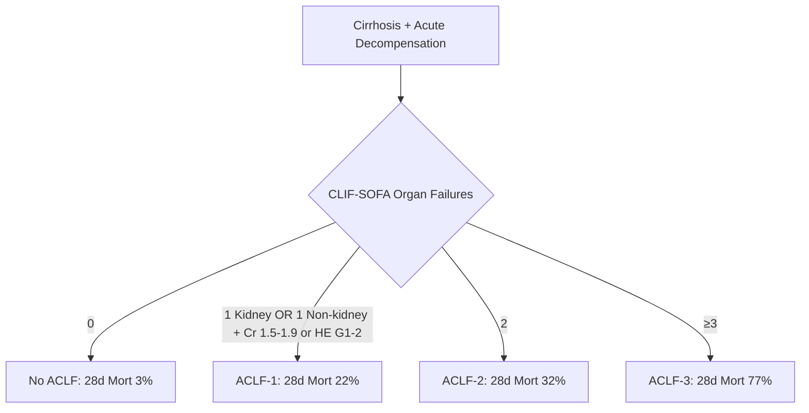
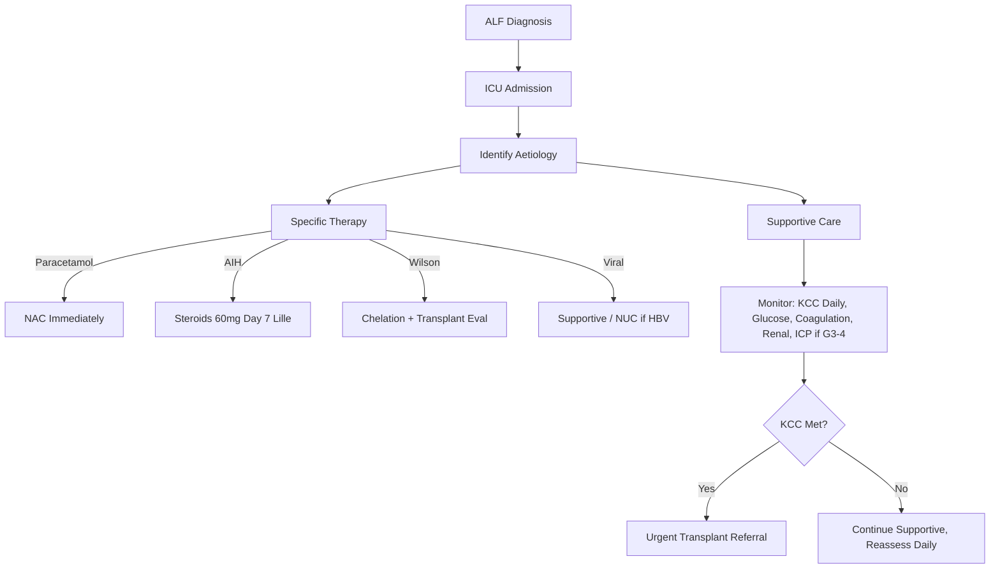
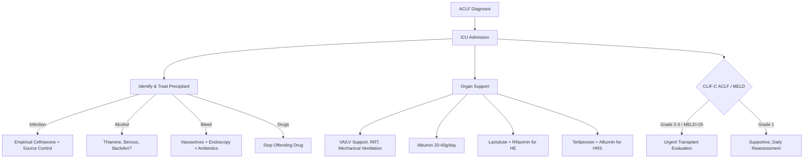

# Acute Liver Failure vs Acute-on-Chronic Liver Failure (ALF vs ACLF)

## Learning Objectives
- [ ] Define ALF and ACLF with precise criteria
- [ ] Apply key distinctions for clinical decision-making
- [ ] Apply King's College Criteria (ALF) vs CLIF-C ACLF Score (ACLF)
- [ ] Identify precipitants and management priorities for each
- [ ] Identify FCPS/MRCP high-yield distinctions

---

## Definitions at a Glance

| Feature | **ALF (Acute Liver Failure)** | **ACLF (Acute-on-Chronic Liver Failure)** |
|---------|-------------------------------|-------------------------------------------|
| **Pre-existing Liver Disease** | **NO** (by definition) | **YES** (Cirrhosis or Chronic Hepatitis) |
| **Encephalopathy** | **Required** (any grade) | Required (Grade III-IV = Organ Failure) |
| **Coagulopathy** | INR ≥1.5 | INR ≥2.0 (Organ Failure threshold) |
| **Organ Failures** | Liver only (initially) | **Multi-organ** (CLIF-SOFA) |
| **Timeline** | <26 weeks (hyperacute/acute/subacute) | Acute decompensation of chronic disease |
| **Precipitant** | Direct hepatotoxin | Infection, Alcohol, Bleed, Drugs, Surgery |
| **Prognostic Score** | **King's College Criteria** | **CLIF-C ACLF Score** |
| **28-Day Mortality** | 30-50% | Grade-dependent (22-77%) |

---

## Diagnostic Criteria Comparison

### Acute Liver Failure (ALF)
> **All 3 Required:**
1. **INR ≥1.5**
2. **Encephalopathy** (any grade)
3. **No pre-existing liver disease** AND **Illness duration <26 weeks**

#### ALF Subtypes (by Time to Encephalopathy)
| Subtype | Onset to Encephalopathy | Prognosis |
|---------|------------------------|-----------|
| **Hyperacute** | <7 days | **Best** (Spontaneous recovery 40-50%) |
| **Acute** | 8-28 days | Intermediate |
| **Subacute** | 29 days - 26 weeks | **Worst** (Less regeneration time) |

### Acute-on-Chronic Liver Failure (ACLF) — EASL-CLIF (CANONIC)
> **All 3 Required:**
1. **Cirrhosis** (previously diagnosed or diagnosed at presentation)
2. **Acute decompensation** (Ascites, GI bleed, HE, Infection)
3. **Organ failure(s)** per CLIF-SOFA

---

## CLIF-SOFA Organ Failure Definitions

| Organ System | Variable | Failure Cut-off |
|--------------|----------|-----------------|
| **Liver** | Bilirubin | **≥12 mg/dL (≥204 μmol/L)** |
| **Kidney** | Creatinine | **≥2.0 mg/dL (≥177 μmol/L)** OR **RRT** |
| **Brain** | HE Grade | **Grade III-IV** |
| **Coagulation** | INR | **≥2.5** |
| **Circulation** | MAP / Vasopressors | **MAP <70 mmHg** OR **Vasopressors** |
| **Respiration** | PaO₂/FiO₂ or SpO₂/FiO₂ | **PaO₂/FiO₂ ≤200** OR **SpO₂/FiO₂ ≤214** OR **MV** |

---

## ACLF Grading (EASL-CLIF)



| Grade | Definition | Organ Failures | 28-Day Mortality | 90-Day Mortality |
|-------|------------|----------------|------------------|------------------|
| **No ACLF** | Acute decompensation without organ failure | 0 | **3%** | **10%** |
| **ACLF-1** | Single kidney failure OR Single non-kidney failure + Cr 1.5-1.9 or HE G1-2 | 1 (or kidney + mild other) | **22%** | **32%** |
| **ACLF-2** | Two organ failures | 2 | **32%** | **47%** |
| **ACLF-3** | Three or more organ failures | ≥3 | **77%** | **85%** |

---

## ALF vs ACLF: Quick Comparison Table

| Feature | ALF | ACLF |
|---------|-----|------|
| **Pre-existing Liver Disease** | **Absent** | **Present (Cirrhosis)** |
| **Encephalopathy Requirement** | Any Grade | Grade III-IV for Organ Failure |
| **INR Threshold** | ≥1.5 | ≥2.5 (for OF) |
| **Creatinine Threshold** | Not a criterion | ≥2.0 or RRT (Kidney OF) |
| **Bilirubin Threshold** | Not a criterion | ≥12 mg/dL (Liver OF) |
| **Organ Failures** | Liver only initially | Multi-organ (CLIF-SOFA) |
| **Commonest Aetiology (West)** | Paracetamol | Infection, Alcohol, Bleed |
| **Commonest Aetiology (Asia)** | Viral (HAV/HEV/HBV) | Infection, Alcohol, Bleed |
| **Prognostic Score** | **King's College Criteria** | **CLIF-C ACLF Score** |
| **Transplant Urgency** | Super-urgent (Days) | Urgent (ACLF-2/3) |

---

## Precipitants Comparison

| ALF Precipitants | ACLF Precipitants |
|------------------|-------------------|
| Paracetamol (50-70% West) | **Bacterial Infection** (30-40%) — SBP, Pneumonia, UTI |
| Non-paracetamol DILI (12%) | **Alcohol Binge** (20-30%) |
| Autoimmune Hepatitis (8%) | **GI Bleed** (15-20%) |
| Viral (HAV, HBV, HEV) (10%) | Drug-induced (10-15%) |
| Wilson Disease (3%) | Viral Reactivation (5-10%) |
| Indeterminate (15-20%) | No identifiable precipitant (20-30%) |

---

## Prognostic Scores

| Score | Population | Components | Action Threshold |
|-------|------------|------------|------------------|
| **King's College (PCM)** | Paracetamol ALF | pH <7.3 **OR** (PT>100s + Cr>300 + HE III/IV) | Urgent Transplant Referral |
| **King's College (Non-PCM)** | Non-PCM ALF | PT>100s **OR** 3 of: Age<10/>40, Non-A/Non-B/Drug/Indeterminate, Jaundice→HE>7d, PT>50s, Bil>300 | Urgent Transplant Referral |
| **CLIF-C ACLF** | ACLF (Days 3-5) | Age, WBC, Cr, INR, Bilirubin, Lactate, HE Grade, ACLF Grade, #OF | >60 = >70% 28d Mort; Transplant Evaluation |
| **MELD-Na** | Cirrhosis/ACLF | Bilirubin, INR, Creatinine, Na | Listing Priority |

---

## Management Priorities

### ALF Management


### ACLF Management


---

## FCPS/MRCP High-Yield Summary

| Concept | ALF | ACLF |
|---------|-----|------|
| **Pre-existing Disease** | NO | YES (Cirrhosis) |
| **Encephalopathy** | Required (any grade) | Required for OF (G3-4) |
| **Coagulopathy** | INR ≥1.5 | INR ≥2.5 (OF) |
| **Organ Failures** | Liver only initially | Multi-organ (CLIF-SOFA) |
| **Scores** | King's College | CLIF-C ACLF / MELD |
| **28d Mortality** | 30-50% | ACLF-1: 22%, -2: 32%, -3: 77% |
| **Aetiology (West)** | Paracetamol #1 | Infection #1 |
| **Transplant** | Super-urgent | Urgent (ACLF-2/3) |

---

## Viva Questions

1. **Define ALF. How does it differ from ACLF?**
2. **Define ACLF per EASL-CLIF.**
3. **What are the 6 organ systems in CLIF-SOFA? Give failure cut-offs.**
4. **How is ACLF graded? What is 28-day mortality for each grade?**
5. **Differentiate ALF from ACLF in a patient with cirrhosis presenting with jaundice and encephalopathy.**
6. **What are the King's College Criteria for paracetamol vs non-paracetamol ALF?**
7. **What are the commonest precipitants for ACLF?**
8. **What is the CLIF-C ACLF score? When is it calculated?**
9. **What is the difference between King's College and CLIF-C ACLF?**
10. **What is the 28-day mortality for ACLF-3?**

---

## Confusions & Mnemonics

| Confusion | Clarification |
|-----------|---------------|
| ALF vs ACLF | **ALF: NO prior liver disease**; **ACLF: Cirrhosis + Acute Decompensation + Organ Failure** |
| ALF vs Severe Acute Hepatitis | ALF = INR ≥1.5 + Encephalopathy; Severe Hepatitis = INR ≥1.5 NO Encephalopathy |
| ALF Subtypes | Time to Encephalopathy: Hyperacute <7d (Best), Acute 8-28d, Subacute 29d-26w (Worst) |
| ACLF-1 vs No ACLF | ACLF-1 = 1 Organ Failure (or Kidney + Mild Other); No ACLF = 0 Organ Failures |
| CLIF-SOFA vs SOFA | CLIF-SOFA: Liver replaces Platelets; Bilirubin ≥12 mg/dL = Liver Failure |
| King's College vs CLIF-C | KCC: Binary (Refer/Don't); CLIF-C: Continuous Score (0-100), Dynamic |
| Kidney OF in CLIF-SOFA | Cr ≥2.0 OR RRT — Lower threshold than KDIGO Stage 3 (Cr≥3×Baseline or ≥4.0) |

---

## Mind Map

```mermaid
mindmap
  root((ALF vs ACLF))
    ALF
      No Prior Liver Disease
      INR >=1.5 + Encephalopathy
      <26 weeks
      Subtypes: Hyperacute (<7d), Acute (8-28d), Subacute (29d-26w)
      King's College Criteria
      Aetiology: PCM #1 West, Viral #1 Asia
    ACLF
      Cirrhosis + Acute Decompensation + Organ Failure
      CLIF-SOFA: Liver(Bil>=12), Kidney(Cr>=2/RRT), Brain(HE III-IV), Coag(INR>=2.5), Circ(Vaso), Resp(PaO2/FiO2<=200)
      Grades: 1 (22%), 2 (32%), 3 (77%) 28d Mortality
      Precipitants: Infection #1, Alcohol #2, Bleed #3
      CLIF-C ACLF Score (Days 3-5)
      Transplant: Urgent for Grade 2-3
    Key Differences
      Pre-existing Disease: ALF=NO, ACLF=YES
      Organ Failures: ALF=Liver, ACLF=Multi
      Scores: KCC vs CLIF-C
      Transplant Urgency: Super-urgent vs Urgent
```

---

## One-Page Revision Card

| **Feature** | **ALF** | **ACLF** |
|-------------|---------|----------|
| **Pre-existing Liver Disease** | NO | YES (Cirrhosis) |
| **Encephalopathy** | Required (Any Grade) | Required for OF (Grade III-IV) |
| **INR** | ≥1.5 | ≥2.5 (Liver OF) |
| **Creatinine** | Not Criterion | ≥2.0 or RRT (Kidney OF) |
| **Bilirubin** | Not Criterion | ≥12 mg/dL (Liver OF) |
| **Organ Failures** | Liver Only (Initially) | Multi-organ (CLIF-SOFA) |
| **28d Mortality** | 30-50% | 1: 22%, 2: 32%, 3: 77% |
| **Prognostic Score** | King's College | CLIF-C ACLF |
| **Aetiology (West)** | Paracetamol | Infection |

| **CLIF-SOFA Organ Failure** | **Cut-off** |
|----------------------------|-------------|
| Liver | Bilirubin ≥12 mg/dL |
| Kidney | Creatinine ≥2.0 mg/dL OR RRT |
| Brain | HE Grade III-IV |
| Coagulation | INR ≥2.5 |
| Circulation | Vasopressors Required |
| Respiration | PaO₂/FiO₂ ≤200 OR MV |

---

## Spaced Repetition Tracker

| Day | 1 | 3 | 7 | 15 | 30 |
|-----|---|---|---|----|----|
| ALF vs ACLF Definition | ☐ | ☐ | ☐ | ☐ | ☐ |
| 6 CLIF-SOFA Organ Failures | ☐ | ☐ | ☐ | ☐ | ☐ |
| ACLF Grades + Mortality | ☐ | ☐ | ☐ | ☐ | ☐ |
| King's College Criteria | ☐ | ☐ | ☐ | ☐ | ☐ |
| Precipitants Comparison | ☐ | ☐ | ☐ | ☐ | ☐ |

---

## Self-Test Scorecard

| Question | My Answer | Correct? |
|----------|-----------|----------|
| ALF vs ACLF Definition |  |  |
| 6 CLIF-SOFA Organ Failures |  |  |
| ACLF Grades Mortality |  |  |
| King's College PCM |  |  |
| Precipitate ACLF |  |  |

---

## Local Navigation

- [[Acute Liver Failure/Definition and Aetiology|ALF Definition]]
- [[Acute Liver Failure/CLIF-C ACLF and ACLF grades|CLIF-C ACLF]]
- [[Acute Liver Failure/King's College Criteria|King's College Criteria]]
- [[Portal Hypertension and Complications/Hepatorenal Syndrome|HRS]]
- [[Acute Liver Failure/Paracetamol-induced hepatotoxicity|Paracetamol ALF]]