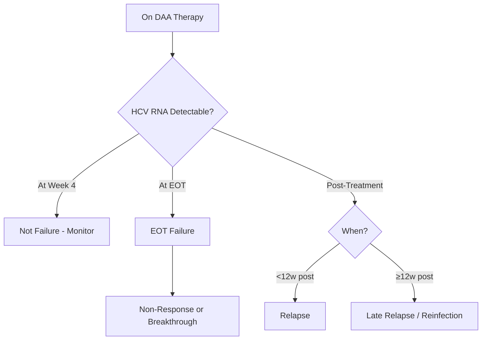
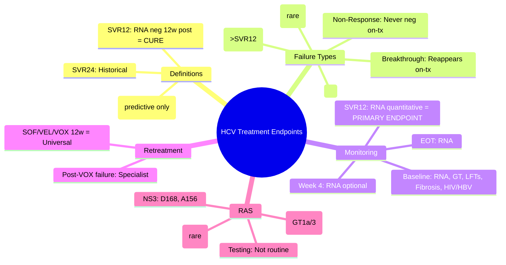

# HCV Treatment Endpoints: SVR12, SVR24, Relapse & Failure

## Learning Objectives
- [ ] Define SVR12, SVR24 and their clinical significance
- [ ] Differentiate relapse, breakthrough, and non-response
- [ ] Apply monitoring schedule during and after DAA therapy
- [ ] Manage treatment failure and retreatment
- [ ] Identify FCPS/MRCP high-yield endpoints and definitions

---

## Treatment Endpoints Definitions

| Endpoint | Definition | Clinical Significance |
|----------|------------|----------------------|
| **SVR12** | **HCV RNA undetectable 12 weeks post-treatment** | **CURE** (>99% durability); Primary endpoint in modern trials |
| **SVR24** | HCV RNA undetectable 24 weeks post-treatment | Historical gold standard; Now equivalent to SVR12 |
| **RVR (Rapid Virologic Response)** | HCV RNA undetectable at Week 4 on-treatment | Predictive of SVR; Not used for stopping decisions |
| **EVR (Early Virologic Response)** | HCV RNA ↓>2 log or undetectable at Week 12 (IFN era) | Historical; Not applicable to DAAs |
| **EOT (End of Treatment) Response** | HCV RNA undetectable at treatment completion | Expected with DAAs; Does NOT equal cure |

> **FCPS/MRCP**: **SVR12 = CURE**; No need for SVR24 in DAA era

---

## SVR12 vs SVR24: Why SVR12 Sufficient

| Aspect | SVR12 | SVR24 |
|--------|-------|-------|
| **Definition** | RNA negative at 12w post-treatment | RNA negative at 24w post-treatment |
| **Durability** | >99% | >99% |
| **Concordance** | 99.5-99.9% with SVR24 | Reference |
| **Regulatory** | FDA/EMA accept SVR12 as primary endpoint | Historical |
| **Clinical Practice** | Standard of care | Rarely used |

> **Key Evidence**: Multiple trials (ION, ASTRAL, SURVEYOR, POLARIS) showed SVR12 predicts SVR24 with >99% accuracy

---

## Virologic Failure Definitions

### Types of Failure

| Failure Type | Timing | Definition | Mechanism |
|--------------|--------|------------|-----------|
| **Non-Response (Null)** | **On-treatment** (any time) | HCV RNA **never becomes undetectable** | Primary resistance, Poor adherence, Drug interactions |
| **Breakthrough** | **On-treatment** (after initial suppression) | HCV RNA **reappears** after being undetectable | Resistance emergence, Adherence lapse |
| **Relapse** | **Post-treatment** (after EOT, before SVR12) | HCV RNA **reappears** after EOT negativity | Resistant variants, Inadequate duration |
| **Late Relapse** | **After SVR12** (rare) | RNA + after documented SVR12 | Reinfection OR true late relapse (<1%) |
| **Reinfection** | After SVR12 | New exposure in high-risk groups (PWID, MSM, Dialysis) | New infection, Different genotype/quasispecies |

---

## Monitoring Schedule (DAA Era)

| Timepoint | Assessment | Action |
|-----------|------------|--------|
| **Baseline** | HCV RNA (quantitative), Genotype, LFTs, CBC, Renal, HIV/HBV coinfection, Fibrosis (TE/FIB-4/APRI), Drug interactions | Regimen selection |
| **Week 4** | HCV RNA (qualitative/quantitative), LFTs, CBC, Adherence, Side effects | If detectable → Check adherence; Rarely stop |
| **EOT** | HCV RNA (qualitative), LFTs, CBC | Confirm negativity |
| **SVR12 (Post-tx Week 12)** | **HCV RNA (Quantitative) — PRIMARY ENDPOINT** | If negative = **CURE**; If positive = Failure |
| **Post-SVR (if Cirrhosis)** | LFTs 6-monthly, US ± AFP 6-monthly (HCC surveillance) | Lifelong HCC surveillance |

> **No RNA testing needed at Week 12 for treatment decisions** — DAAs have high barrier, Week 4 RNA rarely used for futility

---

## Management of Treatment Failure

### 1. Non-Response / Breakthrough (On-Treatment)
- **Rare with modern DAAs** (<1-2%)
- **Causes**: Resistance-associated substitutions (RAS), Poor adherence, Drug interactions, Impaired absorption
- **Action**: **Stop current regimen**; Assess adherence/interactions; **Retreat with different class**

### 2. Relapse (Post-Treatment, Before SVR12)
- **Rate**: 1-3% with modern pan-genotypic regimens
- **Most common**: NS5A inhibitor failure (resistance)
- **Retreatment**: **SOF/VEL/VOX 12 weeks** (preferred for NS5A failures)

### 3. Late Relapse / Reinfection (After SVR12)
- **Distinguish**: **Reinfection** = New exposure, often different genotype/subtype; **Late Relapse** = Same strain
- **Reinfection Risk Groups**: PWID, MSM, Haemodialysis, Prison
- **Management**: Retreat as new infection (same regimens effective)

---

## Retreatment Algorithms

### Prior DAA Failure → Retreatment

| Prior Failed Regimen | Recommended Retreatment | Duration |
|---------------------|------------------------|----------|
| **SOF/VEL** (or SOF/VEL/VOX) | **SOF/VEL/VOX** | 12 weeks |
| **GLE/PIB** | **SOF/VEL/VOX** | 12 weeks |
| **ELB/GZR** | **SOF/VEL/VOX** | 12 weeks |
| **SOF/VEL/VOX** (Failed) | **SOF/VEL + RBV 24w** OR **GLE/PIB + RBV 16-24w** | Specialist |
| **PR + SOF** (IFN-era) | Pan-genotypic per genotype/cirrhosis | Per above |

> **SOF/VEL/VOX = Universal retreatment for most DAA failures**

---

## Resistance-Associated Substitutions (RAS)

| Drug Class | Key RAS | Clinical Impact |
|------------|---------|-----------------|
| **NS5A Inhibitors** (Velpatasvir, Ledipasvir, Daclatasvir, Pibrentasvir) | **Y93H, L31M/V, Q30R/H** (GT1a); **Y93H, L31V** (GT3) | **High barrier to resistance** but cross-resistance within class |
| **NS5B Inhibitors** (Sofosbuvir - Nucleotide) | **S282T** | **Very rare**; High barrier; No cross-resistance with NS5A |
| **NS3/4A Protease Inhibitors** (Grazoprevir, Voxilaprevir, Glecaprevir) | **D168, A156, V170** | Moderate barrier; Cross-resistance within class |

> **Routine RAS testing NOT recommended** before treatment — pan-genotypic regimens cover most RAS; Test only in retreatment failur

---

## FCPS/MRCP High-Yield Summary

| Concept | Key Points |
|---------|------------|
| **SVR12** | **HCV RNA undetectable 12w post-treatment = CURE** |
| **SVR24** | Historical; SVR12 sufficient (>99% concordance) |
| **Failure Types** | Non-response (never neg), Breakthrough (reappears on-tx), Relapse (reappears post-tx) |
| **Monitoring** | Baseline RNA, Week 4 (optional), EOT RNA, **SVR12 RNA (Primary Endpoint)** |
| **Relapse Rate** | 1-3% with modern pan-genotypic DAAs |
| **Retreatment** | **SOF/VEL/VOX 12w** for most DAA failures |
| **RAS Testing** | Not routine; Only for retreatment failures |
| **Late Relapse vs Reinfection** | Reinfection = New exposure (PWID, Dialysis); Late Relapse = Same strain (<1%) |

---

## Viva Questions

1. **Define SVR12. Why is SVR24 no longer required?**
2. **Differentiate non-response, breakthrough, and relapse.**
3. **What is the monitoring schedule during DAA therapy?**
4. **What is the primary endpoint of DAA therapy?**
5. **How do you manage a patient who relapses after SOF/VEL?**
5. **What is the retreatment regimen after GLE/PIB failure?**
6. **When do you test for RAS?**
7. **Differentiate late relapse from reinfection.**
8. **What is the SVR12 durability?**
9. **What are the key NS5A RAS for GT1a and GT3?**
10. **What is the breakthrough definition?**

---

## Confusions & Mnemonics

| Confusion | Clarification |
|-----------|---------------|
| SVR12 vs SVR24 | **SVR12 = Cure**; SVR24 historical; 99.5% concordance |
| Breakthrough vs Relapse | Breakthrough = **On-treatment** (after suppression); Relapse = **Post-treatment** (after EOT) |
| Non-response vs Breakthrough | Non-response = **Never undetectable**; Breakthrough = **Was undetectable, then reappears** |
| Reinfection vs Late Relapse | Reinfection = New exposure, **different genotype/quasispecies**; Late relapse = Same strain, **very rare (<1%)** |
| RAS Testing | **Not routine** — pan-genotypic cover most; Only for retreatment failures |
| SOF/VEL/VOX Retreatment | **Universal** for NS5A/NS5B failures; 12 weeks |

---

## Mind Map

---

## One-Page Revision Card

| **Endpoint** | **Definition** | **Significance** |
|--------------|----------------|------------------|
| **SVR12** | RNA neg 12w post-tx | **CURE** (>99% durable) |
| **SVR24** | RNA neg 24w post-tx | Historical; Not needed |
| **RVR** | RNA neg Week 4 | Predictive only |
| **EOT** | RNA neg at end | Expected; Not cure |

| **Failure** | **Timing** | **Definition** |
|-------------|------------|----------------|
| Non-Response | On-tx | Never undetectable |
| Breakthrough | On-tx | Reappears after suppression |
| Relapse | Post-tx (<12w) | Reappears after EOT neg |
| Late Relapse | >12w post | Same strain (rare) |
| Reinfection | >12w post | New exposure, different strain |

| **Monitoring** | **When** | **Primary Endpoint** |
|----------------|----------|---------------------|
| Baseline | Pre-tx | Regimen selection |
| Week 4 | Optional | Adherence check |
| EOT | End of treatment | Confirm neg |
| **SVR12** | **12w post** | **CURE** |

| **Retreatment** | **Regimen** | **Duration** |
|-----------------|-------------|--------------|
| Prior SOF/VEL | SOF/VEL/VOX | 12w |
| Prior GLE/PIB | SOF/VEL/VOX | 12w |
| Prior VOX | SOF/VEL+RBV 24w / GLE/PIB+RBV | Specialist |

---

## Spaced Repetition Tracker

| Day | 1 | 3 | 7 | 15 | 30 |
|-----|---|---|---|----|----|
| SVR12 definition | ☐ | ☐ | ☐ | ☐ | ☐ |
| Failure types | ☐ | ☐ | ☐ | ☐ | ☐ |
| Monitoring schedule | ☐ | ☐ | ☐ | ☐ | ☐ |
| Retreatment algorithm | ☐ | ☐ | ☐ | ☐ | ☐ |
| RAS testing | ☐ | ☐ | ☐ | ☐ | ☐ |

---

## Self-Test Scorecard

| Question | My Answer | Correct? |
|----------|-----------|----------|
| SVR12 definition |  |  |
| Relapse vs Breakthrough |  |  |
| SVR12 vs SVR24 |  |  |
| Retreatment SOF/VEL fail |  |  |
| RAS testing indication |  |  |

---

## Local Navigation

- [[Viral Hepatitis/Hepatitis C|HCV Overview]]
- [[Viral Hepatitis/Hepatitis C genotype-based treatment|HCV Genotype Treatment]]
- [[Viral Hepatitis/HCV DAA Regimens by Genotype & Cirrhosis|HCV DAA Regimens]]
- [[Viral Hepatitis/Hepatitis C decompensated cirrhosis management|HCV Decompensated]]
- [[Viral Hepatitis/Hepatitis C renal impairment|HCV Renal]]
- [[Viral Hepatitis/Hepatitis C post-SVR follow-up|Post-SVR]]
---

> Auto-generated study sections for "Viral Hepatitis" — Ch 23: Hepatology.

## Flashcards (9 generated)

- Q: What is the definition of Viral Hepatitis?
  A: # HCV Treatment Endpoints: SVR12, SVR24, Relapse & Failure
- Q: What is SVR12 of Viral Hepatitis?
  A: HCV RNA undetectable 12w post-treatment = CURE
- Q: What is SVR24 of Viral Hepatitis?
  A: Historical; SVR12 sufficient (>99% concordance)
- Q: How is Viral Hepatitis classified?
  A: Non-response (never neg), Breakthrough (reappears on-tx), Relapse (reappears post-tx)
- Q: How is Viral Hepatitis monitored?
  A: Baseline RNA, Week 4 (optional), EOT RNA, SVR12 RNA (Primary Endpoint)
- Q: What is Relapse Rate of Viral Hepatitis?
  A: 1-3% with modern pan-genotypic DAAs
- Q: How is Viral Hepatitis managed?
  A: SOF/VEL/VOX 12w for most DAA failures
- Q: What is the investigation of choice for Viral Hepatitis?
  A: Not routine; Only for retreatment failures
- Q: What is Late Relapse vs Reinfection of Viral Hepatitis?
  A: Reinfection = New exposure (PWID, Dialysis); Late Relapse = Same strain (<1%)

## MCQs (1 generated)

1. **Which of the following best describes Viral Hepatitis?**
   A. **# HCV Treatment Endpoints: SVR12, SVR24, Relapse & Failure**
   B. An unrelated condition not matching the clinical picture of Viral Hepatitis
   C. A complication seen late in the disease course of Viral Hepatitis
   D. A condition that mimics Viral Hepatitis but has a different underlying cause

## SBA Questions (1 generated)

1. A patient with suspected Viral Hepatitis presents with: SVR12 — HCV RNA undetectable 12 weeks post-treatment; SVR24 — HCV RNA undetectable 24 weeks post-treatment; RVR (Rapid Virologic Response) — HCV RNA undetectable at Week 4 on-treatment. What is the most likely diagnosis?
   A. **Viral Hepatitis**
   B. A condition that mimics Viral Hepatitis but is not the same entity
   C. A complication of Viral Hepatitis rather than the primary diagnosis
   D. An unrelated condition in the same clinical category as Viral Hepatitis

## PasTest Scenario SBAs (Clinical Vignettes)

> **Auto-generated PasTest/Mediscope-style scenario SBAs** grounded in the authored source. Each scenario tests a real clinical fact (triad, specific sign, contraindication, trial, first-line Rx) extracted from the topic. *Source: Ch 23: Hepatology — Hepatitis C treatment endpoints*

**Q1.** What is the most appropriate first-line therapy for Hepatitis C treatment endpoints?

  - **A.** SVR12 + HCV RNA undetectable + CURE
  - **B.** An advanced/surgical therapy reserved for refractory disease
  - **C.** Symptomatic treatment only, no disease-modifying therapy
  - **D.** Empiric broad-spectrum therapy without specific indication

  > **Answer: A** — SVR12 + HCV RNA undetectable + CURE
  >
  > *Source:* **SVR12**   **HCV RNA undetectable 12 weeks post-treatment**   **CURE** (>99% durability); Primary endpoint in modern trials

