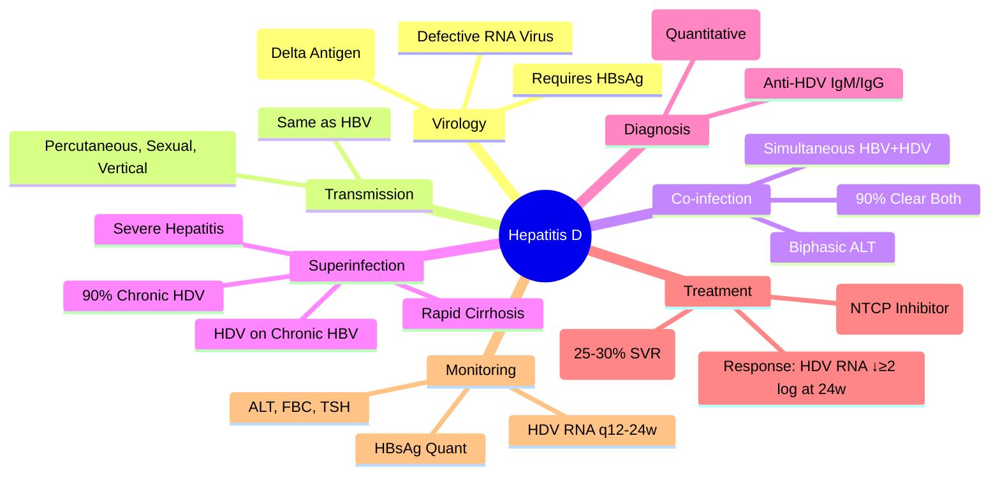

# Hepatitis D (Delta) - Detailed

## Learning Objectives
- [ ] Understand HDV as defective virus requiring HBV
- [ ] Differentiate co-infection vs superinfection
- [ ] Apply diagnostic criteria (Anti-HDV IgM, HDV RNA)
- [ ] Apply treatment options (PEG-IFN, bulevirtide)
- [ ] Identify FCPS/MRCP high-yield features

---

## HDV Virology

| Feature | Detail |
|---------|--------|
| **Classification** | **Defective RNA Virus** (Delta Agent) |
| **Dependence** | **Requires HBsAg** from HBV for Assembly/Propagation |
| **Genome** | Circular, Single-Stranded RNA (~1.7 kb) |
| **Protein** | **HDAg** (Small & Large Delta Antigen) |
| **Envelope** | **HBsAg** (Provided by HBV) |

> **HDV Cannot Replicate Without HBV** — No HBV = No HDV

---

## Transmission & Epidemiology

| Route | Detail |
|-------|--------|
| **Transmission** | **Percutaneous, Sexual, Vertical** (Same as HBV) |
| **High-Risk Groups** | IVDU, Haemophiliacs, MSM, Endemic Areas (Mediterranean, Central Africa, Amazon) |
| **Global Prevalence** | ~15-20 Million (5% of HBsAg+ Carriers) |
| **Declining** | Due to HBV Vaccination |

---

## Co-infection vs Superinfection

```mermaid
flowchart TD
    A[HDV Exposure] --> B{Host HBV Status}
    B -->|HBsAg Negative| C[Acute Co-Infection]
    B -->|HBsAg Positive (Chronic HBV)| D[Superinfection]
    C --> E[Simultaneous HBV + HDV Acquisition]
    D --> F[HDV Superimposes on Chronic HBV]
    E --> G[Acute Hepatitis; 90% Clearance]
    F --> H[Severe Acute Hepatitis; 90% Chronic HDV]
```

### Co-infection (Simultaneous HBV + HDV)

| Feature | Detail |
|--------|--------|
| **Mechanism** | Simultaneous Acquisition of HBV + HDV |
| **Clinical** | Acute Hepatitis (Often Biphasic) |
| **Outcome** | **90% Clear Both Viruses**; <5% Chronic HDV |
| **Severity** | More Severe Than HBV Alone |
| **HBsAg** | Cleared with HBV |

### Superinfection (HDV on Chronic HBV)

| Feature | Detail |
|--------|--------|
| **Mechanism** | HDV Superinfects Chronic HBV Carrier |
| **Clinical** | **Severe Acute Hepatitis** (Often Mistaken for HBV Flare) |
| **Outcome** | **90% Progress to Chronic HDV** |
| **Progression** | **Accelerated Fibrosis → Cirrhosis (2-3x Faster)** |
| **HBsAg** | Persists (Chronic HBV) |

---

## Clinical Presentation

| Scenario | Features |
|---------|----------|
| **Acute Co-infection** | Biphasic ALT Rise; Symptoms Like Acute HBV; Self-Limited |
| **Superinfection** | **Severe Acute on Chronic**; Rapid Progression to Cirrhosis |
| **Chronic HDV** | Accelerated Fibrosis; Early Decompensation; **HCC Risk ↑** |

> **HDV Accelerates Cirrhosis by 10-20 Years** vs HBV Alone

---

## Diagnosis

```mermaid
flowchart TD
    A[Suspect HDV: HBsAg+ with Severe Acute Hepatitis / Rapid Progression] --> B[Anti-HDV IgM/IgG]
    B --> C{Anti-HDV Positive?}
    C -->|Yes| D[HDV RNA PCR (Confirm Active Replication)]
    C -->|No| E[HDV Unlikely]
    D --> F{HDV RNA Positive?}
    F -->|Yes| G[Active HDV Replication]
    F -->|No| H[Past/Resolved HDV]
```

### Serological Markers

| Marker | Significance |
|--------|--------------|
| **Anti-HDV IgM** | **Acute/Active Infection** |
| **Anti-HDV IgG** | Past/Resolved or Chronic |
| **HDV RNA (PCR)** | **Active Replication** (Quantitative) |
| **HDAg** | Liver Biopsy (Rarely Used) |

### HDV + HBV Serology Patterns

| Scenario | HBsAg | Anti-HBc | Anti-HDV IgM | HDV RNA |
|----------|-------|----------|--------------|---------|
| **Acute Co-infection** | + | + (IgM+) | + | + |
| **Resolving Co-infection** | - | + (IgG) | + | - |
| **Superinfection** | + | + (IgG) | + | + |
| **Chronic HDV** | + | + | + (IgG) | + |

---

## Treatment

### Current Standard

| Drug | Regimen | Duration | SVR/Sustained Response |
|------|---------|----------|------------------------|
| **PEG-IFN-α2a/α2b** | 180 μg/week (or 1.5 μg/kg/week) | **48 Weeks** | **~25-30% (HDV RNA Neg at 24w Post-Tx)** |
| **Bulevirtide** (Myrcludex B) | **2 mg SC Daily** | **48 Weeks** | **~45-50% (HDV RNA Decline ≥2 log)** |

> **PEG-IFN = Only Approved Therapy Historically**; **Bulevirtide = New Entry Inhibitor (EMA Approved 2020)**

### Bulevirtide (NTCP Inhibitor)

| Feature | Detail |
|--------|--------|
| **Mechanism** | **NTCP (Sodium Taurocholate Cotransporting Polypeptide) Inhibitor** → Blocks HBV/HDV Entry |
| **Dose** | **2 mg SC Daily** |
| **Duration** | **48 Weeks** (Longer if Response) |
| **Combination** | **With PEG-IFN** (Synergistic) — Under Investigation |
| **Response** | **HDV RNA Decline ≥2 log** at 24w; **HBV DNA Suppression** Also |

### PEG-IFN Regimen

| Parameter | Detail |
|--------|--------|
| **Dose** | 180 μg/week (α2a) or 1.5 μg/kg/week (α2b) |
| **Duration** | **48 Weeks** |
| **Monitoring** | HDV RNA q12-24w, ALT, FBC, TSH, Psychiatric |
| **Stopping Rule** | **HDV RNA <2 log Drop at 24w → Stop** (Futility) |

> **Response Predictor**: **HDV RNA Decline >2 log at 24 Weeks** → Continue; **<2 log → Stop**

---

## Indications for Treatment

| Scenario | Treat? |
|----------|--------|
| **Chronic HDV + Compensated Liver Disease** | **Yes (PEG-IFN or Bulevirtide)** |
| **Decompensated Cirrhosis** | **Caution (PEG-IFN Contraindicated)**; Bulevirtide Preferred |
| **Co-infection (Acute)** | **No** (Self-Limited) |
| **Anti-HDV IgG +, HDV RNA -** | **No** (Resolved) |

---

## Monitoring on Treatment

| Parameter | Frequency |
|-----------|-----------|
| **HDV RNA (Quantitative)** | Baseline, Week 12, 24, 48, 24w Post-Tx |
| **HBsAg (Quantitative)** | q12 Weeks |
| **ALT/AST/Bilirubin** | q4-8 Weeks |
| **FBC, TSH** | q4-8 Weeks (PEG-IFN) |
| **Psychiatric Assessment** | q4-8 Weeks (PEG-IFN) |

---

## FCPS/MRCP High-Yield Summary

| Concept | Key Points |
|---------|------------|
| **HDV = Defective Virus** | **Requires HBsAg**; Enveloped by HBsAg |
| **Co-infection** | Simultaneous HBV+HDV → 90% Clearance |
| **Superinfection** | HDV on Chronic HBV → **90% Chronic HDV**, Rapid Cirrhosis |
| **Diagnosis** | **Anti-HDV IgM/IgG + HDV RNA PCR** |
| **Treatment** | **PEG-IFN 48w** (25-30% SVR) **OR Bulevirtide 2mg SC Daily 48w** |
| **Bulevirtide** | **NTCP Inhibitor** → Blocks Entry; **EMA Approved 2020** |
| **Response Criteria** | HDV RNA Decline ≥2 log at 24w |
| **Contraindications** | Decompensated Cirrhosis (PEG-IFN); Bulevirtide Safer |
| **Monitoring** | HDV RNA q12-24w; HBsAg Quant; ALT |

---

## Viva Questions

1. **What is the difference between HDV co-infection and superinfection?**
2. **Why can HDV not replicate without HBV?**
3. **How do you diagnose active HDV infection?**
3. **What are the treatment options for chronic HDV?**
4. **What is bulevirtide and how does it work?**
4. **What is the response criterion for PEG-IFN in HDV?**
5. **How does HDV superinfection affect liver disease progression?**
5. **What is the role of HDV RNA monitoring during treatment?**
6. **Can you treat HDV in decompensated cirrhosis?**
6. **What is the difference between HDV co-infection and superinfection outcomes?**

---

## Confusions & Mnemonics

| Confusion | Clarification |
|-----------|---------------|
| Co-infection vs Superinfection | Co = Simultaneous (90% Clear); Super = HDV on Chronic HBV (90% Chronic) |
| HDV Without HBV | **Impossible** — HDV Requires HBsAg for Envelopment |
| PEG-IFN Duration | **48 Weeks Fixed** (Not Response-Guided Like HCV) |
| Bulevirtide Mechanism | **NTCP Inhibitor** — Blocks Viral Entry (HDV + HBV) |
| HDV RNA Stopping Rule | **<2 log Drop at 24w → Stop PEG-IFN** (Futility) |
| HDV in Decompensated | **PEG-IFN Contraindicated** → Bulevirtide Preferred |
| Anti-HDV IgG | Persists Lifelong (Even After Clearance) |
| HDV/HBV Co-infection Clearance | **90% Clear Both** (Unlike Superinfection) |

---

## Mind Map



---

## One-Page Revision Card

| **HDV Basics** | **Details** |
|----------------|-------------|
| **Type** | Defective RNA Virus (Delta Agent) |
| **Requirement** | **HBsAg (from HBV)** |
| **Transmission** | Same as HBV |

| **Co-infection** | **Superinfection** |
|------------------|--------------------|
| Simultaneous HBV+HDV | HDV on Chronic HBV |
| Biphasic ALT | Severe Acute on Chronic |
| **90% Clear Both** | **90% Chronic HDV** |
| Self-Limited | **Rapid Cirrhosis** |

| **Diagnosis** | **Markers** |
|---------------|-------------|
| Active Infection | **Anti-HDV IgM + HDV RNA** |
| Past/Resolved | Anti-HDV IgG + HDV RNA Negative |

| **Treatment** | **Details** |
|---------------|-------------|
| **PEG-IFN-α** | 180μg/wk × 48w; **SVR ~25-30%** |
| **Bulevirtide** | **2mg SC Daily × 48w**; NTCP Inhibitor; **Response: HDV RNA ↓≥2 log at 24w** |
| **Combination** | PEG-IFN + Bulevirtide (Investigational) |

| **Monitoring** | **Frequency** |
|----------------|---------------|
| HDV RNA | Baseline, 12, 24, 48w, 24w Post |
| HBsAg Quant | q12 Weeks |
| ALT, FBC, TSH | q4-8 Weeks (IFN) |

| **Contraindications** | |
|-----------------------|--|
| PEG-IFN | Decompensated Cirrhosis |
| Bulevirtide | Safer in Cirrhosis |

---

## Spaced Repetition Tracker

| Day | 1 | 3 | 7 | 15 | 30 |
|-----|---|---|---|---|----|
| Co-infection vs Superinfection | ☐ | ☐ | ☐ | ☐ | ☐ |
| HDV Requires HBV | ☐ | ☐ | ☐ | ☐ | ☐ |
| PEG-IFN vs Bulevirtide | ☐ | ☐ | ☐ | ☐ | ☐ |
| Response Criteria (≥2 log) | ☐ | ☐ | ☐ | ☐ | ☐ |
| HDV RNA Monitoring | ☐ | ☐ | ☐ | ☐ | ☐ |

---

## Self-Test Scorecard

| Question | My Answer | Correct? |
|----------|-----------|----------|
| Co-infection vs Superinfection |  |  |
| HDV Requires HBsAg |  |  |
| Bulevirtide Mechanism |  |  |
| PEG-IFN SVR Rate |  |  |
| HDV RNA Response Criteria |  |  |

---

## Local Navigation

- [[Viral Hepatitis/Hepatitis B|HBV]]
- [[Viral Hepatitis/Hepatitis B phases of chronic infection|HBV Phases]]
- [[Acute Liver Failure/Acute viral hepatitis (A, B, E)|ALF: Viral Hepatitis]]
- [[Viral Hepatitis/Hepatitis B reactivation|HBV Reactivation]]