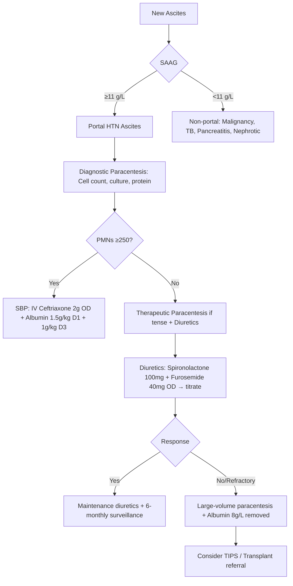

> [!tip] **FCPS/MRCP Priority: HIGH**
> **Cirrhosis & Portal Hypertension = Core hepatology** — Child-Pugh/MELD scoring, ascites (SAAG, SBP, refractory), variceal bleed protocol (vasoactives + antibiotics + endoscopy + TIPS), HE grading, HRS-AKI/CKD, HPS, beta-blocker vs EVL, TIPS indications.

---

## 1. Learning Objectives
By the end of this note you should be able to:
- [ ] Classify cirrhosis (compensated vs decompensated) and apply **Child-Pugh** and **MELD/MELD-Na** scores
- [ ] Diagnose and manage **ascites** (SAAG, SBP prophylaxis/treatment, refractory ascites, TIPS)
- [ ] Apply **variceal bleed protocol**: vasoactives → antibiotics → endoscopy → TIPS
- [ ] Grade **hepatic encephalopathy** (West Haven) and manage (lactulose, rifaximin)
- [ ] Diagnose and manage **HRS-AKI vs HRS-CKD** (terlipressin + albumin, TIPS)
- [ ] Recognise **HPS** and **portopulmonary hypertension**
- [ ] Apply **primary/secondary prophylaxis** for varices (NSBB vs EVL)

---

## 1. Definition & Classification

| Category | Definition |
|----------|------------|
| **Compensated Cirrhosis** | No history of ascites, variceal bleed, hepatic encephalopathy, jaundice |
| **Decompensated Cirrhosis** | **Ascites** OR **variceal bleed** OR **hepatic encephalopathy** OR **jaundice** (bilirubin >35 µmol/L) |

### Child-Pugh Score

| Parameter | 1 Point | 2 Points | 3 Points |
|-----------|---------|----------|----------|
| **Bilirubin (µmol/L)** | <34 | 34-50 | >50 |
| **Albumin (g/L)** | >35 | 28-35 | <28 |
| **INR** | <1.7 | 1.7-2.3 | >2.3 |
| **Ascites** | None | Mild/controlled | Tense/refractory |
| **Hepatic Encephalopathy** | None | Grade I-II | Grade III-IV |

| Class | Score | 1-Year Survival | 2-Year Survival |
|-------|-------|-----------------|-----------------|
| **A** | 5-6 | 100% | 85% |
| **B** | 7-9 | 80% | 60% |
| **C** | 10-15 | 45% | 35% |

### MELD / MELD-Na Score

**MELD = 3.78 × ln(bilirubin mg/dL) + 11.2 × ln(INR) + 9.57 × ln(creatinine mg/dL) + 6.43**

**MELD-Na = MELD + 1.32 × (137 - Na) - [0.033 × MELD × (137 - Na)]** (Na capped 125-137)

| MELD Score | 3-Month Mortality | Transplant Priority |
|------------|-------------------|-------------------|
| <10 | <5% | Low |
| 10-19 | 6-20% | Moderate |
| 20-29 | 20-50% | High |
| 30-39 | 50-75% | Very high |
| ≥40 | >75% | Urgent |

> **Key**: MELD-Na used for transplant allocation (UK); creatinine capped at 4.0; dialysis = 4.0

---

## 2. Ascites

### Diagnosis & SAAG

| Test | Value | Interpretation |
|------|-------|----------------|
| **SAAG** (Serum-Ascites Albumin Gradient) | **≥11 g/L** | **Portal hypertension** (cirrhosis, cardiac, Budd-Chiari) |
| | **<11 g/L** | **Non-portal hypertension** (peritoneal carcinomatosis, TB, pancreatitis, nephrotic) |
| **Ascitic Protein** | **>25 g/L** | Exudate (in SBP context: <15 g/L = high SBP risk) |
| **Polymorphs (PMNs)** | **≥250 cells/mm³** | **SBP diagnosis** |

### Ascites Management Algorithm



### Diuretic Regimen (Standard)

| Drug | Starting Dose | Max Dose | Ratio | Monitoring |
|------|---------------|----------|-------|------------|
| **Spironolactone** | 100 mg OD | 400 mg OD | **100:40** (Spironolactone:Furosemide) | K+, Cr, Na, weight, urine output |
| **Furosemide** | 40 mg OD | 160 mg OD | | K+, Cr, Na, weight |

> **Refractory Ascites** = No response to 400mg spironolactone + 160mg furosemide OR early recurrence after paracentesis OR diuretic-induced complications

### SBP Prophylaxis

| Indication | Regimen |
|------------|---------|
| **Prior SBP** | **Norfloxacin 400mg OD** lifelong |
| **Ascitic protein <15 g/L + Child-Pugh ≥9 or renal impairment** | **Norfloxacin 400mg OD** (primary prophylaxis) |
| **Active GI bleed** | **Ceftriaxone 1g IV OD** (7 days) |

---

## 3. Variceal Bleeding

### Acute Variceal Bleed Protocol

```mermaid
flowchart TD
    A[Acute Variceal Bleed Suspected] --> B[Resuscitation: Airway, IV access, bloods, crossmatch]
    B --> C[**Vasoactive Drug ASAP**: Terlipressin 2mg IV q4h OR Octreotide 50mcg bolus + 50mcg/h]
    C --> D[**Antibiotic Prophylaxis**: Ceftriaxone 1g IV OD ×7 days]
    D --> E[**Endoscopy within 12h** (ideally <12h)]
    E --> F{Endoscopy Findings}
    F -->|Oesophageal Varices| G[**EVL (band ligation)** ± Sclerotherapy]
    F -->|Gastric Varices| H[**Cyanoacrylate glue injection**]
    F -->|No varices / Other source| I[Manage accordingly]
    G --> J{Bleeding Controlled?}
    J -->|Yes| K[**Secondary Prophylaxis**: NSBB + EVL]
    J -->|No/Rebleed| L[**Rescue TIPS** (early within 72h if Child B/C or HVPG >20)]
```

### Primary Prophylaxis (No prior bleed)

| Patient | Recommended | Evidence |
|---------|-------------|----------|
| **Medium/Large varices** (F2/F3) | **NSBB (propranolol/ nadolol) to reduce HR by 25% or to 55-60 bpm** OR **EVL q2wks** | NSBB = EVL for bleed prevention; NSBB also reduces ascites/HE |
| **Small varices (F1) + red wale signs / Child C** | **NSBB** | |
| **Small varices, no red signs, Child A/B** | **Surveillance endoscopy q2-3yrs** | |

### Secondary Prophylaxis (Post-bleed)

| Strategy | Regimen |
|----------|---------|
| **Combined (Preferred)** | **NSBB (propranolol/nadolol) + EVL q2-4wks until eradication** |
| **Alternative** | **EVL alone** (if NSBB contraindicated) |
| **HVPG-guided** (if available) | Target **HVPG <12 mmHg** or **≥20% reduction** from baseline |

---

## 4. Hepatic Encephalopathy (HE)

### West Haven Grading

| Grade | Clinical Features |
|-------|-------------------|
| **Covert (Minimal)** | No overt symptoms; psychometric testing abnormal |

*...continued (truncated for renderer performance)*