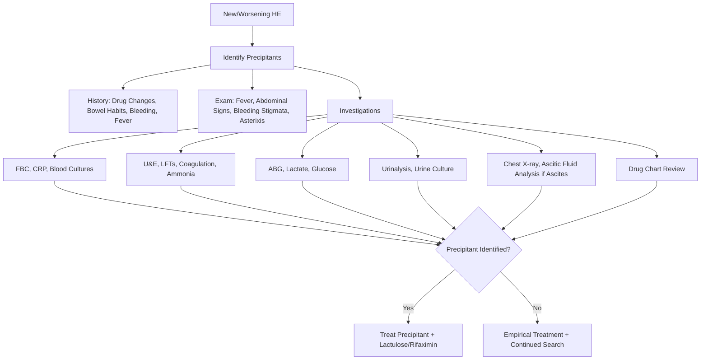
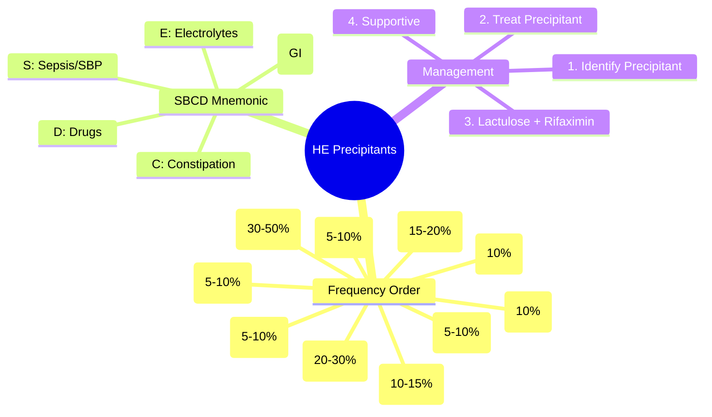

## 1. Learning Objectives
- [ ] Identify common precipitating factors for HE
- [ ] Apply systematic approach to identify and treat precipitants
- [ ] Prioritise treatment of most common precipitants
- [ ] Recognise drug-induced encephalopathy
- [ ] Identify FCPS/MRCP high-yield precipitants

---

## 2. Common Precipitating Factors (Frequency Order)

```mermaid
flowchart TD
    A[Acute/Worsening HE] --> B[Identify Precipitants]
    B --> C[Infection: SBP #1, Pneumonia, UTI, Bacteremia]
    B --> D[GI Bleed: Variceal, Portal Hypertensive Gastropathy]
    B --> E[Electrolytes: Hypokalaemia, Hyponatraemia, Alkalosis]
    B --> F[Drugs: Sedatives, Opioids, Diuretics, PPI, NSAIDs]
    B --> G[Constipation / Faecal Loading]
    B --> H[Renal Failure / HRS]
    B --> I[Hypoxia / Respiratory Failure]
    B --> J[Surgery / Endoscopy / TIPSS]
    B --> K[Alcohol Binge / Withdrawal]
    B --> L[TIPS Dysfunction / Shunt Stenosis]
    B --> M[Paracentesis (Large Volume Without Albumin)]
```

---

## 3. Precipitants by Frequency

| Precipitant | Frequency | Key Features |
|-------------|-----------|--------------|
| **Infection (esp. SBP)** | **30-50%** | Fever, ↑WCC, ↑CRP; **SBP = PMN ≥250** |
| **GI Bleed** | **20-30%** | Haematemesis, Melaena, ↓Hb; ↑Protein Load → ↑Ammonia |
| **Electrolytes** | **15-20%** | **Hypokalaemia** (Diuretics), Hyponatraemia, Alkalosis |
| **Constipation** | **10-15%** | ↓Bowel Movements → ↑Ammonia Absorption |
| **Drugs** | **10%** | Sedatives, Opioids, Diuretics, PPI, NSAIDs |
| **Renal Failure / HRS** | **10%** | ↓Ammonia Clearance, ↑Cerebral Oedema Risk |
| **Hypoxia / Respiratory Failure** | 5-10% | Respiratory Failure, COPD, Aspiration |
| **TIPS Dysfunction** | 5-10% | Shunt Stenosis/Occlusion → Recurrence |
| **Large-Volume Paracentesis** | 5-10% | **Without Albumin** → Circulatory Dysfunction |
| **Alcohol Binge / Withdrawal** | 5-10% | Acute Hepatitis + Encephalopathy |
| **Surgery / Endoscopy / TIPSS** | 5% | Stress, Fasting, Sedation |
| **TIPS Placement** | 5-10% (Early) | New Shunt → ↑Portosystemic Shunting |

---

## 4. Systematic Approach to Precipitant Identification



---

## 5. Precipitant-Specific Management

### 1. Infection (Most Common - 30-50%)
| Infection | Diagnosis | Treatment |
|-----------|-----------|-----------|
| **SBP** | Ascitic PMN ≥250 | **Ceftriaxone 2g IV + Albumin** |
| **Pneumonia** | CXR + Sputum Culture | **Ceftriaxone + Azithromycin** |
| **UTI** | Urinalysis + Culture | **Trimethoprim / Ceftriaxone** |
| **Bacteremia** | Blood Cultures x2 | **Piperacillin-Tazobactam / Ceftriaxone** |

> **Empirical Ceftriaxone 2g IV** if Source Unclear

### 2. GI Bleed (20-30%)
| Feature | Management |
|---------|------------|
| **Bleeding** | Vasoactives (Terlipressin/Octreotide) + Endoscopy + Antibiotics |
| **Protein Load** | ↑Urea → ↑Ammonia → HE |
| **Treatment** | Lactulose (Promotes Excretion), Rifaximin, Protein Restriction (Temporary) |

### 3. Electrolyte Disturbances
| Disturbance | Mechanism | Correction |
|-------------|-----------|------------|
| **Hypokalaemia** | Diuretics → ↑Renal Ammonia | **KCl IV/PO, K-Sparing Diuretic** |
| **Hyponatraemia** | Dilutional, SIADH | **Fluid Restrict 1L, Vaptans (Tolvaptan)** |
| **Alkalosis** | Diuretics, Vomiting | **Treat Cause, Acetazolamide (Caution)** |

### 4. Constipation (10-15%)
| Feature | Management |
|---------|------------|
| **Mechanism** | Stasis → ↑Ammonia Production/Absorption |
| **Treatment** | **Lactulose** (First-Line: 15-30ml BD → 2-3 Soft Stools/Day) |
| **Adjunct** | Lactulose Enema (If Severe), Fibre, Hydration, Mobility |

### 5. Drug-Induced Encephalopathy
| Drug Class | Mechanism | Management |
|------------|-----------|------------|
| **Benzodiazepines** | GABA Agonism | **Stop/Reduce, Flumazenil (Rare)** |
| **Opioids** | Respiratory Depression, ↓Gut Motility | **Stop/Reduce, Naloxone (If Severe)** |
| **Diuretics** | Hypokalaemia, Alkalosis, Volume Depletion | **Stop/Reduce K-Sparing, Correct Electrolytes** |
| **PPI** | Alters Gut Flora → ↑Ammonia | **Stop if Not Indicated** |
| **NSAIDs** | Renal Impairment, GI Bleed | **Avoid/Stop** |

> **Medication Review Essential** — Every New HE Episode

### 6. Renal Failure / HRS
| Mechanism | Management |
|-----------|------------|
| ↓Renal Ammonia Clearance | Lactulose, Rifaximin, Treat HRS (Terlipressin + Albumin) |
| ↑Cerebral Oedema Risk | Control ICP, Avoid Hypoxia |

### 7. TIPS Dysfunction
| Feature | Management |
|--------|------------|
| **Signs** | Recurrent Ascites, HE, Variceal Bleed |
| **Diagnosis** | Doppler US (PSV <60 or >250 cm/s) |
| **Treatment** | Balloon Dilatation ± Stent Revision |

---

## 6. FCPS/MRCP High-Yield Summary

| Precipitant | Frequency | Key Action |
|-------------|-----------|------------|
| **Infection (SBP)** | 30-50% | **Ceftriaxone + Albumin (SBP)** |
| **GI Bleed** | 20-30% | **Vasoactives + Endoscopy + Ceftriaxone** |
| **Electrolytes (K↓, Na↓)** | 15-20% | **Correct K, Na, Alkalosis** |
| **Constipation** | 10-15% | **Lactulose 15-30ml BD → 2-3 Soft Stools** |
| **Drugs** | 10% | **Stop Sedatives, Opioids, Diuretics** |
| **Renal Failure/HRS** | 10% | **Terlipressin + Albumin, Lactulose** |
| **Hypoxia** | 5-10% | **O2, Ventilate if Needed** |
| **TIPS Dysfunction** | 5-10% | **Doppler US → Balloon Dilatation** |

---

## 7. FCPS/MRCP "Must-Know" Precipitant List

| Rank | Precipitant | Key Mnemonics |
|------|-------------|---------------|
| **1** | **Infection (SBP)** | **S**epsis, **B**leed, **E**lectrolytes, **D**rugs, **C**onstipation |
| **2** | **GI Bleed** | **S**BCD: **S**epsis, **B**leed, **C**onstipation, **D**rugs |
| **3** | **Electrolytes (K↓, Na↓)** | **K**iller: **K**↓ → ↑Ammonia |
| **4** | **Constipation** | **C**onstipation → **C**erebral Toxicity |
| **5** | **Drugs (Benzo, Opioid, Diuretic)** | **B**enzo **B**ad for Brain |

> **FCPS/MRCP**: **Always Search for Precipitant FIRST** — Treat Precipitant + Lactulose/Rifaximin

---

## 8. Viva Questions

1. **What are the 5 most common precipitating factors for HE?**
2. **How does hypokalaemia precipitate HE?**
3. **How does GI bleed precipitate HE?**
3. **Which drugs commonly precipitate HE in cirrhosis?**
4. **How does constipation precipitate HE?**
4. **What is the mechanism of SBP precipitating HE?**
5. **How do you manage HE precipitated by GI bleed?**
5. **What electrolyte abnormalities precipitate HE?**
6. **How does TIPS dysfunction present?**
6. **What is the role of lactulose in constipation-induced HE?**
7. **How do you identify drug-induced HE?**

---

## 9. Confusions & Mnemonics

| Confusion | Clarification |
|-----------|---------------|
| Precipitant vs Cause | **Precipitant** = Acute Trigger on Chronic Liver Disease; **Cause** = Underlying Cirrhosis |
| SBP vs Other Infections | **SBP Most Common** (30-50%); Look for Fever, Abdominal Pain, Worsening HE |
| Constipation Mechanism | Stasis → Bacterial Overgrowth → ↑Ammonia Production/Absorption |
| Hypokalaemia Mechanism | K↓ → Renal H+ Excretion → Alkalosis → NH4+ → NH3 (Crosses BBB) |
| GI Bleed Protein Load | Blood in Gut → Protein → Bacterial Urease → Ammonia ↑ |
| Diuretics → HE | Hypokalaemia + Alkalosis + Volume Depletion → ↑Ammonia |
| PPI & HE | Alters Gut Microbiome → ↑Ammonia Producers (Controversial but Recognised) |
| Opioids vs Benzos | Both Sedating → Avoid; Opioids Also → Constipation |

---

## 10. Mind Map



---

## 11. One-Page Revision Card

| **Precipitant** | **Frequency** | **Key Action** |
|-----------------|---------------|----------------|
| **Infection (SBP)** | **30-50%** | **Ceftriaxone 2g IV + Albumin** |
| **GI Bleed** | **20-30%** | **Vasoactives + Endoscopy + Ceftriaxone** |
| **Electrolytes (K↓, Na↓, Alk)** | 15-20% | **Correct K, Na, Alkalosis** |
| **Constipation** | 10-15% | **Lactulose 15-30ml BD → 2-3 Soft Stools** |
| **Drugs (Benzo, Opioid, Diuretic, PPI)** | 10% | **Stop/Reduce Offending Drugs** |
| **Renal Failure/HRS** | 10% | **Terlipressin + Albumin, Lactulose** |
| **Hypoxia** | 5-10% | **O2, Ventilate if Needed** |
| **TIPS Dysfunction** | 5-10% | **Doppler US → Balloon Dilatation** |

| **Mnemonic: SBCDE** | |
|---------------------|--|
| **S** | **S**epsis (SBP #1) |
| **B** | **B**leed (GI #2) |
| **C** | **C**onstipation |
| **D** | **D**rugs |
| **E** | **E**lectrolytes (K, Na, Alkalosis) |

---

## 12. Spaced Repetition Tracker

| Day | 1 | 3 | 7 | 15 | 30 |
|-----|---|---|---|----|----|
| SBCDE Mnemonic | ☐ | ☐ | ☐ | ☐ | ☐ |
| SBP Precipitant #1 | ☐ | ☐ | ☐ | ☐ | ☐ |
| Hypokalaemia Mechanism | ☐ | ☐ | ☐ | ☐ | ☐ |
| GI Bleed Mechanism | ☐ | ☐ | ☐ | ☐ | ☐ |
| Drug Precipitants List | ☐ | ☐ | ☐ | ☐ | ☐ |

---

## 13. Self-Test Scorecard

| Question | My Answer | Correct? |
|----------|-----------|----------|
| Top 5 Precipitants |  |  |
| SBP → HE Mechanism |  |  |
| Hypokalaemia → HE |  |  |
| GI Bleed → HE Mechanism |  |  |
| Drug Precipitants |  |  |

---

## 14. Local Navigation

- [[Portal Hypertension and Complications/Hepatic Encephalopathy|Hepatic Encephalopathy]]
- [[Portal Hypertension and Complications/Management (lactulose, rifaximin)|HE Management]]
- [[Portal Hypertension and Complications/Spontaneous bacterial peritonitis (SBP)|SBP]]
- [[Portal Hypertension and Complications/Acute variceal bleeding management|Acute Variceal Bleed]]
- [[Portal Hypertension and Complications/Hepatorenal Syndrome|HRS]]