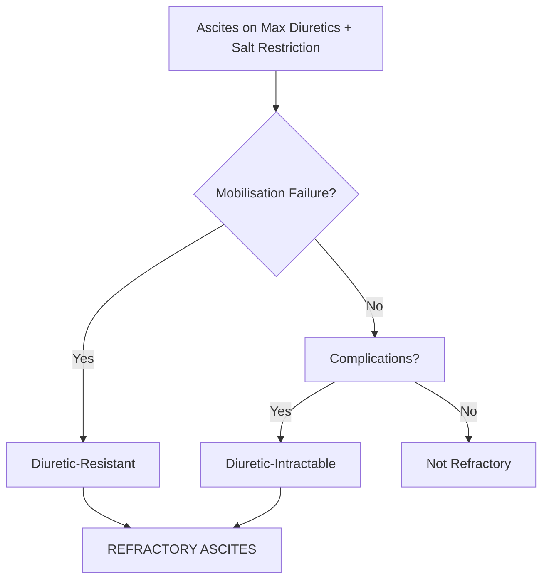

## 1. Learning Objectives
- [ ] Apply ICA definition of refractory ascites
- [ ] Differentiate diuretic-resistant vs diuretic-intractable
- [ ] Apply management algorithm (Serial LVP → TIPS → Transplant)
- [ ] Know alfapump as emerging option
- [ ] Identify FCPS/MRCP high-yield management steps

---

## 2. Definition (International Club of Ascites - ICA)

> **Refractory Ascites** = Ascites that **cannot be mobilised** or **early recurrence** despite:
> 1. **Sodium Restriction**: 88 mmol/day (2g NaCl = 5g salt)
> 2. **Maximum Diuretic Therapy**: Spironolactone 400mg + Furosemide 160mg daily
>    **OR** Diuretic-Induced Complications Preventing Use



---

## 3. Types of Refractory Ascites

| Type | Definition | Key Features |
|------|------------|--------------|
| **Diuretic-Resistant** | **No response** to Max Diuretics (Spiro 400 + Furo 160) + Salt Restriction (88 mmol/day) for ≥1 week | Weight loss <0.5 kg/day; Urine Na <78 mmol/day |
| **Diuretic-Intractable** | **Diuretic-Induced Complications** Preventing Use of Max Doses | Renal Impairment (Cr↑), Hyponatraemia (Na<130), HE, Hyperkalaemia |

> **Key**: Both Require **Adequate Trial** of Max Doses (Spiro 400 + Furo 160) + Salt Restriction

---

## 4. Diagnostic Criteria (ICA)

| Criterion | Must Be Met |
|-----------|-------------|
| **1. Cirrhosis with Ascites** | Confirmed |
| **2. Salt Restriction** | **88 mmol/day (2g NaCl)** for ≥1 week |
| **3. Diuretic Therapy** | **Spiro 400mg + Furo 160mg daily** for ≥1 week |
| **4. Treatment Failure** | **Either**: (a) No Weight Loss <0.5kg/day OR (b) Early Recurrence <4w Post-LVP |
| **4. Complications (Intractable)** | Renal Impairment, Hyponatraemia, HE, Hyperkalaemia Preventing Diuretic Use |

---

## 5. Management Algorithm

```mermaid
flowchart TD
    A[Diagnose Refractory Ascites] --> B[Serial Large-Volume Paracentesis (LVP) + Albumin]
    B --> C{Good Candidate for TIPS?}
    C -->|Child A/B, No Severe HE, Age<70, No Cardiopulmonary Dz| D[TIPS]
    C -->|No| E[Continue Serial LVP + Albumin]
    D --> F[Monitor: HE, Shunt Dysfunction, Liver Function]
    F --> G{Complications?}
    G -->|HE / Shunt Failure| H[Reduce Shunt / Revision / Transplant]
    G -->|No| I[Continue Surveillance]
    E --> J[alfapump (If Available/Indicated)]
    J --> K[Transplant Evaluation — DEFINITIVE]
    I --> K
    H --> K
```

---

## 1. Serial Large-Volume Paracentesis (LVP) + Albumin

| Parameter | Detail |
|-----------|--------|
| **Frequency** | Every 2-4 Weeks (As Needed) |
| **Volume Removed** | All Ascitic Fluid (Complete Drainage) |
| **Albumin Replacement** | **8 g per Litre Removed** (If >5L Removed) |
| **Example** | 8L Removed → 64g Albumin (200ml 20% or 400ml 5%) |
| **No Albumin Needed** | If ≤5L Removed |

### Albumin Dosing
| Volume Removed | Albumin Dose |
|----------------|--------------|
| ≤5L | None |
| >5L | **8 g/L** (e.g., 8L → 64g = 200ml 20% or 400ml 5%) |

---

## 2. TIPS (Transjugular Intrahepatic Portosystemic Shunt)

### Indications
- **Refractory Ascites** (Failed/Intolerant to Serial LVP)
- **Child-Pugh A/B** (Child C: High Mortality)
- **Age <70** (Some Centres <65)
- **No Severe HE** (Prior Recurrent/Severe HE = Contraindication)
- **No Cardiopulmonary Disease** (PAH, Severe COPD)
- **No Active Infection/Sepsis**
- **No HCC Beyond Transplant Criteria**

### Contraindications
| Absolute | Relative |
|----------|----------|
| Severe HE (Recurrent G3-4) | Age >70 |
| Severe Cardiopulmonary Disease | Child-Pugh C |
| Active Sepsis | Portal Vein Thrombosis (Complete) |
| Uncontrolled Heart Failure | Mild HE (Controlled) |
| Severe Pulmonary Hypertension | Prior Hepatic Encephalopathy |

### Outcomes
| Outcome | Rate |
|---------|------|
| **Ascites Control** | 70-80% |
| **New/Worsening HE** | 20-30% |
| **Shunt Dysfunction** | 20-30% at 1 Year |
| **Survival Benefit** | Controversial (No Clear Mortality Benefit vs LVP) |

### Post-TIPS Surveillance
| Test | Interval |
|------|----------|
| **Doppler US** | 1 Month, 3 Months, 6 Months, Then 6-12 Monthly |
| **PSV in Stent** | **60-250 cm/s** (Stenosis if <60 or >250) |
| **LFTs/Renal** | 3-Monthly |

---

## 3. alfapump® (Automated Low-Flow Ascites Pump)

### Indications
- **Refractory Ascites** with **TIPS Contraindicated** or **Failed**
- **Child-Pugh B/C** (Where TIPS High Risk)
- **Bridge to Transplant**

### Technique
- **Subcutaneous Pump** Implanted in Abdominal Wall
- **Catheter** → Peritoneal Cavity → **Bladder** (Ascites Drained into Urine)
- **Programmable Flow** (Automatic, Low-Flow)

| Advantage | Disadvantage |
|-----------|--------------|
| No Shunt → No HE Risk | Infection Risk (Pump/Catheter) |
| Avoids TIPS | Battery Replacement (q6-12mo) |
| Quality of Life Improvement | Cost / Availability Limited |
| Bridge to Transplant | Not Definitive |

---

## 4. Liver Transplantation — Definitive Treatment


*...continued (truncated for renderer performance)*