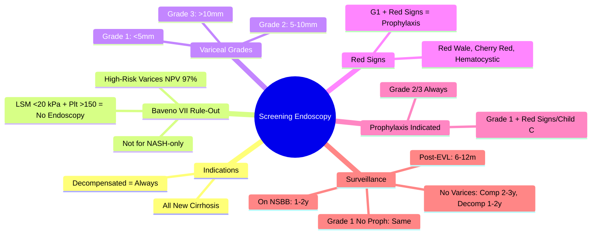

## 1. Learning Objectives
- [ ] Apply Baveno VII criteria for non-invasive rule-out of high-risk varices
- [ ] Know indications and timing for screening endoscopy
- [ ] Classify varices (Grade 1/2/3) and red wale signs
- [ ] Determine surveillance intervals based on findings
- [ ] Identify FCPS/MRCP high-yield decision points

---

## 2. Indications for Screening Endoscopy

### Baveno VII Criteria (Rule-Out High-Risk Varices)

```mermaid
flowchart TD
    A[Newly Diagnosed Cirrhosis] --> B{Non-Invasive Assessment}
    B --> C[LSM (FibroScan/VCTE) + Platelet Count]
    C --> D{LSM <20 kPa AND Platelets >150?}
    D -->|Yes| E[No Endoscopy Needed - Low Risk]
    D -->|No| F[Endoscopy Indicated]
    F --> G[Screening Endoscopy]
    G --> H{Findings}
```

| Population | Endoscopy Indicated? |
|------------|---------------------|
| **Compensated Cirrhosis** | **LSM ≥20 kPa OR Platelets ≤150** → Yes |
| **Compensated Cirrhosis** | **LSM <20 kPa AND Platelets >150** → **No** (Rule out) |
| **Decompensated Cirrhosis** (Any: Ascites, Variceal Bleed, HE, Jaundice) | **Always** |
| **Cirrhosis + Any Decompensation** | **Always** |

> **FCPS/MRCP**: **Baveno VII = LSM <20 kPa + Platelets >150 = No Endoscopy** — High-yield

---

## 3. Variceal Classification (Grading)

| Grade | Description | Size | Risk of Bleeding |
|-------|-------------|------|------------------|
| **Grade 1 (Small)** | Straight, <5mm, flatten on insufflation | <5mm | Low (1-2%/yr) |
| **Grade 2 (Medium)** | Tortuous, 5-10mm, <1/3 lumen | 5-10mm | Moderate (5-10%/yr) |
| **Grade 3 (Large)** | Tortuous, >10mm, >1/3 lumen | >10mm | High (10-15%/yr) |

### Red Wale Signs (High-Risk Stigmata)

| Sign | Description | Bleeding Risk |
|------|-------------|---------------|
| **Red Wale Marks** | Longitudinal red streaks | ↑↑ |
| **Cherry Red Spots** | Small red spots | ↑ |
| **Hematocystic Spots** | Blue-red dilated venules | ↑ |
| **White Nipples** | Fibrin deposits | Variable |

> **Any Red Sign** = Indication for prophylaxis (even Grade 1)

---

## 4. Surveillance Intervals

### No Varices Found
| Population | Surveillance Endoscopy Interval |
|------------|--------------------------------|
| **Compensated Cirrhosis** | **2-3 years** |
| **Decompensated Cirrhosis** | **1-2 years** (higher progression rate) |

### Small Varices (Grade 1) — No Prophylaxis Needed
| Population | Surveillance Endoscopy Interval |
|------------|--------------------------------|
| **Compensated** | **2-3 years** |
| **Decompensated** | **1-2 years** |

### Small Varices WITH Red Signs / Child C → **Prophylaxis Indicated** (NSBB/EVL)
- Surveillance after prophylaxis: **1-2 years**

### Medium/Large Varices (Grade 2/3) → **Prophylaxis Started**
- **Post-Eradication (EVL)**: Surveillance **6-12 monthly**
- **On NSBB**: Surveillance **1-2 years**

---

## 5. Endoscopic Findings Flow

```mermaid
flowchart TD
    A[Screening Endoscopy] --> B{Varices Found?}
    B -->|No| C[No Varices]
    C --> D[Compensated: Repeat 2-3y]
    C --> E[Decompensated: Repeat 1-2y]
    B -->|Yes| F[Grade Varices]
    F --> G{Grade}
    G -->|Grade 1 (Small)| H{Red Signs / Child C?}
    H -->|Yes| I[Prophylaxis: NSBB preferred]
    H -->|No| J[Surveillance: Comp 2-3y, Decomp 1-2y]
    G -->|Grade 2/3 (Medium/Large)| K[Prophylaxis: NSBB + EVL]
    K --> L[EVL q2-4w till Eradication]
    L --> M[Surveillance 6-12 monthly]
```

---

## 6. Baveno VII Non-Invasive Rule-Out: Validation

| Study | Population | NPV for High-Risk Varices |
|-------|------------|---------------------------|
| **Original Baveno VII** | 2,000+ patients | **97%** |
| **External Validations** | Multiple cohorts | 90-97% |
| **Limitations** | Etiology-specific (viral/alcohol); Not for NASH-only | Consider in NASH |

> **High-Risk Varices** = Grade 2/3 OR Grade 1 with Red Signs → Need Prophylaxis

---

## 7. Special Populations

| Population | Endoscopy Approach |
|------------|-------------------|
| **NAFLD Cirrhosis** | Baveno VII less validated; **Lower threshold for endoscopy** |
| **Post-SVR HCV** | If cirrhosis persists → Screen per cirrhosis guidelines |
| **Post-TIPS** | Routine surveillance endoscopy **NOT needed** (varices decompress) |
| **Pregnancy** | Screen in 2nd trimester if cirrhosis; Treat if high-risk |
| **Transplant List** | Screen at listing; Repeat per guidelines |

---

## 8. FCPS/MRCP High-Yield Summary

| Concept | Key Points |
|---------|------------|
| **Baveno VII Rule-Out** | **LSM <20 kPa + Platelets >150 = No Endoscopy** (Compensated) |
| **Decompensated Cirrhosis** | **Always scope** |
| **Variceal Grades** | G1: <5mm, G2: 5-10mm, G3: >10mm |
| **Red Signs** | Red wale, cherry red spots, hematocystic → Prophylaxis even if G1 |
| **Prophylaxis Indicated** | G2/3 always; G1 + Red Signs/Child C |
| **Surveillance No Varices** | Compensated: 2-3y; Decompensated: 1-2y |
| **Surveillance Grade 1 No Prophylaxis** | Compensated: 2-3y; Decompensated: 1-2y |
| **Post-EVL Eradication** | 6-12 monthly |
| **On NSBB** | 1-2 years |

---

## 9. Viva Questions

1. **What are the Baveno VII criteria to avoid screening endoscopy?**
2. **What is the variceal grading system?**
3. **What are red wale signs? Do they change management?**
4. **When is prophylaxis indicated for Grade 1 varices?**
5. **What are the surveillance intervals for no varices, Grade 1, post-EVL?**
6. **How does Baveno VII change practice?**
7. **What is the NPV of Baveno VII for high-risk varices?**
8. **Does Baveno VII apply to NAFLD cirrhosis?**
9. **What is the surveillance after EVL eradication?**
10. **When do you scope after TIPS?**

---

## 10. Confusions & Mnemonics

| Confusion | Clarification |
|-----------|---------------|
| Baveno VII vs VI | **VII**: LSM<20 + Plt>150 = No scope; **VI**: LSM<25 + Plt>150 |
| Compensated vs Decompensated | Compensated = No ascites/bleed/HE/jaundice; Decompensated = Any of these |
| Red Signs on Grade 1 | **Prophylaxis indicated** (NSBB preferred) even though bleeding risk low |
| Surveillance intervals | **No varices: Comp 2-3y, Decomp 1-2y**; **Grade 1 no prophylaxis: Same** |
| Post-EVL vs On NSBB | Post-EVL = 6-12m; On NSBB = 1-2y |
| Baveno VII in NASH | **Less validated** — lower threshold for endoscopy |
| LSM units | **kPa** (FibroScan/VCTE); Not m/s |

---

## 11. Mind Map



---

## 12. One-Page Revision Card

| **Baveno VII** | **Action** |
|----------------|------------|
| LSM <20 kPa **+** Platelets >150 | **No Endoscopy** (Compensated only) |
| Otherwise | **Endoscopy Indicated** |
| Decompensated Cirrhosis | **Always Endoscopy** |

| **Variceal Grade** | **Size** | **Bleeding Risk** | **Prophylaxis** |
|--------------------|----------|-------------------|-----------------|
| Grade 1 (Small) | <5mm | Low | If Red Signs/Child C |
| Grade 2 (Medium) | 5-10mm | Moderate | **Always** |
| Grade 3 (Large) | >10mm | High | **Always** |

| **Red Signs** | **Action** |
|---------------|------------|
| Red Wale Marks | Prophylaxis if G1 |
| Cherry Red Spots | Prophylaxis if G1 |
| Hematocystic Spots | Prophylaxis if G1 |

| **Scenario** | **Surveillance** |
|--------------|-----------------|
| No Varices (Compensated) | 2-3 years |
| No Varices (Decompensated) | 1-2 years |
| Grade 1, No Prophylaxis (Comp) | 2-3 years |
| Grade 1, No Prophylaxis (Decomp) | 1-2 years |
| Post-EVL Eradication | 6-12 months |
| On NSBB | 1-2 years |

---

## 13. Spaced Repetition Tracker

| Day | 1 | 3 | 7 | 15 | 30 |
|-----|---|---|---|----|----|
| Baveno VII rule | ☐ | ☐ | ☐ | ☐ | ☐ |
| Variceal grades | ☐ | ☐ | ☐ | ☐ | ☐ |
| Red signs types | ☐ | ☐ | ☐ | ☐ | ☐ |
| Surveillance intervals | ☐ | ☐ | ☐ | ☐ | ☐ |
| Prophylaxis indications | ☐ | ☐ | ☐ | ☐ | ☐ |

---

## 14. Self-Test Scorecard

| Question | My Answer | Correct? |
|----------|�|-----------|----------|
| Baveno VII criteria |  |  |
| Variceal grades |  |  |
| Red signs |  |  |
| Surveillance intervals table |  |  |
| Prophylaxis for Grade 1 |  |  |

---

## 15. Local Navigation

- [[Portal Hypertension and Complications/Primary prophylaxis (NSBB vs EVL)|Primary Prophylaxis]]
- [[Portal Hypertension and Complications/Secondary prophylaxis|Secondary Prophylaxis]]
- [[Portal Hypertension and Complications/Varices|Varices Overview]]
- [[Portal Hypertension and Complications/Acute variceal bleeding management|Acute Bleed]]
- [[Portal Hypertension and Complications/Gastric varices (glue injection)|Gastric Varices]]
---

> Auto-generated study sections for "Portal Hypertension and Complications" — Ch 23: Hepatology.

## Flashcards (1 generated)

- Q: What is the definition of Portal Hypertension and Complications?
  A: | Grade | Description | Size | Risk of Bleeding |

## MCQs (1 generated)

1. **Which of the following best describes Portal Hypertension and Complications?**
   A. **| Grade | Description | Size | Risk of Bleeding |**
   B. An unrelated condition not matching the clinical picture of Portal Hypertension and Complications
   C. A complication seen late in the disease course of Portal Hypertension and Complications
   D. A condition that mimics Portal Hypertension and Complications but has a different underlying cause

## SBA Questions (1 generated)

1. A patient with suspected Portal Hypertension and Complications presents with: Grade 1 (Small) — Straight, <5mm, flatten on insufflation; Grade 2 (Medium) — Tortuous, 5-10mm, <1/3 lumen; Grade 3 (Large) — Tortuous, >10mm, >1/3 lumen. What is the most likely diagnosis?
   A. **Portal Hypertension and Complications**
   B. A condition that mimics Portal Hypertension and Complications but is not the same entity
   C. A complication of Portal Hypertension and Complications rather than the primary diagnosis
   D. An unrelated condition in the same clinical category as Portal Hypertension and Complications

